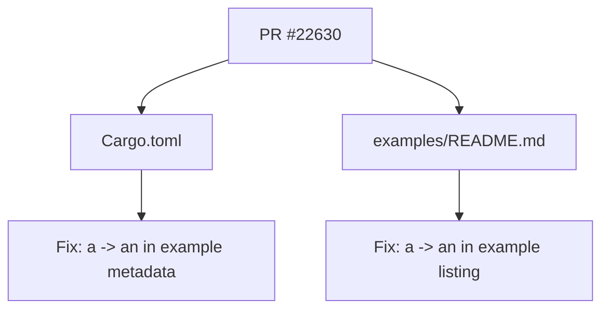

+++
title = "#22630 Fix mistake in example description"
date = "2026-01-21T00:00:00"
draft = false
template = "pull_request_page.html"
in_search_index = true

[taxonomies]
list_display = ["show"]

[extra]
current_language = "en"
available_languages = {"en" = { name = "English", url = "/pull_request/bevy/2026-01/pr-22630-en-20260121" }, "zh-cn" = { name = "中文", url = "/pull_request/bevy/2026-01/pr-22630-zh-cn-20260121" }}
labels = ["D-Trivial", "C-Examples", "A-UI"]
+++

# Title

## Basic Information
- **Title**: Fix mistake in example description
- **PR Link**: https://github.com/bevyengine/bevy/pull/22630
- **Author**: ickshonpe
- **Status**: MERGED
- **Labels**: D-Trivial, C-Examples, A-UI, S-Ready-For-Final-Review
- **Created**: 2026-01-21T18:22:48Z
- **Merged**: 2026-01-21T19:20:21Z
- **Merged By**: alice-i-cecile

## Description Translation

# Objective

Fix a grammatical error in the `image_node` example's description.

## The Story of This Pull Request

This PR addresses a minor grammatical issue in the Bevy engine's documentation. The error was a simple article mismatch: the word "a" was used before "image node" when it should have been "an" because "image" begins with a vowel sound.

The fix was straightforward but important for maintaining professional documentation standards. In the context of an open-source game engine like Bevy, clear and correct documentation helps users understand examples more easily and presents the project as well-maintained.

The developer identified the issue in two locations:
1. The `Cargo.toml` file's metadata section for the example
2. The `examples/README.md` file that lists all examples

Both locations contained the same incorrect phrasing. The correction required changing "a image node" to "an image node" in both places. This ensures consistency across the documentation and prevents confusion for developers who might reference either location.

From an engineering perspective, even minor documentation fixes like this contribute to overall code quality. While the change doesn't affect runtime behavior, it improves the developer experience by eliminating a distraction. The rapid merging (less than an hour from creation to merge) indicates the change was both correct and uncontroversial.

The fix follows standard English grammar rules where "an" is used before words beginning with vowel sounds. Since "image" is pronounced with an initial vowel sound (/ˈɪm.ɪdʒ/), "an" is the correct article.

## Visual Representation



## Key Files Changed

**File: `Cargo.toml`**
- **Change**: Fixed article from "a" to "an" in the `image_node` example description
- **Purpose**: The metadata in `Cargo.toml` is used by cargo and documentation tools. This ensures correct grammar appears in generated documentation.

```toml
# Before:
description = "Demonstrates how to create a image node"

# After:
description = "Demonstrates how to create an image node"
```

**File: `examples/README.md`**
- **Change**: Fixed the same article mismatch in the examples table
- **Purpose**: The README file is the primary documentation for Bevy's examples. Correct grammar improves readability and professionalism.

```markdown
# Before:
[Image Node](../examples/ui/image_node.rs) | Demonstrates how to create a image node

# After:
[Image Node](../examples/ui/image_node.rs) | Demonstrates how to create an image node
```

## Further Reading

- Bevy Examples Documentation: https://bevyengine.org/examples/
- English Articles (a/an/the) Rules: https://www.englishclub.com/grammar/determiners-articles.htm
- Bevy UI System: https://bevyengine.org/learn/book/working-with-2d/ui/