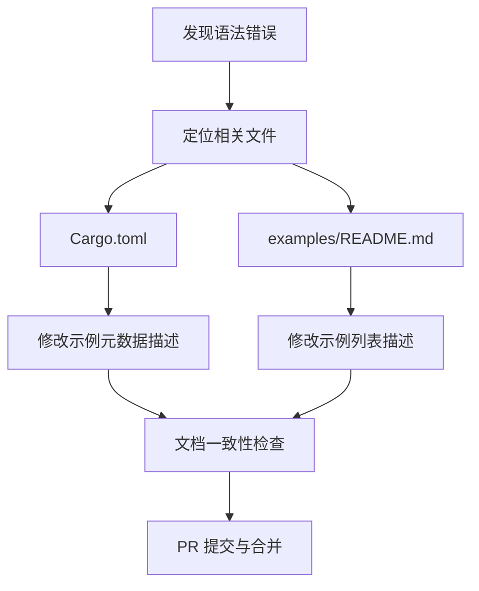

+++
title = "#22630 Fix mistake in example description"
date = "2026-01-21T00:00:00"
draft = false
template = "pull_request_page.html"
in_search_index = false

[extra]
current_language = "zh-cn"
available_languages = {"en" = { name = "English", url = "/pull_request/bevy/2026-01/pr-22630-en-20260121" }, "zh-cn" = { name = "中文", url = "/pull_request/bevy/2026-01/pr-22630-zh-cn-20260121" }}
+++

# Fix mistake in example description

## 基本信息
- **标题**: Fix mistake in example description
- **PR 链接**: https://github.com/bevyengine/bevy/pull/22630
- **作者**: ickshonpe
- **状态**: 已合并
- **标签**: D-Trivial, C-Examples, A-UI, S-Ready-For-Final-Review
- **创建时间**: 2026-01-21T18:22:48Z
- **合并时间**: 2026-01-21T19:20:21Z
- **合并者**: alice-i-cecile

## 描述翻译
# Objective

修复 `image_node` 示例描述中的语法错误。

## 本次 PR 的技术分析

这是一个非常简单的文档修复 PR，主要处理示例代码描述中的语法错误。问题出现在两个地方：`Cargo.toml` 文件中的示例元数据和 `examples/README.md` 文件中的示例列表。

在英语语法中，不定冠词 "a" 和 "an" 的使用取决于后续单词的发音。当后续单词以元音音素开头时，应使用 "an" 而非 "a"。示例描述中的 "image" 一词以元音音素 /ɪ/ 开头，因此正确的形式应该是 "an image node" 而不是 "a image node"。虽然这种错误不影响代码功能，但对于项目文档的专业性和准确性有一定影响，特别是在开源项目中，文档质量直接影响用户的第一印象。

从技术角度看，这个 PR 展示了 Bevy 项目中示例文档的维护流程。Bevy 使用两个地方来管理示例信息：
1. `Cargo.toml` 中的 `[package.metadata.example]` 部分，用于定义示例的元数据
2. `examples/README.md` 文件，用于生成示例的文档页面

这两个地方需要保持一致，这也是为什么同一个错误需要在这两个文件中都进行修复。这种重复信息的维护虽然增加了维护成本，但也确保了文档在不同上下文中的一致性。

本次修复的工程价值在于：
1. **保持文档专业性**：语法错误虽然小，但会影响项目的专业形象
2. **一致性维护**：确保不同位置的示例描述保持一致
3. **贡献者体验**：展示了对细节的关注，鼓励更多精细化的贡献

从工程实践角度看，这种类型的修复通常由贡献者通过以下流程完成：
1. 在浏览文档或代码时发现错误
2. 定位到相关文件并进行修改
3. 提交 PR 并等待审查
4. 维护者快速合并，因为这种修复风险极低且价值明确

在更广泛的工程实践中，这类文档修复虽然技术复杂度低，但对于维护项目质量和吸引贡献者具有重要意义。清晰的文档能降低新用户的学习曲线，而准确的语法则体现了项目的专业水准。

## 可视化表示



## 关键文件更改

### 1. Cargo.toml
**更改内容**：修复示例 `image_node` 元数据描述中的语法错误
**更改原因**：确保示例描述符合英语语法规则，提升文档专业性

```toml
# 文件: Cargo.toml
# 修改前:
[package.metadata.example.image_node]
name = "Image Node"
description = "Demonstrates how to create a image node"  # 语法错误：应为 "an image node"
category = "UI (User Interface)"
wasm = true

# 修改后:
[package.metadata.example.image_node]
name = "Image Node"
description = "Demonstrates how to create an image node"  # 修复为正确的 "an image node"
category = "UI (User Interface)"
wasm = true
```

### 2. examples/README.md
**更改内容**：修复示例列表中 `image_node` 示例的描述语法错误
**更改原因**：保持与 `Cargo.toml` 中描述的一致性，确保文档准确性

```markdown
# 文件: examples/README.md
# 修改前:
| [Image Node](../examples/ui/image_node.rs) | Demonstrates how to create a image node |  # 语法错误

# 修改后:
| [Image Node](../examples/ui/image_node.rs) | Demonstrates how to create an image node |  # 修复为正确的 "an image node"
```

## 延伸阅读

- [Bevy 示例文档](https://github.com/bevyengine/bevy/tree/main/examples) - Bevy 官方示例代码库
- [英语不定冠词使用规则](https://en.wikipedia.org/wiki/English_articles) - 关于 "a" 和 "an" 使用的详细规则
- [开源项目文档最佳实践](https://opensource.guide/best-practices/) - 开源项目文档维护指南