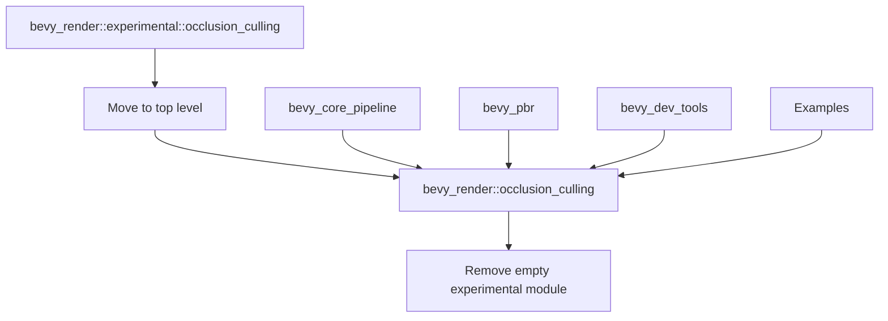

+++
title = "#22631 Move occlusion culling out of the `experimental` namespace."
date = "2026-01-21T00:00:00"
draft = false
template = "pull_request_page.html"
in_search_index = true

[taxonomies]
list_display = ["show"]

[extra]
current_language = "en"
available_languages = {"en" = { name = "English", url = "/pull_request/bevy/2026-01/pr-22631-en-20260121" }, "zh-cn" = { name = "中文", url = "/pull_request/bevy/2026-01/pr-22631-zh-cn-20260121" }}
labels = ["A-Rendering", "M-Migration-Guide", "X-Contentious", "D-Straightforward"]
+++

# Title

## Basic Information
- **Title**: Move occlusion culling out of the `experimental` namespace.
- **PR Link**: https://github.com/bevyengine/bevy/pull/22631
- **Author**: pcwalton
- **Status**: MERGED
- **Labels**: A-Rendering, M-Migration-Guide, X-Contentious, D-Straightforward, S-Needs-Review
- **Created**: 2026-01-21T18:58:22Z
- **Merged**: 2026-01-21T23:04:28Z
- **Merged By**: superdump

## Description Translation

With #22603 landed, all known issues that could cause Bevy to cull meshes that shouldn't have been culled are fixed, so there now seems to be consensus that we can remove occlusion culling from the `experimental` namespace. This patch does that (and in fact removes the `experimental` module from `bevy_render` entirely, as it's now empty).

## The Story of This Pull Request

This PR marks a significant milestone for Bevy's rendering system by promoting the occlusion culling feature from experimental to stable. The change is primarily organizational, reflecting increased confidence in the feature's reliability after recent fixes.

Occlusion culling is a performance optimization technique that prevents rendering objects that are fully hidden behind other opaque objects. This reduces GPU workload and improves frame rates, particularly in complex scenes with many overlapping objects. However, implementing occlusion culling correctly is challenging because incorrectly culling visible objects causes visual artifacts.

The Bevy team had previously placed occlusion culling in an `experimental` namespace because it had known issues where meshes could be incorrectly culled. With PR #22603 addressing these problems, the consensus was reached that the feature was now stable enough for production use.

The implementation approach is straightforward: move the occlusion culling module out of the experimental namespace and update all import paths throughout the codebase. This involves three main types of changes:

1. Moving the module from `crates/bevy_render/src/experimental/occlusion_culling/` to `crates/bevy_render/src/occlusion_culling/`
2. Updating all import statements from `bevy_render::experimental::occlusion_culling` to `bevy_render::occlusion_culling`
3. Removing the experimental module entirely since it no longer contains any features

The technical implementation demonstrates how Bevy organizes experimental features. By placing potentially unstable features in an `experimental` namespace, developers can opt into using them while being aware of their status. This approach allows for real-world testing while protecting the stability of the core API.

One key aspect of this PR is the documentation update for the `OcclusionCulling` component. The previous documentation included a prominent warning about experimental status and potential issues. The new documentation removes this warning while maintaining the technical explanation of what occlusion culling does:

```rust
/// Add this component to a view in order to enable GPU occlusion culling.
///
/// *Occlusion culling* allows Bevy to avoid rendering objects that are fully
/// behind other opaque or alpha tested objects. This is different from, and
/// complimentary to, frustum culling. Frustum culling only avoids rendering
/// objects that are outside the view frustum. Occlusion culling avoids
/// rendering objects that are inside the view frustum, but are hidden behind
/// other objects.
```

The changes also include the removal of the experimental module from Bevy's main library file. Since the experimental module is now empty, it makes sense to remove it entirely rather than leaving an empty module:

```rust
// Before:
pub mod experimental;
// After:
// Module removed entirely
```

This PR required updates across 13 different files in the codebase, demonstrating how deeply integrated occlusion culling is in Bevy's rendering pipeline. The changes affect core pipeline systems, PBR rendering, and several examples that use occlusion culling.

The impact of this change is primarily organizational rather than functional. Existing code using occlusion culling will continue to work, but the import paths need to be updated. This is why the PR includes a migration guide to help users update their code. The straightforward nature of the change (D-Straightforward label) made it suitable for a relatively quick review and merge process.

From an engineering perspective, this PR demonstrates good practices for feature promotion in a large codebase. The changes are minimal and focused, updating only what's necessary to move the feature out of experimental status. This approach reduces the risk of introducing new bugs while achieving the organizational goal.

## Visual Representation



## Key Files Changed

List the most significant files changed in this PR:
- `release-content/migration-guides/occlusion-culling-no-longer-experimental.md` (+10/-0)
- `crates/bevy_render/src/occlusion_culling/mod.rs` (+1/-7)
- `crates/bevy_render/src/experimental/mod.rs` (+0/-6)
- `crates/bevy_render/src/lib.rs` (+2/-2)
- `examples/large_scenes/bistro/src/main.rs` (+2/-2)

### File: `release-content/migration-guides/occlusion-culling-no-longer-experimental.md`
This is a new migration guide that informs users about the change:
```markdown
---
title: "Occlusion culling is no longer experimental"
pull_requests: [22631]
---

Occlusion culling is no longer experimental, as the known issues that could
cause Bevy to cull meshes incorrectly are now fixed.
 Consequently, the
`bevy::render::experimental::occlusion_culling` module has been renamed to
simply `bevy::render::occlusion_culling`.
```

### File: `crates/bevy_render/src/occlusion_culling/mod.rs`
The main change here is removing the experimental warning from the documentation:
```rust
// Before:
/// Add this component to a view in order to enable experimental GPU occlusion
/// culling.
///
/// *Bevy's occlusion culling is currently marked as experimental.* There are
/// known issues whereby, in rare circumstances, occlusion culling can result in
/// meshes being culled that shouldn't be (i.e. meshes that turn invisible).
/// Please try it out and report issues.
///
/// *Occlusion culling* allows Bevy to avoid rendering objects that are fully
/// behind other opaque or alpha tested objects. This is different from, and
/// complimentary to, frustum culling. Frustum culling only avoids rendering
/// objects that are outside the view frustum. Occlusion culling avoids
/// rendering objects that are inside the view frustum, but are hidden behind
/// other objects.

// After:
/// Add this component to a view in order to enable GPU occlusion culling.
///
/// *Occlusion culling* allows Bevy to avoid rendering objects that are fully
/// behind other opaque or alpha tested objects. This is different from, and
/// complimentary to, frustum culling. Frustum culling only avoids rendering
/// objects that are outside the view frustum. Occlusion culling avoids
/// rendering objects that are inside the view frustum, but are hidden behind
/// other objects.
```

### File: `crates/bevy_render/src/experimental/mod.rs`
This file is deleted entirely since the experimental module is now empty:
```rust
// Deleted file content:
//! Experimental rendering features.
//!
//! Experimental features are features with known problems, but are included
//! nonetheless for testing purposes.

pub mod occlusion_culling;
```

### File: `crates/bevy_render/src/lib.rs`
The library file is updated to remove the experimental module and add occlusion_culling at the top level:
```rust
// Before:
pub mod experimental;
// ... other modules ...

// After:
// experimental module removed
pub mod occlusion_culling; // added here
```

### File: `examples/large_scenes/bistro/src/main.rs`
This shows a typical import path update:
```rust
// Before:
use bevy::render::{
    batching::NoAutomaticBatching, experimental::occlusion_culling::OcclusionCulling,
    render_resource::Face, view::NoIndirectDrawing,
};

// After:
use bevy::render::{
    batching::NoAutomaticBatching, occlusion_culling::OcclusionCulling, render_resource::Face,
    view::NoIndirectDrawing,
};
```

## Further Reading

1. **Occlusion Culling in Computer Graphics**: Learn about the fundamental concepts of occlusion culling and different algorithms used in real-time rendering.
2. **Bevy's Rendering Architecture**: Understanding how Bevy organizes its rendering pipeline will help contextualize where occlusion culling fits.
3. **GPU-Driven Rendering Pipelines**: Modern occlusion culling techniques often leverage GPU compute for better performance.
4. **PR #22603**: The fix that resolved the remaining issues with occlusion culling, making this promotion possible.
5. **Bevy's Feature Lifecycle**: Understanding how Bevy manages experimental features can help when evaluating other upcoming features.