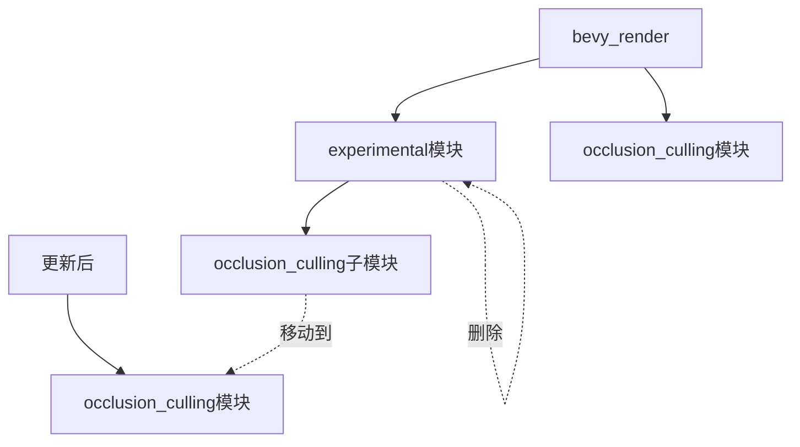

+++
title = "#22631 Move occlusion culling out of the `experimental` namespace."
date = "2026-01-21T00:00:00"
draft = false
template = "pull_request_page.html"
in_search_index = false

[extra]
current_language = "zh-cn"
available_languages = {"en" = { name = "English", url = "/pull_request/bevy/2026-01/pr-22631-en-20260121" }, "zh-cn" = { name = "中文", url = "/pull_request/bevy/2026-01/pr-22631-zh-cn-20260121" }}
+++

# 标题

## 基本信息
- **标题**: Move occlusion culling out of the `experimental` namespace.
- **PR链接**: https://github.com/bevyengine/bevy/pull/22631
- **作者**: pcwalton
- **状态**: MERGED
- **标签**: A-Rendering, M-Migration-Guide, X-Contentious, D-Straightforward, S-Needs-Review
- **创建时间**: 2026-01-21T18:58:22Z
- **合并时间**: 2026-01-21T23:04:28Z
- **合并者**: superdump

## 描述翻译
在 #22603 合并后，所有可能导致 Bevy 剔除不应被剔除的网格（mesh）的已知问题都已修复，因此现在有共识认为可以将遮挡剔除（occlusion culling）从 `experimental` 命名空间中移除。本补丁完成了这项工作（实际上，由于 `experimental` 模块现在已空，它完全从 `bevy_render` 中移除了该模块）。

## 这个 PR 的故事

遮挡剔除是一种图形渲染优化技术，它通过避免渲染完全被其他不透明物体遮挡的物体来提高性能。在 Bevy 中，这项功能最初被标记为实验性（experimental），因为存在一些已知问题，可能导致本应可见的网格被错误地剔除。

随着 PR #22603 的合并，这些已知问题得到了解决。这意味着遮挡剔除功能现在被认为是稳定可靠的，可以安全地用于生产环境。因此，本 PR 的核心目标就是将遮挡剔除从实验性命名空间中移出，使其成为 Bevy 渲染管线的正式组成部分。

从技术实现的角度来看，这个 PR 主要涉及模块结构的重构。之前，遮挡剔除相关的代码位于 `bevy_render::experimental::occlusion_culling` 模块中。现在需要将其提升到 `bevy_render::occlusion_culling` 的直接子模块位置。这不仅仅是一个简单的重命名，还需要更新整个代码库中所有引用该模块的地方。

开发者首先需要移动整个模块的物理位置，将 `crates/bevy_render/src/experimental/occlusion_culling` 目录移动到 `crates/bevy_render/src/occlusion_culling`。然后，更新 `bevy_render` 库的主文件（`lib.rs`）中的模块声明：

```rust
// 之前:
pub mod experimental;
// 之后:
pub mod occlusion_culling;
```

同时，需要更新 `OcclusionCullingPlugin` 的导入路径。之前它是通过 `experimental::occlusion_culling::OcclusionCullingPlugin` 导入的，现在改为 `occlusion_culling::OcclusionCullingPlugin`。

最繁琐的部分是更新所有引用遮挡剔除的代码文件。这包括多个核心管道（core pipeline）模块、PBR 渲染代码、开发工具以及示例代码。每个文件都需要将 `bevy_render::experimental::occlusion_culling` 的导入改为 `bevy_render::occlusion_culling`。

例如，在 `bevy_core_pipeline/src/core_3d/mod.rs` 中：

```rust
// 之前:
use bevy_render::experimental::occlusion_culling::OcclusionCulling;
// 之后:
use bevy_render::occlusion_culling::OcclusionCulling;
```

这种全局性的导入更新确保了整个代码库的一致性。由于 `experimental` 模块现在为空，可以安全地删除整个模块定义文件（`crates/bevy_render/src/experimental/mod.rs`）。

除了代码结构的调整，还需要更新文档。`OcclusionCulling` 组件之前的文档包含关于实验性状态和潜在问题的警告信息。这些警告现在已不再适用，因此被移除：

```rust
/// Add this component to a view in order to enable experimental GPU occlusion
/// culling.
///
/// *Bevy's occlusion culling is currently marked as experimental.* There are
/// known issues whereby, in rare circumstances, occlusion culling can result in
/// meshes being culled that shouldn't be (i.e. meshes that turn invisible).
/// Please try it out and report issues.
///
/// *Occlusion culling* allows Bevy to avoid rendering objects that are fully
/// behind other opaque or alpha tested objects. This is different from, and
/// complementary to, *frustum culling*, which only culls objects outside the
/// camera's view frustum.
```

更新后的文档更加简洁，直接说明其功能：

```rust
/// Add this component to a view in order to enable GPU occlusion culling.
///
/// *Occlusion culling* allows Bevy to avoid rendering objects that are fully
/// behind other opaque or alpha tested objects. This is different from, and
/// complementary to, *frustum culling*, which only culls objects outside the
/// camera's view frustum.
```

为了帮助现有用户迁移，还添加了一个迁移指南（migration guide）。这个指南简明地说明了变化：遮挡剔除不再标记为实验性，相应的模块路径已从 `bevy::render::experimental::occlusion_culling` 更名为 `bevy::render::occlusion_culling`。

从工程角度看，这个 PR 展示了 Bevy 项目中功能从实验性到稳定状态的典型升级路径。当一项功能经过充分测试，解决了关键问题后，就可以从实验性命名空间中移出，成为正式 API 的一部分。这种模式有助于保持代码库的整洁，同时为用户提供清晰的 API 稳定性信号。

值得注意的是，虽然这个 PR 看似只是移动文件和更新导入，但它实际上代表了项目对遮挡剔除功能稳定性的信心。现在开发者可以更放心地在生产项目中使用这一性能优化功能，而不必担心之前可能存在的错误剔除问题。

## 可视化表示



## 关键文件变更

### `release-content/migration-guides/occlusion-culling-no-longer-experimental.md` (+10/-0)
这是新增的迁移指南文件，告知用户遮挡剔除不再标记为实验性，并提供了模块路径变更信息。

```markdown
---
title: "Occlusion culling is no longer experimental"
pull_requests: [22631]
---

Occlusion culling is no longer experimental, as the known issues that could
cause Bevy to cull meshes incorrectly are now fixed.
 Consequently, the
`bevy::render::experimental::occlusion_culling` module has been renamed to
simply `bevy::render::occlusion_culling`.
```

### `crates/bevy_render/src/occlusion_culling/mod.rs` (+1/-7)
这是从 `experimental/occlusion_culling/mod.rs` 移动并修改后的文件。主要变化是移除了关于实验性状态的警告文档。

```rust
// 之前:
/// Add this component to a view in order to enable experimental GPU occlusion
/// culling.
///
/// *Bevy's occlusion culling is currently marked as experimental.* There are
/// known issues whereby, in rare circumstances, occlusion culling can result in
/// meshes being culled that shouldn't be (i.e. meshes that turn invisible).
/// Please try it out and report issues.
///
/// *Occlusion culling* allows Bevy to avoid rendering objects that are fully
/// behind other opaque or alpha tested objects. This is different from, and
/// complementary to, *frustum culling*, which only culls objects outside the
/// camera's view frustum.

// 之后:
/// Add this component to a view in order to enable GPU occlusion culling.
///
/// *Occlusion culling* allows Bevy to avoid rendering objects that are fully
/// behind other opaque or alpha tested objects. This is different from, and
/// complementary to, *frustum culling*, which only culls objects outside the
/// camera's view frustum.
```

### `crates/bevy_render/src/experimental/mod.rs` (+0/-6)
这个文件被完全删除，因为 `experimental` 模块现在已空。

```rust
// 被删除的内容:
//! Experimental rendering features.
//!
//! Experimental features are features with known problems, but are included
//! nonetheless for testing purposes.

pub mod occlusion_culling;
```

### `crates/bevy_render/src/lib.rs` (+2/-2)
主库文件更新了模块声明和插件导入路径。

```rust
// 之前:
pub mod experimental;
// ...
use experimental::occlusion_culling::OcclusionCullingPlugin;

// 之后:
pub mod occlusion_culling;
// ...
use occlusion_culling::OcclusionCullingPlugin;
```

### `examples/large_scenes/bistro/src/main.rs` (+2/-2)
示例文件中的导入路径更新，展示了用户代码需要如何迁移。

```rust
// 之前:
use bevy::render::{
    batching::NoAutomaticBatching, experimental::occlusion_culling::OcclusionCulling,
    render_resource::Face, view::NoIndirectDrawing,
};

// 之后:
use bevy::render::{
    batching::NoAutomaticBatching, occlusion_culling::OcclusionCulling, render_resource::Face,
    view::NoIndirectDrawing,
};
```

## 进一步阅读

1. **遮挡剔除技术介绍**：了解 GPU 遮挡剔除的基本原理和实现方式
2. **Bevy 渲染管道架构**：学习 Bevy 的渲染系统如何组织，包括实验性功能的处理机制
3. **PR #22603**：了解修复了哪些遮挡剔除的具体问题，使这项功能得以稳定
4. **Bevy 迁移指南模式**：研究 Bevy 如何管理 API 变更和提供迁移指导
5. **图形优化技术**：深入学习包括视锥剔除、遮挡剔除在内的各种渲染优化技术