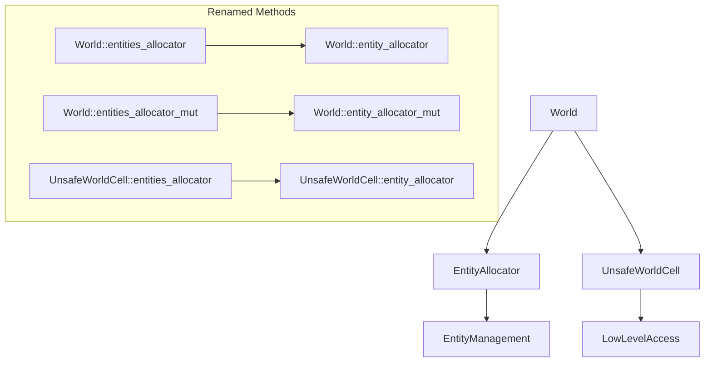

+++
title = "#22638 Rename world.entities_allocator to entity_allocator"
date = "2026-01-22T00:00:00"
draft = false
template = "pull_request_page.html"
in_search_index = true

[taxonomies]
list_display = ["show"]

[extra]
current_language = "en"
available_languages = {"en" = { name = "English", url = "/pull_request/bevy/2026-01/pr-22638-en-20260122" }, "zh-cn" = { name = "中文", url = "/pull_request/bevy/2026-01/pr-22638-zh-cn-20260122" }}
labels = ["A-ECS", "C-Code-Quality", "C-Usability", "D-Straightforward"]
+++

# Title

## Basic Information
- **Title**: Rename world.entities_allocator to entity_allocator
- **PR Link**: https://github.com/bevyengine/bevy/pull/22638
- **Author**: cart
- **Status**: MERGED
- **Labels**: A-ECS, C-Code-Quality, C-Usability, S-Ready-For-Final-Review, X-Uncontroversial, D-Straightforward
- **Created**: 2026-01-21T23:45:08Z
- **Merged**: 2026-01-22T01:14:01Z
- **Merged By**: cart

## Description Translation
# Objective

We missed this when we renamed `EntitiesAllocator` to `EntityAllocator`

## Solution

Rename it

## The Story of This Pull Request

This pull request addresses a naming inconsistency in Bevy's Entity Component System (ECS) that occurred during a previous refactoring. The core issue is straightforward: when the type `EntitiesAllocator` was renamed to `EntityAllocator` in an earlier change, several related field and method names in the `World` struct weren't updated to match. This PR systematically corrects that oversight to maintain consistency across the codebase.

The problem manifested as a mismatch between type names and their associated accessor methods. While the type had been updated from `EntitiesAllocator` to `EntityAllocator`, the corresponding field in the `World` struct remained named `allocator`, and the public accessor methods were still named `entities_allocator()` and `entities_allocator_mut()`. This inconsistency could confuse developers reading the code and create unnecessary mental overhead when working with the entity allocation system.

The solution approach is a straightforward rename operation that touches multiple files in the `bevy_ecs` crate. The developer methodically updated:
1. The field name in the `World` struct from `allocator` to `entity_allocator`
2. The public accessor methods from `entities_allocator()` and `entities_allocator_mut()` to `entity_allocator()` and `entity_allocator_mut()`
3. All internal references to these fields and methods throughout the codebase
4. The corresponding method in `UnsafeWorldCell` from `entities_allocator()` to `entity_allocator()`

This change is primarily about code quality and developer experience rather than functional behavior. By aligning method names with the type they return (`EntityAllocator`), the API becomes more intuitive and consistent. The naming follows the pattern established by other World methods like `entity()` and `entities()`, which return single entities and the entities collection respectively.

From a technical perspective, this change required updates across 11 files in the `crates/bevy_ecs` directory, demonstrating how a core type rename can ripple through a codebase. Each update is mechanical but necessary for consistency. The PR also adds a migration guide to help users update their code, showing that this is considered a breaking change that requires documentation.

The implementation reveals several interesting aspects of Bevy's ECS architecture. The `EntityAllocator` is responsible for managing entity IDs and tracking which ones are available for reuse. It's a critical component of Bevy's entity management system, and references to it appear in many places including spawning systems, command processing, and entity mapping utilities. The fact that so many files needed updating underscores how central the World struct and its entity allocation capabilities are to the ECS framework.

One notable technical insight is how this change affects both safe and unsafe world access. The `UnsafeWorldCell` type, which provides low-level access to world data, also needed its method name updated. This ensures consistency across the entire API surface, whether developers are using safe or unsafe world access patterns.

The impact of this change is primarily on code readability and maintainability. Developers working with entity allocation will now encounter consistent naming that matches the type system. This reduces cognitive load and makes the codebase easier to navigate. The migration guide helps ensure existing code can be updated with minimal disruption.

## Visual Representation



## Key Files Changed

### `crates/bevy_ecs/src/world/mod.rs`
This file contains the definition of the `World` struct and its public API. The field and method names were updated to use `entity_allocator` instead of `entities_allocator`.

```rust
// File: crates/bevy_ecs/src/world/mod.rs
// Before:
pub struct World {
    // ...
    pub(crate) allocator: EntityAllocator,
    // ...
}

impl World {
    pub fn entities_allocator(&self) -> &EntityAllocator {
        &self.allocator
    }
    
    pub fn entities_allocator_mut(&mut self) -> &mut EntityAllocator {
        &mut self.allocator
    }
}

// After:
pub struct World {
    // ...
    pub(crate) entity_allocator: EntityAllocator,
    // ...
}

impl World {
    pub fn entity_allocator(&self) -> &EntityAllocator {
        &self.entity_allocator
    }
    
    pub fn entity_allocator_mut(&mut self) -> &mut EntityAllocator {
        &mut self.entity_allocator
    }
}
```

### `crates/bevy_ecs/src/world/unsafe_world_cell.rs`
This file contains the unsafe world access API. The method name was updated to match the change in the main World struct.

```rust
// File: crates/bevy_ecs/src/world/unsafe_world_cell.rs
// Before:
impl<'w> UnsafeWorldCell<'w> {
    pub fn entities_allocator(self) -> &'w EntityAllocator {
        &unsafe { self.world_metadata() }.allocator
    }
}

// After:
impl<'w> UnsafeWorldCell<'w> {
    pub fn entity_allocator(self) -> &'w EntityAllocator {
        &unsafe { self.world_metadata() }.entity_allocator
    }
}
```

### `crates/bevy_ecs/src/entity/mod.rs`
This file contains documentation examples that needed updating to use the new method names.

```rust
// File: crates/bevy_ecs/src/entity/mod.rs
// Before (in documentation example):
// let entity = world.entities_allocator().alloc();

// After:
// let entity = world.entity_allocator().alloc();
```

### `crates/bevy_ecs/src/lib.rs`
This file contains test code that was updated to use the new method names.

```rust
// File: crates/bevy_ecs/src/lib.rs
// Before:
// let e1 = world.entities_allocator_mut().alloc();

// After:
// let e1 = world.entity_allocator_mut().alloc();
```

### `release-content/migration-guides/entity_allocator.md`
This is a new migration guide added to help users update their code.

```markdown
---
title: "`World::entities_allocator` is now `World::entity_allocator`"
pull_requests: [22638]
---

`World::entities_allocator()` has been renamed to `World::entity_allocator()` to match the type returned (`EntityAllocator`). Likewise, `World::entities_allocator_mut()` has been renamed to `World::entity_allocator_mut()`.
```

## Further Reading

1. [Bevy ECS World Documentation](https://docs.rs/bevy_ecs/latest/bevy_ecs/world/struct.World.html) - Official documentation for the World struct and its methods
2. [EntityAllocator Type Documentation](https://docs.rs/bevy_ecs/latest/bevy_ecs/entity/struct.EntityAllocator.html) - Documentation for the EntityAllocator type
3. [Bevy Migration Guides](https://bevyengine.org/learn/migration-guides/) - Other migration guides for updating Bevy code
4. [Rust API Guidelines: Naming](https://rust-lang.github.io/api-guidelines/naming.html) - Rust conventions for naming types and methods