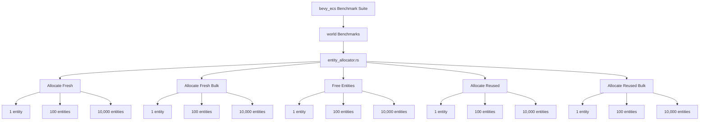

+++
title = "#22640 Add benchmarks for raw entity allocation"
date = "2026-01-23T00:00:00"
draft = false
template = "pull_request_page.html"
in_search_index = true

[taxonomies]
list_display = ["show"]

[extra]
current_language = "en"
available_languages = {"en" = { name = "English", url = "/pull_request/bevy/2026-01/pr-22640-en-20260123" }, "zh-cn" = { name = "中文", url = "/pull_request/bevy/2026-01/pr-22640-zh-cn-20260123" }}
labels = ["D-Trivial", "A-ECS", "C-Benchmarks"]
+++

# Title

## Basic Information
- **Title**: Add benchmarks for raw entity allocation
- **PR Link**: https://github.com/bevyengine/bevy/pull/22640
- **Author**: ElliottjPierce
- **Status**: MERGED
- **Labels**: D-Trivial, A-ECS, C-Benchmarks
- **Created**: 2026-01-22T03:09:36Z
- **Merged**: 2026-01-23T02:25:12Z
- **Merged By**: cart

## Description Translation

# Objective

As per [this](https://github.com/bevyengine/bevy/pull/18670#issuecomment-3781624261) comment on #18670, this adds benchmarks for direct access to the entity allocator.

## Solution

Add 5 groups of benchmarks:

- allocating fresh entities
- allocating fresh entities in bulk
- freeing entities
- allocating reused entities
- allocating reused entities in bulk

## Testing

- CI and benches

## The Story of This Pull Request

This pull request addresses a gap in the Bevy ECS benchmarking suite by adding comprehensive benchmarks for the raw entity allocation system. The need for these benchmarks was identified in a previous PR (#18670), where a comment noted the absence of performance measurements for the low-level entity allocator operations.

The entity allocator is a fundamental component of Bevy's ECS architecture, responsible for managing entity IDs and their lifecycle. Without proper benchmarks, it's difficult to measure the performance impact of changes to this core system or to identify potential optimization opportunities.

The developer implemented five distinct benchmark groups, each designed to measure a specific aspect of entity allocation performance. This approach provides a comprehensive view of the allocator's behavior under different usage patterns and scales. The benchmarks test three entity counts (1, 100, and 10,000) to capture performance characteristics at different scales, from small operations to bulk processing.

The implementation follows Bevy's existing benchmarking patterns, using the `criterion` benchmarking library. Each benchmark group is properly configured with appropriate warm-up and measurement times to ensure reliable results. The use of `black_box` prevents compiler optimizations from interfering with the measurements, ensuring the benchmarks accurately reflect real-world performance.

One notable aspect of the implementation is the careful separation of benchmark setup from the actual measurement code. For example, in the "freeing entities" benchmark, the setup function creates a world and allocates entities, while the benchmarked code focuses only on the freeing operation. This isolation ensures that setup costs don't skew the performance measurements.

Similarly, the "allocate reused" benchmarks measure allocation performance after entities have been freed and returned to the allocator's pool. This tests the performance of the entity reuse mechanism, which is important for applications that create and destroy entities frequently.

The benchmarks use `BatchSize::SmallInput` for all tests, which is appropriate given the entity counts being tested. This configuration tells criterion to run multiple iterations of the benchmarked code per setup, providing more stable measurements for operations that complete quickly.

From an engineering perspective, these benchmarks provide several important benefits:

1. **Performance regression detection**: Changes to the entity allocator can now be tested for performance regressions.
2. **Optimization guidance**: The benchmarks highlight which operations are most expensive, guiding future optimization efforts.
3. **Comparison baseline**: Different allocation strategies or implementations can be compared against these benchmarks.
4. **Scale understanding**: The three different entity counts help understand how performance scales with workload size.

The PR is minimal and focused, adding only the necessary benchmark code without modifying any production logic. This keeps the change low-risk while providing significant value for ongoing development and optimization of the ECS system.

## Visual Representation



## Key Files Changed

**File: benches/benches/bevy_ecs/world/entity_allocator.rs** (+131/-0)

This is a new file that contains all the entity allocator benchmarks. The file defines a single public function `entity_allocator_benches` that sets up five benchmark groups:

```rust
pub fn entity_allocator_benches(criterion: &mut Criterion) {
    const ENTITY_COUNTS: [u32; 3] = [1, 100, 10_000];

    // First benchmark group: allocating fresh entities one at a time
    let mut group = criterion.benchmark_group("entity_allocator_allocate_fresh");
    group.warm_up_time(core::time::Duration::from_millis(500));
    group.measurement_time(core::time::Duration::from_secs(4));

    for entity_count in ENTITY_COUNTS {
        group.bench_function(format!("{entity_count}_entities"), |bencher| {
            bencher.iter_batched_ref(
                World::default,
                |world| {
                    for _ in 0..entity_count {
                        let entity = world.entity_allocator().alloc();
                        black_box(entity);
                    }
                },
                BatchSize::SmallInput,
            );
        });
    }

    group.finish();

    // Additional benchmark groups follow similar patterns...
}
```

The key aspects of this implementation:
- Uses `ENTITY_COUNTS` array to test three scales of operations
- Each benchmark group has appropriate timing configuration (500ms warm-up, 4s measurement)
- Uses `iter_batched_ref` to properly manage setup and teardown
- `black_box` prevents compiler optimization of allocation results
- Tests both individual (`alloc()`) and bulk (`alloc_many()`) operations
- Tests both fresh allocation and allocation after freeing (reuse)

**File: benches/benches/bevy_ecs/world/mod.rs** (+3/-0)

This file was modified to include the new benchmark module and add it to the criterion group:

```rust
// Before:
mod commands;
mod despawn;
mod despawn_recursive;
mod entity_hash;
mod spawn;
mod world_get;

use commands::*;
use criterion::criterion_group;
use despawn::*;
use despawn_recursive::*;
use entity_hash::*;
use spawn::*;
use world_get::*;

criterion_group!(
    benches,
    commands_apply,
    commands_apply_buffered,
    despawn_entities,
    despawn_recursive,
    spawn_entities,
    spawn_batch,
    query_get_component,
    query_get_components_2,
    query_get_components_5,
    query_get_components_10,
    query_get_component_mut,
    query_get_components_mut_2,
    query_get_components_mut_5,
    query_get_components_mut_10,
    entity_set_build_and_lookup,
);

// After:
mod commands;
mod despawn;
mod despawn_recursive;
mod entity_allocator;  // Added
mod entity_hash;
mod spawn;
mod world_get;

use commands::*;
use criterion::criterion_group;
use despawn::*;
use despawn_recursive::*;
use entity_allocator::*;  // Added
use entity_hash::*;
use spawn::*;
use world_get::*;

criterion_group!(
    benches,
    commands_apply,
    commands_apply_buffered,
    despawn_entities,
    despawn_recursive,
    spawn_entities,
    spawn_batch,
    query_get_component,
    query_get_components_2,
    query_get_components_5,
    query_get_components_10,
    query_get_component_mut,
    query_get_components_mut_2,
    query_get_components_mut_5,
    query_get_components_mut_10,
    entity_set_build_and_lookup,
    entity_allocator_benches,  // Added
);
```

The changes are minimal and consistent with the existing pattern:
1. Added `mod entity_allocator;` to declare the new module
2. Added `use entity_allocator::*;` to import the benchmark function
3. Added `entity_allocator_benches` to the `criterion_group!` macro invocation

## Further Reading

1. **Criterion.rs Documentation**: https://bheisler.github.io/criterion.rs/book/index.html
2. **Bevy ECS Architecture**: https://bevyengine.org/learn/book/ecs/
3. **Entity Component System Pattern**: https://en.wikipedia.org/wiki/Entity_component_system
4. **Previous PR #18670**: https://github.com/bevyengine/bevy/pull/18670 (mentioned as the inspiration for these benchmarks)
5. **Benchmarking Best Practices**: https://nnethercote.github.io/perf-book/benchmarking.html