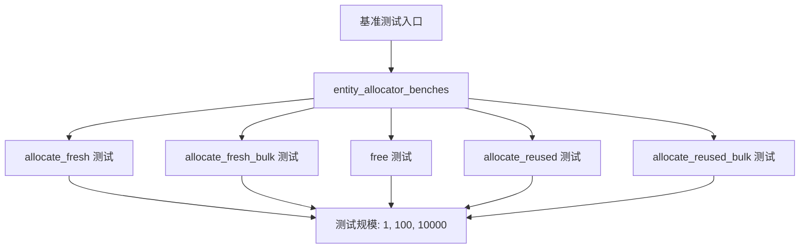

+++
title = "#22640 Add benchmarks for raw entity allocation"
date = "2026-01-23T00:00:00"
draft = false
template = "pull_request_page.html"
in_search_index = false

[extra]
current_language = "zh-cn"
available_languages = {"en" = { name = "English", url = "/pull_request/bevy/2026-01/pr-22640-en-20260123" }, "zh-cn" = { name = "中文", url = "/pull_request/bevy/2026-01/pr-22640-zh-cn-20260123" }}
+++

# Title
Add benchmarks for raw entity allocation

## 基本信息
- **标题**: Add benchmarks for raw entity allocation
- **PR链接**: https://github.com/bevyengine/bevy/pull/22640
- **作者**: ElliottjPierce
- **状态**: 已合并
- **标签**: D-Trivial, A-ECS, C-Benchmarks
- **创建时间**: 2026-01-22T03:09:36Z
- **合并时间**: 2026-01-23T02:25:12Z
- **合并者**: cart

## 描述翻译

# 目标

根据 [#18670](https://github.com/bevyengine/bevy/pull/18670) 中的[这条评论](https://github.com/bevyengine/bevy/pull/18670#issuecomment-3781624261)，本PR为直接访问实体分配器（entity allocator）添加基准测试。

## 解决方案

添加5组基准测试：
- 分配新实体
- 批量分配新实体
- 释放实体
- 分配复用实体
- 批量分配复用实体

## 测试
- CI和基准测试

## PR技术分析

这个PR解决了一个明确的性能测量需求。在PR #18670的讨论中，开发者指出当前缺乏对Bevy ECS中实体分配器原始操作的直接性能基准测试。实体分配是ECS核心操作，尤其是在大规模实体创建和销毁的场景中，了解分配器的性能特性对优化应用至关重要。

### 问题背景

Bevy的实体分配器管理着Entity ID的生成和回收。当开发者需要了解底层分配性能时，特别是：
- 单个实体分配与批量分配的性能差异
- 实体释放的开销
- ID重用机制的性能影响

现有的基准测试主要关注更高层级的操作（如spawn、despawn），但缺少对底层分配器API的直接测量。这种缺失使得性能优化缺乏数据支持。

### 解决方案设计

作者采用了系统化的基准测试设计，创建了5组独立测试，每组测试3种不同规模（1、100、10,000个实体）。这种设计能够揭示不同负载下的性能特征。

测试分组逻辑清晰：
1. `entity_allocator_allocate_fresh` - 测试全新的实体分配
2. `entity_allocator_allocate_fresh_bulk` - 测试批量分配新实体
3. `entity_allocator_free` - 测试实体释放操作
4. `entity_allocator_allocate_reused` - 测试分配先前释放的实体
5. `entity_allocator_allocate_reused_bulk` - 测试批量分配复用实体

### 实现细节

实现中使用了criterion基准测试库的标准模式。每个测试组都有适当的预热时间（500ms）和测量时间（4秒），确保结果稳定可靠。使用`black_box`防止编译器过度优化。

关键实现模式：
- 使用`iter_batched_ref`分离测试准备和执行阶段
- 对于需要预分配和释放的测试，在闭包中设置初始状态
- 统一使用`BatchSize::SmallInput`，因为实体分配是轻量级操作

一个值得注意的实现技巧是在复用实体测试中：先分配实体然后立即释放，确保后续分配操作会重用这些ID。这模拟了实际使用中实体池（entity pool）被填充后的场景。

### 技术洞察

这个基准测试揭示了几个重要的性能考虑：

1. **批量操作的优势**：`alloc_many`与多次调用`alloc`的性能对比
2. **内存重用开销**：复用实体ID是否需要额外处理逻辑
3. **不同规模下的表现**：小规模与大规模操作是否呈现线性关系

基准测试的结构还展示了如何正确测量有状态组件的性能：通过`iter_batched_ref`管理测试状态，确保每次迭代都在可控的初始条件下开始。

### 影响和意义

这些基准测试为Bevy ECS的性能优化提供了关键数据点。当开发者考虑优化实体管理策略时，现在可以参考这些基准测试结果。例如：
- 决定何时使用批量分配
- 评估实体池大小对性能的影响
- 验证分配器改进的实际效果

此外，这组测试建立了实体分配性能的基线，未来对分配器的任何修改都可以通过对比这些基准测试来评估性能影响。

## 可视化表示



## 关键文件变更

### 1. `benches/benches/bevy_ecs/world/entity_allocator.rs` (+131/-0)

**新增文件**：包含所有实体分配器的基准测试实现。

```rust
// 文件: benches/benches/bevy_ecs/world/entity_allocator.rs
// 这是全新的文件，包含完整的基准测试实现

use core::hint::black_box;

use bevy_ecs::prelude::*;
use criterion::{BatchSize, Criterion};

pub fn entity_allocator_benches(criterion: &mut Criterion) {
    const ENTITY_COUNTS: [u32; 3] = [1, 100, 10_000];

    // 第一组测试：分配新实体
    let mut group = criterion.benchmark_group("entity_allocator_allocate_fresh");
    group.warm_up_time(core::time::Duration::from_millis(500));
    group.measurement_time(core::time::Duration::from_secs(4));

    for entity_count in ENTITY_COUNTS {
        group.bench_function(format!("{entity_count}_entities"), |bencher| {
            bencher.iter_batched_ref(
                World::default,
                |world| {
                    for _ in 0..entity_count {
                        let entity = world.entity_allocator().alloc();
                        black_box(entity);
                    }
                },
                BatchSize::SmallInput,
            );
        });
    }

    group.finish();

    // 后续测试组结构类似，测试不同场景...
}
```

**说明**：这个新文件实现了5组完整的基准测试，每组测试3种不同规模的实体操作。每个测试组都遵循criterion的最佳实践，包含适当的预热和测量时间。

### 2. `benches/benches/bevy_ecs/world/mod.rs` (+3/-0)

**修改文件**：将新的基准测试模块集成到现有的基准测试套件中。

```rust
// 文件: benches/benches/bevy_ecs/world/mod.rs
// 修改前：
mod commands;
mod despawn;
mod despawn_recursive;
mod entity_hash;
mod spawn;
mod world_get;

use commands::*;
use criterion::criterion_group;
use despawn::*;
use despawn_recursive::*;
use entity_hash::*;
use spawn::*;
use world_get::*;

// 修改后：
mod commands;
mod despawn;
mod despawn_recursive;
mod entity_allocator;  // 新增模块
mod entity_hash;
mod spawn;
mod world_get;

use commands::*;
use criterion::criterion_group;
use despawn::*;
use despawn_recursive::*;
use entity_allocator::*;  // 新增导入
use entity_hash::*;
use spawn::*;
use world_get::*;

// 在criterion_group!宏中添加新基准测试
criterion_group!(
    benches,
    commands_benches,
    despawn_benches,
    despawn_recursive_benches,
    entity_hash_benches,
    spawn_benches,
    world_get_benches,
    query_get_components_mut_5,
    query_get_components_mut_10,
    entity_set_build_and_lookup,
    entity_allocator_benches,  // 新增基准测试
);
```

**说明**：这个修改将新的实体分配器基准测试集成到现有的基准测试套件中。通过添加模块声明、导入和将`entity_allocator_benches`函数添加到`criterion_group!`宏，新的基准测试现在会成为常规基准测试运行的一部分。

## 进一步阅读

1. **Criterion.rs文档**: https://bheisler.github.io/criterion.rs/book/ - 了解如何编写有效的Rust基准测试
2. **Bevy ECS架构**: https://bevyengine.org/learn/book/getting-started/ecs/ - 理解Bevy的实体组件系统
3. **实体分配器设计**: 查看Bevy源码中的`bevy_ecs/src/entity`模块，了解实体ID生成和回收的实现细节
4. **性能优化模式**: 学习批量处理与单独处理的权衡，这在游戏开发中是一个常见优化点