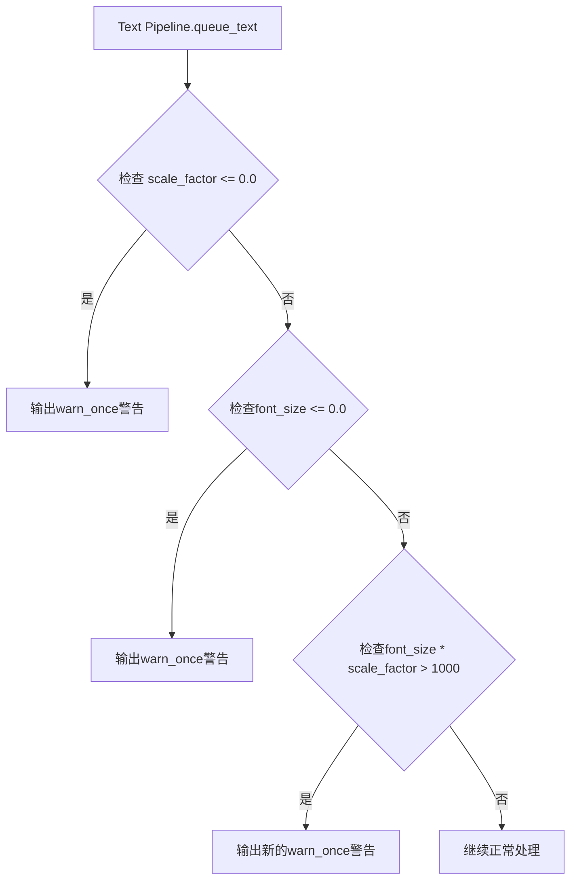

+++
title = "#22642 Emit a `warn_once` if a font size is larger than 1000"
date = "2026-01-24T00:00:00"
draft = false
template = "pull_request_page.html"
in_search_index = false

[extra]
current_language = "zh-cn"
available_languages = {"en" = { name = "English", url = "/pull_request/bevy/2026-01/pr-22642-en-20260124" }, "zh-cn" = { name = "中文", url = "/pull_request/bevy/2026-01/pr-22642-zh-cn-20260124" }}
+++

# Title

## 基本信息
- **标题**: Emit a `warn_once` if a font size is larger than 1000
- **PR 链接**: https://github.com/bevyengine/bevy/pull/22642
- **作者**: WaterWhisperer
- **状态**: 已合并
- **标签**: C-Usability, S-Ready-For-Final-Review, A-Text, X-Uncontroversial, D-Straightforward
- **创建时间**: 2026-01-22T05:46:58Z
- **合并时间**: 2026-01-24T19:38:56Z
- **合并者**: alice-i-cecile

## 描述翻译

# 目标
- 修复 #22625

## 解决方案
- 添加一个 `WARN_FONT_SIZE` 常量，当字体大小超过该值时发出 `warn_once` 警告
- 将一些 `once!(warn!())` 调用改为 `warn_once!()`

## 测试
- 你测试过这些更改吗？如果是，如何测试的？
`cargo check`

## 本次 Pull Request 的技术分析

这个 PR 主要解决一个特定的性能警告问题。在 Bevy 引擎的文本渲染系统中，当用户设置了非常大的字体尺寸时，会导致字体图集（font atlas）生成性能问题和内存使用过高。这个问题在 issue #22625 中被报告。

开发者在分析问题时发现，现有的文本处理代码已经有一些警告机制，比如对小于等于0的缩放因子和字体大小有警告，但对过大的字体尺寸没有相应警告。这是一个明显的缺失，因为极端大的字体尺寸在实际使用中通常是由于误操作或计算错误导致的，而不是真正需要的渲染效果。

PR 的核心修改在 `crates/bevy_text/src/pipeline.rs` 文件中。首先，开发者将原有的警告日志方式从 `once!(warn!(...))` 统一改为 `warn_once!(...)` 宏调用。这两种方式在功能上类似，但 `warn_once!` 更简洁，是 Bevy 提供的专门用于单次警告的工具宏。

然后，开发者添加了一个新的常量定义和检查逻辑：

```rust
const WARN_FONT_SIZE: f32 = 1000.0;
if text_font.font_size * scale_factor as f32 > WARN_FONT_SIZE {
    warn_once!(
        "Text span {entity} has an excessively large font size ({} with scale factor {}). \
        Extremely large font sizes will cause performance issues with font atlas \
        generation and high memory usage.",
        text_font.font_size,
        scale_factor,
    );
}
```

这里有几个技术细节值得注意：

1. **阈值的合理性**：选择了 1000.0 作为阈值，这个值相当大，对大多数实际应用场景来说，正常的文本渲染不会达到这个尺寸。这个阈值避免了对合理使用的误报，同时能捕捉到真正有问题的极端值。

2. **考虑缩放因子**：检查的是 `text_font.font_size * scale_factor` 而不是单纯的字体大小，这很重要，因为最终的渲染尺寸会受到全局缩放因子的影响。一个原本合理的字体大小可能因为过大的缩放因子而变得有问题。

3. **明确的警告信息**：警告信息清楚地说明了问题实体、具体数值以及可能导致的后果（性能问题和内存使用过高），这有助于开发者快速定位和解决问题。

4. **单次警告策略**：使用 `warn_once!` 而不是每次处理都警告，避免了日志泛滥问题。对于同一个文本实体，这个警告只会出现一次，不会重复干扰开发者。

从架构角度看，这个修改位于文本管道的处理逻辑中，具体在 `queue_text` 方法里。这个方法负责将文本组件转换为可渲染的数据，是添加这种验证逻辑的合适位置。

这个 PR 虽然改动不大，但体现了良好的工程实践：
- 修复特定问题的同时，保持了代码风格的一致性（统一使用 `warn_once!`）
- 添加了有意义的常量而非魔数（magic number）
- 提供了清晰、有操作性的警告信息
- 不会对正常使用产生性能影响

值得注意的是，这个修改只是添加警告而不是强制限制字体大小，保持了API的灵活性。在某些特殊情况下，开发者可能确实需要非常大的字体，他们仍然可以这样做，但会收到明确的性能警告。

## 视觉表示



## 主要文件变更

### `crates/bevy_text/src/pipeline.rs` (+15/-6)

这个文件是文本渲染管道的核心实现，负责处理文本的排队和渲染准备。

**关键修改**：

1. **导入变更**：
```rust
// 之前:
use bevy_log::{once, warn};
// 之后:
use bevy_log::warn_once;
```
从导入 `once` 和 `warn` 改为直接导入 `warn_once` 宏。

2. **已有警告的优化**：
```rust
// 之前对 scale_factor 的警告:
once!(warn!(
    "Text scale factor is <= 0.0. No text will be displayed.",
));
// 之后:
warn_once!("Text scale factor is <= 0.0. No text will be displayed.");
```

```rust
// 之前对 font_size <= 0.0 的警告:
once!(warn!(
    "Text span {entity} has a font size <= 0.0. Nothing will be displayed.",
));
// 之后:
warn_once!(
    "Text span {entity} has a font size <= 0.0. Nothing will be displayed.",
);
```

3. **新增对大字体尺寸的警告**：
```rust
const WARN_FONT_SIZE: f32 = 1000.0;
if text_font.font_size * scale_factor as f32 > WARN_FONT_SIZE {
    warn_once!(
        "Text span {entity} has an excessively large font size ({} with scale factor {}). \
        Extremely large font sizes will cause performance issues with font atlas \
        generation and high memory usage.",
        text_font.font_size,
        scale_factor,
    );
}
```

这些修改共同实现了在文本处理过程中对异常字体大小的检测和警告，帮助开发者避免性能问题。

## 进一步阅读

1. Bevy 日志系统文档：了解 `warn_once!` 宏和其他日志工具的使用
2. Bevy 文本渲染系统：理解字体图集（font atlas）的生成机制和性能考量
3. 游戏引擎中的文本渲染优化技术
4. Rust 中的常量定义和配置管理最佳实践