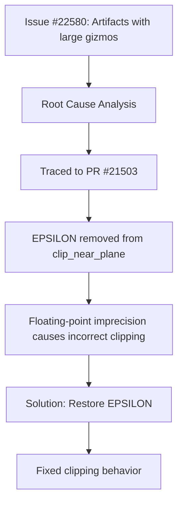

+++
title = "#22645 Fix artifacts when rendering large gizmos"
date = "2026-01-23T00:00:00"
draft = false
template = "pull_request_page.html"
in_search_index = true

[taxonomies]
list_display = ["show"]

[extra]
current_language = "en"
available_languages = {"en" = { name = "English", url = "/pull_request/bevy/2026-01/pr-22645-en-20260123" }, "zh-cn" = { name = "中文", url = "/pull_request/bevy/2026-01/pr-22645-zh-cn-20260123" }}
labels = ["C-Bug", "A-Gizmos"]
+++

# Title

## Basic Information
- **Title**: Fix artifacts when rendering large gizmos
- **PR Link**: https://github.com/bevyengine/bevy/pull/22645
- **Author**: EmbersArc
- **Status**: MERGED
- **Labels**: C-Bug, S-Ready-For-Final-Review, A-Gizmos
- **Created**: 2026-01-22T12:32:33Z
- **Merged**: 2026-01-23T03:14:22Z
- **Merged By**: alice-i-cecile

## Description Translation

# Objective

Fixes #22580, see the issue for more information.

## Solution

- Bring back the EPSILON that was removed in https://github.com/bevyengine/bevy/pull/21503

## Testing

Tested with the example code in the issue.

## The Story of This Pull Request

The problem started when developers reported visual artifacts when rendering large gizmos in Bevy. Specifically, lines were appearing where they shouldn't - lines that should have been clipped at the near plane were still visible. This was tracked in issue #22580 where users provided reproducible examples showing the problem.

Looking at the code history, this regression was introduced in PR #21503 where an EPSILON value was removed from the line clipping logic. The original developer likely removed it thinking it was unnecessary, but as with many floating-point precision issues, the consequences only manifested under specific conditions - in this case, when rendering large-scale gizmos where the numerical precision limitations became apparent.

The solution was straightforward: restore the EPSILON value that had been previously removed. In the `clip_near_plane` function in the WebGPU Shading Language (WGSL) code, when interpolating between two points to find where a line intersects the near clipping plane, floating-point imprecision could cause the calculated intersection point to be slightly behind the clip plane. This meant lines that should have been fully clipped away would still have visible fragments.

The implementation change is minimal but critical. In the `lines.wgsl` file, the function computes an interpolation factor `t` to find where a line from point `a` to point `b` intersects the near plane. Without the epsilon, when `distance_a` and `distance_b` are very close in value (which happens with large coordinates due to floating-point precision limits), the calculation could produce a `t` value that's mathematically correct but numerically imprecise enough to place the resulting point slightly behind the near plane instead of exactly on it.

By adding `EPSILON` to the interpolator, we ensure the computed point is pushed just slightly in front of the near plane, guaranteeing proper clipping behavior. This is a standard technique in computer graphics to handle floating-point precision issues near clipping boundaries.

The fix demonstrates an important principle in graphics programming: when dealing with floating-point calculations for visibility and clipping, small epsilon values are often necessary to account for numerical imprecision. The removal of this epsilon in PR #21503 was likely an oversight during refactoring or optimization, highlighting how seemingly innocuous changes to graphics math can have visible consequences.

From an engineering perspective, this fix shows the value of maintaining regression tests for graphical output and the importance of understanding the purpose of even small constants in graphics code. The EPSILON isn't arbitrary - it serves a specific purpose in mitigating floating-point precision issues that are inherent in 3D graphics calculations.

## Visual Representation



## Key Files Changed

### `crates/bevy_gizmos_render/src/lines.wgsl` (+4/-1)

This is the only file modified in the PR. It contains the WGSL shader code for rendering gizmo lines. The change is in the `clip_near_plane` function which handles clipping lines against the near plane of the view frustum.

**Key Change:**
The function computes where a line segment intersects the near clipping plane. The fix adds a small epsilon value to the interpolation factor to ensure numerical stability.

**Code Snippet:**

```wgsl
// File: crates/bevy_gizmos_render/src/lines.wgsl
// Before:
fn clip_near_plane(a: vec4<f32>, b: vec4<f32>) -> vec4<f32> {
    // ... other code ...
    let t = distance_a / (distance_a - distance_b);
    return mix(a, b, t);
}

// After:
fn clip_near_plane(a: vec4<f32>, b: vec4<f32>) -> vec4<f32> {
    // ... other code ...
    // Add an epsilon to the interpolator to ensure that the point is
    // not just behind the clip plane due to floating-point imprecision,
    // which can lead to lines showing up where they should not.
    let t = distance_a / (distance_a - distance_b) + EPSILON;
    return mix(a, b, t);
}
```

The change adds `+ EPSILON` to the calculation of `t`. The EPSILON constant is defined elsewhere in the shader (not shown in the diff) and provides a small floating-point value to offset the interpolation factor, ensuring the resulting point is safely in front of the near plane rather than potentially behind it due to floating-point rounding errors.

## Further Reading

1. **Floating-Point Precision in Graphics**: Understanding how floating-point imprecision affects 3D graphics calculations is fundamental. The classic reference is "What Every Computer Scientist Should Know About Floating-Point Arithmetic" by David Goldberg.

2. **Clipping Algorithms**: The Cohen-Sutherland line clipping algorithm and its variants are standard in computer graphics. This fix relates to the numerical stability of such algorithms when implemented with floating-point arithmetic.

3. **WebGPU Shading Language (WGSL)**: The shader language used in Bevy's renderer. The official WGSL specification provides details on its floating-point behavior and precision guarantees.

4. **Bevy Gizmos System**: Bevy's gizmo rendering system provides debug visualization tools. Understanding how it integrates with Bevy's ECS and rendering pipeline helps contextualize this fix.

5. **Numerical Epsilon Values**: The concept of epsilon values for comparing floating-point numbers is widely used in game development and computer graphics. Different scenarios require different epsilon values based on the scale of numbers involved.