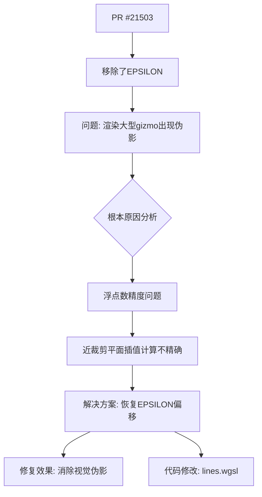

+++
title = "#22645 Fix artifacts when rendering large gizmos"
date = "2026-01-23T00:00:00"
draft = false
template = "pull_request_page.html"
in_search_index = false

[extra]
current_language = "zh-cn"
available_languages = {"en" = { name = "English", url = "/pull_request/bevy/2026-01/pr-22645-en-20260123" }, "zh-cn" = { name = "中文", url = "/pull_request/bevy/2026-01/pr-22645-zh-cn-20260123" }}
+++

# Fix artifacts when rendering large gizmos

## 基本信息
- **标题**: Fix artifacts when rendering large gizmos
- **PR链接**: https://github.com/bevyengine/bevy/pull/22645
- **作者**: EmbersArc
- **状态**: 已合并
- **标签**: C-Bug, S-Ready-For-Final-Review, A-Gizmos
- **创建时间**: 2026-01-22T12:32:33Z
- **合并时间**: 2026-01-23T03:14:22Z
- **合并人**: alice-i-cecile

## 描述翻译

# 目标

修复 #22580，更多信息请参阅该issue。

## 解决方案

- 恢复在 https://github.com/bevyengine/bevy/pull/21503 中被移除的 EPSILON

## 测试

使用issue中的示例代码进行了测试。

## 本次Pull Request的技术分析

这个PR解决了一个渲染大型gizmo时出现的视觉伪影（artifacts）问题。问题的核心在于图形渲染管线中的浮点数精度问题，特别是在近裁剪平面（near clipping plane）处理时。

### 问题背景与上下文

在3D图形渲染中，裁剪（clipping）是一个关键步骤，用于移除相机视锥体（view frustum）外的几何体。其中，近裁剪平面尤其重要，因为任何位于近裁剪平面后面的物体都不可见。在PR #21503中，开发人员移除了一个用于处理浮点数精度的EPSILON值，这导致了当渲染大型gizmo时，由于浮点数舍入误差，本应被裁剪掉的线条片段可能出现在屏幕上。

具体来说，问题出现在`clip_near_plane`函数中计算插值参数`t`时。当线段的一个端点非常接近近裁剪平面时，浮点数计算的不精确性可能导致`t`值计算不准确，从而使插值得到的点稍微位于近裁剪平面之后。这在渲染大型gizmo时尤为明显，因为坐标值较大时浮点数精度问题会被放大。

### 解决方案的实现方式

解决方案相对直接：恢复之前被移除的EPSILON偏移量。这个微小的偏移量确保插值点不会因为浮点数不精确性而落到近裁剪平面之后。

关键修改在`lines.wgsl`文件的第141行，具体是在计算插值参数`t`时添加了一个EPSILON：

```wgsl
// 修改前:
let t = distance_a / (distance_a - distance_b);

// 修改后:
let t = distance_a / (distance_a - distance_b) + EPSILON;
```

这个修改虽然只有一行代码，但解决了显著的视觉问题。添加的注释清晰地解释了修改目的："添加一个epsilon到插值器中，确保该点不会仅仅因为浮点数不精确性而位于裁剪平面之后，这可能导致线条出现在它们不应出现的位置。"

### 技术洞察与工程考量

这种使用epsilon值来处理浮点数精度问题是计算机图形学中的常见模式。在图形渲染中，由于浮点数的有限精度，边界情况（edge cases）的处理需要特别小心。几个关键点值得注意：

1. **浮点数精度与图形渲染**：在图形管线中，顶点坐标经过一系列变换（模型变换、视图变换、投影变换），每一步都可能引入数值误差。当坐标值非常大时，如渲染大型gizmo，这种误差会变得更加明显。

2. **裁剪算法的稳定性**：裁剪算法需要处理各种边界情况，包括线段端点正好在裁剪平面上或非常接近裁剪平面的情况。没有适当的容差处理，这些边界情况可能导致视觉伪影或不一致的行为。

3. **epsilon值的选择**：虽然代码中没有显示EPSILON的具体数值，但通常这类epsilon值是经过精心选择的——足够小以避免影响正常渲染，又足够大以解决浮点数精度问题。

4. **向后兼容性考虑**：这个PR实际上是恢复之前被移除的功能，这提醒我们在优化代码时需要谨慎。有时候看似不必要的代码实际上是为了处理特定边界情况。

### 影响与改进

这个修复直接影响渲染质量，消除了大型gizmo渲染时的视觉伪影。从工程角度看，这个变更：

1. **维护了视觉一致性**：确保gizmo在各种尺寸下都能正确渲染
2. **遵循了稳健性原则**：通过添加容差来处理浮点数精度边界情况
3. **保持了代码可读性**：添加的注释清楚地解释了为什么需要这个epsilon

这次修复也展示了一个重要的工程原则：在移除看似"冗余"的代码时需要充分理解其原始目的，特别是在处理浮点数计算和图形渲染这种对精度敏感的领域。

## 可视化关系



## 关键文件变更

### `crates/bevy_gizmos_render/src/lines.wgsl` (+4/-1)

这是本次PR中唯一修改的文件，包含了对近裁剪平面裁剪函数的修复。

**变更说明**：
在`clip_near_plane`函数中，当计算从点a到点b的插值参数t时，添加了一个EPSILON值。这确保了由于浮点数不精确性，插值点不会意外地落在近裁剪平面之后。

**代码对比**：
```wgsl
// 修改前:
fn clip_near_plane(a: vec4<f32>, b: vec4<f32>) -> vec4<f32> {
    // ... 其他代码
    let distance_a = a.z - a.w;
    let distance_b = b.z - b.w;
    let t = distance_a / (distance_a - distance_b);
    return mix(a, b, t);
}

// 修改后:
fn clip_near_plane(a: vec4<f32>, b: vec4<f32>) -> vec4<f32> {
    // ... 其他代码
    let distance_a = a.z - a.w;
    let distance_b = b.z - b.w;
    // 添加一个epsilon到插值器中，确保该点不会仅仅因为浮点数不精确性而位于裁剪平面之后，
    // 这可能导致线条出现在它们不应出现的位置。
    let t = distance_a / (distance_a - distance_b) + EPSILON;
    return mix(a, b, t);
}
```

**与PR目标的关联**：
这个修改直接解决了issue #22580中报告的视觉伪影问题。当渲染大型gizmo时，坐标值较大，浮点数精度问题更加明显，这个epsilon偏移确保了裁剪计算的稳健性。

## 扩展阅读

对于想深入了解相关概念的开发者，建议阅读以下资源：

1. **计算机图形学中的浮点数问题**：
   - 《Real-Time Rendering》第4版，第23章 "Precision and Accuracy"
   - 维基百科词条：Floating-point arithmetic in computer graphics

2. **裁剪算法与实现**：
   - 《Fundamentals of Computer Graphics》第5版，第8章 "Viewing"
   - Cohen-Sutherland裁剪算法及其在3D图形中的应用

3. **WebGPU/WGSL编程**：
   - WebGPU规范中的浮点数精度要求
   - WGSL语言规范中的数值计算部分

4. **图形API中的容差处理**：
   - OpenGL/ DirectX/ Vulkan中近裁剪平面的处理方式
   - 各种图形引擎中处理裁剪边界情况的实现模式

5. **相关Bevy引擎文档**：
   - Bevy的gizmo系统架构
   - Bevy渲染管线的坐标变换流程