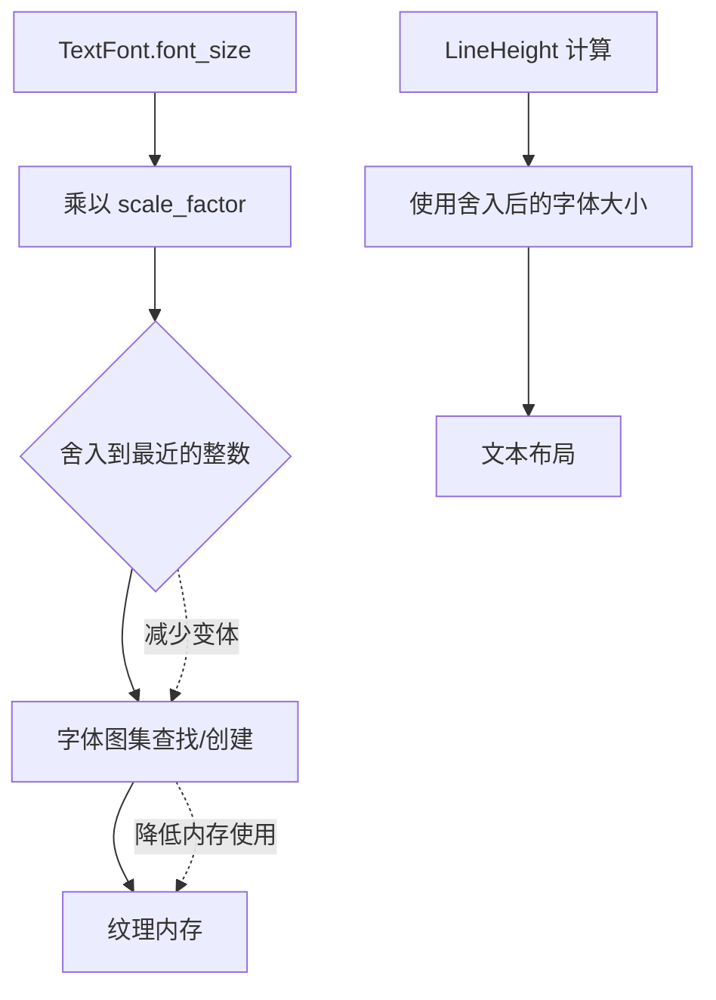

+++
title = "#22646 Round sub pixel font sizes"
date = "2026-01-24T00:00:00"
draft = false
template = "pull_request_page.html"
in_search_index = false

[extra]
current_language = "zh-cn"
available_languages = {"en" = { name = "English", url = "/pull_request/bevy/2026-01/pr-22646-en-20260124" }, "zh-cn" = { name = "中文", url = "/pull_request/bevy/2026-01/pr-22646-zh-cn-20260124" }}
+++

# Title: Round sub pixel font sizes

## 基本信息
- **标题**: Round sub pixel font sizes
- **PR链接**: https://github.com/bevyengine/bevy/pull/22646
- **作者**: ickshonpe
- **状态**: 已合并
- **标签**: C-性能, S-准备最终评审, A-文本, X-有争议, D-简单明了
- **创建时间**: 2026-01-22T13:03:58Z
- **合并时间**: 2026-01-24T20:23:33Z
- **合并人**: alice-i-cecile

## 描述翻译

### 目标

对于位图字体而言，亚像素(sub-pixel)字体大小并没有带来太多好处，而当文本实体的字体大小被简单地插值(interpolated)时，将它们舍入(round)到最近的像素可以极大地减少字体图集(font atlas)的数量。

修复 #22626

### 解决方案

在将字体大小添加到 Cosmic Text 的 `Attrs` 之前，对它们进行舍入(round)。

### 测试

```
cargo run --example animated_ui
```

在主分支(main)中，窗口是空白的，并且它会快速生成吉字节(gigabytes)级的字体图集图像。

使用此 PR 后，文本可见并具有动画效果，并且内存使用保持稳定。

## 这个 PR 的故事

这个 PR 解决了一个看似简单但具有重要性能影响的问题。在 Bevy 引擎中，当文本实体的字体大小被动画化或通过其他方式插值时，可能会产生大量的亚像素(sub-pixel)字体大小。每个独特的字体大小都会触发生成一个新的字体图集(font atlas)纹理(texture)，这可能导致内存使用量激增和性能问题。

### 问题与背景

问题起源于 #22626，报告中描述了一个场景：运行 `animated_ui` 示例时，窗口变为空白，并且系统快速生成吉字节(gigabytes)级的字体图集图像。问题的核心在于字体大小的小数部分。

在文本渲染系统中，每个字体文件(`FontSource`)和字体大小的组合都会创建一个单独的字体图集。当字体大小被动画化(比如从 16.0 平滑过渡到 32.0)时，每一帧都可能产生一个带有小数部分的、稍微不同的字体大小。对于位图字体(bitmap fonts)来说，这些亚像素的细微差异并不会在视觉质量上带来显著提升，但每个独特的小数值都会导致创建一个新的字体图集。

### 解决方案方法

作者采用了一个直接且实用的方法：在计算最终用于文本布局的字体大小时，将缩放后的字体大小舍入(round)到最近的整数值。这样，相近的字体大小(比如 16.1, 16.2, 16.3)都会被映射到同一个整数值(16)，从而重用同一个字体图集。

这个方法的合理性基于两个观察：
1. 对于位图字体，亚像素的精确度并不会显著提高视觉质量
2. 性能收益(减少纹理内存和创建开销)远超过视觉上的微小损失

### 实现细节

在 `pipeline.rs` 的 `get_attrs` 函数中，关键的改变是添加了 `.round()` 调用：

```rust
// 修改前
// 字体大小直接使用，可能包含小数部分
.font_size: text_font.font_size,

// 修改后
let font_size = (text_font.font_size * scale_factor as f32).round();
// ...
.font_size: font_size,
```

同时，行高(line height)的计算逻辑也从 `LineHeight::eval` 方法移到了 `get_attrs` 函数内部，这样可以直接使用舍入后的 `font_size` 来计算相对行高。

这个变化带来了一系列连锁修改：
1. 移除了 `LineHeight::eval` 方法，因为它只在 `get_attrs` 中使用
2. 更新了 `TextFont::font_size` 的文档，明确说明了舍入行为
3. 简化了 `Metrics` 的创建，不再需要单独的 `.scale()` 调用

### 技术洞见

这个 PR 展示了工程实践中常见的权衡：在精确度和性能之间找到平衡点。具体来说：

1. **精度损失的可接受性**：对于文本渲染，整数字体大小通常已经足够。特别是在游戏和 UI 环境中，文本尺寸通常是整数像素值以获得清晰显示。

2. **性能优化的杠杆点**：字体图集的创建和纹理上传是相对昂贵的操作。通过减少不必要的变体，可以显著降低内存使用和 GPU 资源消耗。

3. **级联影响**：一个简单的 `.round()` 调用产生了广泛的影响，不仅解决了内存爆炸问题，还简化了相关的代码路径。

4. **向后兼容性考虑**：虽然行为发生了变化，但对于大多数用例来说，这种变化是不可见的。只有在使用非常精确的亚像素字体大小动画时才会注意到差异。

### 影响

这个修改带来了直接的性能改善：

1. **内存使用稳定**：在 `animated_ui` 示例中，内存使用不再呈指数增长
2. **减少纹理创建**：显著减少了字体图集纹理的创建数量
3. **保持功能完整**：文本仍然正确渲染，动画效果正常工作

从架构角度来看，这个修改：
- 简化了 `LineHeight` 的实现，移除了不再需要的方法
- 使字体大小的处理更加明确和可预测
- 为未来的优化奠定了基础(比如可以考虑添加缓存策略)

## 可视化表示



## 关键文件变更

### `crates/bevy_text/src/pipeline.rs` (+10/-7)

这个文件包含了主要的逻辑修改。`get_attrs` 函数现在会在应用缩放因子(scale factor)后对字体大小进行舍入：

```rust
// 修改前:
.font_size: text_font.font_size,

// 修改后:
let font_size = (text_font.font_size * scale_factor as f32).round();
```

同时，行高的计算逻辑被内联到函数中，直接使用舍入后的字体大小：

```rust
// 修改前:
.metrics(
    Metrics {
        font_size: text_font.font_size,
        line_height: line_height.eval(text_font.font_size),
    }
    .scale(scale_factor as f32),
)

// 修改后:
let line_height = match line_height {
    LineHeight::Px(px) => px * scale_factor as f32,
    LineHeight::RelativeToFont(s) => s * font_size,
};
.metrics(Metrics {
    font_size,
    line_height,
})
```

### `crates/bevy_text/src/text.rs` (+3/-11)

这个文件包含了两类修改：文档更新和代码简化。

1. **文档更新**：`TextFont::font_size` 的文档现在明确说明了舍入行为：

```rust
// 修改后:
/// 然后，缩放后的字体大小会被舍入到最近的像素，
/// 以产生在字形布局期间使用的最终字体大小。
```

2. **代码简化**：移除了 `LineHeight::eval` 方法，因为它只在修改后的 `get_attrs` 函数中使用，而该函数现在直接计算行高：

```rust
// 被移除的方法:
impl LineHeight {
    pub(crate) fn eval(self, font_size: f32) -> f32 {
        match self {
            LineHeight::Px(px) => px,
            LineHeight::RelativeToFont(scale) => scale * font_size,
        }
    }
}
```

## 进一步阅读

1. **Bevy 文本渲染系统**: 了解 Bevy 如何集成 Cosmic Text 进行文本布局和渲染
2. **字体图集技术**: 学习字体图集的工作原理和优化策略
3. **GPU 纹理内存管理**: 理解纹理内存对性能的影响和优化技术
4. **亚像素渲染**: 深入了解亚像素渲染的优缺点，特别是在游戏引擎中的适用场景
5. **性能权衡分析**: 学习如何在软件工程中做出合理的性能与质量权衡决策

相关的 GitHub issue: #22626 提供了这个问题发生的具体场景和详细描述。