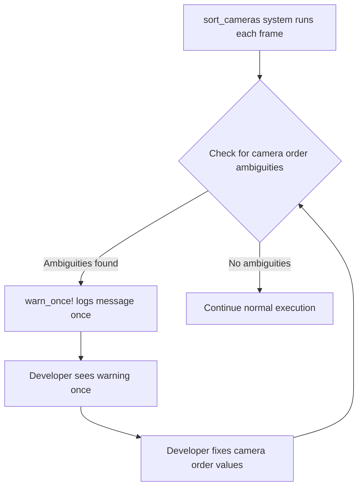

+++
title = "#22649 Change camera order ambiguity warning to `warn_once!`"
date = "2026-01-27T00:00:00"
draft = false
template = "pull_request_page.html"
in_search_index = true

[taxonomies]
list_display = ["show"]

[extra]
current_language = "en"
available_languages = {"en" = { name = "English", url = "/pull_request/bevy/2026-01/pr-22649-en-20260127" }, "zh-cn" = { name = "中文", url = "/pull_request/bevy/2026-01/pr-22649-zh-cn-20260127" }}
labels = ["D-Trivial", "A-Rendering", "C-Usability"]
+++

# Title

## Basic Information
- **Title**: Change camera order ambiguity warning to `warn_once!`
- **PR Link**: https://github.com/bevyengine/bevy/pull/22649
- **Author**: natepiano
- **Status**: MERGED
- **Labels**: D-Trivial, A-Rendering, C-Usability, S-Ready-For-Final-Review
- **Created**: 2026-01-22T17:27:44Z
- **Merged**: 2026-01-27T07:03:38Z
- **Merged By**: alice-i-cecile

## Description Translation

### Objective

Fixes #22635

Camera order ambiguity warnings currently fire every frame, flooding the console.

### Solution

- Change `warn!` to `warn_once!` in `sort_cameras` so the warning only fires once per ambiguity
- Remove the log filter workaround from `ui_target_camera` example since the warning is no longer spammy

### Testing

Ran the `ui_target_camera` example and triggered a camera order ambiguity by clicking to give two cameras the same order. Verified the warning appears exactly once in the logs despite running for many frames afterward.

## The Story of This Pull Request

The PR addresses a straightforward but annoying issue in Bevy's rendering system: camera order ambiguity warnings that were spamming the console every frame. These warnings occur when multiple active cameras share the same render order value, creating an ambiguous situation where the renderer can't deterministically decide which camera to prioritize.

In the existing implementation, when the `sort_cameras` system runs each frame (which is necessary to maintain correct rendering order), it would check for ambiguities and log a warning using the standard `warn!` macro. This meant that if you had two cameras with the same order value, you'd get the same warning message printed to your console 60+ times per second, quickly flooding the output and making it difficult to see other important log messages.

The fix is simple but effective: replace `warn!` with `warn_once!`. This macro, provided by Bevy's logging system, ensures that a warning message is only logged once per unique call site and message. This change maintains the warning's utility for alerting developers to a legitimate configuration issue while eliminating the console spam.

The PR also cleans up a workaround in the `ui_target_camera` example. Previously, to avoid the spammy warnings during example execution, the example was manually configuring the `LogPlugin` with a filter that suppressed warnings from the camera module entirely. With the warning now appearing only once, this workaround is no longer necessary, so the example reverts to using the default plugin configuration.

From an engineering perspective, this change demonstrates good practice in logging: warnings should alert developers to problems without overwhelming them with noise. The `warn_once!` macro is particularly useful for warnings that occur in systems running every frame, where the underlying condition persists unchanged across multiple frames. This pattern could be applied to other similar warnings in the codebase where repetitive logging adds no additional value.

The implementation is minimal - just changing one macro call and removing some configuration code - but the impact on developer experience is significant. Developers can now see the warning once, understand the problem, and fix it, without having to filter through hundreds of identical messages.

## Visual Representation



## Key Files Changed

### 1. `crates/bevy_render/src/camera.rs` (+2/-1)

This file contains the core change to fix the warning spam. The `sort_cameras` function now uses `warn_once!` instead of `warn!` for camera order ambiguity warnings.

**Key changes:**
```rust
// Before (line 652-657):
if !ambiguities.is_empty() {
    warn!(
        "Camera order ambiguities detected for active cameras with the following priorities: {:?}. \
        To fix this, ensure there is exactly one Camera entity spawned with a given order for a given RenderTarget. \
        Ambiguities should be resolved because either (1) multiple active cameras were spawned accidentally, which will \
        result in multiple renders happening on the same window; or (2) one of the cameras should be changed to a different order.",
        ambiguities
    );

// After (lines 653-658):
if !ambiguities.is_empty() {
    warn_once!(
        "Camera order ambiguities detected for active cameras with the following priorities: {:?}. \
        To fix this, ensure there is exactly one Camera entity spawned with a given order for a given RenderTarget. \
        Ambiguities should be resolved because either (1) multiple active cameras were spawned accidentally, which will \
        result in multiple renders happening on the same window; or (2) one of the cameras should be changed to a different order.",
        ambiguities
    );
```

Additionally, the import for `warn_once` was added:
```rust
use bevy_log::warn_once;
```

### 2. `examples/ui/ui_target_camera.rs` (+1/-7)

This file removes the workaround that was suppressing camera warnings in the example. The example now uses the default `LogPlugin` configuration instead of a custom one that filtered out camera warnings.

**Key changes:**
```rust
// Before (lines 4-11):
use bevy::log::LogPlugin;
use bevy::log::DEFAULT_FILTER;
use bevy::prelude::*;

fn main() {
    App::new()
        .add_plugins(DefaultPlugins.set(LogPlugin {
            // Disable camera order ambiguity warnings
            filter: format!("{DEFAULT_FILTER},bevy_render::camera=off"),
            ..Default::default()
        }))
        .add_systems(Startup, setup)
        .run();
}

// After (lines 4-11):
use bevy::prelude::*;

fn main() {
    App::new()
        .add_plugins(DefaultPlugins)
        .add_systems(Startup, setup)
        .run();
}
```

## Further Reading

1. **Bevy Logging Documentation**: For more information on Bevy's logging system and available macros like `warn_once!`, see the [Bevy Logging documentation](https://docs.rs/bevy_log/latest/bevy_log/).

2. **Camera Ordering in Bevy**: To understand camera ordering and why ambiguities matter, refer to the [Bevy Camera documentation](https://docs.rs/bevy_render/latest/bevy_render/camera/index.html) and the `Camera` component documentation.

3. **Rust Logging Best Practices**: For general guidance on effective logging in Rust applications, the [Rust Log crate documentation](https://docs.rs/log/latest/log/) provides useful patterns and conventions.

4. **Issue #22635**: The original issue report provides additional context about the problem and user experience impact: https://github.com/bevyengine/bevy/issues/22635

5. **Bevy ECS Systems**: To understand how systems like `sort_cameras` run each frame in Bevy's ECS, see the [Bevy ECS Systems documentation](https://docs.rs/bevy_ecs/latest/bevy_ecs/system/index.html).