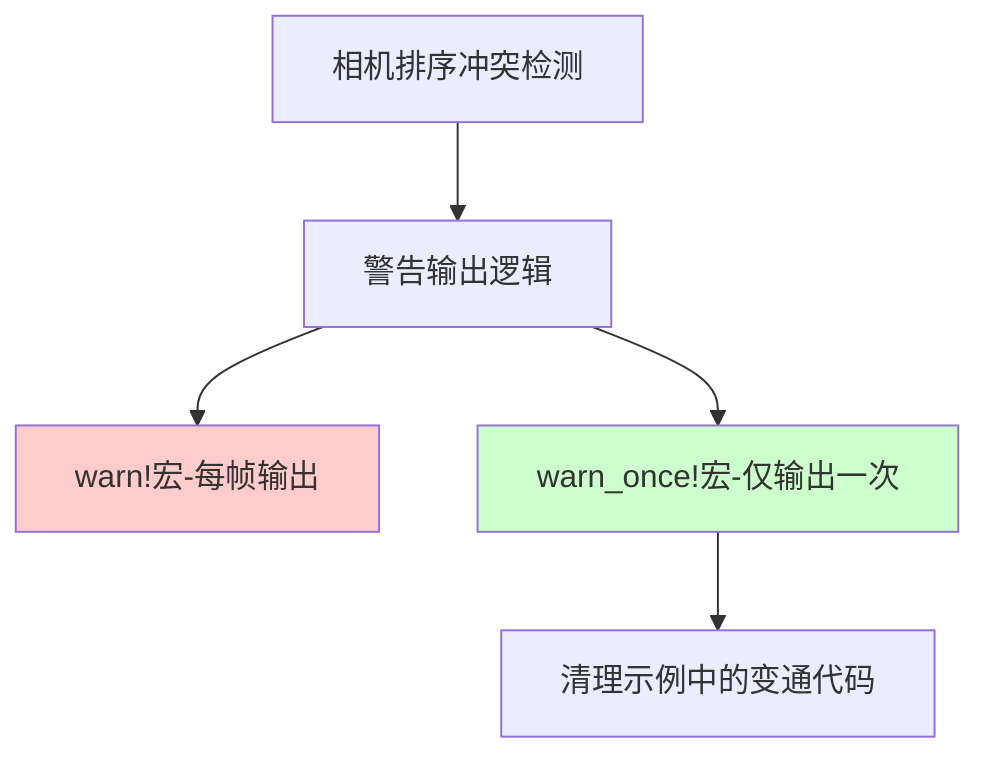

+++
title = "#22649 Change camera order ambiguity warning to `warn_once!"
date = "2026-01-27T00:00:00"
draft = false
template = "pull_request_page.html"
in_search_index = false

[extra]
current_language = "zh-cn"
available_languages = {"en" = { name = "English", url = "/pull_request/bevy/2026-01/pr-22649-en-20260127" }, "zh-cn" = { name = "中文", url = "/pull_request/bevy/2026-01/pr-22649-zh-cn-20260127" }}
+++

# Title
## Basic Information
- **标题**: Change camera order ambiguity warning to `warn_once!`
- **PR链接**: https://github.com/bevyengine/bevy/pull/22649  
- **作者**: natepiano
- **状态**: 已合并
- **标签**: D-Trivial, A-Rendering, C-Usability, S-Ready-For-Final-Review
- **创建时间**: 2026-01-22T17:27:44Z
- **合并时间**: 2026-01-27T07:03:38Z
- **合并者**: alice-i-cecile

## 描述翻译
### 目标
修复 #22635

当前相机排序冲突警告每帧都会触发，导致控制台信息泛滥。

### 解决方案
- 将 `sort_cameras` 中的 `warn!` 改为 `warn_once!`，使警告仅在每次冲突时触发一次
- 从 `ui_target_camera` 示例中移除日志过滤器变通方案，因为警告不再泛滥

### 测试
运行 `ui_target_camera` 示例，并通过点击使两个相机拥有相同排序值来触发相机排序冲突。验证警告在日志中仅出现一次，尽管后续运行了许多帧。

## 此PR的故事

这个PR解决了一个实际使用中的问题：相机排序冲突警告的泛滥问题。在Bevy引擎中，渲染系统需要确定相机的渲染顺序，当多个相机被分配到相同的渲染目标和相同的排序值时，就会产生冲突。原本的设计是在`sort_cameras`函数中使用`warn!`宏输出警告，但这会导致警告每帧都打印一次，严重干扰开发调试体验。

问题的根本在于警告的逻辑位置。`sort_cameras`函数在渲染系统的每一帧都会被调用，用于确定相机的渲染顺序。当检测到排序冲突时，原本的`warn!`宏会在每一帧都输出相同的警告信息，即使冲突状态没有改变。这对于开发者来说非常不友好，因为重复的警告会淹没其他重要的日志信息。

开发者natepiano的解决方案简洁有效：将`warn!`替换为`warn_once!`。`warn_once!`宏是Bevy日志系统提供的一个实用工具，它会确保相同的警告消息在整个程序运行期间只输出一次。这个改动既保留了警告的提示功能，又避免了日志泛滥的问题。

从技术实现角度看，`warn_once!`的工作原理是在内部维护一个已记录警告的哈希集合，当相同的警告试图再次输出时会被静默忽略。这种方法在保持向后兼容性的同时，显著改善了开发者体验。

除了核心修复，这个PR还清理了示例代码中的变通方案。在`ui_target_camera.rs`示例中，开发者原本通过配置日志过滤器来禁用相机相关的警告，以应对警告泛滥问题。随着核心问题的解决，这个变通方案变得不再必要，因此被移除。这体现了良好的代码维护实践：当核心问题解决后，相关的变通代码也应该被清理。

这个改动虽然简单，但体现了对开发者体验的关注。日志输出的质量直接影响调试效率，合理的警告频率既能提醒开发者注意潜在问题，又不会干扰正常的工作流程。从工程角度看，这也是一个典型的"修复症状同时移除变通方案"的完整修复。

## 视觉表示


## 关键文件更改

### 1. `crates/bevy_render/src/camera.rs` (+2/-1)

**变化说明**：修改相机排序函数中的警告输出逻辑，从每帧输出改为仅输出一次。

**关键代码片段**：
```rust
// 修改前：
use bevy_log::warn;

// ... 在 sort_cameras 函数中：
if !ambiguities.is_empty() {
    warn!(
        "Camera order ambiguities detected for active cameras with the following priorities: {:?}. \
        To fix this, ensure there is exactly one Camera entity spawned with a given order for a given RenderTarget. \
        Ambiguities should be resolved because either (1) multiple active cameras were spawned accidentally, which will \
        result in multiple renders happening on the same window, or (2) one of the cameras needs to be given a \
        different order value.",
        ambiguities
    );
}

// 修改后：
use bevy_log::warn;
use bevy_log::warn_once;  // 新增导入

// ... 在 sort_cameras 函数中：
if !ambiguities.is_empty() {
    warn_once!(  // 从 warn! 改为 warn_once!
        "Camera order ambiguities detected for active cameras with the following priorities: {:?}. \
        To fix this, ensure there is exactly one Camera entity spawned with a given order for a given RenderTarget. \
        Ambiguities should be resolved because either (1) multiple active cameras were spawned accidentally, which will \
        result in multiple renders happening on the same window, or (2) one of the cameras needs to be given a \
        different order value.",
        ambiguities
    );
}
```

### 2. `examples/ui/ui_target_camera.rs` (+1/-7)

**变化说明**：移除为解决警告泛滥问题而添加的日志过滤器配置，因为核心问题已修复。

**关键代码片段**：
```rust
// 修改前：
use bevy::log::LogPlugin;
use bevy::log::DEFAULT_FILTER;

fn main() {
    App::new()
        .add_plugins(DefaultPlugins.set(LogPlugin {
            // 禁用相机排序冲突警告
            filter: format!("{DEFAULT_FILTER},bevy_render::camera=off"),
            ..Default::default()
        }))
        .add_systems(Startup, setup)
        .run();
}

// 修改后：
fn main() {
    App::new()
        .add_plugins(DefaultPlugins)  // 恢复默认配置
        .add_systems(Startup, setup)
        .run();
}
```

## 进一步阅读

1. **Bevy日志系统**：了解Bevy中的日志级别、过滤器和宏的使用
   - 相关文档：https://docs.rs/bevy/latest/bevy/log/index.html

2. **渲染管线中的相机排序**：理解相机在渲染系统中的排序机制及其重要性
   - Bevy渲染管线文档：https://bevyengine.org/learn/book/rendering/cameras/

3. **warn_once!宏的实现**：研究Bevy中一次性警告的实现机制
   - 源代码：`crates/bevy_log/src/lib.rs` 中的 `warn_once!` 宏定义

4. **开发者体验优化**：学习如何通过改进日志和错误提示来提升开发效率
   - 相关文章：https://matklad.github.io/2021/05/06/how-to-design-a-good-api.html