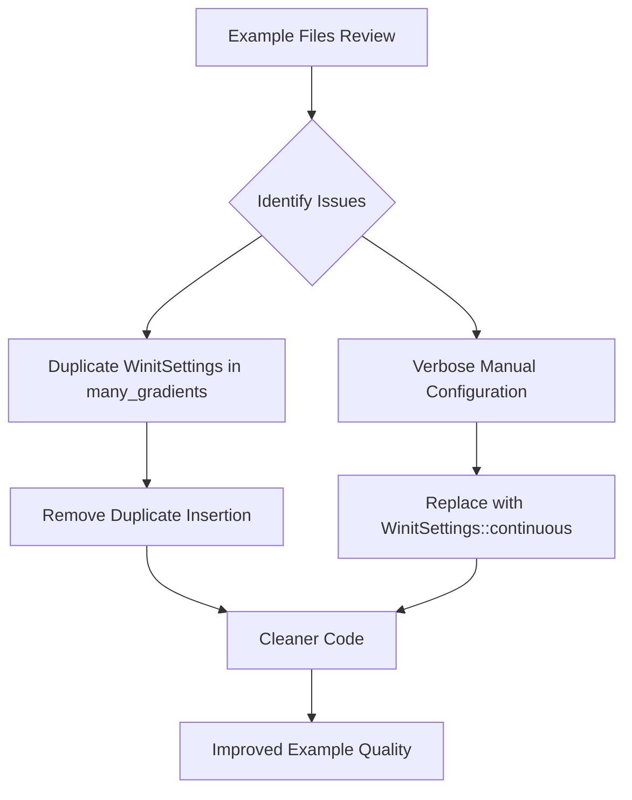

+++
title = "#22650 `WinitSettings` Cleanup - Simplifying Example Code"
date = "2026-01-22T00:00:00"
draft = false
template = "pull_request_page.html"
in_search_index = true

[taxonomies]
list_display = ["show"]

[extra]
current_language = "en"
available_languages = {"en" = { name = "English", url = "/pull_request/bevy/2026-01/pr-22650-en-20260122" }, "zh-cn" = { name = "中文", url = "/pull_request/bevy/2026-01/pr-22650-zh-cn-20260122" }}
labels = ["D-Trivial", "C-Code-Quality"]
+++

# Title: `WinitSettings` Cleanup - Simplifying Example Code

## Basic Information
- **Title**: `WinitSettings` cleanup
- **PR Link**: https://github.com/bevyengine/bevy/pull/22650
- **Author**: ickshonpe
- **Status**: MERGED
- **Labels**: D-Trivial, C-Code-Quality, S-Ready-For-Final-Review
- **Created**: 2026-01-22T17:31:23Z
- **Merged**: 2026-01-22T18:42:32Z
- **Merged By**: alice-i-cecile

## Description Translation

### Objective

#### Some cleanup
1. `many_gradients` inserts `WinitSettings` twice.
2. Replace manual configuration where `WinitSettings::continuous()` could be used.

## The Story of This Pull Request

This PR addresses a straightforward code quality issue in Bevy's example codebase. When examining several stress test and large scene examples, the author noticed a pattern of redundant and verbose `WinitSettings` configuration. The cleanup follows two clear objectives that demonstrate good software engineering practices: eliminating duplicate code and utilizing helper methods where available.

The core issue was that multiple examples were manually constructing `WinitSettings` structs with identical configuration instead of using the existing convenience method. In Bevy, `WinitSettings` controls how the game loop updates when the application window is focused or unfocused. Many examples, particularly stress tests and performance-focused demonstrations, need continuous updates regardless of window focus to provide accurate performance measurements and smooth animations.

The manual configuration pattern appeared in five different example files:

```rust
// Before the change:
.insert_resource(WinitSettings {
    focused_mode: UpdateMode::Continuous,
    unfocused_mode: UpdateMode::Continuous,
})
```

This approach worked correctly but was verbose and less maintainable than using the provided helper method. The Bevy engine already included `WinitSettings::continuous()` as a convenience constructor that creates settings with both update modes set to continuous.

The author identified a more serious issue in the `many_gradients.rs` example where `WinitSettings` was being inserted twice - once with the verbose manual construction and once with the helper method. This duplication wasn't causing functional problems since the second insertion would overwrite the first, but it represented unnecessary code execution and potential confusion for developers reading the example.

The solution approach was methodical and targeted. Instead of making sweeping changes or refactoring complex logic, the author applied focused improvements:

1. **Eliminate duplicate insertion** in `many_gradients.rs` by removing the manual configuration and keeping only the helper method call
2. **Replace manual configuration** with `WinitSettings::continuous()` in all other examples where appropriate

The technical insight here is about API design and usage patterns. When an API provides convenience constructors like `::continuous()`, using them offers several benefits:
- Reduced verbosity and improved readability
- Centralized logic (if the implementation of "continuous" needs to change, it happens in one place)
- Clearer intent (the method name `continuous()` communicates the purpose better than reading two field assignments)
- Prevention of common errors (developers can't accidentally set one mode differently than the other)

This cleanup also demonstrates the importance of reviewing example code. Examples serve as both demonstration and documentation for users learning the engine. Clean, concise examples with proper API usage patterns teach best practices to new users. When examples contain redundant code or don't use available convenience methods, they can inadvertently teach suboptimal patterns.

The impact of these changes is primarily on code quality and maintainability. While there's no functional difference in how the examples run, the improvements make the code:
- More readable and self-documenting
- Less prone to accidental configuration errors
- Consistent across different examples
- Better aligned with Bevy's API design patterns

From an engineering perspective, this PR exemplifies the value of small, focused improvements. Each change is minimal and low-risk, but collectively they improve the overall quality of the codebase. The changes also follow the DRY (Don't Repeat Yourself) principle by eliminating duplicate configuration patterns.

## Visual Representation



## Key Files Changed

### `examples/stress_tests/many_gradients.rs` (+2/-6)
**Description**: Fixed duplicate `WinitSettings` insertion and replaced verbose configuration with helper method. This was the most significant change since it addressed two issues in one file.

**Code changes**:
```rust
// Before:
        .insert_resource(WinitSettings {
            focused_mode: UpdateMode::Continuous,
            unfocused_mode: UpdateMode::Continuous,
        })
        .insert_resource(args)
        .insert_resource(WinitSettings::continuous())

// After:
        .insert_resource(WinitSettings::continuous())
        .insert_resource(args)
```

### `examples/large_scenes/bistro/src/main.rs` (+2/-5)
**Description**: Replaced manual `WinitSettings` construction with the `::continuous()` helper method.

**Code changes**:
```rust
// Before:
        .insert_resource(WinitSettings {
            focused_mode: UpdateMode::Continuous,
            unfocused_mode: UpdateMode::Continuous,
        })

// After:
        .insert_resource(WinitSettings::continuous())
```

### `examples/large_scenes/caldera_hotel/src/main.rs` (+2/-5)
**Description**: Replaced manual `WinitSettings` construction with the `::continuous()` helper method.

**Code changes**:
```rust
// Before:
        .insert_resource(WinitSettings {
            focused_mode: UpdateMode::Continuous,
            unfocused_mode: UpdateMode::Continuous,
        })

// After:
        .insert_resource(WinitSettings::continuous())
```

### `examples/stress_tests/many_cubes.rs` (+2/-5)
**Description**: Replaced manual `WinitSettings` construction with the `::continuous()` helper method.

**Code changes**:
```rust
// Before:
        .insert_resource(WinitSettings {
            focused_mode: UpdateMode::Continuous,
            unfocused_mode: UpdateMode::Continuous,
        })

// After:
        .insert_resource(WinitSettings::continuous())
```

### `examples/stress_tests/many_materials.rs` (+2/-5)
**Description**: Replaced manual `WinitSettings` construction with the `::continuous()` helper method.

**Code changes**:
```rust
// Before:
        .insert_resource(WinitSettings {
            focused_mode: UpdateMode::Continuous,
            unfocused_mode: UpdateMode::Continuous,
        })

// After:
        .insert_resource(WinitSettings::continuous())
```

## Further Reading

1. **Bevy `WinitSettings` documentation**: For understanding the different update modes and their use cases
2. **API Design Patterns**: Resources on when to provide convenience constructors vs. direct struct initialization
3. **Code Quality Metrics**: Information on how small improvements contribute to overall codebase health
4. **Example-Driven Development**: How example code serves as documentation and teaching tool in open source projects
5. **The DRY Principle**: Understanding the benefits of eliminating duplication in code

# Full Code Diff
*(Provided in the original request)*