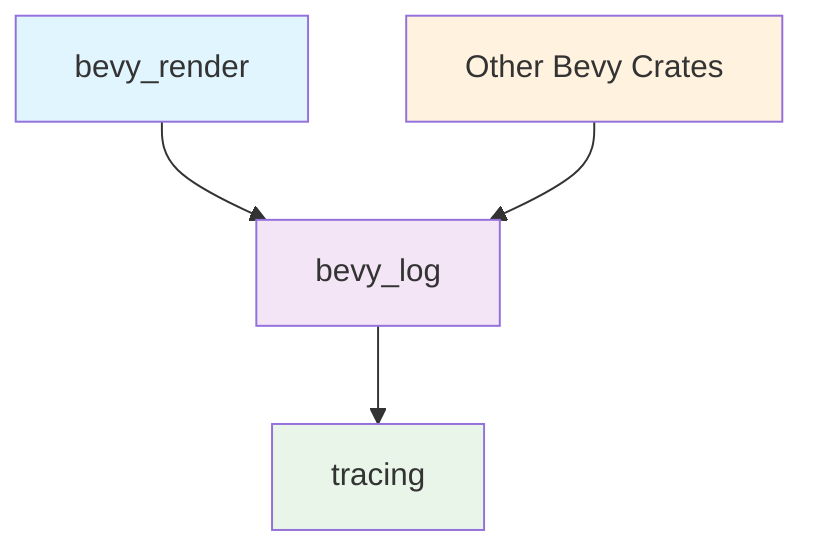

+++
title = "#22652 Replace `tracing` with `bevy_log` in `bevy_render`"
date = "2026-01-23T00:00:00"
draft = false
template = "pull_request_page.html"
in_search_index = true

[taxonomies]
list_display = ["show"]

[extra]
current_language = "en"
available_languages = {"en" = { name = "English", url = "/pull_request/bevy/2026-01/pr-22652-en-20260123" }, "zh-cn" = { name = "中文", url = "/pull_request/bevy/2026-01/pr-22652-zh-cn-20260123" }}
labels = ["A-Rendering", "C-Code-Quality", "A-Diagnostics", "D-Straightforward"]
+++

# Title

## Basic Information
- **Title**: Replace `tracing` with `bevy_log` in `bevy_render`
- **PR Link**: https://github.com/bevyengine/bevy/pull/22652
- **Author**: natepiano
- **Status**: MERGED
- **Labels**: A-Rendering, C-Code-Quality, S-Ready-For-Final-Review, A-Diagnostics, X-Uncontroversial, D-Straightforward
- **Created**: 2026-01-22T18:56:47Z
- **Merged**: 2026-01-23T00:41:48Z
- **Merged By**: alice-i-cecile

## Description Translation

## Objective

Replace direct `tracing` dependency with `bevy_log` in `bevy_render` for consistency with other bevy crates.

This was split out from #22649 at @IceSentry's request.

## Solution

- Add `bevy_log` dependency to `bevy_render`
- Replace all `use tracing::*` imports with `use bevy_log::*`
- Remove `tracing` dependency from `bevy_render`
- Add `event` to `bevy_log`'s tracing re-exports (needed by `renderer/mod.rs`)

## Testing

Built with `--all-features` and ran `3d_scene` example.

## The Story of This Pull Request

This PR addresses a straightforward but important consistency issue in the Bevy engine's codebase. The `bevy_render` crate was directly depending on the `tracing` crate for logging functionality, while most other Bevy crates were already using `bevy_log`, which serves as a wrapper and re-exports `tracing` macros. This inconsistency created maintenance overhead and violated the project's architectural patterns.

The problem originated from the natural evolution of the codebase. As Bevy grew, different contributors added logging to various modules, and some used the direct `tracing` dependency while others used the project's established `bevy_log` abstraction. The `bevy_render` crate, being one of the core rendering modules, had accumulated direct `tracing` imports across its 26 modified files. While functionally equivalent, this approach created several practical issues: it made dependency management more complex, prevented centralized configuration of logging behavior, and made future migrations or feature additions more difficult.

The solution approach was mechanical but required careful execution. The developer needed to:
1. Add `bevy_log` as a dependency to `bevy_render`'s Cargo.toml
2. Remove the direct `tracing` dependency from the same file
3. Update all import statements across the codebase
4. Ensure `bevy_log` properly re-exports all needed functionality

The implementation revealed an interesting detail: `bevy_log` was missing a re-export for `tracing::event`, which was being used in `renderer/mod.rs`. This required a small but important addition to `bevy_log`'s public interface:

```rust
// In crates/bevy_log/src/lib.rs
// Before:
pub use tracing::{
    self, debug, debug_span, error, error_span, info, info_span, trace, trace_span, warn,
    warn_span, Level,
};

// After:
pub use tracing::{
    self, debug, debug_span, error, error_span, event, info, info_span, trace, trace_span, warn,
    warn_span, Level,
};
```

This addition demonstrates how such consistency fixes can uncover gaps in abstraction layers. Without this change, the compilation would fail because `renderer/mod.rs` uses `tracing::event!` macro calls that get replaced with `bevy_log::event!`, which wouldn't exist without the re-export.

The bulk of the changes were import replacements. Here's a typical example from `camera.rs`:

```rust
// Before:
use tracing::warn;

// After:
use bevy_log::warn;
```

And from `renderer/mod.rs`:

```rust
// Before:
use tracing::{debug, error, info, info_span, warn};

// After:
use bevy_log::{debug, error, info, info_span, warn};
```

Some files also needed to update their usage of tracing spans. For example, in `pipelined_rendering.rs`:

```rust
// Before:
let _span = tracing::info_span!("render thread").entered();

// After:
let _span = bevy_log::info_span!("render thread").entered();
```

The technical insight here is that `bevy_log` serves as a facade over `tracing`, allowing the Bevy project to:
1. Centralize logging configuration
2. Potentially swap out the logging backend in the future with minimal disruption
3. Enforce consistent logging patterns across the codebase
4. Reduce direct external dependencies in individual crates

From a dependency management perspective, this change simplifies the dependency graph. Instead of `bevy_render` directly depending on `tracing`, it now depends on `bevy_log`, which itself depends on `tracing`. This creates a cleaner abstraction boundary and makes it easier to manage version updates and feature flags.

The impact of this change is primarily on maintainability and consistency. While it doesn't affect runtime behavior or performance, it makes the codebase more coherent and easier to work with. Future developers adding logging to `bevy_render` will naturally use `bevy_log` because that's what they'll see in the existing code. This creates a positive feedback loop that reinforces project standards.

One important consideration during implementation was ensuring that all tracing functionality remained available. The developer had to verify that `bevy_log` re-exports all the macros and types used in `bevy_render`. This included not just basic logging macros (`debug!`, `info!`, `warn!`, `error!`), but also span creation macros (`info_span!`, `debug_span!`, etc.) and the `event!` macro.

Testing was straightforward but thorough: building with `--all-features` ensured that no configuration-specific code paths were broken, and running the `3d_scene` example verified that the rendering system still functioned correctly with the updated logging infrastructure.

This PR demonstrates a common pattern in large codebases: establishing and maintaining consistent abstraction boundaries. While the individual changes are simple, their cumulative effect significantly improves code quality and reduces technical debt. The fact that this was split out from a larger PR (#22649) at another contributor's request shows good collaborative practices—breaking down larger changes into manageable, reviewable pieces.

## Visual Representation



## Key Files Changed

### `crates/bevy_render/Cargo.toml`
This file was updated to add the `bevy_log` dependency and remove the direct `tracing` dependency.

```toml
# Before:
tracing = { version = "0.1", default-features = false, features = ["std"] }

# After:
bevy_log = { path = "../bevy_log", version = "0.19.0-dev" }
# tracing dependency removed
```

### `crates/bevy_log/src/lib.rs`
This file needed to export the `event` macro from `tracing` to support usage in `renderer/mod.rs`.

```rust
// Before:
pub use tracing::{
    self, debug, debug_span, error, error_span, info, info_span, trace, trace_span, warn,
    warn_span, Level,
};

// After:
pub use tracing::{
    self, debug, debug_span, error, error_span, event, info, info_span, trace, trace_span, warn,
    warn_span, Level,
};
```

### `crates/bevy_render/src/renderer/mod.rs`
This file uses the `event` macro for Tracy profiling integration, requiring the updated re-export.

```rust
// Before:
use tracing::{debug, error, info, info_span, warn};

#[cfg(feature = "tracing-tracy")]
tracing::event!(
    tracing::Level::INFO,
    message = "finished frame",
    tracy.frame_mark = true
);

// After:
use bevy_log::{debug, error, info, info_span, warn};

#[cfg(feature = "tracing-tracy")]
bevy_log::event!(
    bevy_log::Level::INFO,
    message = "finished frame",
    tracy.frame_mark = true
);
```

### `crates/bevy_render/src/batching/gpu_preprocessing.rs`
This file contains multiple tracing spans for performance monitoring, all updated to use `bevy_log`.

```rust
// Before:
let _span = tracing::info_span!("write_current_input_buffers").entered();

// After:
let _span = bevy_log::info_span!("write_current_input_buffers").entered();
```

### `crates/bevy_render/src/extract_resource.rs`
This file shows how error and warning logging was updated.

```rust
// Before:
once!(tracing::error!(
    "Render app did not exist when trying to add `extract_resource` for <{}>.",
    core::any::type_name::<R>()
));

// After:
once!(bevy_log::error!(
    "Render app did not exist when trying to add `extract_resource` for <{}>.",
    core::any::type_name::<R>()
));
```

## Further Reading

1. **The `tracing` crate documentation**: https://docs.rs/tracing - Understanding the underlying logging library
2. **Facade Pattern**: A design pattern where a simplified interface is provided to a larger body of code
3. **Dependency Management in Rust**: How Cargo handles dependencies and versioning
4. **Bevy's ECS Architecture**: How logging fits into Bevy's entity-component-system design
5. **Macro Re-export Patterns in Rust**: Techniques for re-exporting macros from dependencies