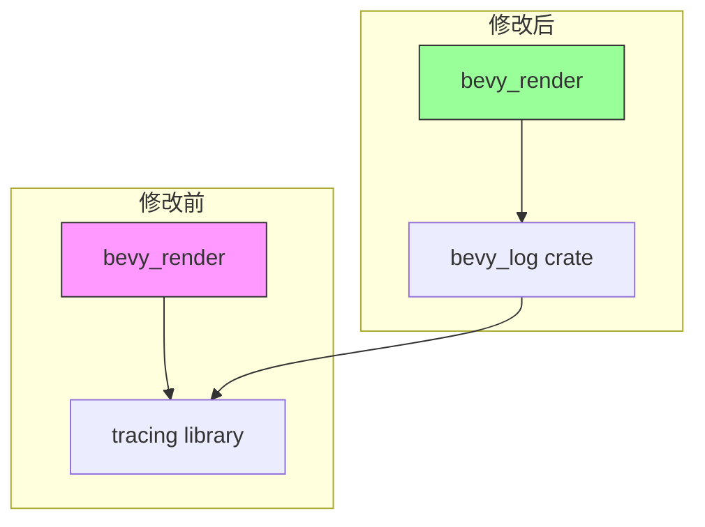

+++
title = "#22652 Replace `tracing` with `bevy_log` in `bevy_render"
date = "2026-01-23T00:00:00"
draft = false
template = "pull_request_page.html"
in_search_index = false

[extra]
current_language = "zh-cn"
available_languages = {"en" = { name = "English", url = "/pull_request/bevy/2026-01/pr-22652-en-20260123" }, "zh-cn" = { name = "中文", url = "/pull_request/bevy/2026-01/pr-22652-zh-cn-20260123" }}
+++

# Title

## 基本信息
- **标题**: Replace `tracing` with `bevy_log` in `bevy_render`
- **PR 链接**: https://github.com/bevyengine/bevy/pull/22652
- **作者**: natepiano
- **状态**: 已合并 (MERGED)
- **标签**: A-Rendering, C-Code-Quality, S-Ready-For-Final-Review, A-Diagnostics, X-Uncontroversial, D-Straightforward
- **创建时间**: 2026-01-22T18:56:47Z
- **合并时间**: 2026-01-23T00:41:48Z
- **合并者**: alice-i-cecile

## 目标

将 `bevy_render` 中的直接 `tracing` 依赖替换为 `bevy_log`，以与其他 bevy crate 保持一致。

此 PR 是根据 @IceSentry 的要求从 #22649 中拆分出来的。

## 解决方案

- 为 `bevy_render` 添加 `bevy_log` 依赖项。
- 将所有 `use tracing::*` 导入替换为 `use bevy_log::*`。
- 从 `bevy_render` 的依赖项中移除 `tracing`。
- 将 `event` 添加到 `bevy_log` 的 tracing 重新导出中（`renderer/mod.rs` 需要用到）。

## 测试

使用 `--all-features` 参数构建并运行了 `3d_scene` 示例。

## 关于此 Pull Request 的分析

这个 PR 的核心是一个依赖关系重构任务，旨在统一 Bevy 引擎渲染模块的日志接口。

**问题与背景**
在 PR 修改之前，`bevy_render` crate 直接依赖于底层的 `tracing` 库来输出日志和追踪信息。然而，Bevy 引擎的其他部分大多使用一个名为 `bevy_log` 的内部封装 crate。`bevy_log` 的作用是对 `tracing` 及其生态系统（如 `tracing-subscriber`）进行包装和配置，为整个引擎提供一个统一、可控的日志抽象层。这种不一致性带来了几个问题：
1.  **代码不一致**：不同的 crate 使用了不同的日志导入方式，降低了代码库的整体一致性。
2.  **依赖管理**：直接依赖 `tracing` 绕过了 `bevy_log` 可能提供的统一配置和功能封装。
3.  **维护负担**：如果未来需要更改底层的日志实现或配置，直接使用 `tracing` 的模块将需要单独修改，增加了维护成本。

因此，将 `bevy_render` 中的日志调用统一到 `bevy_log` 接口下，是一个旨在提升代码质量和可维护性的重构。

**解决方案与实施**
解决思路非常直接：用 `bevy_log` 的重新导出替换所有对 `tracing` 的直接使用。这要求两个步骤：首先，确保 `bevy_log` 重新导出了 `bevy_render` 所需的所有 `tracing` 功能；其次，修改 `bevy_render` 内的所有相关代码。

1.  **增强 `bevy_log` 接口**：
    检查 `bevy_render` 的代码发现，`renderer/mod.rs` 文件中使用了 `tracing::event!` 宏。然而，`bevy_log` 最初的重新导出列表中没有包含 `event`。因此，修改的首要步骤是扩展 `bevy_log` 的公共 API，将 `event` 也重新导出。
    ```rust
    // crates/bevy_log/src/lib.rs
    // 修改前：
    pub use tracing::{
        self, debug, debug_span, error, error_span, info, info_span, trace, trace_span, warn,
        warn_span, Level,
    };
    // 修改后：
    pub use tracing::{
        self, debug, debug_span, error, error_span, event, info, info_span, trace, trace_span, warn,
        warn_span, Level,
    };
    ```
    这个改动很小但很关键，它保证了替换过程的完整性，避免了因缺失符号而导致编译错误。

2.  **更新 `bevy_render` 的依赖和导入**：
    接下来是修改 `bevy_render` 本身。首先更新 `Cargo.toml`，添加对 `bevy_log` 的依赖，并移除对 `tracing` 的直接依赖。
    ```toml
    # crates/bevy_render/Cargo.toml
    # 添加：
    bevy_log = { path = "../bevy_log", version = "0.19.0-dev" }
    # 移除：
    # tracing = { version = "0.1", default-features = false, features = ["std"] }
    ```
    然后，批量修改源代码文件。PR 总共修改了 26 个文件，模式完全一致：将所有 `use tracing::{...}` 的导入语句替换为 `use bevy_log::{...}`，并将代码中内联的 `tracing::` 前缀调用（例如 `tracing::info_span!`）替换为 `bevy_log::`。这种修改是机械性的，不改变任何业务逻辑。
    ```rust
    // 示例：crates/bevy_render/src/batching/gpu_preprocessing.rs
    // 修改前：
    use tracing::{error, info};
    let _span = tracing::info_span!("write_current_input_buffers").entered();
    // 修改后：
    use bevy_log::{error, info};
    let _span = bevy_log::info_span!("write_current_input_buffers").entered();
    ```

**技术洞察与影响**
从工程角度看，这个 PR 体现了良好的软件设计实践：
- **依赖反转/封装**：`bevy_log` 作为一个适配器层（adapter layer），将具体的日志实现（`tracing`）与业务代码（`bevy_render`）解耦。这符合依赖反转原则，高层模块（渲染）不依赖于低层模块（特定日志库），而是依赖于一个稳定的抽象（`bevy_log` 的接口）。
- **关注点分离**：日志的收集、过滤、格式化和输出配置被集中到 `bevy_log` 中管理，而各个业务 crate 只负责“产生”日志事件。这简化了全局日志策略的管理。
- **一致性**：统一接口后，任何开发者在使用 Bevy 的任意部分时，都只需要熟悉 `bevy_log` 这一个日志模块，降低了认知负担。

此次修改的直接影响是提升了代码库的内聚性。`bevy_render` 不再直接绑定到 `tracing`，未来如果 `bevy_log` 决定更换底层实现（虽然可能性不大），或者调整默认配置，`bevy_render` 都可以无缝适配。从性能角度看，由于 `bevy_log` 只是对 `tracing` 的简单重新导出，没有引入额外的运行时开销，因此这是一个零成本的重构。

## 可视化依赖关系



## 关键文件变更

1.  **`crates/bevy_log/src/lib.rs`**
    - **变更原因**：`bevy_render` 中的 `renderer/mod.rs` 使用了 `tracing::event!` 宏，但 `bevy_log` 最初未重新导出该宏。为确保替换的完整性，必须将其加入公开接口。
    - **关键代码**：
        ```rust
        // 修改：在重新导出的列表中添加了 `event`
        pub use tracing::{
            self, debug, debug_span, error, error_span, event, info, info_span, trace, trace_span, warn,
            warn_span, Level,
        };
        ```

2.  **`crates/bevy_render/Cargo.toml`**
    - **变更原因**：更新 crate 的依赖关系，移除直接的 `tracing` 依赖，改为依赖统一的 `bevy_log`。
    - **关键代码**：
        ```toml
        # 添加新依赖
        bevy_log = { path = "../bevy_log", version = "0.19.0-dev" }
        # ...
        # 移除旧依赖（此行被删除）
        # tracing = { version = "0.1", default-features = false, features = ["std"] }
        ```

3.  **`crates/bevy_render/src/batching/gpu_preprocessing.rs`**
    - **变更原因**：这是修改量最大的文件之一，包含大量用于性能分析的 tracing span。它展示了如何将内联的 `tracing::` 调用替换为 `bevy_log::`。
    - **关键代码**：
        ```rust
        // 导入语句变更
        - use tracing::{error, info};
        + use bevy_log::{error, info};

        // 函数内调用变更（多个类似实例）
        - let _span = tracing::info_span!("write_current_input_buffers").entered();
        + let _span = bevy_log::info_span!("write_current_input_buffers").entered();
        ```

4.  **`crates/bevy_render/src/renderer/mod.rs`**
    - **变更原因**：此文件使用了 `tracing::event!` 宏（与 Tracy 性能分析工具集成），因此它的修改直接依赖于 `bevy_log` 的增强。它也是验证 `bevy_log` 重新导出是否完整的关键文件。
    - **关键代码**：
        ```rust
        // 导入变更
        - use tracing::{debug, error, info, info_span, warn};
        + use bevy_log::{debug, error, info, info_span, warn};

        // 使用了需要新增导出的 `event!` 宏
        #[cfg(feature = "tracing-tracy")]
        - tracing::event!(
        -     tracing::Level::INFO,
        + bevy_log::event!(
        +     bevy_log::Level::INFO,
              message = "finished frame",
              tracy.frame_mark = true
          );
        ```

5.  **`crates/bevy_render/src/pipelined_rendering.rs`**
    - **变更原因**：此文件管理渲染线程的生命周期和循环，包含线程级别的 tracing span 和调试日志，是渲染架构中的核心协调模块。
    - **关键代码**：
        ```rust
        // 渲染线程入口的 tracing span
        #[cfg(feature = "trace")]
        - let _span = tracing::info_span!("render thread").entered();
        + let _span = bevy_log::info_span!("render thread").entered();

        // 调试日志
        - tracing::debug!("exiting pipelined rendering thread");
        + bevy_log::debug!("exiting pipelined rendering thread");
        ```

## 进一步阅读

1.  **Rust `tracing` 库**: `tracing` 是 Rust 生态系统中的一个结构化、事件驱动的诊断框架。理解其核心概念（如 `Span`、`Event`、`Subscriber`）有助于更好地使用基于它的 `bevy_log`。
    - 官方文档: https://docs.rs/tracing

2.  **Bevy 架构模式**: 此 PR 展示了 Bevy 如何通过内部封装 crate（如 `bevy_log`）来管理第三方依赖和提供稳定内部 API。这是大型 Rust 项目中常见的架构模式。
    - 相关讨论：Bevy 官方仓库中关于引擎架构的讨论和 RFC。

3.  **Cargo 依赖管理**: 关于如何在 `Cargo.toml` 中声明、添加和移除依赖项。
    - Cargo 手册: https://doc.rust-lang.org/cargo/guide/dependencies.html

4.  **代码重构与一致性**: 保持大型代码库中工具和依赖使用的一致性对长期可维护性至关重要。这是一个关于如何执行此类全局重构的实践案例。