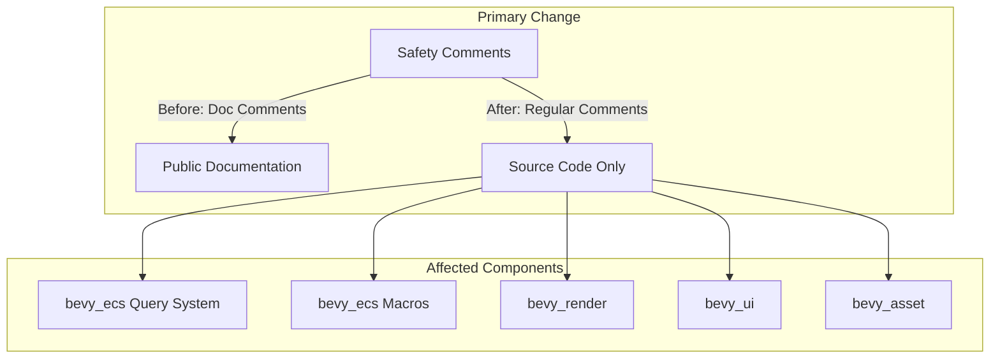

+++
title = "#22653 Make safety comments on unsafe traits internal comments"
date = "2026-01-27T00:00:00"
draft = false
template = "pull_request_page.html"
in_search_index = true

[taxonomies]
list_display = ["show"]

[extra]
current_language = "en"
available_languages = {"en" = { name = "English", url = "/pull_request/bevy/2026-01/pr-22653-en-20260127" }, "zh-cn" = { name = "中文", url = "/pull_request/bevy/2026-01/pr-22653-zh-cn-20260127" }}
labels = ["A-ECS", "C-Code-Quality", "X-Contentious"]
+++

# Title

## Basic Information
- **Title**: Make safety comments on unsafe traits internal comments
- **PR Link**: https://github.com/bevyengine/bevy/pull/22653
- **Author**: hymm
- **Status**: MERGED
- **Labels**: A-ECS, C-Code-Quality, S-Ready-For-Final-Review, X-Contentious
- **Created**: 2026-01-22T20:01:00Z
- **Merged**: 2026-01-27T06:44:28Z
- **Merged By**: alice-i-cecile

## Description Translation

# Objective

- Safety comments on implementations of unsafe traits should not be part of the public docs as these are meant to bevy devs explain why implementing the trait is safe.

## Solution

- Make them regular doc comments

## The Story of This Pull Request

This PR addresses a documentation clarity issue in the Bevy codebase related to how safety comments are presented in public API documentation. The core problem was that safety justifications for implementing unsafe traits were appearing in the generated public documentation, which could confuse users who only need to understand the API's behavior, not its internal safety guarantees.

The issue stems from a distinction in Rust documentation: `///` comments (doc comments) appear in the generated public documentation, while `//` comments (regular comments) do not. When implementing unsafe traits in Rust, developers must provide safety comments explaining why their implementation is sound. These comments are crucial for maintainers and contributors who need to verify the code's safety, but they aren't relevant to end users who just want to understand how to use the API.

The developer recognized that safety comments like `/// SAFETY: ...` were appearing in public documentation, creating noise and potentially confusing users. These comments are intended for developers working on the engine itself, not for consumers of the API. The solution was straightforward: convert all safety comments on unsafe trait implementations from doc comments (`///`) to regular comments (`//`).

The implementation involved a systematic search and replace across 11 files in the codebase. The changes were primarily concentrated in the ECS (Entity Component System) module, where many unsafe traits are implemented for query types. For example, in `crates/bevy_ecs/src/query/fetch.rs`, numerous `/// SAFETY:` comments were converted to `// SAFETY:`:

```rust
// Before:
/// SAFETY: `update_component_access` does nothing.
/// This is sound because `fetch` does not access components.
unsafe impl WorldQuery for Entity {

// After:
// SAFETY: `update_component_access` does nothing.
// This is sound because `fetch` does not access components.
unsafe impl WorldQuery for Entity {
```

This change doesn't affect the code's functionality or safety - it only changes how the comments are processed by Rust's documentation generator. The safety justifications remain in the source code for developers to review, but they no longer clutter the public API documentation.

The technical insight here is about balancing two needs: providing enough information for contributors to understand safety invariants, while keeping public documentation focused on API usage. Unsafe code in Rust requires careful justification, and those justifications should be preserved in the source code. However, they don't belong in the public-facing documentation where they can distract from how to use the API correctly.

This PR faced some contention (as indicated by the "X-Contentious" label), likely because it touches many files and changes documentation conventions. However, the change is consistent with Rust community practices where safety comments are typically internal documentation rather than public API documentation.

The impact of this change is cleaner public documentation that focuses on what the API does rather than how it achieves safety. Users reading the documentation will see only the information relevant to using the API, while developers examining the source code can still access the safety justifications. This separation of concerns makes the codebase more maintainable and user-friendly.

## Visual Representation



## Key Files Changed

### `crates/bevy_ecs/src/query/fetch.rs` (+98/-98)
This file contains the core implementations of query-related traits. The changes convert safety comments from doc comments to regular comments for various `WorldQuery`, `QueryData`, and `ReadOnlyQueryData` implementations.

**Example change:**
```rust
// Before:
/// SAFETY: `update_component_access` does nothing.
/// This is sound because `fetch` does not access components.
unsafe impl WorldQuery for Entity {

// After:
// SAFETY: `update_component_access` does nothing.
// This is sound because `fetch` does not access components.
unsafe impl WorldQuery for Entity {
```

**Why this matters:** This file contains many unsafe trait implementations that power Bevy's query system. The safety comments explain invariants that maintain memory safety, but these details aren't needed by API consumers.

### `crates/bevy_ecs/src/query/filter.rs` (+30/-30)
This file handles query filtering implementations. Similar changes were made to safety comments for filter-related traits.

**Example change:**
```rust
// Before:
/// SAFETY:
/// `update_component_access` does not add any accesses.
/// This is sound because [`QueryFilter::filter_fetch`] does not access any components.
/// `update_component_access` adds a `With` filter for `T`.
/// This is sound because `matches_component_set` returns whether the set contains the component.
unsafe impl<T: Component> WorldQuery for With<T> {

// After:
// SAFETY:
// `update_component_access` does not add any accesses.
// This is sound because [`QueryFilter::filter_fetch`] does not access any components.
// `update_component_access` adds a `With` filter for `T`.
// This is sound because `matches_component_set` returns whether the set contains the component.
unsafe impl<T: Component> WorldQuery for With<T> {
```

**Why this matters:** Filter implementations have complex safety requirements that are important for contributors to understand but not for users to see in documentation.

### `crates/bevy_ecs/macros/src/query_data.rs` (+3/-3)
This file contains macro-generated code for query data. The changes ensure that safety comments in generated code also use regular comments.

**Example change:**
```rust
// Before:
/// SAFETY: we assert fields are readonly below
unsafe impl #user_impl_generics #path::query::QueryData

// After:
// SAFETY: we assert fields are readonly below
unsafe impl #user_impl_generics #path::query::QueryData
```

**Why this matters:** Consistent comment style across both hand-written and generated code maintains codebase uniformity.

### `crates/bevy_render/src/sync_world.rs` (+4/-4)
This file handles synchronization between render and main worlds. The changes apply the same pattern to render-specific query implementations.

**Example change:**
```rust
// Before:
/// SAFETY: defers completely to `&RenderEntity` implementation,
/// and then only modifies the output safely.
unsafe impl WorldQuery for RenderEntity {

// After:
// SAFETY: defers completely to `&RenderEntity` implementation,
// and then only modifies the output safely.
unsafe impl WorldQuery for RenderEntity {
```

**Why this matters:** Even in specialized systems like rendering, safety comments should remain internal documentation.

### `crates/bevy_asset/src/asset_changed.rs` (+2/-2)
This file handles asset change tracking. The changes ensure consistency across different parts of the codebase.

**Example change:**
```rust
// Before:
/// SAFETY: `ROQueryFetch<Self>` is the same as `QueryFetch<Self>`
unsafe impl<A: AsAssetId> WorldQuery for AssetChanged<A> {

// After:
// SAFETY: `ROQueryFetch<Self>` is the same as `QueryFetch<Self>`
unsafe impl<A: AsAssetId> WorldQuery for AssetChanged<A> {
```

**Why this matters:** Maintaining consistency across all modules makes the codebase easier to understand and maintain.

## Further Reading

1. **Rust Documentation Comments**: [The Rust Book's chapter on documentation](https://doc.rust-lang.org/book/ch14-02-publishing-to-crates-io.html#making-useful-documentation-comments) explains the difference between `///`, `//!`, and `//` comments.

2. **Unsafe Rust**: [The Rustonomicon](https://doc.rust-lang.org/nomicon/) provides in-depth information about unsafe Rust and the safety invariants that must be maintained.

3. **Bevy ECS**: [Bevy's ECS documentation](https://bevyengine.org/learn/ecs-intro/) explains the Entity Component System pattern and how queries work in Bevy.

4. **Rust API Guidelines**: [The Rust API Guidelines](https://rust-lang.github.io/api-guidelines/) include recommendations about documentation practices for public APIs.