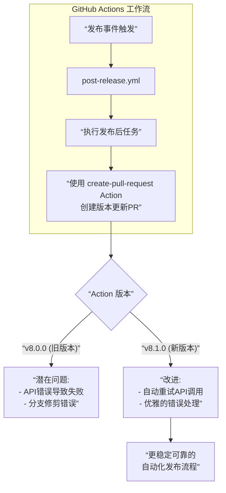

+++
title = "#22661 Bump peter-evans/create-pull-request from 8.0.0 to 8.1.0"
date = "2026-01-23T00:00:00"
draft = false
template = "pull_request_page.html"
in_search_index = false

[extra]
current_language = "zh-cn"
available_languages = {"en" = { name = "English", url = "/pull_request/bevy/2026-01/pr-22661-en-20260123" }, "zh-cn" = { name = "中文", url = "/pull_request/bevy/2026-01/pr-22661-zh-cn-20260123" }}
+++

# Bump peter-evans/create-pull-request from 8.0.0 to 8.1.0

## 基本信息
- **标题**: Bump peter-evans/create-pull-request from 8.0.0 to 8.1.0
- **PR链接**: https://github.com/bevyengine/bevy/pull/22661
- **作者**: app/dependabot
- **状态**: 已合并 (MERGED)
- **标签**: C-Dependencies
- **创建时间**: 2026-01-23T06:52:35Z
- **合并时间**: 2026-01-23T11:45:55Z
- **合并者**: mockersf

## 描述翻译
将 `peter-evans/create-pull-request` 从 8.0.0 升级至 8.1.0。
<details>
<summary>版本发布说明</summary>
<p><em>来源自 <a href="https://github.com/peter-evans/create-pull-request/releases">peter-evans/create-pull-request 的发布页面</a>。</em></p>
<blockquote>
<h2>Create Pull Request v8.1.0</h2>
<h2>更新内容</h2>
<ul>
<li>README.md: 将提到的 GitHub Actions 更新到最新版本 by <a href="https://github.com/deining"><code>@​deining</code></a> in <a href="https://redirect.github.com/peter-evans/create-pull-request/pull/4265">peter-evans/create-pull-request#4265</a></li>
<li>build(deps): 将 github-actions 依赖组更新 2 项 by <a href="https://github.com/dependabot"><code>@​dependabot</code></a>[bot] in <a href="https://redirect.github.com/peter-evans/create-pull-request/pull/4273">peter-evans/create-pull-request#4273</a></li>
<li>build(deps-dev): 将 npm 依赖组更新 2 项 by <a href="https://github.com/dependabot"><code>@​dependabot</code></a>[bot] in <a href="https://redirect.github.com/peter-evans/create-pull-request/pull/4274">peter-evans/create-pull-request#4274</a></li>
<li>build(deps-dev): 将 undici 从 6.22.0 升级到 6.23.0 by <a href="https://github.com/dependabot"><code>@​dependabot</code></a>[bot] in <a href="https://redirect.github.com/peter-evans/create-pull-request/pull/4284">peter-evans/create-pull-request#4284</a></li>
<li>更新发布包 by <a href="https://github.com/actions-bot"><code>@​actions-bot</code></a> in <a href="https://redirect.github.com/peter-evans/create-pull-request/pull/4289">peter-evans/create-pull-request#4289</a></li>
<li>fix: 在自托管 runner 上优雅处理远程分支修剪失败 by <a href="https://github.com/peter-evans"><code>@​peter-evans</code></a> in <a href="https://redirect.github.com/peter-evans/create-pull-request/pull/4295">peter-evans/create-pull-request#4295</a></li>
<li>feat: 添加 <code>@​octokit/plugin-retry</code> 以处理可重试的服务器错误 by <a href="https://github.com/peter-evans"><code>@​peter-evans</code></a> in <a href="https://redirect.github.com/peter-evans/create-pull-request/pull/4298">peter-evans/create-pull-request#4298</a></li>
</ul>
<h2>新贡献者</h2>
<ul>
<li><a href="https://github.com/deining"><code>@​deining</code></a> 在 <a href="https://redirect.github.com/peter-evans/create-pull-request/pull/4265">peter-evans/create-pull-request#4265</a> 中完成了首次贡献</li>
</ul>
<p><strong>完整更新日志</strong>: <a href="https://github.com/peter-evans/create-pull-request/compare/v8.0.0...v8.1.0">https://github.com/peter-evans/create-pull-request/compare/v8.0.0...v8.1.0</a></p>
</blockquote>
</details>
<details>
<summary>提交历史</summary>
<ul>
<li><a href="https://github.com/peter-evans/create-pull-request/commit/c0f553fe549906ede9cf27b5156039d195d2ece0"><code>c0f553f</code></a> feat: 添加 <code>@​octokit/plugin-retry</code> 以处理可重试的服务器错误 (<a href="https://redirect.github.com/peter-evans/create-pull-request/issues/4298">#4298</a>)</li>
<li><a href="https://github.com/peter-evans/create-pull-request/commit/70001242bfa9ec7844891e620fdda69a2a2a06c7"><code>7000124</code></a> fix: 优雅处理远程分支修剪失败 (<a href="https://redirect.github.com/peter-evans/create-pull-request/issues/4295">#4295</a>)</li>
<li><a href="https://github.com/peter-evans/create-pull-request/commit/34aa40e9cf0bb8b5be745a552003fdeb25e4dd3a"><code>34aa40e</code></a> build: 更新发布包 (<a href="https://redirect.github.com/peter-evans/create-pull-request/issues/4289">#4289</a>)</li>
<li><a href="https://github.com/peter-evans/create-pull-request/commit/641099ddca097df58c3369dd5e1f33322b223029"><code>641099d</code></a> build(deps-dev): 将 undici 从 6.22.0 升级到 6.23.0 (<a href="https://redirect.github.com/peter-evans/create-pull-request/issues/4284">#4284</a>)</li>
<li><a href="https://github.com/peter-evans/create-pull-request/commit/2271f1ddcf09437ed8f019733eb5cfba58ac76f0"><code>2271f1d</code></a> build(deps-dev): 将 npm 依赖组更新 2 项 (<a href="https://redirect.github.com/peter-evans/create-pull-request/issues/4274">#4274</a>)</li>
<li><a href="https://github.com/peter-evans/create-pull-request/commit/437c31a11dd02128dd37633ad8d3832853477e7a"><code>437c31a</code></a> build(deps): 将 github-actions 依赖组更新 2 项 (<a href="https://redirect.github.com/peter-evans/create-pull-request/issues/4273">#4273</a>)</li>
<li><a href="https://github.com/peter-evans/create-pull-request/commit/0979079bc20c05bbbb590a56c21c4e2b1d1f1bbe"><code>0979079</code></a> docs: 更新 readme</li>
<li><a href="https://github.com/peter-evans/create-pull-request/commit/5b751cdf403b4f0314c656b2618939e4c8bdf824"><code>5b751cd</code></a> README.md: 将提到的 GitHub Actions 更新到最新版本 (<a href="https://redirect.github.com/peter-evans/create-pull-request/issues/4265">#4265</a>)</li>
<li>查看完整差异请访问 <a href="https://github.com/peter-evans/create-pull-request/compare/98357b18bf14b5342f975ff684046ec3b2a07725...c0f553fe549906ede9cf27b5156039d195d2ece0">比较视图</a></li>
</ul>
</details>
<br />


[](https://docs.github.com/en/github/managing-security-vulnerabilities/about-dependabot-security-updates#about-compatibility-scores)

只要你不自行修改此 PR，Dependabot 将解决所有冲突。你也可以通过评论 `@dependabot rebase` 手动触发变基。

[//]: # (dependabot-automerge-start)
[//]: # (dependabot-automerge-end)

---

<details>
<summary>Dependabot 命令和选项</summary>
<br />

你可以通过评论此 PR 来触发 Dependabot 操作：
- `@dependabot rebase` 将变基此 PR
- `@dependabot recreate` 将重新创建此 PR，覆盖对其所做的任何编辑
- `@dependabot merge` 将在 CI 通过后合并此 PR
- `@dependabot squash and merge` 将在 CI 通过后压缩并合并此 PR
- `@dependabot cancel merge` 将取消先前请求的合并并阻止自动合并
- `@dependabot reopen` 将重新打开已关闭的 PR
- `@dependabot close` 将关闭此 PR 并阻止 Dependabot 重新创建它。你也可以通过手动关闭来达到相同效果
- `@dependabot show <dependency name> ignore conditions` 将显示指定依赖项的所有忽略条件
- `@dependabot ignore this major version` 将关闭此 PR 并阻止 Dependabot 为此主要版本创建更多 PR（除非你重新打开 PR 或自行升级）
- `@dependabot ignore this minor version` 将关闭此 PR 并阻止 Dependabot 为此次要版本创建更多 PR（除非你重新打开 PR 或自行升级）
- `@dependabot ignore this dependency` 将关闭此 PR 并阻止 Dependabot 为此依赖项创建更多 PR（除非你重新打开 PR 或自行升级）


</details>

## 该Pull Request的故事

这个PR是GitHub Dependabot自动生成的，目的是将Bevy仓库中使用的 `peter-evans/create-pull-request` 这个GitHub Action从版本8.0.0升级到8.1.0。从表面看，这只是修改了一行代码，替换了一个版本号和一个对应的提交SHA。然而，这类自动化依赖升级是维护现代软件项目健康与安全的关键实践。

**问题与背景**
在Bevy这样的开源项目中，持续集成/持续部署（CI/CD）流程的稳定性至关重要。`post-release.yml` 工作流会在新版本发布后自动运行，其任务之一是创建一个指向 `main` 分支的Pull Request，目的是更新发布分支（如 `release-0.15`）上的版本号。这项工作由 `peter-evans/create-pull-request` 这个第三方Action来执行。
依赖项，即使是像GitHub Actions这样的工作流工具，如果不及时更新，可能会带来几个问题：错过重要的错误修复、存在已知的安全漏洞、或者无法利用新功能带来的效率提升。手动跟踪每个依赖项的更新既繁琐又容易出错。这就是Dependabot这类自动化工具的价值所在——它持续监控项目依赖，并在新版本可用时自动创建升级PR。

**解决方案与实施**
解决方案非常直接：接受Dependabot的建议，将Action升级到最新的小版本（minor version）v8.1.0。实施过程体现在一个简单的diff中，修改了YAML文件中Action的引用。
```yaml
# 文件： .github/workflows/post-release.yml
# 修改前：
      - name: Create PR
        uses: peter-evans/create-pull-request@98357b18bf14b5342f975ff684046ec3b2a07725 # v8.0.0

# 修改后：
      - name: Create PR
        uses: peter-evans/create-pull-request@c0f553fe549906ede9cf27b5156039d195d2ece0 # v8.1.0
```
值得注意的是，Bevy项目遵循了GitHub推荐的最佳实践：使用完整的Git提交SHA（如 `c0f553fe549906ede9cf27b5156039d195d2ece0`）而非版本标签（如 `v8.1.0`）来锁定Action。这种做法确保了工作流的完全可重现性，因为SHA指向的是代码仓库中一个不可变的快照，避免了因标签被移动或删除而带来的不确定性。同时，注释 `# v8.1.0` 为开发者提供了清晰的可读性。

**技术洞察与影响**
这次升级的具体内容，正如发布说明所述，主要带来了两个重要的改进：
1.  **增强的健壮性**：新增的 `@octokit/plugin-retry` 可以自动处理来自GitHub API的可重试服务器错误（例如临时性的网络问题或速率限制）。这对于自动化工作流至关重要，因为它减少了因瞬时性API故障而导致的整个工作流失败。
2.  **更好的错误处理**：改进了在自托管（self-hosted）runner上执行 `git remote prune` 命令失败时的处理逻辑，使其更加“优雅”。这提高了工作流在不同环境下的兼容性和稳定性。

对于Bevy项目而言，这次升级的直接影响是提高了 `post-release.yml` 工作流的可靠性。发布后的版本号更新PR的创建过程将更少受到外部因素（如网络波动）的干扰，降低了维护人员需要手动干预的概率。虽然这只是一个支撑性的工作流工具，但其稳定性的提升有助于确保发布流程的顺畅，间接支持了项目的发布节奏。

从更广泛的工程实践角度看，这个PR展示了健康的依赖管理策略：**依赖自动化工具进行版本监控，遵循语义化版本控制（SemVer）进行小版本升级以获取修复和新功能，同时使用不可变的引用（SHA）来保证构建的确定性**。合并此类由Dependabot创建的、兼容性评分良好的小版本升级PR，是保持项目依赖现代、安全且低维护成本的有效手段。

## 视觉表示



## 关键文件变更

- **.github/workflows/post-release.yml** (+1/-1)
    - **变更描述**：将 `peter-evans/create-pull-request` GitHub Action 的引用从版本 `v8.0.0`（对应提交SHA `98357b1...`）更新至版本 `v8.1.0`（对应提交SHA `c0f553f...`）。
    - **关键代码片段**：
      ```yaml
      # 变更行前后的上下文：
            # ... 其他步骤 ...
      
      -     - name: Create PR
      -       uses: peter-evans/create-pull-request@98357b18bf14b5342f975ff684046ec3b2a07725 # v8.0.0
      +     - name: Create PR
      +       uses: peter-evans/create-pull-request@c0f553fe549906ede9cf27b5156039d195d2ece0 # v8.1.0
              with:
                delete-branch: true
                base: "main"
      ```
    - **与PR目的的关系**：这是实现本次依赖升级的唯一且直接的修改。它确保了Bevy的发布后自动化流程使用该Action的最新稳定小版本，从而获取错误修复和功能改进。

## 进一步阅读

- **[GitHub Actions 文档: 使用动作](https://docs.github.com/zh/actions/using-workflows/workflow-syntax-for-github-actions#jobsjob_idstepsuses)**：了解如何在 workflow 中引用和使用第三方 Action，包括版本控制的最佳实践。
- **[语义化版本控制 (SemVer) 规范](https://semver.org/lang/zh-CN/)**：理解主版本号、次版本号、修订号的含义，这对于判断依赖升级的风险和收益至关重要。
- **[Dependabot 文档](https://docs.github.com/zh/code-security/dependabot)**：学习如何配置和使用 Dependabot 来自动化管理项目依赖项的更新。
- **[`peter-evans/create-pull-request` 仓库](https://github.com/peter-evans/create-pull-request)**：查看该 Action 的详细使用说明、配置选项和更新日志。

# 完整代码差异
```
diff --git a/.github/workflows/post-release.yml b/.github/workflows/post-release.yml
index 457726671eb49..d6ceec6068d89 100644
--- a/.github/workflows/post-release.yml
+++ b/.github/workflows/post-release.yml
@@ -60,7 +60,7 @@ jobs:
             --exclude bistro
 
       - name: Create PR
-        uses: peter-evans/create-pull-request@98357b18bf14b5342f975ff684046ec3b2a07725 # v8.0.0
+        uses: peter-evans/create-pull-request@c0f553fe549906ede9cf27b5156039d195d2ece0 # v8.1.0
         with:
           delete-branch: true
           base: "main"
```