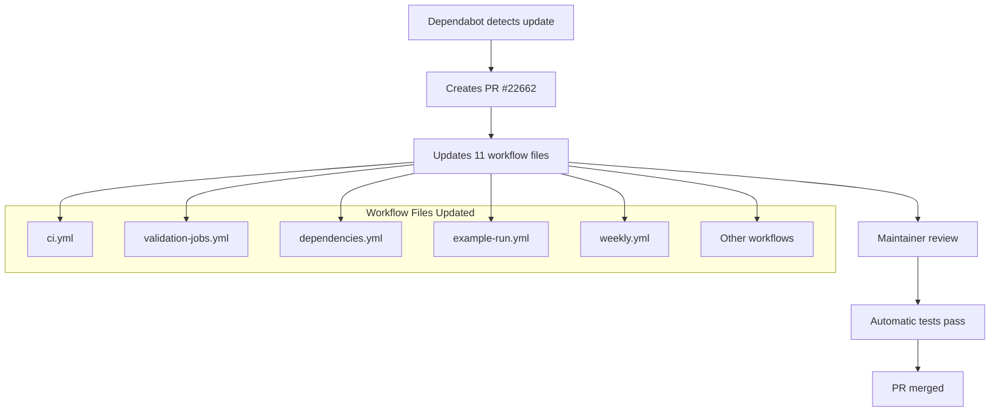

+++
title = "#22662 Bump actions/checkout from 6.0.1 to 6.0.2"
date = "2026-01-23T00:00:00"
draft = false
template = "pull_request_page.html"
in_search_index = true

[taxonomies]
list_display = ["show"]

[extra]
current_language = "en"
available_languages = {"en" = { name = "English", url = "/pull_request/bevy/2026-01/pr-22662-en-20260123" }, "zh-cn" = { name = "中文", url = "/pull_request/bevy/2026-01/pr-22662-zh-cn-20260123" }}
labels = ["C-Dependencies"]
+++

# Bump actions/checkout from 6.0.1 to 6.0.2

## Basic Information
- **Title**: Bump actions/checkout from 6.0.1 to 6.0.2
- **PR Link**: https://github.com/bevyengine/bevy/pull/22662
- **Author**: app/dependabot
- **Status**: MERGED
- **Labels**: C-Dependencies
- **Created**: 2026-01-23T06:52:54Z
- **Merged**: 2026-01-23T11:45:55Z
- **Merged By**: mockersf

## Description Translation
Bumps [actions/checkout](https://github.com/actions/checkout) from 6.0.1 to 6.0.2.
<details>
<summary>Release notes</summary>
<p><em>Sourced from <a href="https://github.com/actions/checkout/releases">actions/checkout's releases</a>.</em></p>
<blockquote>
<h2>v6.0.2</h2>
<h2>What's Changed</h2>
<ul>
<li>Add orchestration_id to git user-agent when ACTIONS_ORCHESTRATION_ID is set by <a href="https://github.com/TingluoHuang"><code>@​TingluoHuang</code></a> in <a href="https://redirect.github.com/actions/checkout/pull/2355">actions/checkout#2355</a></li>
<li>Fix tag handling: preserve annotations and explicit fetch-tags by <a href="https://github.com/ericsciple"><code>@​ericsciple</code></a> in <a href="https://redirect.github.com/actions/checkout/pull/2356">actions/checkout#2356</a></li>
</ul>
<p><strong>Full Changelog</strong>: <a href="https://github.com/actions/checkout/compare/v6.0.1...v6.0.2">https://github.com/actions/checkout/compare/v6.0.1...v6.0.2</a></p>
</blockquote>
</details>
<details>
<summary>Changelog</summary>
<p><em>Sourced from <a href="https://github.com/actions/checkout/blob/main/CHANGELOG.md">actions/checkout's changelog</a>.</em></p>
<blockquote>
<h1>Changelog</h1>
<h2>v6.0.2</h2>
<ul>
<li>Fix tag handling: preserve annotations and explicit fetch-tags by <a href="https://github.com/ericsciple"><code>@​ericsciple</code></a> in <a href="https://redirect.github.com/actions/checkout/pull/2356">actions/checkout#2356</a></li>
</ul>
<h2>v6.0.1</h2>
<ul>
<li>Add worktree support for persist-credentials includeIf by <a href="https://github.com/ericsciple"><code>@​ericsciple</code></a> in <a href="https://redirect.github.com/actions/checkout/pull/2327">actions/checkout#2327</a></li>
</ul>
<h2>v6.0.0</h2>
<ul>
<li>Persist creds to a separate file by <a href="https://github.com/ericsciple"><code>@​ericsciple</code></a> in <a href="https://redirect.github.com/actions/checkout/pull/2286">actions/checkout#2286</a></li>
<li>Update README to include Node.js 24 support details and requirements by <a href="https://github.com/salmanmkc"><code>@​salmanmkc</code></a> in <a href="https://redirect.github.com/actions/checkout/pull/2248">actions/checkout#2248</a></li>
</ul>
<h2>v5.0.1</h2>
<ul>
<li>Port v6 cleanup to v5 by <a href="https://github.com/ericsciple"><code>@​ericsciple</code></a> in <a href="https://redirect.github.com/actions/checkout/pull/2301">actions/checkout#2301</a></li>
</ul>
<h2>v5.0.0</h2>
<ul>
<li>Update actions checkout to use node 24 by <a href="https://github.com/salmanmkc"><code>@​salmanmkc</code></a> in <a href="https://redirect.github.com/actions/checkout/pull/2226">actions/checkout#2226</a></li>
</ul>
<h2>v4.3.1</h2>
<ul>
<li>Port v6 cleanup to v4 by <a href="https://github.com/ericsciple"><code>@​ericsciple</code></a> in <a href="https://redirect.github.com/actions/checkout/pull/2305">actions/checkout#2305</a></li>
</ul>
<h2>v4.3.0</h2>
<ul>
<li>docs: update README.md by <a href="https://github.com/motss"><code>@​motss</code></a> in <a href="https://redirect.github.com/actions/checkout/pull/1971">actions/checkout#1971</a></li>
<li>Add internal repos for checking out multiple repositories by <a href="https://github.com/mouismail"><code>@​mouismail</code></a> in <a href="https://redirect.github.com/actions/checkout/pull/1977">actions/checkout#1977</a></li>
<li>Documentation update - add recommended permissions to Readme by <a href="https://github.com/benwells"><code>@​benwells</code></a> in <a href="https://redirect.github.com/actions/checkout/pull/2043">actions/checkout#2043</a></li>
<li>Adjust positioning of user email note and permissions heading by <a href="https://github.com/joshmgross"><code>@​joshmgross</code></a> in <a href="https://redirect.github.com/actions/checkout/pull/2044">actions/checkout#2044</a></li>
<li>Update README.md by <a href="https://github.com/nebuk89"><code>@​nebuk89</code></a> in <a href="https://redirect.github.com/actions/checkout/pull/2194">actions/checkout#2194</a></li>
<li>Update CODEOWNERS for actions by <a href="https://github.com/TingluoHuang"><code>@​TingluoHuang</code></a> in <a href="https://redirect.github.com/actions/checkout/pull/2224">actions/checkout#2224</a></li>
<li>Update package dependencies by <a href="https://github.com/salmanmkc"><code>@​salmanmkc</code></a> in <a href="https://redirect.github.com/actions/checkout/pull/2236">actions/checkout#2236</a></li>
</ul>
<h2>v4.3.1</h2>
<ul>
<li>Port v6 cleanup to v4 by <a href="https://github.com/ericsciple"><code>@​ericsciple</code></a> in <a href="https://redirect.github.com/actions/checkout/pull/2305">actions/checkout#2305</a></li>
</ul>
<h2>v4.3.0</h2>
<ul>
<li>docs: update README.md by <a href="https://github.com/motss"><code>@​motss</code></a> in <a href="https://redirect.github.com/actions/checkout/pull/1971">actions/checkout#1971</a></li>
<li>Add internal repos for checking out multiple repositories by <a href="https://github.com/mouismail"><code>@​mouismail</code></a> in <a href="https://redirect.github.com/actions/checkout/pull/1977">actions/checkout#1977</a></li>
<li>Documentation update - add recommended permissions to Readme by <a href="https://github.com/benwells"><code>@​benwells</code></a> in <a href="https://redirect.github.com/actions/checkout/pull/2043">actions/checkout#2043</a></li>
<li>Adjust positioning of user email note and permissions heading by <a href="https://github.com/joshmgross"><code>@​joshmgross</code></a> in <a href="https://redirect.github.com/actions/checkout/pull/2044">actions/checkout#2044</a></li>
<li>Update README.md by <a href="https://github.com/nebuk89"><code>@​nebuk89</code></a> in <a href="https://redirect.github.com/actions/checkout/pull/2194">actions/checkout#2194</a></li>
<li>Update CODEOWNERS for actions by <a href="https://github.com/TingluoHuang"><code>@​TingluoHuang</code></a> in <a href="https://redirect.github.com/actions/checkout/pull/2224">actions/checkout#2224</a></li>
<li>Update package dependencies by <a href="https://github.com/salmanmkc"><code>@​salmanmkc</code></a> in <a href="https://redirect.github.com/actions/checkout/pull/2236">actions/checkout#2236</a></li>
</ul>
<h2>v4.2.2</h2>
<ul>
<li><code>url-helper.ts</code> now leverages well-known environment variables by <a href="https://github.com/jww3"><code>@​jww3</code></a> in <a href="https://redirect.github.com/actions/checkout/pull/1941">actions/checkout#1941</a></li>
<li>Expand unit test coverage for <code>isGhes</code> by <a href="https://github.com/jww3"><code>@​jww3</code></a> in <a href="https://redirect.github.com/actions/checkout/pull/1946">actions/checkout#1946</a></li>
</ul>
<h2>v4.2.1</h2>
<ul>
<li>Check out other refs/* by commit if provided, fall back to ref by <a href="https://github.com/orhantoy"><code>@​orhantoy</code></a> in <a href="https://redirect.github.com/actions/checkout/pull/1924">actions/checkout#1924</a></li>
</ul>
<h2>v4.2.0</h2>
<ul>
<li>Add Ref and Commit outputs by <a href="https://github.com/lucacome"><code>@​lucacome</code></a> in <a href="https://redirect.github.com/actions/checkout/pull/1180">actions/checkout#1180</a></li>
<li>Dependency updates by <a href="https://github.com/dependabot"><code>@​dependabot</code></a>- <a href="https://redirect.github.com/actions/checkout/pull/1777">actions/checkout#1777</a>, <a href="https://redirect.github.com/actions/checkout/pull/1872">actions/checkout#1872</a></li>
</ul>
<h2>v4.1.7</h2>
<ul>
<li>Bump the minor-npm-dependencies group across 1 directory with 4 updates by <a href="https://github.com/dependabot"><code>@​dependabot</code></a> in <a href="https://redirect.github.com/actions/checkout/pull/1739">actions/checkout#1739</a></li>
<li>Bump actions/checkout from 3 to 4 by <a href="https://github.com/dependabot"><code>@​dependabot</code></a> in <a href="https://redirect.github.com/actions/checkout/pull/1697">actions/checkout#1697</a></li>
<li>Check out other refs/* by commit by <a href="https://github.com/orhantoy"><code>@​orhantoy</code></a> in <a href="https://redirect.github.com/actions/checkout/pull/1774">actions/checkout#1774</a></li>
<li>Pin actions/checkout's own workflows to a known, good, stable version. by <a href="https://github.com/jww3"><code>@​jww3</code></a> in <a href="https://redirect.github.com/actions/checkout/pull/1776">actions/checkout#1776</a></li>
</ul>
<h2>v4.1.6</h2>
<ul>
<li>Check platform to set archive extension appropriately by <a href="https://github.com/cory-miller"><code>@​cory-miller</code></a> in <a href="https://redirect.github.com/actions/checkout/pull/1732">actions/checkout#1732</a></li>
</ul>
<!-- raw HTML omitted -->
</blockquote>
<p>... (truncated)</p>
</details>
<details>
<summary>Commits</summary>
<ul>
<li><a href="https://github.com/actions/checkout/commit/de0fac2e4500dabe0009e67214ff5f5447ce83dd"><code>de0fac2</code></a> Fix tag handling: preserve annotations and explicit fetch-tags (<a href="https://redirect.github.com/actions/checkout/issues/2356">#2356</a>)</li>
<li><a href="https://github.com/actions/checkout/commit/064fe7f3312418007dea2b49a19844a9ee378f49"><code>064fe7f</code></a> Add orchestration_id to git user-agent when ACTIONS_ORCHESTRATION_ID is set (...</li>
<li>See full diff in <a href="https://github.com/actions/checkout/compare/8e8c483db84b4bee98b60c0593521ed34d9990e8...de0fac2e4500dabe0009e67214ff5f5447ce83dd">compare view</a></li>
</ul>
</details>
<br />


[](https://docs.github.com/en/github/managing-security-vulnerabilities/about-dependabot-security-updates#about-compatibility-scores)

Dependabot will resolve any conflicts with this PR as long as you don't alter it yourself. You can also trigger a rebase manually by commenting `@dependabot rebase`.

[//]: # (dependabot-automerge-start)
[//]: # (dependabot-automerge-end)

---

<details>
<summary>Dependabot commands and options</summary>
<br />

You can trigger Dependabot actions by commenting on this PR:
- `@dependabot rebase` will rebase this PR
- `@dependabot recreate` will recreate this PR, overwriting any edits that have been made to it
- `@dependabot merge` will merge this PR after your CI passes on it
- `@dependabot squash and merge` will squash and merge this PR after your CI passes on it
- `@dependabot cancel merge` will cancel a previously requested merge and block automerging
- `@dependabot reopen` will reopen this PR if it is closed
- `@dependabot close` will close this PR and stop Dependabot recreating it. You can achieve the same result by closing it manually
- `@dependabot show <dependency name> ignore conditions` will show all of the ignore conditions of the specified dependency
- `@dependabot ignore this major version` will close this PR and stop Dependabot creating any more for this major version (unless you reopen the PR or upgrade to it yourself)
- `@dependabot ignore this minor version` will close this PR and stop Dependabot creating any more for this minor version (unless you reopen the PR or upgrade to it yourself)
- `@dependabot ignore this dependency` will close this PR and stop Dependabot creating any more for this dependency (unless you reopen the PR or upgrade to it yourself)


</details>

## The Story of This Pull Request

This PR represents a routine but essential maintenance task in modern software development: dependency management. The pull request was automatically generated by Dependabot, a GitHub tool that monitors project dependencies for updates and security fixes. The specific update involves bumping the version of the `actions/checkout` GitHub Action from 6.0.1 to 6.0.2 across Bevy's extensive GitHub Actions workflow configuration.

At its core, this PR addresses two concrete issues fixed in the newer version of `actions/checkout`. First, it adds an orchestration ID to the Git user-agent when `ACTIONS_ORCHESTRATION_ID` is set. This change improves telemetry and debugging capabilities for GitHub Actions workflows that run in orchestrated environments. Second, and more significantly, it fixes tag handling to preserve annotations and explicit fetch-tags. This fix is particularly important for workflows that rely on accurate tag metadata, such as release processes or version-based automation.

The implementation approach is straightforward: systematically update the version reference in all workflow files. Each change follows the same pattern:

```
- uses: actions/checkout@8e8c483db84b4bee98b60c0593521ed34d9990e8 # v6.0.1
```
becomes:
```
- uses: actions/checkout@de0fac2e4500dabe0009e67214ff5f5447ce83dd # v6.0.2
```

This pattern demonstrates several best practices in GitHub Actions configuration. The use of specific commit SHAs rather than version tags ensures deterministic builds and prevents issues from version tag movement. The comments indicating the semantic version provide human-readable context while the SHA ensures exact reproducibility.

From an architectural perspective, the extensive use of `actions/checkout` throughout Bevy's CI/CD pipeline makes this update particularly significant. The action serves as the foundation for nearly all workflows, checking out repository code before any build, test, or analysis steps. Updating this dependency ensures that all subsequent steps in the pipeline benefit from the bug fixes and improvements in the new version.

The technical impact of this change is primarily in two areas. For workflows that fetch tags, the improved tag handling ensures that annotated tags and their metadata are preserved correctly. This is crucial for release automation where tag annotations might contain important information. The orchestration ID addition, while less immediately visible, improves the observability of workflows in complex GitHub Actions environments.

The merge was straightforward, with the maintainer (`mockersf`) merging the PR after approximately 5 hours. The "C-Dependencies" label indicates this is part of Bevy's dependency management category, suggesting a well-established process for handling such updates.

## Visual Representation



## Key Files Changed

The PR updates 11 files in the `.github/workflows/` directory. Here are the most significant changes:

### `.github/workflows/ci.yml` (+18/-18)
This file contains the main CI workflow configuration. The `actions/checkout` step is used in multiple jobs including `ci`, `build`, and various testing jobs.

```yaml
# Before:
- uses: actions/checkout@8e8c483db84b4bee98b60c0593521ed34d9990e8 # v6.0.1

# After:
- uses: actions/checkout@de0fac2e4500dabe0009e67214ff5f5447ce83dd # v6.0.2
```

### `.github/workflows/validation-jobs.yml` (+6/-6)
This workflow handles various validation tasks. The update ensures all validation jobs use the improved version.

```yaml
# Before:
- uses: actions/checkout@8e8c483db84b4bee98b60c0593521ed34d9990e8 # v6.0.1

# After:
- uses: actions/checkout@de0fac2e4500dabe0009e67214ff5f5447ce83dd # v6.0.2
```

### `.github/workflows/dependencies.yml` (+4/-4)
This workflow checks dependencies for security and compliance issues. The checkout action is used in jobs like `check-advisories`, `check-bans`, `check-licenses`, and `check-sources`.

```yaml
# Before:
- uses: actions/checkout@8e8c483db84b4bee98b60c0593521ed34d9990e8 # v6.0.1

# After:
- uses: actions/checkout@de0fac2e4500dabe0009e67214ff5f5447ce83dd # v6.0.2
```

### `.github/workflows/example-run.yml` (+3/-3)
This workflow runs examples to ensure they compile and execute correctly. The update affects macOS, Ubuntu, and Windows example runners.

```yaml
# Before:
- uses: actions/checkout@8e8c483db84b4bee98b60c0593521ed34d9990e8 # v6.0.1

# After:
- uses: actions/checkout@de0fac2e4500dabe0009e67214ff5f5447ce83dd # v6.0.2
```

### `.github/workflows/weekly.yml` (+3/-3)
This workflow handles weekly maintenance tasks. The update ensures weekly jobs use the latest version.

```yaml
# Before:
- uses: actions/checkout@8e8c483db84b4bee98b60c0593521ed34d9990e8 # v6.0.1

# After:
- uses: actions/checkout@de0fac2e4500dabe0009e67214ff5f5447ce83dd # v6.0.2
```

All changes follow the same consistent pattern, demonstrating good maintenance practices where dependency updates are applied systematically across the entire codebase.

## Further Reading

- [GitHub Actions documentation](https://docs.github.com/en/actions)
- [actions/checkout repository](https://github.com/actions/checkout)
- [Dependabot documentation](https://docs.github.com/en/code-security/dependabot)
- [Git tag annotations vs lightweight tags](https://git-scm.com/book/en/v2/Git-Basics-Tagging)
- [Deterministic builds with GitHub Actions](https://docs.github.com/en/actions/using-workflows/caching-dependencies-to-speed-up-workflows)

## Full Code Diff

The full diff shows consistent updates across all 11 workflow files, each changing the SHA reference for the `actions/checkout` action. This demonstrates a systematic approach to dependency management where all instances of a dependency are updated simultaneously, reducing the risk of version inconsistency across different parts of the CI/CD pipeline.