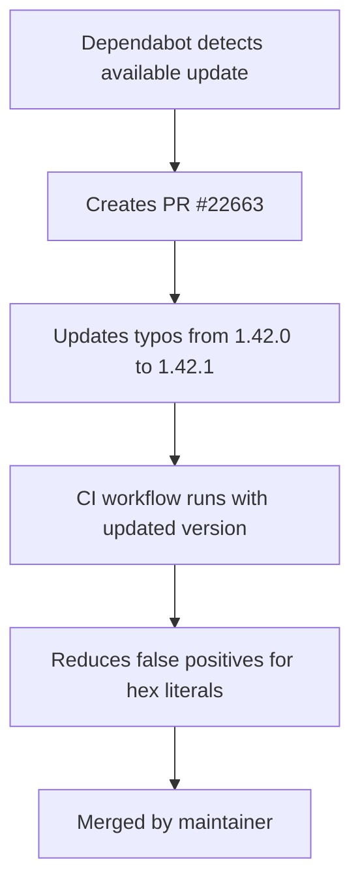

+++
title = "#22663 Bump crate-ci/typos from 1.42.0 to 1.42.1"
date = "2026-01-23T00:00:00"
draft = false
template = "pull_request_page.html"
in_search_index = true

[taxonomies]
list_display = ["show"]

[extra]
current_language = "en"
available_languages = {"en" = { name = "English", url = "/pull_request/bevy/2026-01/pr-22663-en-20260123" }, "zh-cn" = { name = "中文", url = "/pull_request/bevy/2026-01/pr-22663-zh-cn-20260123" }}
labels = ["C-Dependencies"]
+++

# Title

## Basic Information
- **Title**: Bump crate-ci/typos from 1.42.0 to 1.42.1
- **PR Link**: https://github.com/bevyengine/bevy/pull/22663
- **Author**: app/dependabot
- **Status**: MERGED
- **Labels**: C-Dependencies
- **Created**: 2026-01-23T06:53:08Z
- **Merged**: 2026-01-23T11:45:55Z
- **Merged By**: mockersf

## Description Translation
Bumps [crate-ci/typos](https://github.com/crate-ci/typos) from 1.42.0 to 1.42.1.
<details>
<summary>Release notes</summary>
<p><em>Sourced from <a href="https://github.com/crate-ci/typos/releases">crate-ci/typos's releases</a>.</em></p>
<blockquote>
<h2>v1.42.1</h2>
<h2>[1.42.1] - 2026-01-19</h2>
<h3>Fixes</h3>
<ul>
<li>Ignore hex literals with suffixes (e.g. <code>0xffffUL</code>)</li>
</ul>
</blockquote>
</details>
<details>
<summary>Changelog</summary>
<p><em>Sourced from <a href="https://github.com/crate-ci/typos/blob/master/CHANGELOG.md">crate-ci/typos's changelog</a>.</em></p>
<blockquote>
<h1>Change Log</h1>
<p>All notable changes to this project will be documented in this file.</p>
<p>The format is based on <a href="https://keepachangelog.com/">Keep a Changelog</a>
and this project adheres to <a href="https://semver.org/">Semantic Versioning</a>.</p>
<!-- raw HTML omitted -->
<h2>[Unreleased] - ReleaseDate</h2>
<h2>[1.42.1] - 2026-01-19</h2>
<h3>Fixes</h3>
<ul>
<li>Ignore hex literals with suffixes (e.g. <code>0xffffUL</code>)</li>
</ul>
<h2>[1.42.0] - 2026-01-07</h2>
<h3>Features</h3>
<ul>
<li>Dictionary updates</li>
</ul>
<h2>[1.41.0] - 2025-12-31</h2>
<h3>Features</h3>
<ul>
<li>Updated the dictionary with the <a href="https://redirect.github.com/crate-ci/typos/issues/1431">December 2025</a> changes</li>
</ul>
<h2>[1.40.1] - 2025-12-29</h2>
<h3>Fixes</h3>
<ul>
<li>Treat <code>incrementer</code> and <code>incrementor</code> the same for now</li>
</ul>
<h3>Fixes</h3>
<ul>
<li>Don't correct ITerm2</li>
</ul>
<h2>[1.40.0] - 2025-11-26</h2>
<h3>Features</h3>
<ul>
<li>Updated the dictionary with the <a href="https://redirect.github.com/crate-ci/typos/issues/1405">November 2025</a> changes</li>
</ul>
<h2>[1.39.2] - 2025-11-13</h2>
<h3>Fixes</h3>
<ul>
<li>Don't offer <code>entry</code> as a correction for <code>entrys</code></li>
</ul>
<h2>[1.39.1] - 2025-11-12</h2>
<!-- raw HTML omitted -->
</blockquote>
<p>... (truncated)</p>
</details>
<details>
<summary>Commits</summary>
<ul>
<li><a href="https://github.com/crate-ci/typos/commit/65120634e79d8374d1aa2f27e54baa0c364fff5a"><code>6512063</code></a> chore: Release</li>
<li><a href="https://github.com/crate-ci/typos/commit/2049566b9c8d1828af41b31f770bbc44d6b34eab"><code>2049566</code></a> docs: Update changelog</li>
<li><a href="https://github.com/crate-ci/typos/commit/cbc66c9a8518fdb8d78f6502705ffad9a58574c5"><code>cbc66c9</code></a> Merge pull request <a href="https://redirect.github.com/crate-ci/typos/issues/1471">#1471</a> from epage/hex</li>
<li><a href="https://github.com/crate-ci/typos/commit/207157952c1c5bb2f91d933d56924dcb674cd919"><code>2071579</code></a> fix(tokens): Ignore hex literals with suffixes</li>
<li><a href="https://github.com/crate-ci/typos/commit/7300bb0964cb8a525429adbde59c6a4eeb27099e"><code>7300bb0</code></a> perf(token): Avoid switching to chars</li>
<li><a href="https://github.com/crate-ci/typos/commit/01955c0f2a615c6f18fecd48a83fce416f520c38"><code>01955c0</code></a> perf(token): Prefer slices over characters</li>
<li><a href="https://github.com/crate-ci/typos/commit/5d4cfab739a1567f49a71c421647370271da220f"><code>5d4cfab</code></a> test(cli): Show hex literal issue</li>
<li><a href="https://github.com/crate-ci/typos/commit/3cee018e3f423e227a4df83b164d33084d6ee2be"><code>3cee018</code></a> Merge pull request <a href="https://redirect.github.com/crate-ci/typos/issues/1468">#1468</a> from Wilfred/patch-1</li>
<li><a href="https://github.com/crate-ci/typos/commit/a96a636d4eab2dee39e7046a61c94cf3171cbaad"><code>a96a636</code></a> Fix typo in ripsecrets link</li>
<li><a href="https://github.com/crate-ci/typos/commit/837ad2701b39a6d960ea301041d309c10185efd6"><code>837ad27</code></a> Merge pull request <a href="https://redirect.github.com/crate-ci/typos/issues/1467">#1467</a> from Wilfred/full_examples_in_reference</li>
<li>Additional commits viewable in <a href="https://github.com/crate-ci/typos/compare/bb4666ad77b539a6b4ce4eda7ebb6de553704021...65120634e79d8374d1aa2f27e54baa0c364fff5a">compare view</a></li>
</ul>
</details>
<br />


[](https://docs.github.com/en/github/managing-security-vulnerabilities/about-dependabot-security-updates#about-compatibility-scores)

Dependabot will resolve any conflicts with this PR as long as you don't alter it yourself. You can also trigger a rebase manually by commenting `@dependabot rebase`.

[//]: # (dependabot-automerge-start)
[//]: # (dependabot-automerge-end)

---

<details>
<summary>Dependabot commands and options</summary>
<br />

You can trigger Dependabot actions by commenting on this PR:
- `@dependabot rebase` will rebase this PR
- `@dependabot recreate` will recreate this PR, overwriting any edits that have been made to it
- `@dependabot merge` will merge this PR after your CI passes on it
- `@dependabot squash and merge` will squash and merge this PR after your CI passes on it
- `@dependabot cancel merge` will cancel a previously requested merge and block automerging
- `@dependabot reopen` will reopen this PR if it is closed
- `@dependabot close` will close this PR and stop Dependabot recreating it. You can achieve the same result by closing it manually
- `@dependabot show <dependency name> ignore conditions` will show all of the ignore conditions of the specified dependency
- `@dependabot ignore this major version` will close this PR and stop Dependabot creating any more for this major version (unless you reopen the PR or upgrade to it yourself)
- `@dependabot ignore this minor version` will close this PR and stop Dependabot creating any more for this minor version (unless you reopen the PR or upgrade to it yourself)
- `@dependabot ignore this dependency` will close this PR and stop Dependabot creating any more for this dependency (unless you reopen the PR or upgrade to it yourself)


</details>

## The Story of This Pull Request

This PR is a routine dependency update that was automatically generated by Dependabot, GitHub's automated dependency management tool. The change updates the `crate-ci/typos` action in Bevy's CI workflow from version 1.42.0 to version 1.42.1.

The context here is that Bevy uses the `typos` tool as part of its continuous integration pipeline to catch spelling errors in code and documentation. This is a common practice in large open-source projects to maintain code quality and prevent embarrassing typos from reaching production code. The tool runs as a GitHub Action, which means it automatically executes on every pull request to check for spelling mistakes.

The problem that prompted this update was a specific issue in the typos tool itself. Version 1.42.1 of typos fixed a bug where the tool was incorrectly flagging hex literals with suffixes as potential typos. For example, a hex literal like `0xffffUL` (which is valid in some programming languages to indicate an unsigned long integer) was being incorrectly identified as containing a typo. This would cause false positives in the CI checks, potentially failing builds unnecessarily.

The solution approach here is straightforward: update to the patched version of the dependency. Since this is a patch version update (from 1.42.0 to 1.42.1), it follows semantic versioning principles where patch versions contain only backward-compatible bug fixes. This makes the update low-risk and appropriate for automatic merging once CI passes.

The implementation is minimal, involving just a single line change in the CI configuration file. The update switches from using the specific commit hash for version 1.42.0 to the commit hash for version 1.42.1. This is a common pattern in GitHub Actions workflows where dependencies are pinned to specific versions for reproducibility.

From a technical perspective, this PR demonstrates several best practices in dependency management. First, it shows the value of automated dependency updates through tools like Dependabot, which helps keep projects secure and up-to-date with minimal manual effort. Second, it illustrates the importance of semantic versioning in the ecosystem, allowing projects to confidently apply patch updates without fear of breaking changes. Third, it highlights how CI tools can be configured to use specific pinned versions rather than floating tags, ensuring consistent behavior across runs.

The impact of this change is that Bevy's CI will now benefit from the bug fix in typos 1.42.1, reducing false positives when checking for typos in code containing hex literals with suffixes. This makes the development experience smoother by preventing unnecessary CI failures for legitimate code patterns.

## Visual Representation



## Key Files Changed

### `.github/workflows/ci.yml`

This file contains Bevy's GitHub Actions workflow configuration for continuous integration. The change updates the version of the `crate-ci/typos` action used in the CI pipeline.

**Before:**
```yaml
- name: Check for typos
  uses: crate-ci/typos@bb4666ad77b539a6b4ce4eda7ebb6de553704021 # v1.42.0
```

**After:**
```yaml
- name: Check for typos
  uses: crate-ci/typos@65120634e79d8374d1aa2f27e54baa0c364fff5a # v1.42.1
```

The change replaces the commit hash reference from the 1.42.0 release to the 1.42.1 release. The comment is updated accordingly to reflect the new version. This ensures that when the CI workflow runs, it will use the updated version of the typos tool with the bug fix for hex literals.

## Further Reading

- [GitHub Actions documentation](https://docs.github.com/en/actions) - For understanding how GitHub Actions workflows are configured
- [Semantic Versioning specification](https://semver.org/) - For understanding version numbering conventions
- [Dependabot documentation](https://docs.github.com/en/code-security/dependabot) - For learning about automated dependency management
- [Typos tool repository](https://github.com/crate-ci/typos) - For understanding the spelling checker tool being updated

# Full Code Diff
diff --git a/.github/workflows/ci.yml b/.github/workflows/ci.yml
index b5d7e3f966546..4b24a8b46ef7e 100644
--- a/.github/workflows/ci.yml
+++ b/.github/workflows/ci.yml
@@ -367,7 +367,7 @@ jobs:
         with:
           persist-credentials: false
       - name: Check for typos
-        uses: crate-ci/typos@bb4666ad77b539a6b4ce4eda7ebb6de553704021 # v1.42.0
+        uses: crate-ci/typos@65120634e79d8374d1aa2f27e54baa0c364fff5a # v1.42.1
       - name: Typos info
         if: failure()
         run: |