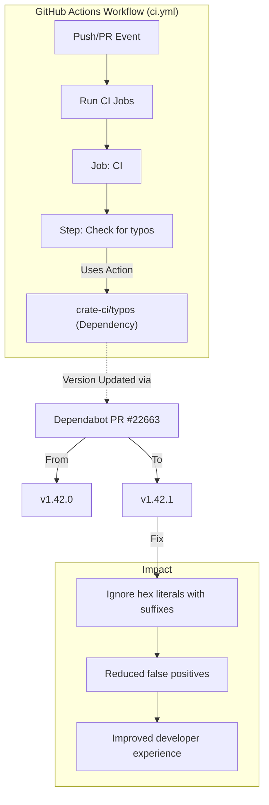

+++
title = "#22663 Bump crate-ci/typos from 1.42.0 to 1.42.1"
date = "2026-01-23T00:00:00"
draft = false
template = "pull_request_page.html"
in_search_index = false

[extra]
current_language = "zh-cn"
available_languages = {"en" = { name = "English", url = "/pull_request/bevy/2026-01/pr-22663-en-20260123" }, "zh-cn" = { name = "中文", url = "/pull_request/bevy/2026-01/pr-22663-zh-cn-20260123" }}
labels = ["C-Dependencies"]
+++

# Bump crate-ci/typos from 1.42.0 to 1.42.1

## Basic Information
- **Title**: Bump crate-ci/typos from 1.42.0 to 1.42.1
- **PR Link**: https://github.com/bevyengine/bevy/pull/22663
- **Author**: app/dependabot
- **Status**: MERGED
- **Labels**: C-Dependencies
- **Created**: 2026-01-23T06:53:08Z
- **Merged**: 2026-01-23T11:45:55Z
- **Merged By**: mockersf

## Description Translation
此 PR 将 [crate-ci/typos](https://github.com/crate-ci/typos) 从版本 1.42.0 升级至 1.42.1。
<details>
<summary>Release notes</summary>
<p><em>Sourced from <a href="https://github.com/crate-ci/typos/releases">crate-ci/typos's releases</a>.</em></p>
<blockquote>
<h2>v1.42.1</h2>
<h2>[1.42.1] - 2026-01-19</h2>
<h3>Fixes</h3>
<ul>
<li>忽略带有后缀的十六进制字面量 (例如 <code>0xffffUL</code>)</li>
</ul>
</blockquote>
</details>
<details>
<summary>Changelog</summary>
<p><em>Sourced from <a href="https://github.com/crate-ci/typos/blob/master/CHANGELOG.md">crate-ci/typos's changelog</a>.</em></p>
<blockquote>
<h1>Change Log</h1>
<p>All notable changes to this project will be documented in this file.</p>
<p>The format is based on <a href="https://keepachangelog.com/">Keep a Changelog</a>
and this project adheres to <a href="https://semver.org/">Semantic Versioning</a>.</p>
<!-- raw HTML omitted -->
<h2>[Unreleased] - ReleaseDate</h2>
<h2>[1.42.1] - 2026-01-19</h2>
<h3>Fixes</h3>
<ul>
<li>Ignore hex literals with suffixes (e.g. <code>0xffffUL</code>)</li>
</ul>
<h2>[1.42.0] - 2026-01-07</h2>
<h3>Features</h3>
<ul>
<li>Dictionary updates</li>
</ul>
<h2>[1.41.0] - 2025-12-31</h2>
<h3>Features</h3>
<ul>
<li>Updated the dictionary with the <a href="https://redirect.github.com/crate-ci/typos/issues/1431">December 2025</a> changes</li>
</ul>
<h2>[1.40.1] - 2025-12-29</h2>
<h3>Fixes</h3>
<ul>
<li>Treat <code>incrementer</code> and <code>incrementor</code> the same for now</li>
</ul>
<h3>Fixes</h3>
<ul>
<li>Don't correct ITerm2</li>
</ul>
<h2>[1.40.0] - 2025-11-26</h2>
<h3>Features</h3>
<ul>
<li>Updated the dictionary with the <a href="https://redirect.github.com/crate-ci/typos/issues/1405">November 2025</a> changes</li>
</ul>
<h2>[1.39.2] - 2025-11-13</h2>
<h3>Fixes</h3>
<ul>
<li>Don't offer <code>entry</code> as a correction for <code>entrys</code></li>
</ul>
<h2>[1.39.1] - 2025-11-12</h2>
<!-- raw HTML omitted -->
</blockquote>
<p>... (truncated)</p>
</details>
<details>
<summary>Commits</summary>
<ul>
<li><a href="https://github.com/crate-ci/typos/commit/65120634e79d8374d1aa2f27e54baa0c364fff5a"><code>6512063</code></a> chore: Release</li>
<li><a href="https://github.com/crate-ci/typos/commit/2049566b9c8d1828af41b31f770bbc44d6b34eab"><code>2049566</code></a> docs: Update changelog</li>
<li><a href="https://github.com/crate-ci/typos/commit/cbc66c9a8518fdb8d78f6502705ffad9a58574c5"><code>cbc66c9</code></a> Merge pull request <a href="https://redirect.github.com/crate-ci/typos/issues/1471">#1471</a> from epage/hex</li>
<li><a href="https://github.com/crate-ci/typos/commit/207157952c1c5bb2f91d933d56924dcb674cd919"><code>2071579</code></a> fix(tokens): Ignore hex literals with suffixes</li>
<li><a href="https://github.com/crate-ci/typos/commit/7300bb0964cb8a525429adbde59c6a4eeb27099e"><code>7300bb0</code></a> perf(token): Avoid switching to chars</li>
<li><a href="https://github.com/crate-ci/typos/commit/01955c0f2a615c6f18fecd48a83fce416f520c38"><code>01955c0</code></a> perf(token): Prefer slices over characters</li>
<li><a href="https://github.com/crate-ci/typos/commit/5d4cfab739a1567f49a71c421647370271da220f"><code>5d4cfab</code></a> test(cli): Show hex literal issue</li>
<li><a href="https://github.com/crate-ci/typos/commit/3cee018e3f423e227a4df83b164d33084d6ee2be"><code>3cee018</code></a> Merge pull request <a href="https://redirect.github.com/crate-ci/typos/issues/1468">#1468</a> from Wilfred/patch-1</li>
<li><a href="https://github.com/crate-ci/typos/commit/a96a636d4eab2dee39e7046a61c94cf3171cbaad"><code>a96a636</code></a> Fix typo in ripsecrets link</li>
<li><a href="https://github.com/crate-ci/typos/commit/837ad2701b39a6d960ea301041d309c10185efd6"><code>837ad27</code></a> Merge pull request <a href="https://redirect.github.com/crate-ci/typos/issues/1467">#1467</a> from Wilfred/full_examples_in_reference</li>
<li>Additional commits viewable in <a href="https://github.com/crate-ci/typos/compare/bb4666ad77b539a6b4ce4eda7ebb6de553704021...65120634e79d8374d1aa2f27e54baa0c364fff5a">compare view</a></li>
</ul>
</details>
<br />


[](https://docs.github.com/en/github/managing-security-vulnerabilities/about-dependabot-security-updates#about-compatibility-scores)

Dependabot 会在你不做任何更改的情况下自动解决此 PR 的任何冲突。你也可以通过评论 `@dependabot rebase` 手动触发 rebase。

[//]: # (dependabot-automerge-start)
[//]: # (dependabot-automerge-end)

---

<details>
<summary>Dependabot commands and options</summary>
<br />

You can trigger Dependabot actions by commenting on this PR:
- `@dependabot rebase` will rebase this PR
- `@dependabot recreate` will recreate this PR, overwriting any edits that have been made to it
- `@dependabot merge` will merge this PR after your CI passes on it
- `@dependabot squash and merge` will squash and merge this PR after your CI passes on it
- `@dependabot cancel merge` will cancel a previously requested merge and block automerging
- `@dependabot reopen` will reopen this PR if it is closed
- `@dependabot close` will close this PR and stop Dependabot recreating it. You can achieve the same result by closing it manually
- `@dependabot show <dependency name> ignore conditions` will show all of the ignore conditions of the specified dependency
- `@dependabot ignore this major version` will close this PR and stop Dependabot creating any more for this major version (unless you reopen the PR or upgrade to it yourself)
- `@dependabot ignore this minor version` will close this PR and stop Dependabot creating any more for this minor version (unless you reopen the PR or upgrade to it yourself)
- `@dependabot ignore this dependency` will close this PR and stop Dependabot creating any more for this dependency (unless you reopen the PR or upgrade to it yourself)


</details>

## The Story of This Pull Request

这是一个关于维护性依赖更新和开发工具链优化的简短故事。PR #22663 的核心是更新 Bevy 持续集成 (CI, Continuous Integration) 流程中使用的一个静态分析工具。

在维护大型开源项目时，代码质量和一致性是重要考量。Bevy 项目在其 GitHub Actions 工作流中集成了 `crate-ci/typos` 这个工具，用于在代码提交时自动检查文档、注释和标识符中的拼写错误。这有助于保持代码库的专业性和可读性，特别是对于非英语母语的贡献者来说，能避免一些常见的拼写错误。

这次更新是由 Dependabot 自动发起的。Dependabot 是一个 GitHub 原生工具，它监控项目的依赖关系，并在有新版发布时自动创建 Pull Request。这对于保持依赖项为最新、获取安全补丁和功能改进非常有用。从标签 `C-Dependencies` 可以看出，这被归类为一个常规的依赖更新。

这次更新的内容很具体：从 typos v1.42.0 升级到 v1.42.1。根据发布说明，v1.42.1 版本修复了一个问题：**忽略带有后缀的十六进制字面量**（例如 `0xffffUL`）。这是一个典型的“误报”修复。在编程中，`0xffffUL` 是一个有效的十六进制数字字面量，其中 `UL` 是无符号长整型 (unsigned long) 的后缀。然而，对于拼写检查器来说，它可能将 `UL` 解析为一个独立的单词并错误地标记为拼写问题（或许认为 `UL` 是某个词的缩写或拼写错误）。v1.42.1 的修复使工具更加“智能”，能够正确识别这类编程语言特有的构造，避免干扰开发人员。

这个修复虽然很小，但对开发体验很重要。没有这个修复，如果开发者在代码中使用了 `0xffffUL` 这样的常量，CI 可能会失败并报告一个虚假的“拼写错误”，这会浪费时间去调查和解决一个实际上不存在的问。通过及时更新到修复版本，Bevy 团队确保了其 CI 流程的准确性和可靠性。

从工程实践角度看，这个 PR 展示了几个好的做法：
1.  **自动化依赖管理**：使用 Dependabot 自动处理依赖更新，减少了维护负担。
2.  **语义化版本控制**：`typos` 项目遵循语义化版本 (SemVer)，从 1.42.0 到 1.42.1 是一个补丁版本更新，意味着只包含向后兼容的 bug 修复，因此升级风险很低。
3.  **关注开发体验**：及时修复会引发误报的工具，保持 CI 检查的准确性和对开发者的友好性。
4.  **清晰的变更记录**：PR 描述中包含了完整的发布说明和变更日志链接，让审阅者可以轻松了解更新的具体内容。

最终，维护者 `mockersf` 在验证 CI 通过后合并了这个 PR，将 Bevy 的代码质量检查工具更新到了一个更精准的版本。

## Visual Representation



## Key Files Changed

本次 PR 只修改了一个文件：

- `.github/workflows/ci.yml` (+1/-1)

**描述与原因**：此文件定义了 Bevy 仓库的 GitHub Actions 持续集成工作流。具体修改是更新了 `typos` 拼写检查工具的版本，从 `v1.42.0` 的特定提交哈希更改为 `v1.42.1` 的提交哈希。这是为了获取新版本中包含的 bug 修复，特别是关于忽略十六进制字面量后缀的修复。

**代码变更**：
```yaml
# File: .github/workflows/ci.yml
# Before:
      - name: Check for typos
        uses: crate-ci/typos@bb4666ad77b539a6b4ce4eda7ebb6de553704021 # v1.42.0

# After:
      - name: Check for typos
        uses: crate-ci/typos@65120634e79d8374d1aa2f27e54baa0c364fff5a # v1.42.1
```

**与 PR 目的的关系**：这一行代码的变更是本次 PR 的全部内容。它直接实现了将依赖的 `typos` GitHub Action 升级到新版本的目标，从而使 CI 流程能够利用新版本的改进。注释中更新了版本标签 (`# v1.42.0` -> `# v1.42.1`)，这有助于开发者阅读配置文件时理解当前使用的版本。

## Further Reading

- **[crate-ci/typos GitHub Repository](https://github.com/crate-ci/typos)**: 工具的源代码和文档，了解其全部功能和配置选项。
- **[Typos: Docs](https://typos.it/)**: 项目的官方网站，提供使用指南。
- **[GitHub Actions Documentation](https://docs.github.com/en/actions)**: 了解 GitHub Actions 工作流如何编写和运行。
- **[Dependabot Documentation](https://docs.github.com/en/code-security/dependabot)**: 学习如何配置和使用 Dependabot 来自动化管理项目依赖。
- **[Semantic Versioning (SemVer)](https://semver.org/)**: 理解语义化版本控制规范，这是判断依赖升级风险的基础。

# Full Code Diff
diff --git a/.github/workflows/ci.yml b/.github/workflows/ci.yml
index b5d7e3f966546..4b24a8b46ef7e 100644
--- a/.github/workflows/ci.yml
+++ b/.github/workflows/ci.yml
@@ -367,7 +367,7 @@ jobs:
         with:
           persist-credentials: false
       - name: Check for typos
-        uses: crate-ci/typos@bb4666ad77b539a6b4ce4eda7ebb6de553704021 # v1.42.0
+        uses: crate-ci/typos@65120634e79d8374d1aa2f27e54baa0c364fff5a # v1.42.1
       - name: Typos info
         if: failure()
         run: |