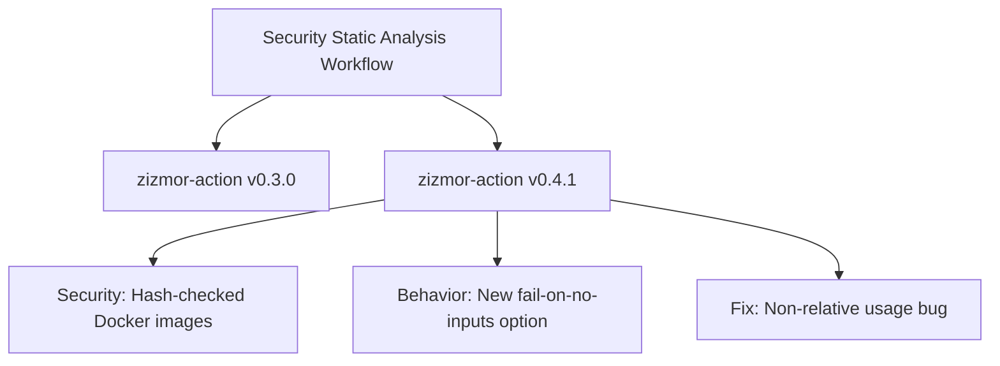

+++
title = "#22664 Bump zizmorcore/zizmor-action from 0.3.0 to 0.4.1"
date = "2026-01-23T00:00:00"
draft = false
template = "pull_request_page.html"
in_search_index = true

[taxonomies]
list_display = ["show"]

[extra]
current_language = "en"
available_languages = {"en" = { name = "English", url = "/pull_request/bevy/2026-01/pr-22664-en-20260123" }, "zh-cn" = { name = "中文", url = "/pull_request/bevy/2026-01/pr-22664-zh-cn-20260123" }}
labels = ["C-Dependencies"]
+++

# Title: Bump zizmorcore/zizmor-action from 0.3.0 to 0.4.1

## Basic Information
- **Title**: Bump zizmorcore/zizmor-action from 0.3.0 to 0.4.1
- **PR Link**: https://github.com/bevyengine/bevy/pull/22664
- **Author**: app/dependabot
- **Status**: MERGED
- **Labels**: C-Dependencies
- **Created**: 2026-01-23T06:53:12Z
- **Merged**: 2026-01-23T11:45:55Z
- **Merged By**: mockersf

## Description Translation
Bumps [zizmorcore/zizmor-action](https://github.com/zizmorcore/zizmor-action) from 0.3.0 to 0.4.1.
<details>
<summary>Release notes</summary>
<p><em>Sourced from <a href="https://github.com/zizmorcore/zizmor-action/releases">zizmorcore/zizmor-action's releases</a>.</em></p>
<blockquote>
<h2>v0.4.1</h2>
<p>This version fixes an error in the 0.4.0 release that prevented non-relative use
of the action.</p>
<h2>What's Changed</h2>
<ul>
<li>Fix version file path by <a href="https://github.com/woodruffw"><code>@​woodruffw</code></a> in <a href="https://redirect.github.com/zizmorcore/zizmor-action/pull/83">zizmorcore/zizmor-action#83</a></li>
</ul>
<p><strong>Full Changelog</strong>: <a href="https://github.com/zizmorcore/zizmor-action/compare/v0.4.0...v0.4.1">https://github.com/zizmorcore/zizmor-action/compare/v0.4.0...v0.4.1</a></p>
<h2>v0.4.0</h2>
<p>This new version of <code>zizmor-action</code> brings two major changes:</p>
<ul>
<li>
<p>The new <code>fail-on-no-inputs</code> option can be used to control whether
<code>zizmor-action</code> fails if no inputs were collected by <code>zizmor</code>. The default
remains <code>true</code>, reflecting the pre-existing behavior.</p>
</li>
<li>
<p>The action's use of the official <code>zizmor</code> Docker images is now fully
hash-checked internally, preventing accidental or malicious modification
to the images. This also means that subsequent releases of <code>zizmor</code>
will induce a release of this action, rather than the action always picking
up the latest version by default.</p>
</li>
</ul>
<h2>What's Changed</h2>
<ul>
<li>docs: extended permissions required for internal repos by <a href="https://github.com/AntoineSebert"><code>@​AntoineSebert</code></a> in <a href="https://redirect.github.com/zizmorcore/zizmor-action/pull/61">zizmorcore/zizmor-action#61</a></li>
<li>docs: clarify description of &quot;token&quot; to indicate it is only used for online audits by <a href="https://github.com/rmuir"><code>@​rmuir</code></a> in <a href="https://redirect.github.com/zizmorcore/zizmor-action/pull/63">zizmorcore/zizmor-action#63</a></li>
<li>Hash-check zizmor Docker images by <a href="https://github.com/woodruffw"><code>@​woodruffw</code></a> in <a href="https://redirect.github.com/zizmorcore/zizmor-action/pull/68">zizmorcore/zizmor-action#68</a></li>
<li>Add <code>fail-on-no-inputs</code> option by <a href="https://github.com/woodruffw"><code>@​woodruffw</code></a> in <a href="https://redirect.github.com/zizmorcore/zizmor-action/pull/67">zizmorcore/zizmor-action#67</a></li>
</ul>
<h2>New Contributors</h2>
<ul>
<li><a href="https://github.com/AntoineSebert"><code>@​AntoineSebert</code></a> made their first contribution in <a href="https://redirect.github.com/zizmorcore/zizmor-action/pull/61">zizmorcore/zizmor-action#61</a></li>
<li><a href="https://github.com/rmuir"><code>@​rmuir</code></a> made their first contribution in <a href="https://redirect.github.com/zizmorcore/zizmor-action/pull/63">zizmorcore/zizmor-action#63</a></li>
</ul>
<p><strong>Full Changelog</strong>: <a href="https://github.com/zizmorcore/zizmor-action/compare/v0.3.0...v0.4.0">https://github.com/zizmorcore/zizmor-action/compare/v0.3.0...v0.4.0</a></p>
</blockquote>
</details>
<details>
<summary>Commits</summary>
<ul>
<li><a href="https://github.com/zizmorcore/zizmor-action/commit/135698455da5c3b3e55f73f4419e481ab68cdd95"><code>1356984</code></a> Fix version file path (<a href="https://redirect.github.com/zizmorcore/zizmor-action/issues/83">#83</a>)</li>
<li><a href="https://github.com/zizmorcore/zizmor-action/commit/72469cf6cc7fbd7801d9b361f11f25c0b5fc9d42"><code>72469cf</code></a> Bump pins in README (<a href="https://redirect.github.com/zizmorcore/zizmor-action/issues/80">#80</a>)</li>
<li><a href="https://github.com/zizmorcore/zizmor-action/commit/3aa7e2f1ad15075829ef5158ee06938ae12e1769"><code>3aa7e2f</code></a> Add fail-on-no-inputs tests (<a href="https://redirect.github.com/zizmorcore/zizmor-action/issues/79">#79</a>)</li>
<li><a href="https://github.com/zizmorcore/zizmor-action/commit/92fc377b741151b893e77df75819fb34a198f677"><code>92fc377</code></a> Sync zizmor versions (<a href="https://redirect.github.com/zizmorcore/zizmor-action/issues/78">#78</a>)</li>
<li><a href="https://github.com/zizmorcore/zizmor-action/commit/5aff8efe9fc7bea2f977d55dcc7c98923f22d887"><code>5aff8ef</code></a> Add <code>fail-on-no-inputs</code> option (<a href="https://redirect.github.com/zizmorcore/zizmor-action/issues/67">#67</a>)</li>
<li><a href="https://github.com/zizmorcore/zizmor-action/commit/4d497b9cc8b9f59f4154478dffc4bab6a783fc69"><code>4d497b9</code></a> Sync zizmor versions (<a href="https://redirect.github.com/zizmorcore/zizmor-action/issues/75">#75</a>)</li>
<li><a href="https://github.com/zizmorcore/zizmor-action/commit/5fa0711fa51dd83a19dbfcf0195cfb02e61571ef"><code>5fa0711</code></a> Fix sync-zizmor-versions (<a href="https://redirect.github.com/zizmorcore/zizmor-action/issues/69">#69</a>)</li>
<li><a href="https://github.com/zizmorcore/zizmor-action/commit/c823f2c8e66ceac799af6d2d17b1d83b6d5a0177"><code>c823f2c</code></a> Hash-check zizmor Docker images (<a href="https://redirect.github.com/zizmorcore/zizmor-action/issues/68">#68</a>)</li>
<li><a href="https://github.com/zizmorcore/zizmor-action/commit/706c51b5bce7adb027de71ab36d865f5d3fcc7b7"><code>706c51b</code></a> chore(deps): bump github/codeql-action in the github-actions group (<a href="https://redirect.github.com/zizmorcore/zizmor-action/issues/66">#66</a>)</li>
<li><a href="https://github.com/zizmorcore/zizmor-action/commit/cb3d8e846e148d1111d90b03375b9c03deceda37"><code>cb3d8e8</code></a> chore(deps): bump actions/checkout in the github-actions group (<a href="https://redirect.github.com/zizmorcore/zizmor-action/issues/65">#65</a>)</li>
<li>Additional commits viewable in <a href="https://github.com/zizmorcore/zizmor-action/compare/e639db99335bc9038abc0e066dfcd72e23d26fb4...135698455da5c3b3e55f73f4419e481ab68cdd95">compare view</a></li>
</ul>
</details>
<br />


[](https://docs.github.com/en/github/managing-security-vulnerabilities/about-dependabot-security-updates#about-compatibility-scores)

Dependabot will resolve any conflicts with this PR as long as you don't alter it yourself. You can also trigger a rebase manually by commenting `@dependabot rebase`.

[//]: # (dependabot-automerge-start)
[//]: # (dependabot-automerge-end)

---

<details>
<summary>Dependabot commands and options</summary>
<br />

You can trigger Dependabot actions by commenting on this PR:
- `@dependabot rebase` will rebase this PR
- `@dependabot recreate` will recreate this PR, overwriting any edits that have been made to it
- `@dependabot merge` will merge this PR after your CI passes on it
- `@dependabot squash and merge` will squash and merge this PR after your CI passes on it
- `@dependabot cancel merge` will cancel a previously requested merge and block automerging
- `@dependabot reopen` will reopen this PR if it is closed
- `@dependabot close` will close this PR and stop Dependabot recreating it. You can achieve the same result by closing it manually
- `@dependabot show <dependency name> ignore conditions` will show all of the ignore conditions of the specified dependency
- `@dependabot ignore this major version` will close this PR and stop Dependabot creating any more for this major version (unless you reopen the PR or upgrade to it yourself)
- `@dependabot ignore this minor version` will close this PR and stop Dependabot creating any more for this minor version (unless you reopen the PR or upgrade to it yourself)
- `@dependabot ignore this dependency` will close this PR and stop Dependabot creating any more for this dependency (unless you reopen the PR or upgrade to it yourself)


</details>

## The Story of This Pull Request

This is a straightforward dependency update PR, but it demonstrates important aspects of maintaining security tooling in a large open-source project like Bevy. The PR updates the version of the `zizmor-action` GitHub Action from 0.3.0 to 0.4.1 in the project's security static analysis workflow.

**The Problem and Context**

The Bevy project uses automated security scanning as part of its CI/CD pipeline to identify potential vulnerabilities in dependencies. The `zizmor-action` is a GitHub Action that runs the `zizmor` tool, which performs static analysis to detect security issues in third-party dependencies. Like any security tool, it needs to be kept current to ensure it can detect the latest known vulnerabilities and to benefit from improvements in the tooling itself.

The existing version (0.3.0) was missing two key improvements introduced in versions 0.4.0 and 0.4.1:
1. A new `fail-on-no-inputs` option that provides better control over failure behavior
2. Hash-checking for Docker images to prevent supply chain attacks
3. A bug fix for non-relative use of the action

**The Solution Approach**

The solution is simple but important: update the dependency to the latest stable version. This is a standard practice for maintaining security tooling, but it requires careful consideration because:
- Security tools need to be trustworthy (hence the hash-checking improvement is particularly relevant)
- Changes in failure behavior could affect CI/CD pipelines
- The update needed to be tested to ensure compatibility with Bevy's existing workflow configuration

Since this is a Dependabot-generated PR, the automation handled the version bump, compatibility checking, and conflict resolution. The maintainers needed to review the changes and verify that the new version wouldn't break the existing workflow.

**The Implementation**

The implementation consists of a single line change in the GitHub Actions workflow file. The update pins the action to a specific commit hash rather than using a floating version tag, which is a security best practice that ensures reproducible builds and prevents unexpected changes if the tag is moved.

**Technical Insights**

The two main improvements in the new version address different aspects of security tooling:

1. **Hash-checking Docker images**: This is a supply chain security measure. By verifying the cryptographic hash of the Docker images used by the action, the tool ensures that the container image hasn't been tampered with. This prevents an attacker from substituting a malicious image if they compromise the Docker registry or the build process. This is particularly important for security tools themselves, as compromising them could allow attackers to hide vulnerabilities.

2. **`fail-on-no-inputs` option**: This provides more flexible control over the action's behavior. In some scenarios, you might want the security scan to run but not fail the build if no dependencies are found to analyze (for example, in a minimal test project). The default remains `true` to maintain the existing strict behavior, but projects now have the option to change this if needed.

**The Impact**

For the Bevy project, this update:
- Improves the security of the security scanning process itself through Docker image hash verification
- Provides more control over CI/CD failure conditions
- Fixes a bug that could affect non-relative usage (though Bevy uses it relatively)
- Maintains compatibility as shown by the 100% compatibility score from Dependabot

The minimal change required demonstrates that the action maintains a stable API and that the Bevy team practices good dependency hygiene by keeping security tooling up-to-date.

## Visual Representation



## Key Files Changed

### `.github/workflows/security-static-analysis.yml` (+1/-1)

This file contains the GitHub Actions workflow for security static analysis. The change updates the version of the `zizmor-action` used in the workflow.

**Before:**
```yaml
- name: Run zizmor 🌈
  uses: zizmorcore/zizmor-action@e639db99335bc9038abc0e066dfcd72e23d26fb4 # v0.3.0
```

**After:**
```yaml
- name: Run zizmor 🌈
  uses: zizmorcore/zizmor-action@135698455da5c3b3e55f73f4419e481ab68cdd95 # v0.4.1
```

The change updates the pinned commit hash from the v0.3.0 release to the v0.4.1 release. The comment is updated accordingly to reflect the new version. This single-line change brings in all the improvements from the new version while maintaining the same workflow structure.

## Further Reading

1. [GitHub Actions Security Hardening Guide](https://docs.github.com/en/actions/security-guides/security-hardening-for-github-actions) - Best practices for securing GitHub Actions workflows
2. [Dependabot Documentation](https://docs.github.com/en/code-security/dependabot) - How Dependabot automates dependency updates
3. [Supply Chain Security for Containers](https://docs.docker.com/security/for-developers/container-security-supply-chain/) - Docker's guide to securing container supply chains
4. [GitHub Actions `uses` Pinning](https://docs.github.com/en/actions/using-workflows/workflow-syntax-for-github-actions#jobsjob_idstepsuses) - Official documentation on pinning actions to specific versions

# Full Code Diff
```
diff --git a/.github/workflows/security-static-analysis.yml b/.github/workflows/security-static-analysis.yml
index e9d031563115d..592b6497b7e2f 100644
--- a/.github/workflows/security-static-analysis.yml
+++ b/.github/workflows/security-static-analysis.yml
@@ -87,4 +87,4 @@ jobs:
           persist-credentials: false
 
       - name: Run zizmor 🌈
-        uses: zizmorcore/zizmor-action@e639db99335bc9038abc0e066dfcd72e23d26fb4 # v0.3.0
+        uses: zizmorcore/zizmor-action@135698455da5c3b3e55f73f4419e481ab68cdd95 # v0.4.1
```