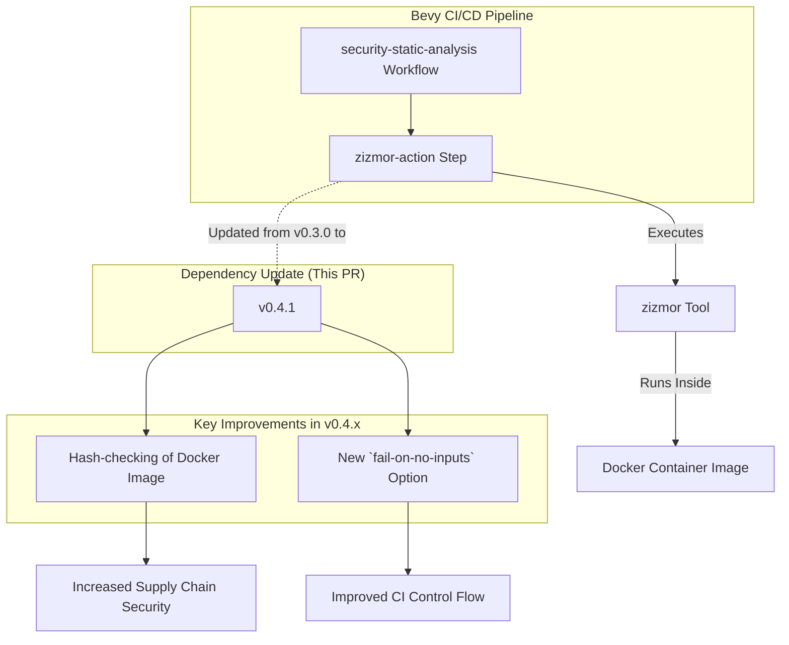

+++
title = "#22664 Bump zizmorcore/zizmor-action from 0.3.0 to 0.4.1"
date = "2026-01-23T00:00:00"
draft = false
template = "pull_request_page.html"
in_search_index = false

[extra]
current_language = "zh-cn"
available_languages = {"en" = { name = "English", url = "/pull_request/bevy/2026-01/pr-22664-en-20260123" }, "zh-cn" = { name = "中文", url = "/pull_request/bevy/2026-01/pr-22664-zh-cn-20260123" }}
labels = ["C-Dependencies"]
+++

# Title
Bump zizmorcore/zizmor-action from 0.3.0 to 0.4.1

## Basic Information
- **Title**: Bump zizmorcore/zizmor-action from 0.3.0 to 0.4.1
- **PR Link**: https://github.com/bevyengine/bevy/pull/22664
- **Author**: app/dependabot
- **Status**: MERGED
- **Labels**: C-Dependencies
- **Created**: 2026-01-23T06:53:12Z
- **Merged**: 2026-01-23T11:45:55Z
- **Merged By**: mockersf

## Description Translation
Bumps [zizmorcore/zizmor-action](https://github.com/zizmorcore/zizmor-action) from 0.3.0 to 0.4.1.
<details>
<summary>Release notes</summary>
<p><em>Sourced from <a href="https://github.com/zizmorcore/zizmor-action/releases">zizmorcore/zizmor-action's releases</a>.</em></p>
<blockquote>
<h2>v0.4.1</h2>
<p>此版本修复了 0.4.0 中的一个错误，该错误阻止了该 action 的非相对使用。</p>
<h2>What's Changed</h2>
<ul>
<li>修复版本文件路径 by <a href="https://github.com/woodruffw"><code>@​woodruffw</code></a> in <a href="https://redirect.github.com/zizmorcore/zizmor-action/pull/83">zizmorcore/zizmor-action#83</a></li>
</ul>
<p><strong>Full Changelog</strong>: <a href="https://github.com/zizmorcore/zizmor-action/compare/v0.4.0...v0.4.1">https://github.com/zizmorcore/zizmor-action/compare/v0.4.0...v0.4.1</a></p>
<h2>v0.4.0</h2>
<p>此新版本 <code>zizmor-action</code> 带来两个主要变化：</p>
<ul>
<li>
<p>新的 <code>fail-on-no-inputs</code> 选项可用于控制当 <code>zizmor</code> 未收集到任何输入时，<code>zizmor-action</code> 是否应视为失败。默认值保持为 <code>true</code>，这反映了之前已有的行为。</p>
</li>
<li>
<p>该 action 对官方 <code>zizmor</code> Docker 镜像的使用现在在内部进行了完整的哈希校验（hash-checked），这可以防止镜像被意外或恶意修改。这也意味着，后续 <code>zizmor</code> 的发布将引发此 action 的发布，而不是让 action 默认始终获取最新版本。</p>
</li>
</ul>
<h2>What's Changed</h2>
<ul>
<li>docs: extended permissions required for internal repos by <a href="https://github.com/AntoineSebert"><code>@​AntoineSebert</code></a> in <a href="https://redirect.github.com/zizmorcore/zizmor-action/pull/61">zizmorcore/zizmor-action#61</a></li>
<li>docs: clarify description of &quot;token&quot; to indicate it is only used for online audits by <a href="https://github.com/rmuir"><code>@​rmuir</code></a> in <a href="https://redirect.github.com/zizmorcore/zizmor-action/pull/63">zizmorcore/zizmor-action#63</a></li>
<li>Hash-check zizmor Docker images by <a href="https://github.com/woodruffw"><code>@​woodruffw</code></a> in <a href="github.com/zizmorcore/zizmor-action/pull/68">zizmorcore/zizmor-action#68</a></li>
<li>Add <code>fail-on-no-inputs</code> option by <a href="https://github.com/woodruffw"><code>@​woodruffw</code></a> in <a href="https://redirect.github.com/zizmorcore/zizmor-action/pull/67">zizmorcore/zizmor-action#67</a></li>
</ul>
<h2>New Contributors</h2>
<ul>
<li><a href="https://github.com/AntoineSebert"><code>@​AntoineSebert</code></a> made their first contribution in <a href="https://redirect.github.com/zizmorcore/zizmor-action/pull/61">zizmorcore/zizmor-action#61</a></li>
<li><a href="https://github.com/rmuir"><code>@​rmuir</code></a> made their first contribution in <a href="https://redirect.github.com/zizmorcore/zizmor-action/pull/63">zizmorcore/zizmor-action#63</a></li>
</ul>
<p><strong>Full Changelog</strong>: <a href="https://github.com/zizmorcore/zizmor-action/compare/v0.3.0...v0.4.0">https://github.com/zizmorcore/zizmor-action/compare/v0.3.0...v0.4.0</a></p>
</blockquote>
</details>
<details>
<summary>Commits</summary>
<ul>
<li><a href="https://github.com/zizmorcore/zizmor-action/commit/135698455da5c3b3e55f73f4419e481ab68cdd95"><code>1356984</code></a> Fix version file path (<a href="https://redirect.github.com/zizmorcore/zizmor-action/issues/83">#83</a>)</li>
<li><a href="https://github.com/zizmorcore/zizmor-action/commit/72469cf6cc7fbd7801d9b361f11f25c0b5fc9d42"><code>72469cf</code></a> Bump pins in README (<a href="https://redirect.github.com/zizmorcore/zizmor-action/issues/80">#80</a>)</li>
<li><a href="https://github.com/zizmorcore/zizmor-action/commit/3aa7e2f1ad15075829ef5158ee06938ae12e1769"><code>3aa7e2f</code></a> Add fail-on-no-inputs tests (<a href="https://redirect.github.com/zizmorcore/zizmor-action/issues/79">#79</a>)</li>
<li><a href="https://github.com/zizmorcore/zizmor-action/commit/92fc377b741151b893e77df75819fb34a198f677"><code>92fc377</code></a> Sync zizmor versions (<a href="https://redirect.github.com/zizmorcore/zizmor-action/issues/78">#78</a>)</li>
<li><a href="https://github.com/zizmorcore/zizmor-action/commit/5aff8efe9fc7bea2f977d55dcc7c98923f22d887"><code>5aff8ef</code></a> Add <code>fail-on-no-inputs</code> option (<a href="https://redirect.github.com/zizmorcore/zizmor-action/issues/67">#67</a>)</li>
<li><a href="https://github.com/zizmorcore/zizmor-action/commit/4d497b9cc8b9f59f4154478dffc4bab6a783fc69"><code>4d497b9</code></a> Sync zizmor versions (<a href="https://redirect.github.com/zizmorcore/zizmor-action/issues/75">#75</a>)</li>
<li><a href="https://github.com/zizmorcore/zizmor-action/commit/5fa0711fa51dd83a19dbfcf0195cfb02e61571ef"><code>5fa0711</code></a> Fix sync-zizmor-versions (<a href="https://redirect.github.com/zizmorcore/zizmor-action/issues/69">#69</a>)</li>
<li><a href="https://github.com/zizmorcore/zizmor-action/commit/c823f2c8e66ceac799af6d2d17b1d83b6d5a0177"><code>c823f2c</code></a> Hash-check zizmor Docker images (<a href="https://redirect.github.com/zizmorcore/zizmor-action/issues/68">#68</a>)</li>
<li><a href="https://github.com/zizmorcore/zizmor-action/commit/706c51b5bce7adb027de71ab36d865f5d3fcc7b7"><code>706c51b</code></a> chore(deps): bump github/codeql-action in the github-actions group (<a href="https://redirect.github.com/zizmorcore/zizmor-action/issues/66">#66</a>)</li>
<li><a href="https://github.com/zizmorcore/zizmor-action/commit/cb3d8e846e148d1111d90b03375b9c03deceda37"><code>cb3d8e8</code></a> chore(deps): bump actions/checkout in the github-actions group (<a href="https://redirect.github.com/zizmorcore/zizmor-action/issues/65">#65</a>)</li>
<li>Additional commits viewable in <a href="https://github.com/zizmorcore/zizmor-action/compare/e639db99335bc9038abc0e066dfcd72e23d26fb4...135698455da5c3b3e55f73f4419e481ab68cdd95">compare view</a></li>
</ul>
</details>
<br />


[](https://docs.github.com/en/github/managing-security-vulnerabilities/about-dependabot-security-updates#about-compatibility-scores)

Dependabot will resolve any conflicts with this PR as long as you don't alter it yourself. You can also trigger a rebase manually by commenting `@dependabot rebase`.

[//]: # (dependabot-automerge-start)
[//]: # (dependabot-automerge-end)

---

<details>
<summary>Dependabot commands and options</summary>
<br />

You can trigger Dependabot actions by commenting on this PR:
- `@dependabot rebase` will rebase this PR
- `@dependabot recreate` will recreate this PR, overwriting any edits that have been made to it
- `@dependabot merge` will merge this PR after your CI passes on it
- `@dependabot squash and merge` will squash and merge this PR after your CI passes on it
- `@dependabot cancel merge` will cancel a previously requested merge and block automerging
- `@dependabot reopen` will reopen this PR if it is closed
- `@dependabot close` will close this PR and stop Dependabot recreating it. You can achieve the same result by closing it manually
- `@dependabot show <dependency name> ignore conditions` will show all of the ignore conditions of the specified dependency
- `@dependabot ignore this major version` will close this PR and stop Dependabot creating any more for this major version (unless you reopen the PR or upgrade to it yourself)
- `@dependabot ignore this minor version` will close this PR and stop Dependabot creating any more for this minor version (unless you reopen the PR or upgrade to it yourself)
- `@dependabot ignore this dependency` will close this PR and stop Dependabot creating any more for this dependency (unless you reopen the PR or upgrade to it yourself)


</details>

## The Story of This Pull Request

这是一个由Dependabot自动创建的PR，核心内容非常简单：将GitHub Actions工作流中使用的一个第三方action `zizmorcore/zizmor-action` 从版本 `0.3.0` 更新到 `0.4.1`。从表面上看，这只是修改了一个文件中的一行代码，将引用的commit hash从旧的更新到了新的。然而，这次更新背后的驱动力，是为了给Bevy项目的持续集成(CI)管道引入更强的安全性和控制性。

在CI/CD实践中，依赖第三方Actions是普遍做法，但也引入了供应链安全风险。恶意行为者可能劫持一个被广泛引用的Action仓库，或者其依赖的Docker镜像，从而在无数项目的构建过程中执行恶意代码。`zizmor-action` 0.4.0版本引入的核心特性正是为了解决这个问题：**对底层`zizmor` Docker镜像进行哈希校验（Hash-check）**。这意味着该Action在运行时不再简单地拉取 `latest` 标签或某个可能被覆盖的版本标签对应的镜像，而是会验证所拉取镜像的摘要(Digest)是否与Action代码中硬编码的预期哈希值完全一致。如果哈希值不匹配，Action将失败。这有效防止了因Docker Registry被入侵或镜像被恶意替换而导致的供应链攻击。

除了安全性提升，0.4.0版本还增加了一个实用的新配置选项 `fail-on-no-inputs`。这个选项让使用者可以控制当`zizmor`工具（一个用于识别代码中依赖项的静态分析工具）没有找到任何需要分析的输入（例如，在特定条件下没有符合条件的文件）时，整个工作流步骤是否应该被视为失败。其默认值保持为 `true`，与旧版本行为一致，确保了向后兼容性。这个选项提供了更大的灵活性，允许项目维护者根据自身CI策略来决定在没有输入时是让检查失败，还是静默通过。

0.4.1版本则是一个快速跟进的小版本，它修复了0.4.0中引入的一个影响Action“非相对使用”的路径错误。这表明依赖库的维护者能迅速响应问题并发布修复。

对于Bevy项目而言，这次更新是一个低风险、高收益的维护性操作。它没有改变`security-static-analysis.yml`工作流文件的功能逻辑，只是将执行该逻辑的“工具”升级到了一个更安全、功能更完善的版本。通过Dependabot的自动依赖管理，项目团队可以高效地保持其CI依赖的更新，降低安全风险，而无需手动跟踪每个第三方Action的变更日志。合并这个PR，相当于为项目的安全扫描流程增加了一道更可靠的验证环节。

## Visual Representation



## Key Files Changed

`.github/workflows/security-static-analysis.yml`
这个文件是Bevy项目GitHub Actions工作流定义的一部分，专门用于执行静态安全分析。本次PR只修改了一行，即更新所引用的`zizmor-action`的版本。

**变更详情：**
此行修改将action的引用从`v0.3.0`对应的特定commit hash更新到了`v0.4.1`对应的commit hash。GitHub Actions支持通过commit SHA、版本标签或分支名来引用action，使用完整的commit SHA是推荐做法，因为它能确保每次运行都使用完全相同的代码，避免了因标签被移动（如`v1`被重新指向）而带来的不确定性。

```yaml
# File: .github/workflows/security-static-analysis.yml
# Before:
- name: Run zizmor 🌈
  uses: zizmorcore/zizmor-action@e639db99335bc9038abc0e066dfcd72e23d26fb4 # v0.3.0

# After:
- name: Run zizmor 🌈
  uses: zizmorcore/zizmor-action@135698455da5c3b3e55f73f4419e481ab68cdd95 # v0.4.1
```

## Further Reading
- [GitHub Actions 官方文档：使用 action](https://docs.github.com/zh/actions/using-workflows/workflow-syntax-for-github-actions#jobsjob_idstepsuses)
- [GitHub 博客：保护 GitHub Actions 的供应链安全](https://github.blog/2020-09-02-securing-github-actions-with-software-supply-chain-security-features/) (英文)
- [关于 Docker 镜像摘要(Digest)和哈希](https://docs.docker.com/engine/reference/commandline/images/#list-image-digests) (英文)
- [Dependabot 文档：版本更新](https://docs.github.com/zh/code-security/dependabot/dependabot-version-updates/about-dependabot-version-updates)

# Full Code Diff
```diff
diff --git a/.github/workflows/security-static-analysis.yml b/.github/workflows/security-static-analysis.yml
index e9d031563115d..592b6497b7e2f 100644
--- a/.github/workflows/security-static-analysis.yml
+++ b/.github/workflows/security-static-analysis.yml
@@ -87,4 +87,4 @@ jobs:
           persist-credentials: false
 
       - name: Run zizmor 🌈
-        uses: zizmorcore/zizmor-action@e639db99335bc9038abc0e066dfcd72e23d26fb4 # v0.3.0
+        uses: zizmorcore/zizmor-action@135698455da5c3b3e55f73f4419e481ab68cdd95 # v0.4.1
```