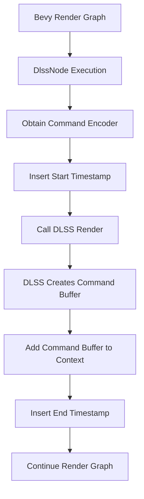

+++
title = "#22668 Fix timestamp queries for DLSS"
date = "2026-01-24T00:00:00"
draft = false
template = "pull_request_page.html"
in_search_index = true

[taxonomies]
list_display = ["show"]

[extra]
current_language = "en"
available_languages = {"en" = { name = "English", url = "/pull_request/bevy/2026-01/pr-22668-en-20260124" }, "zh-cn" = { name = "中文", url = "/pull_request/bevy/2026-01/pr-22668-zh-cn-20260124" }}
labels = ["C-Bug", "A-Rendering"]
+++

# Title
## Fix timestamp queries for DLSS

## Basic Information
- **Title**: Fix timestamp queries for DLSS
- **PR Link**: https://github.com/bevyengine/bevy/pull/22668
- **Author**: JMS55
- **Status**: MERGED
- **Labels**: C-Bug, A-Rendering, S-Ready-For-Final-Review
- **Created**: 2026-01-23T16:55:58Z
- **Merged**: 2026-01-24T19:47:40Z
- **Merged By**: alice-i-cecile

## Description Translation
Timestamp queries have never worked for DLSS because I setup them up wrong when I initially wrote the code. This fixes it (and adds DLSS-RR time to the Solari example).

Basically we need to put the timestamp start on the command buffer before DLSS, and then the timestamp end on the command buffer right after DLSS.

Debug groups had to be removed because I can't use them across different command encoders.

## The Story of This Pull Request

This PR addresses a long-standing issue in Bevy's DLSS (Deep Learning Super Sampling) integration where timestamp queries for performance profiling were not functioning correctly. The root cause was incorrect placement of timestamp markers in the command buffer sequence, combined with debug group usage that interfered with multi-encoder workflows.

The problem emerged from how DLSS operations work within Bevy's render graph architecture. When DLSS runs, it creates its own command buffer separate from Bevy's main command encoder. The original implementation placed timestamp start/end markers on Bevy's command encoder, but these markers needed to be on the actual command buffer where DLSS executes. This meant performance measurements for DLSS operations were always invalid.

The solution involved two key changes. First, the code needed to ensure timestamp markers were placed correctly relative to the DLSS command buffer creation. Second, debug groups had to be removed because they cannot span multiple command encoders - an architectural constraint that wasn't initially accounted for.

Looking at the implementation, the fix is straightforward but reveals important insights about GPU command buffer management. In the `DlssNode` implementation, the original code structure was:

```rust
// Before - incorrect placement
let time_span = diagnostics.time_span(command_encoder, "dlss_super_resolution");
let dlss_command_buffer = dlss_context.render(...);
time_span.end(command_encoder);
```

The issue here is that `time_span.end(command_encoder)` places the end timestamp on Bevy's command encoder, not on the DLSS command buffer. The corrected version ensures both timestamps are on the appropriate command buffer:

```rust
// After - correct placement
let time_span = diagnostics.time_span(command_encoder, "dlss_super_resolution");
let dlss_command_buffer = dlss_context.render(...);
render_context.add_command_buffer(dlss_command_buffer);
time_span.end(render_context.command_encoder());
```

The key insight is that `dlss_context.render()` internally uses the provided command encoder to create a new command buffer. The start timestamp needs to be on that same encoder before DLSS begins, and the end timestamp must be on it after DLSS completes. This ensures both timestamps are in the same command buffer sequence.

The removal of debug groups (`push_debug_group`/`pop_debug_group`) was necessary because debug groups in graphics APIs like Vulkan and DirectX 12 cannot span multiple command encoders. Since DLSS creates its own command buffer (and thus its own encoder), attempting to use debug groups across this boundary would cause validation errors or undefined behavior.

The documentation in `diagnostic/mod.rs` was also updated to clarify that the encoder passed to `time_span.end()` doesn't strictly need to be the same instance, but should be the same logical encoder (or pass) to ensure timestamps are properly paired. This is important for future developers working with multi-encoder rendering patterns.

The impact of this fix is significant for performance profiling in Bevy applications using DLSS. Developers can now accurately measure GPU time spent in DLSS super resolution and ray reconstruction passes, enabling proper performance optimization and bottleneck identification. The Solari example was updated to display these measurements, replacing the previous "TODO" placeholder.

This fix demonstrates several important concepts in modern graphics programming: proper command buffer synchronization, the limitations of debug groups across encoder boundaries, and the importance of understanding how third-party libraries (like NVIDIA's DLSS SDK) integrate with custom rendering pipelines.

## Visual Representation



## Key Files Changed

1. **File:** `crates/bevy_anti_alias/src/dlss/node.rs`

   **Changes:** Fixed timestamp query placement for both DLSS super resolution and ray reconstruction features. Removed debug groups that couldn't span command encoders.

   **Code Snippet (Super Resolution):**
   ```rust
   // Before:
   command_encoder.push_debug_group("dlss_super_resolution");
   let time_span = diagnostics.time_span(command_encoder, "dlss_super_resolution");
   let mut dlss_context = dlss_context.context.lock().unwrap();
   let dlss_command_buffer = dlss_context.render(render_parameters, command_encoder, &adapter);
   time_span.end(command_encoder);
   command_encoder.pop_debug_group();
   render_context.add_command_buffer(dlss_command_buffer);
   
   // After:
   let time_span = diagnostics.time_span(command_encoder, "dlss_super_resolution");
   let mut dlss_context = dlss_context.context.lock().unwrap();
   let dlss_command_buffer = dlss_context.render(render_parameters, command_encoder, &adapter);
   render_context.add_command_buffer(dlss_command_buffer);
   time_span.end(render_context.command_encoder());
   ```

   **Relation to PR:** This is the core fix ensuring timestamp queries work correctly with DLSS command buffers.

2. **File:** `crates/bevy_render/src/diagnostic/mod.rs`

   **Changes:** Updated documentation to clarify encoder requirements for timestamp queries.

   **Code Snippet:**
   ```rust
   // Before:
   /// End the span. You have to provide the same encoder which was used to begin the span.
   
   // After:
   /// End the span.
   ```
   
   **Relation to PR:** Clarifies that while the encoder should be logically the same (same command buffer sequence), it doesn't need to be the exact same instance.

3. **File:** `examples/3d/solari.rs`

   **Changes:** Added DLSS ray reconstruction timing to the performance display.

   **Code Snippet:**
   ```rust
   // Before:
   text.push_str(&format!("{:17}     TODO\n", "DLSS-RR"));
   
   // After:
   (add_diagnostic)("DLSS-RR", "render/dlss_ray_reconstruction/elapsed_gpu");
   ```
   
   **Relation to PR:** Demonstrates the fix working by showing actual DLSS timing data instead of placeholder text.

## Further Reading
- [Vulkan Command Buffers and Synchronization](https://vulkan-tutorial.com/Drawing_a_triangle/Drawing/Command_buffers)
- [DirectX 12 Command Lists and Bundles](https://docs.microsoft.com/en-us/windows/win32/direct3d12/recording-command-lists-and-bundles)
- [Bevy Render Graph Documentation](https://github.com/bevyengine/bevy/blob/main/docs/plugins_guidelines.md#render-graph)
- [NVIDIA DLSS SDK Documentation](https://github.com/NVIDIA/DLSS)