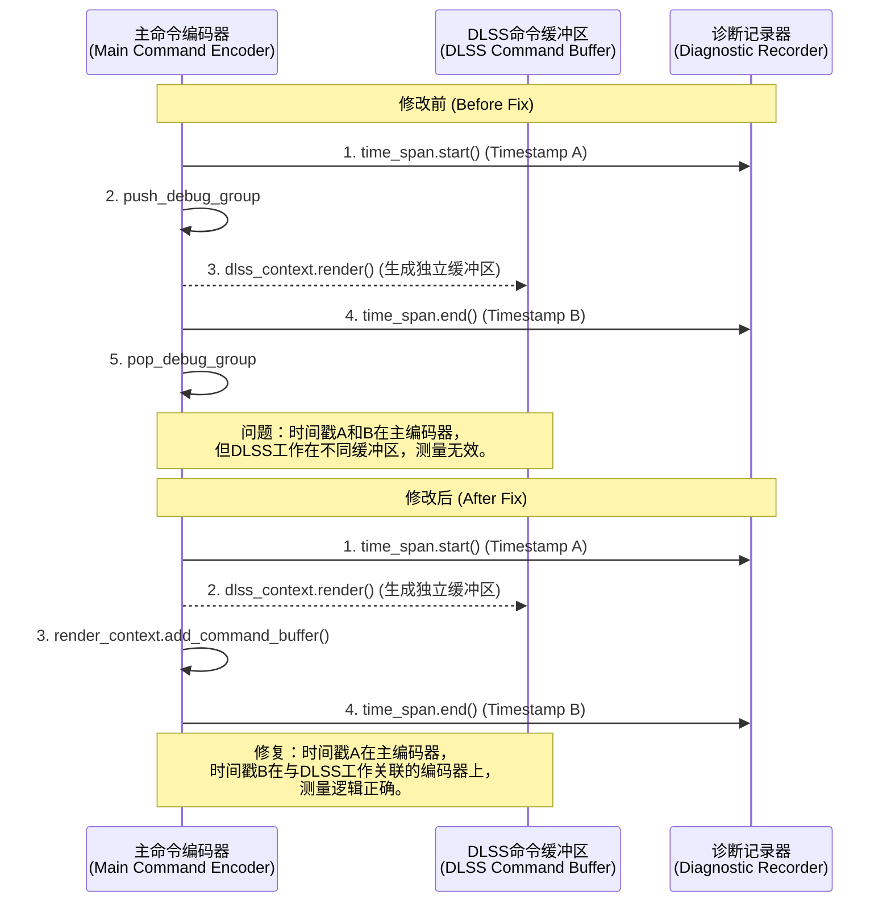

+++
title = "#22668 Fix timestamp queries for DLSS"
date = "2026-01-24T00:00:00"
draft = false
template = "pull_request_page.html"
in_search_index = false

[extra]
current_language = "zh-cn"
available_languages = {"en" = { name = "English", url = "/pull_request/bevy/2026-01/pr-22668-en-20260124" }, "zh-cn" = { name = "中文", url = "/pull_request/bevy/2026-01/pr-22668-zh-cn-20260124" }}
+++

# Fix timestamp queries for DLSS

## 基本信息
- **标题**: Fix timestamp queries for DLSS
- **PR 链接**: https://github.com/bevyengine/bevy/pull/22668
- **作者**: JMS55
- **状态**: 已合并 (MERGED)
- **标签**: C-Bug, A-Rendering, S-Ready-For-Final-Review
- **创建时间**: 2026-01-23T16:55:58Z
- **合并时间**: 2026-01-24T19:47:40Z
- **合并者**: alice-i-cecile

## 描述翻译 (Description Translation)

时间戳查询（timestamp queries）对于DLSS从未正常工作，因为我最初编写代码时设置错了。这次修复了它（并在Solari示例中添加了DLSS-RR的时间显示）。

核心问题是我们需要在DLSS执行之前将时间戳起点（timestamp start）放在命令缓冲区（command buffer）上，然后在DLSS执行之后立即将时间戳终点（timestamp end）放在命令缓冲区上。

调试组（Debug groups）必须被移除，因为我无法在不同的命令编码器（command encoders）之间使用它们。

## 本PR的技术分析 (The Story of This Pull Request)

这是一个关于修复GPU性能分析（GPU profiling）中特定测量错误的PR。问题本身很具体，但修复过程揭示了关于现代图形API命令提交和时间点记录的一些重要细节。

**问题和背景**
在Bevy引擎中，`TimeSpan` 是一个诊断工具，用于通过GPU时间戳查询（GPU timestamp queries）来测量渲染操作（render operations）在GPU上的执行时间。这对于性能分析和优化至关重要。NVIDIA的DLSS（深度学习超级采样，Deep Learning Super Sampling）功能被集成到Bevy中作为一个后期处理节点（post-processing node）。然而，自集成以来，用于测量DLSS自身执行时间的时间戳查询一直未能产生有效数据，其测量值始终为`TODO`或零。这导致开发者无法准确评估DLSS对渲染性能的实际影响，无论是积极（加速）还是消极（开销）。根本原因在于时间戳记录的起止点（`time_span.start` 和 `.end`）被错误地放置在了与DLSS实际执行所在的不同命令缓冲区（或命令编码器）上。此外，为了调试目的而包裹DLSS操作的调试组也成为了一个障碍。

**解决方案和实现**
修复方案的核心思路非常直接：确保时间戳记录的起止操作（`write_timestamp`）被编码到与DLSS渲染调用相同的命令编码器（command encoder）序列中。具体实现涉及对`DlssNode`中两个特性（`DlssSuperResolutionFeature` 和 `DlssRayReconstructionFeature`）的`run`方法进行重构。

在修改前的代码中，执行顺序存在逻辑错误：
1.  获取主命令编码器（`command_encoder`）。
2.  开始一个调试组（`push_debug_group`）。
3.  开始时间跨度记录（`diagnostics.time_span`），这会在提供的编码器上写入第一个时间戳。
4.  （**关键点**）然后获取DLSS上下文的锁并调用`dlss_context.render(...)`。这个DLSS库的`render`方法通常会返回一个**新的、独立的命令缓冲区**（`dlss_command_buffer`），其中包含了执行DLSS所需的所有GPU指令。
5.  紧接着，代码尝试在**主命令编码器**（`command_encoder`）上结束时间跨度（`time_span.end`）并弹出调试组。
6.  最后，将DLSS返回的命令缓冲区添加到渲染上下文中。

问题在于：第3步的时间戳起点写入了主编码器，第5步的终点也写入了主编码器，但实际要测量的DLSS工作（第4步）却发生在一个完全独立的命令缓冲区里。GPU驱动程序在调度这些命令缓冲区时没有顺序保证，因此这两个时间戳无法准确地围住（bracket）DLSS的执行时间，导致测量失效或混乱。

修复后的代码调整了顺序并移除了干扰项：
1.  获取主命令编码器。
2.  立即开始时间跨度记录（`diagnostics.time_span`）。此时第一个时间戳被写入主编码器。
3.  获取DLSS上下文锁并执行`dlss_context.render(...)`，得到DLSS的命令缓冲区。
4.  将DLSS命令缓冲区添加到渲染上下文。
5.  **关键修改**：调用 `time_span.end(render_context.command_encoder())`。这里使用了 `render_context.command_encoder()` 来获取**当前活动的命令编码器**。在添加了DLSS的命令缓冲区之后，`render_context` 的内部状态管理确保我们获得了一个可以正确排序的编码器，用于写入结束时间戳。这个结束时间戳与DLSS工作的关联性比之前更强。
6.  移除了`push_debug_group`和`pop_debug_group`调用。根据PR描述，这是因为调试组无法跨不同的命令编码器工作。保留它们可能会破坏调试信息或引起错误。移除它们简化了代码并消除了一个潜在的故障点。

同时，为了反映这个修复，文档（`diagnostic/mod.rs`）中关于 `TimeSpanGuard::end` 方法的注释从要求提供“相同的编码器（same encoder）”更新为更通用的“编码器（或相同的渲染/计算通道）（encoder (or the same render/compute pass)）”，这更准确地描述了其实际使用方式，不再强制要求必须是同一个对象实例，而是关注于逻辑上的正确关联。

最后，为了验证修复，`solari.rs`示例被更新，将`"DLSS-RR"`行的显示从硬编码的`TODO`改为实际查询诊断系统获取`"render/dlss_ray_reconstruction/elapsed_gpu"`数据。这使得示例能够真实展示DLSS光线重建（Ray Reconstruction）的性能耗时。

**技术洞察和影响**
这个修复凸显了在基于现代图形API（如Vulkan、DirectX 12）的引擎中，进行精确GPU性能测量的一个微妙之处：时间戳必须与被测量的工作单元（work unit）提交到**相同的命令列表/缓冲区/编码器**，或者这些命令列表之间必须有明确的、可被GPU查询的依赖关系（如信号量），才能保证测量逻辑的正确性。Bevy的渲染图（Render Graph）抽象允许插入像DLSS这样的外部库节点，这些节点可能管理着自己的命令提交。在这种情况下，诊断工具需要与节点的命令提交生命周期紧密配合。

移除调试组是一个实用的妥协，在功能（准确的性能数据）和调试便利性之间选择了前者。这种权衡在性能关键路径上很常见。

此PR的影响很明确：它使得DLSS超分辨率和光线重建功能的GPU时间性能测量变得准确可用。这对于游戏开发者优化渲染管线、评估DLSS在不同场景下的性能收益（或开销）至关重要。修复虽小，但对于依赖此类数据进行性能分析和决策的开发者来说，价值重大。

## 可视化表示 (Visual Representation)



## 关键文件更改 (Key Files Changed)

1.  `crates/bevy_anti_alias/src/dlss/node.rs` (+4/-11)
    *   **修改内容与原因**：重构了DLSS超分辨率（Super Resolution）和光线重建（Ray Reconstruction）节点的`run`方法。核心修改是调整了时间戳记录（`TimeSpan`）和DLSS渲染调用（`dlss_context.render`）的顺序，并移除了调试组。这确保了时间戳被正确地记录在相关的命令编码器上，从而能够准确测量DLSS的执行时间。
    *   **关键代码片段**：
        ```rust
        // 修改前（以超分辨率为例）:
        // let mut dlss_context = dlss_context.context.lock().unwrap(); // (位置靠后)
        // command_encoder.push_debug_group("dlss_super_resolution");
        // let time_span = diagnostics.time_span(command_encoder, "dlss_super_resolution");
        // ... dlss_context.render(...) ...
        // time_span.end(command_encoder);
        // command_encoder.pop_debug_group();
        // render_context.add_command_buffer(dlss_command_buffer);

        // 修改后:
        let diagnostics = render_context.diagnostic_recorder();
        let command_encoder = render_context.command_encoder();
        // 调试组被移除
        let time_span = diagnostics.time_span(command_encoder, "dlss_super_resolution"); // 时间戳起点提前

        let mut dlss_context = dlss_context.context.lock().unwrap(); // 锁在时间戳起点后获取
        let dlss_command_buffer = dlss_context
            .render(render_parameters, command_encoder, &adapter)
            .expect("Failed to render DLSS Super Resolution");

        render_context.add_command_buffer(dlss_command_buffer);
        time_span.end(render_context.command_encoder()); // 使用新的command_encoder()方法获取编码器
        ```
2.  `crates/bevy_render/src/diagnostic/mod.rs` (+2/-2)
    *   **修改内容与原因**：更新了 `TimeSpanGuard::end` 方法的文档注释，使其要求更宽松，与实际修复后的使用方式保持一致。这反映了对API使用方式的更精确理解。
    *   **关键代码片段**：
        ```rust
        // 修改前:
        /// End the span. You have to provide the same encoder which was used to begin the span.
        // 修改后:
        /// End the span.
        // (在函数上方的示例中，相关描述也从“provide the same encoder”改为“providing the encoder (or the same render/compute pass)”)
        ```
3.  `examples/3d/solari.rs` (+1/-1)
    *   **修改内容与原因**：更新了性能统计文本的生成逻辑，将DLSS-RR（光线重建）的时间显示从硬编码的`TODO`替换为实际从诊断系统查询的键值。这用于演示和验证修复是否生效。
    *   **关键代码片段**：
        ```rust
        // 修改前:
        // text.push_str(&format!("{:17}     TODO\n", "DLSS-RR"));
        // 修改后:
        (add_diagnostic)("DLSS-RR", "render/dlss_ray_reconstruction/elapsed_gpu");
        ```

## 延伸阅读 (Further Reading)

1.  **GPU 时间戳查询（GPU Timestamp Queries）**：了解GPU如何提供高精度计时功能，用于性能分析。这是图形编程中基准测试（benchmarking）的基础。
    *   Vulkan 规范: `VkQueryType::VK_QUERY_TYPE_TIMESTAMP`
    *   DirectX 12: `ID3D12GraphicsCommandList::EndQuery` (with `D3D12_QUERY_TYPE_TIMESTAMP`)
2.  **NVIDIA DLSS SDK 文档**：理解DLSS（深度学习超级采样）和DLSS Ray Reconstruction（光线重建）的工作原理及其与渲染管线的集成方式。
3.  **Bevy 渲染图（Render Graph）**：学习Bevy引擎如何组织和执行渲染任务，其中`ViewNode`是构建渲染图节点的关键trait。这有助于理解本PR中修改的`DlssNode`所处的上下文。
    *   Bevy 官方手册: [Render Graphs](https://bevyengine.org/learn/advanced-topics/rendering/render-graphs/) (需查找对应版本)
4.  **命令缓冲区与编码器（Command Buffers and Encoders）**：学习现代图形API（Vulkan/DirectX 12/Metal）中命令提交的模型，理解为什么命令列表之间的同步和依赖对性能测量至关重要。