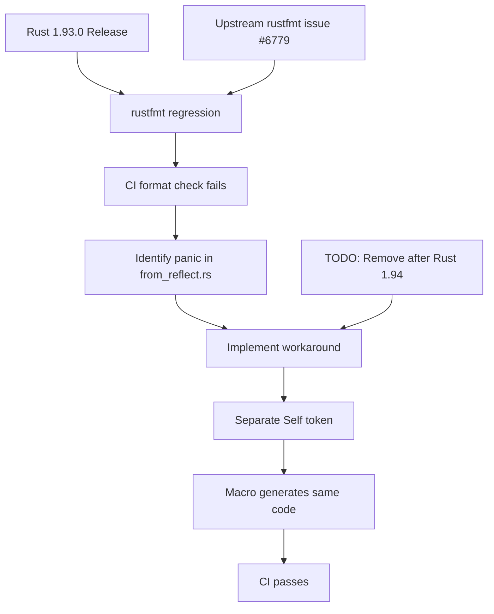

+++
title = "#22669 Workaround rustfmt panic on `quote!(Self(#var))` in Rust 1.93.0"
date = "2026-01-26T00:00:00"
draft = false
template = "pull_request_page.html"
in_search_index = true

[taxonomies]
list_display = ["show"]

[extra]
current_language = "en"
available_languages = {"en" = { name = "English", url = "/pull_request/bevy/2026-01/pr-22669-en-20260126" }, "zh-cn" = { name = "中文", url = "/pull_request/bevy/2026-01/pr-22669-zh-cn-20260126" }}
labels = ["C-Bug", "D-Trivial", "A-Reflection"]
+++

# Title

## Basic Information
- **Title**: Workaround rustfmt panic on `quote!(Self(#var))` in Rust 1.93.0
- **PR Link**: https://github.com/bevyengine/bevy/pull/22669
- **Author**: natepiano
- **Status**: MERGED
- **Labels**: C-Bug, D-Trivial, S-Ready-For-Final-Review, A-Reflection
- **Created**: 2026-01-23T16:59:46Z
- **Merged**: 2026-01-26T00:48:28Z
- **Merged By**: alice-i-cecile

## Description Translation

**Objective**

Fix CI failure caused by a rustfmt regression in Rust 1.93.0.

The `cargo fmt --all -- --check` CI step panics when formatting `crates/bevy_reflect/derive/src/from_reflect.rs` due to the pattern `quote!(Self(#__this))`.

Upstream issue: https://github.com/rust-lang/rustfmt/issues/6779

Fixes #22704.

**Solution**

Pre-construct `Self` as a separate token stream before using it in the `quote!` macro:

```rust
let self_ty = quote!(Self);
quote!(#self_ty(#__this))  // instead of quote!(Self(#__this))
```

This produces identical output but avoids the rustfmt parser bug.

**Testing**

- `cargo fmt --all` no longer panics
- `cargo build -p bevy_reflect_derive` succeeds
- `cargo nextest run -p bevy_reflect` passes all 212 tests

## The Story of This Pull Request

The Bevy project's continuous integration (CI) system encountered a failure when Rust 1.93.0 was released. The specific failure occurred during the `cargo fmt --all -- --check` step, which verifies that all code conforms to the project's formatting standards. This step was panicking while processing the file `crates/bevy_reflect/derive/src/from_reflect.rs`. The root cause was identified as a regression in rustfmt, the Rust formatting tool, which had an issue parsing the specific pattern `quote!(Self(#__this))` in macro expansions.

The upstream rustfmt issue (#6779) documented this bug, which triggered a panic when encountering the `Self` keyword in certain contexts within `quote!` macros. This was a blocker for the Bevy project's CI because it prevented successful formatting checks, which are essential for maintaining code consistency and catching formatting issues early.

The developer addressed this by implementing a straightforward workaround. Instead of using `quote!(Self(#__this))` directly, they pre-constructed the `Self` token as a separate variable:

```rust
let self_ty = quote!(Self);
quote!(#self_ty(#__this))
```

This approach yields identical token streams and generated code, but avoids the rustfmt parser bug. The workaround is explicitly marked with a TODO comment indicating it can be removed after Rust 1.94, when the rustfmt issue is expected to be fixed. This demonstrates good practice in temporary workarounds by including clear documentation about when they can be safely removed.

The fix was minimal and surgical, changing only the problematic pattern in two locations within the same function. The changes maintained backward compatibility and didn't affect the generated code's functionality—only how it was constructed at the macro expansion level. This is important because the `from_reflect` derive macro generates code for reflection capabilities in Bevy's ECS (Entity Component System).

The testing approach was pragmatic: verifying that formatting no longer panics, that the macro still compiles correctly (`cargo build -p bevy_reflect_derive`), and that all existing reflection tests pass. This ensures the workaround doesn't introduce regressions in functionality while solving the immediate CI problem.

This PR illustrates a common scenario in large Rust projects: dealing with toolchain regressions that affect build processes. The solution demonstrates understanding of Rust's macro system, specifically how `quote!` macros work and how token streams can be manipulated to work around tooling issues without changing the generated code's semantics.

## Visual Representation



## Key Files Changed

**File: `crates/bevy_reflect/derive/src/from_reflect.rs`** (+7/-2)

This file contains the derive macro implementation for the `FromReflect` trait, which enables constructing types from their reflected representations. The changes modify how the macro generates code for struct initialization.

**Key Changes:**
1. Added a workaround variable to avoid rustfmt panic
2. Updated two macro expansions to use the variable instead of direct `Self` token

**Code Changes:**

```rust
// Before (lines 146-170 approximately):
// The constructed "Self" ident
let __this = Ident::new("__this", Span::call_site());

// The reflected type: either `Self` or a remote type
let (reflect_ty, constructor, retval) = if let Some(remote_ty) = remote_ty {
    let constructor = match remote_ty.as_expr_path() {
        Some(path) => path,
        None => return Err(Error::new_spanned(remote_ty, "expected type path")),
    };
    
    (
        quote!(#remote_ty),
        quote!(#constructor),
        quote!(Self(#__this)),  // Problematic line
    )
} else {
    (quote!(Self), quote!(Self), quote!(#__this))  // Another problematic line
};
```

```rust
// After:
// The constructed "Self" ident
let __this = Ident::new("__this", Span::call_site());

// Workaround for rustfmt issue: https://github.com/rust-lang/rustfmt/issues/6779
// `quote!(Self(#__this))` causes rustfmt to panic in Rust 1.93.0+
// TODO: not needed after Rust 1.94
let self_ty = quote!(Self);

// The reflected type: either `Self` or a remote type
let (reflect_ty, constructor, retval) = if let Some(remote_ty) = remote_ty {
    let constructor = match remote_ty.as_expr_path() {
        Some(path) => path,
        None => return Err(Error::new_spanned(remote_ty, "expected type path")),
    };
    
    (
        quote!(#remote_ty),
        quote!(#constructor),
        quote!(#self_ty(#__this)),  // Fixed: use variable instead of direct Self
    )
} else {
    (quote!(#self_ty), quote!(#self_ty), quote!(#__this))  // Fixed: use variable
};
```

The changes are minimal and focused:
1. Line 149-152: Added `self_ty` variable holding `quote!(Self)`
2. Line 165: Changed `quote!(Self(#__this))` to `quote!(#self_ty(#__this))`
3. Line 168: Changed `quote!(Self)` to `quote!(#self_ty)`

These modifications ensure the macro generates identical token streams while avoiding the rustfmt parser bug.

## Further Reading

1. **Rust `quote!` Macro**: The [quote crate documentation](https://docs.rs/quote/latest/quote/) provides details on procedural macro quoting in Rust
2. **rustfmt Issues**: The [rustfmt issue tracker](https://github.com/rust-lang/rustfmt/issues) for tracking formatting tool bugs and regressions
3. **Bevy Reflection System**: [Bevy's reflection documentation](https://github.com/bevyengine/bevy/tree/main/crates/bevy_reflect) explains how reflection works in the ECS
4. **Procedural Macros**: The [Rust Book chapter on macros](https://doc.rust-lang.org/book/ch19-06-macros.html) covers both declarative and procedural macros
5. **CI/CD with Rust**: [GitHub Actions for Rust](https://github.com/actions-rs) provides tools and examples for Rust CI workflows