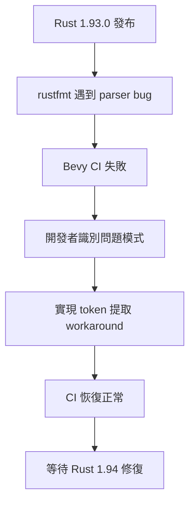

+++
title = "#22669"
date = "2026-01-26T00:00:00"
draft = false
template = "pull_request_page.html"
in_search_index = false

[extra]
current_language = "zh-cn"
available_languages = {"en" = { name = "English", url = "/pull_request/bevy/2026-01/pr-22669-en-20260126" }, "zh-cn" = { name = "中文", url = "/pull_request/bevy/2026-01/pr-22669-zh-cn-20260126" }}
+++

# Title

## 基本資訊
- **標題**: Workaround rustfmt panic on `quote!(Self(#var))` in Rust 1.93.0
- **PR 連結**: https://github.com/bevyengine/bevy/pull/22669
- **作者**: natepiano
- **狀態**: MERGED
- **標籤**: C-Bug, D-Trivial, S-Ready-For-Final-Review, A-Reflection
- **建立時間**: 2026-01-23T16:59:46Z
- **合併時間**: 2026-01-26T00:48:28Z
- **合併者**: alice-i-cecile

## 描述翻譯

### 目標

修復由 Rust 1.93.0 中的 rustfmt regression 造成的 CI 失敗。

`cargo fmt --all -- --check` CI 步驟在格式化 `crates/bevy_reflect/derive/src/from_reflect.rs` 時 panic，原因是模式 `quote!(Self(#__this))`。

上游問題：https://github.com/rust-lang/rustfmt/issues/6779

修復 #22704。

### 解決方案

在 `quote!` 巨集使用前，預先將 `Self` 建構為獨立的 token stream：

```rust
let self_ty = quote!(Self);
quote!(#self_ty(#__this))  // 代替 quote!(Self(#__this))
```

這樣產生完全相同的輸出，但避免了 rustfmt 的 parser bug。

### 測試

- `cargo fmt --all` 不再 panic
- `cargo build -p bevy_reflect_derive` 成功
- `cargo nextest run -p bevy_reflect` 通過所有 212 個測試

## 此 Pull Request 的故事

這個 PR 是典型的工具鏈相容性問題處理案例。問題發生在 Bevy 引擎的 CI pipeline 中，當 Rust 工具鏈升級到 1.93.0 版本後，rustfmt 在格式化特定程式碼模式時會發生 panic，導致 CI 失敗。

問題的核心在於 `crates/bevy_reflect/derive/src/from_reflect.rs` 檔案中的一行程式碼：`quote!(Self(#__this))`。這是在 `proc_macro2` 和 `quote` crate 中常用的語法，用於生成 Rust 程式碼。在 Rust 1.93.0 中，rustfmt 在處理這種特定的 token 模式時出現 parser bug。

從工程角度看，這種問題很棘手，因為：
1. 問題在第三方工具（rustfmt）而非專案程式碼本身
2. 需要維持現有程式碼的行為不變
3. 需要最小化修改以降低維護成本

解決方案採取了簡單但有效的技巧：將 `Self` 提取為變數。具體來說，開發者添加了一行程式碼：

```rust
let self_ty = quote!(Self);
```

然後在原本使用 `quote!(Self(#__this))` 的地方，改為使用 `quote!(#self_ty(#__this))`。這個修改的原理是：
- `quote!(Self(#__this))` 會生成包含 `Self` 關鍵字後接括號的 token stream
- 將 `Self` 提取為變數後，rustfmt 看到的是 `quote!(#self_ty(#__this))`，其中 `#self_ty` 在巨集展開時會替換為 `Self`
- 從結果來看，生成的程式碼完全相同，但 rustfmt 的 parser 看到的是不同的 token 結構

這種方法的優點是：
1. **保持向後相容**：生成的程式碼與之前完全相同
2. **最小化修改**：僅更改了 token 的表示方式，不影響邏輯
3. **明確的時效性**：註解標明這是 workaround，可在 Rust 1.94 後移除

值得注意的是，這個修改影響了兩個不同的使用場景：
1. 當存在 `remote_ty` 時：`quote!(#self_ty(#__this))` 替換 `quote!(Self(#__this))`
2. 當不存在 `remote_ty` 時：`quote!(#self_ty)` 替換 `quote!(Self)`

從技術角度來看，這展示了處理編譯器/工具鏈 bug 的有效模式：
1. 先確認問題來自工具鏈而非自身程式碼
2. 尋找最小化的 workaround，避免大規模重構
3. 添加明確的註解說明原因和預期的移除時間
4. 確保 workaround 不改變程式語意

這個案例也凸顯了依賴管理的重要性。在複雜的 Rust 生態中，工具鏈的穩定性直接影響專案的 CI/CD 流程。當遇到這類問題時，及時的 workaround 能確保開發流程不中斷，同時等待上游修復。

## 視覺化表示



## 主要變更檔案

### `crates/bevy_reflect/derive/src/from_reflect.rs` (+7/-2)

這個檔案包含了 `FromReflect` derive 巨集的實作。變更集中在 `impl_struct_internal` 函式中，該函式負責為結構體生成 `FromReflect` 的實作。

#### 關鍵修改：

```rust
// 變更前：
// 函式內部直接使用 quote!(Self(#__this))

// 變更後：
// 新增：用於 rustfmt workaround 的變數
let self_ty = quote!(Self);

// 在原本使用 quote!(Self(#__this)) 的地方改為：
quote!(#self_ty(#__this))

// 在原本使用 quote!(Self) 的地方改為：
quote!(#self_ty)
```

#### 具體 diff：

```rust
@@ -146,6 +146,11 @@ fn impl_struct_internal(
     // The constructed "Self" ident
     let __this = Ident::new("__this", Span::call_site());
 
+    // Workaround for rustfmt issue: https://github.com/rust-lang/rustfmt/issues/6779
+    // `quote!(Self(#__this))` causes rustfmt to panic in Rust 1.93.0+
+    // TODO: not needed after Rust 1.94
+    let self_ty = quote!(Self);
+
     // The reflected type: either `Self` or a remote type
     let (reflect_ty, constructor, retval) = if let Some(remote_ty) = remote_ty {
         let constructor = match remote_ty.as_expr_path() {
@@ -157,10 +162,10 @@ fn impl_struct_internal(
         (
             quote!(#remote_ty),
             quote!(#constructor),
-            quote!(Self(#__this)),
+            quote!(#self_ty(#__this)),
         )
     } else {
-        (quote!(Self), quote!(Self), quote!(#__this))
+        (quote!(#self_ty), quote!(#self_ty), quote!(#__this))
     };
```

#### 變更關係：
這個修改直接對應 PR 的目標：解決 rustfmt 在處理 `quote!(Self(#__this))` 模式時的 panic。通過預先提取 `Self` 到變數中，繞過了 rustfmt 的 parser bug，同時保持生成的程式碼不變。

## 進一步閱讀

1. **Rust 巨集程式設計**：
   - [The Little Book of Rust Macros](https://veykril.github.io/tlborm/)
   - [`quote` crate 文件](https://docs.rs/quote/latest/quote/)

2. **Rust 工具鏈問題處理**：
   - [Rust Compiler Bug Reports](https://github.com/rust-lang/rust/issues)
   - [rustfmt Issues](https://github.com/rust-lang/rustfmt/issues)

3. **Bevy 反射系統**：
   - [Bevy Reflection Documentation](https://docs.rs/bevy_reflect/latest/bevy_reflect/)
   - [Procedural Macros in Bevy](https://bevyengine.org/learn/books/bevy-reflect/)