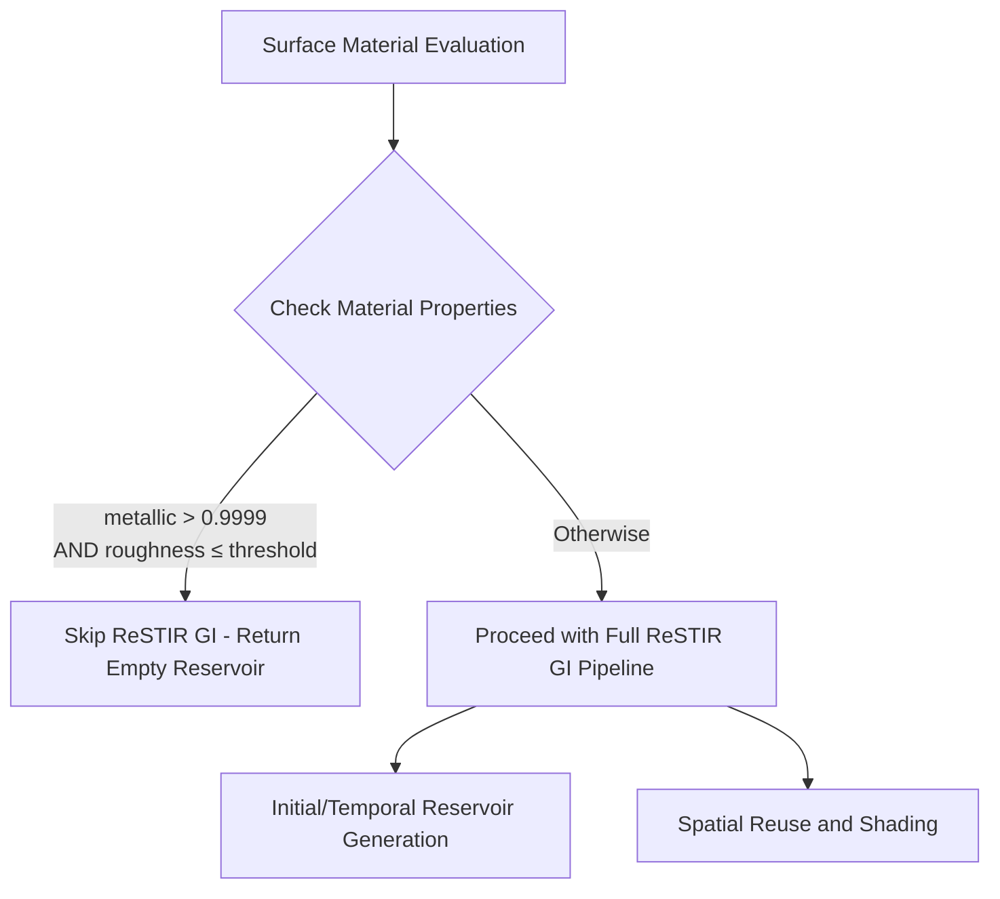

+++
title = "#22671 Solari: Skip ReSTIR GI for smooth metallic surfaces"
date = "2026-01-24T00:00:00"
draft = false
template = "pull_request_page.html"
in_search_index = true

[taxonomies]
list_display = ["show"]

[extra]
current_language = "en"
available_languages = {"en" = { name = "English", url = "/pull_request/bevy/2026-01/pr-22671-en-20260124" }, "zh-cn" = { name = "中文", url = "/pull_request/bevy/2026-01/pr-22671-zh-cn-20260124" }}
labels = ["D-Trivial", "A-Rendering", "C-Performance"]
+++

# Title

## Basic Information
- **Title**: Solari: Skip ReSTIR GI for smooth metallic surfaces
- **PR Link**: https://github.com/bevyengine/bevy/pull/22671
- **Author**: JMS55
- **Status**: MERGED
- **Labels**: D-Trivial, A-Rendering, C-Performance, S-Ready-For-Final-Review
- **Created**: 2026-01-23T18:08:52Z
- **Merged**: 2026-01-24T19:47:40Z
- **Merged By**: alice-i-cecile

## Description Translation

# Objective

- Save perf on scenes with smooth metallic surfaces

## Solution

- Skip ReSTIR GI for these surfaces as the contribution will be zero anyways

## Testing

- Tested on a half metallic half non-metallic scene with varying roughness

## The Story of This Pull Request

This PR addresses a specific performance optimization in Bevy's Solari rendering system, which implements ReSTIR GI (ReSTIR: ReSTIR Temporal Importance Resampling for Global Illumination). The core insight driving this change is straightforward: don't waste computational resources calculating lighting contributions that will effectively be zero.

The problem centers around physically-based rendering (PBR) materials and their interaction with global illumination. In PBR, materials have two primary components: a diffuse component (which scatters light in all directions) and a specular component (which reflects light like a mirror). The `metallic` parameter controls the balance between these components. When `metallic` is 1.0, the material is fully metallic, meaning it has no diffuse component at all - it only reflects specularly. The `roughness` parameter controls how sharp or blurry these specular reflections are.

For smooth metallic surfaces (high metallic value, low roughness), there's essentially no diffuse component to contribute to global illumination. ReSTIR GI primarily handles diffuse indirect lighting, so calculating it for these surfaces is computationally wasteful since the result will be negligible or zero. The existing code was performing the full ReSTIR GI pipeline for all surfaces regardless of their material properties.

The solution implements a simple early exit in the ReSTIR GI shader code. Before proceeding with expensive GI calculations, the shader now checks if the surface meets specific criteria: `metallic > 0.9999` (essentially fully metallic) and `roughness <= DIFFUSE_GI_REUSE_ROUGHNESS_THRESHOLD` (smooth enough that diffuse contribution is negligible). When both conditions are true, the shader immediately returns an empty reservoir (zero contribution) and skips the rest of the computation.

This approach is effective because it operates at the shader level, avoiding unnecessary work before it happens rather than trying to optimize calculations that are already in progress. The threshold values are carefully chosen: 0.9999 for metallic (not exactly 1.0 to handle floating-point precision issues) and reusing the existing `DIFFUSE_GI_REUSE_ROUGHNESS_THRESHOLD` constant for consistency with other parts of the rendering system.

The implementation required changes in two key shader functions: `initial_and_temporal` and `spatial_and_shade`. Both functions follow the same pattern - they resolve the surface material properties, check the metallic/roughness conditions, and early-exit if appropriate. This ensures the optimization applies throughout the ReSTIR GI pipeline, from initial sample generation through temporal and spatial reuse.

From an architectural perspective, this change fits well into the existing Solari system. It leverages already-available material data from the GBuffer and uses an existing constant for consistency. The optimization is localized to the ReSTIR GI shader without affecting other rendering passes or requiring changes to the material system.

The performance impact is straightforward: scenes with many smooth metallic surfaces will see reduced GPU load during GI calculations. Since the check happens early in the shader and avoids subsequent ray tracing and sampling operations, the savings can be significant for qualifying surfaces. The author tested this on a scene with half metallic and half non-metallic surfaces with varying roughness, confirming both correctness and performance improvement.

This optimization demonstrates a common pattern in real-time graphics: identifying calculations that can be skipped based on material properties. Similar optimizations exist in other rendering systems, like skipping specular calculations for fully diffuse materials or avoiding transparency calculations for opaque surfaces.

## Visual Representation



## Key Files Changed

**crates/bevy_solari/src/realtime/restir_gi.wgsl** (+9/-0)

This is the only file modified in this PR. It contains the WebGPU Shading Language (WGSL) code for the ReSTIR GI implementation in Solari, Bevy's global illumination system.

### Changes in Detail:

1. **Import Addition**: Added import for `DIFFUSE_GI_REUSE_ROUGHNESS_THRESHOLD` constant from the specular GI module:
```wgsl
#import bevy_solari::specular_gi::DIFFUSE_GI_REUSE_ROUGHNESS_THRESHOLD
```

2. **Early Exit in `initial_and_temporal` Function**: Added material check after surface resolution:
```wgsl
// Before: No check, always proceed
let surface = gpixel_resolve(...);

// After: Check material properties and early exit
let surface = gpixel_resolve(textureLoad(gbuffer, global_id.xy, 0), depth, global_id.xy, view.main_pass_viewport.zw, view.world_from_clip);
if surface.material.metallic > 0.9999 && surface.material.roughness <= DIFFUSE_GI_REUSE_ROUGHNESS_THRESHOLD {
    gi_reservoirs_b[pixel_index] = empty_reservoir();
    return;
}
```

3. **Early Exit in `spatial_and_shade` Function**: Added identical check in the second stage:
```wgsl
let surface = gpixel_resolve(textureLoad(gbuffer, global_id.xy, 0), depth, global_id.xy, view.main_pass_viewport.zw, view.world_from_clip);
if surface.material.metallic > 0.9999 && surface.material.roughness <= DIFFUSE_GI_REUSE_ROUGHNESS_THRESHOLD {
    gi_reservoirs_a[pixel_index] = empty_reservoir();
    return;
}
```

These changes implement the core optimization: when a surface is essentially fully metallic and smooth enough, the shader skips all ReSTIR GI calculations and returns an empty reservoir (no GI contribution). This saves computational resources that would otherwise be wasted on calculations with negligible results.

## Further Reading

1. **ReSTIR GI Paper**: "Spatiotemporal reservoir resampling for real-time ray tracing with dynamic direct lighting" by Bitterli et al. - The foundational paper for the ReSTIR algorithm
2. **Physically Based Rendering**: The PBR theory behind metallic/roughness workflow and why diffuse contribution approaches zero for smooth metallic surfaces
3. **Bevy Solari Documentation**: For understanding how Solari integrates with Bevy's rendering pipeline
4. **WebGPU Shading Language (WGSL) Specification**: For details on the shader language used in this implementation
5. **Global Illumination Techniques**: Overview of various GI methods and their performance characteristics in real-time rendering