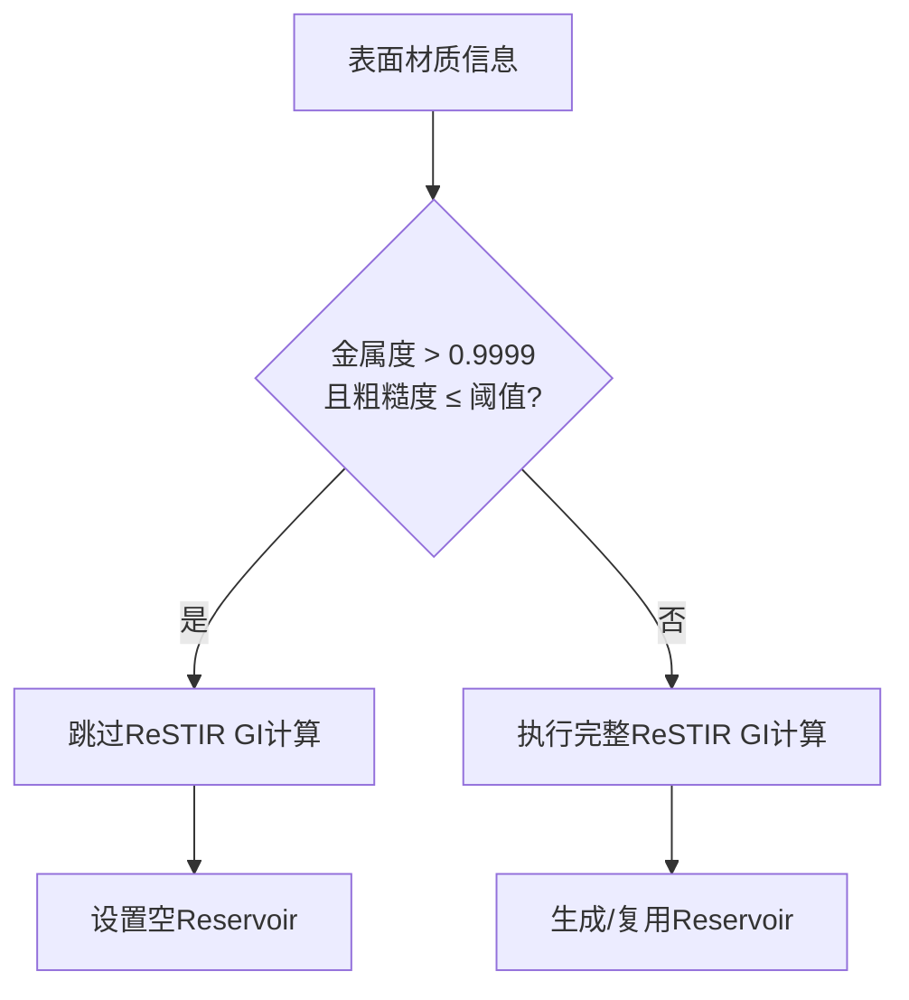

+++
title = "#22671 Solari: 跳过平滑金属表面的ReSTIR GI计算"
date = "2026-01-24T00:00:00"
draft = false
template = "pull_request_page.html"
in_search_index = false

[extra]
current_language = "zh-cn"
available_languages = {"en" = { name = "English", url = "/pull_request/bevy/2026-01/pr-22671-en-20260124" }, "zh-cn" = { name = "中文", url = "/pull_request/bevy/2026-01/pr-22671-zh-cn-20260124" }}
+++

# Title
Solari: Skip ReSTIR GI for smooth metallic surfaces

## Basic Information
- **标题**: Solari: 跳过平滑金属表面的ReSTIR GI计算
- **PR链接**: https://github.com/bevyengine/bevy/pull/22671
- **作者**: JMS55
- **状态**: 已合并
- **标签**: D-Trivial, A-Rendering, C-Performance, S-Ready-For-Final-Review
- **创建时间**: 2026-01-23T18:08:52Z
- **合并时间**: 2026-01-24T19:47:40Z
- **合并者**: alice-i-cecile

## 描述翻译

### 目标
- 在有平滑金属表面的场景中节省性能

### 解决方案
- 跳过这些表面的ReSTIR GI计算，因为它们的贡献值始终为零

### 测试
- 在一个一半金属一半非金属且粗糙度不同的场景上进行了测试

## PR的故事分析

这个PR针对的是Bevy渲染引擎中的Solari全局光照系统，具体来说是ReSTIR GI（ReSTIR全局光照）部分的性能优化。核心问题是某些材质的表面特性使得ReSTIR GI计算实际上没有贡献，但系统仍然执行了完整的计算流程，造成了不必要的性能开销。

从物理渲染的角度来看，完全金属材质（metallic ≈ 1.0）且表面光滑（roughness值很低）的表面主要表现镜面反射特性，对漫反射全局光照的贡献可以忽略不计。ReSTIR GI算法主要用于计算漫反射间接光照，对于这种几乎不产生漫反射的表面，计算结果趋近于零。然而，现有的实现仍然为这些表面执行完整的ReSTIR GI采样、权重计算和复用流程，这是不必要的计算浪费。

解决方案简单而直接：在ReSTIR GI计算管线的两个关键阶段添加早期退出条件。当检测到表面满足"高金属度（>0.9999）且低粗糙度（≤阈值）"时，直接跳过后续计算，并将对应的光采样缓存（reservoir）设置为空状态。这种优化属于典型的"提前退出"模式，在图形编程中很常见，特别是在需要逐像素计算的着色器中。

实现上，这个PR只修改了一个文件：`restir_gi.wgsl`，包含两个计算着色器函数`initial_and_temporal`和`spatial_and_shade`。这两个函数分别处理ReSTIR GI的初始/时间复用阶段和空间复用/着色阶段。每个函数中都添加了相同的材质检查逻辑：

```wgsl
if surface.material.metallic > 0.9999 && surface.material.roughness <= DIFFUSE_GI_REUSE_ROUGHNESS_THRESHOLD {
    // 设置为空reservoir并提前返回
}
```

这里使用了两个重要的阈值：
1. 金属度阈值0.9999：使用略小于1.0的值是为了避免浮点数精度问题，同时确保只有接近完全金属的表面才会被跳过
2. 粗糙度阈值`DIFFUSE_GI_REUSE_ROUGHNESS_THRESHOLD`：这是一个预定义的常量，从`specular_gi`模块导入，确保了阈值定义的一致性

从工程角度看，这个PR有几个值得注意的技术细节：
- **性能收益明显**：虽然代码改动很小，但ReSTIR GI是计算密集型操作，涉及多次光线追踪、采样和权重计算。跳过这些计算对于包含大量金属表面的场景（如科幻场景、机械场景）会有显著的性能提升
- **视觉无损**：优化没有改变渲染结果，因为这些表面原本就对漫反射GI贡献极小
- **阈值选择合理**：金属度使用0.9999而非1.0，避免了浮点数精度导致的误判
- **代码复用**：粗糙度阈值使用了已有的常量，保持了系统的一致性

这个PR展示了图形编程中一个常见的优化模式：根据材质的物理特性选择性地跳过某些计算。类似的技术也常用于阴影计算（如跳过透明表面的阴影）、后期处理（如跳过完全黑暗区域的抗锯齿）等场景。它提醒我们在编写着色器时，不仅要考虑算法的正确性，还要考虑材质的物理特性可能带来的优化机会。

## 可视化表示



## 关键文件变更

### `crates/bevy_solari/src/realtime/restir_gi.wgsl` (+9/-0)

这个文件包含了ReSTIR GI算法的WebGPU着色器实现。主要变更是在两个计算着色器函数中添加了提前退出逻辑，跳过对高金属度、低粗糙度表面的处理。

#### 关键修改：

```wgsl
// 在initial_and_temporal函数中添加：
if surface.material.metallic > 0.9999 && surface.material.roughness <= DIFFUSE_GI_REUSE_ROUGHNESS_THRESHOLD {
    gi_reservoirs_b[pixel_index] = empty_reservoir();
    return;
}

// 在spatial_and_shade函数中添加：
if surface.material.metallic > 0.9999 && surface.material.roughness <= DIFFUSE_GI_REUSE_ROUGHNESS_THRESHOLD {
    gi_reservoirs_a[pixel_index] = empty_reservoir();
    return;
}
```

这些修改确保了在初始/时间复用阶段和空间复用/着色阶段都跳过了对高金属度、低粗糙度表面的ReSTIR GI计算，直接将对应的光采样缓存设置为空状态并提前返回。

## 延伸阅读

1. **ReSTIR算法**：原始的ReSTIR（Reservoir-based Spatiotemporal Importance Resampling）论文提供了算法的基础理论，可以了解其采样和复用机制
2. **物理基础渲染（PBR）**：理解金属度和粗糙度在PBR材质中的作用，以及它们如何影响光照计算
3. **WebGPU着色器优化**：关于WebGPU着色器中提前退出、分支优化等技术的更多资料
4. **Bevy Solari系统文档**：了解Bevy中全局光照系统的整体架构，以及ReSTIR GI在其中的作用