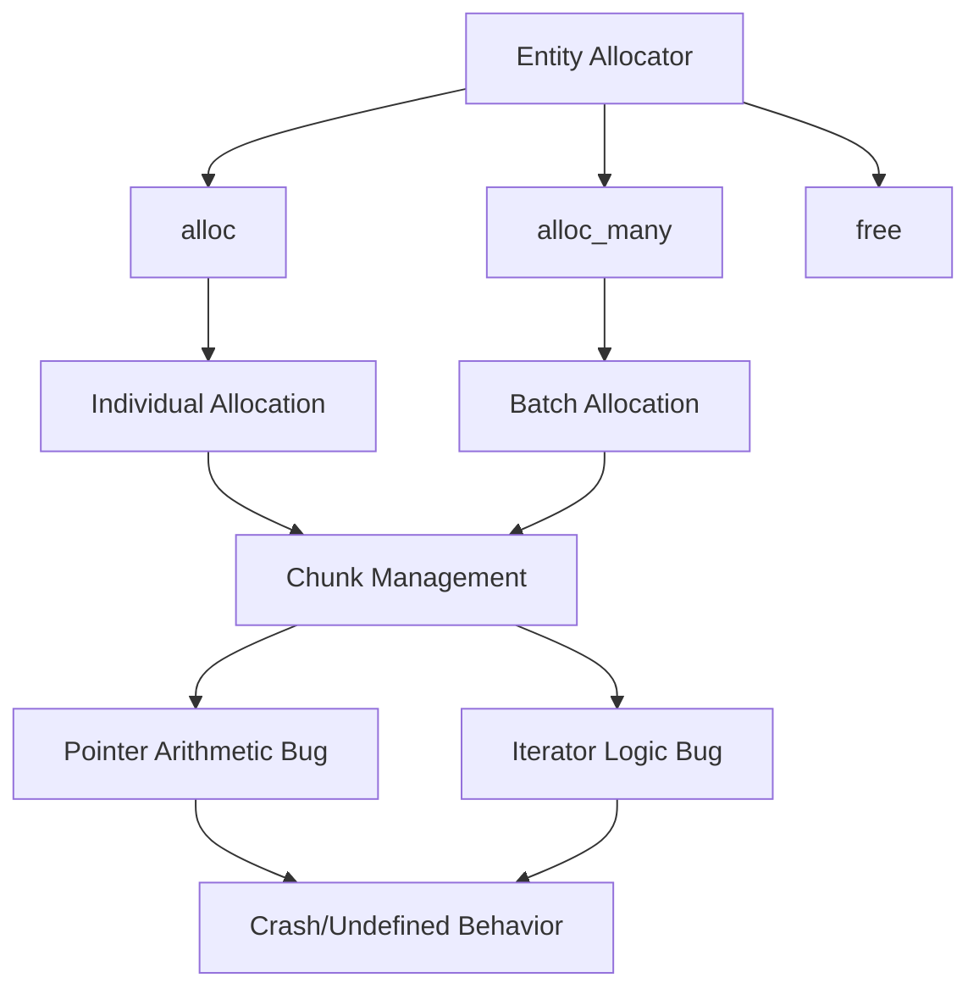

+++
title = "#22672 Fix spawn batch bug"
date = "2026-01-23T00:00:00"
draft = false
template = "pull_request_page.html"
in_search_index = true

[taxonomies]
list_display = ["show"]

[extra]
current_language = "en"
available_languages = {"en" = { name = "English", url = "/pull_request/bevy/2026-01/pr-22672-en-20260123" }, "zh-cn" = { name = "中文", url = "/pull_request/bevy/2026-01/pr-22672-zh-cn-20260123" }}
labels = ["C-Bug", "A-ECS", "P-Crash"]
+++

# Title
## Fix spawn batch bug

## Basic Information
- **Title**: Fix spawn batch bug
- **PR Link**: https://github.com/bevyengine/bevy/pull/22672
- **Author**: ElliottjPierce
- **Status**: MERGED
- **Labels**: C-Bug, A-ECS, P-Crash, S-Needs-Review
- **Created**: 2026-01-23T21:13:22Z
- **Merged**: 2026-01-23T23:04:37Z
- **Merged By**: mockersf

## Description Translation

# Objective

#18670 introduced a small but fatal issue with batch spawning. Previous tests did not catch this bug because they tested `alloc` and `alloc_many` separately.

## Solution

- Fix an off by one math mistake in `FreeBufferIterator::next`.
- Fix the part where you need to `ptr.add(index)` if you want the element at `index`. Whoops.
- Add a test to catch these issues next time

## Testing

- CI
- One new test
- This was originally found [here](https://discord.com/channels/691052431525675048/749335865876021248/1464359124950319114), and the reproduction crashes on main but is fine on this branch.

## The Story of This Pull Request

This PR addresses a critical bug in Bevy's ECS entity allocation system that was introduced in PR #18670. The bug specifically affected batch entity spawning (using `alloc_many`) and could lead to crashes or undefined behavior due to memory access issues.

The problem originated from two distinct but related issues in the entity allocation code. First, there was an off-by-one error in the `FreeBufferIterator::next` method that could cause incorrect iteration logic. Second, and more critically, the `Chunk::entity_slice` method was incorrectly computing pointer offsets when accessing entities within a chunk, completely ignoring the index parameter that was passed to it.

These bugs were particularly insidious because they only manifested when using `alloc_many` for batch entity allocation. The existing test suite had gaps - it tested individual allocation (`alloc`) and batch allocation (`alloc_many`) separately, but didn't have comprehensive tests that validated the interaction between these two allocation methods, especially when entities were freed and reallocated.

The fix involved two key changes. In `Chunk::entity_slice`, the method now correctly adds the index offset to the base pointer before creating a slice, ensuring that it returns entities starting from the specified index rather than always from the beginning of the chunk. In `FreeBufferIterator::next`, the logic was corrected to properly handle the case where there are no remaining indices to iterate through, preventing potential out-of-bounds access.

To prevent regression, a new test called `allocation_order_correctness` was added. This test deliberately creates a scenario where entities are allocated, freed, and then reallocated using a mix of individual and batch allocation methods. The test verifies that the reallocation order matches expectations, which would have caught this bug if it had been present during the original implementation.

The bug was discovered through community reporting on Discord, where a user encountered crashes when using batch spawning. This highlights the value of real-world testing and community feedback in identifying edge cases that might not be covered by existing unit tests.

From an engineering perspective, this PR demonstrates several important lessons. First, it shows how subtle pointer arithmetic errors can have significant consequences in systems programming. Second, it illustrates the importance of comprehensive testing that covers not just individual components but also their interactions. Third, it underscores the need for careful review when modifying low-level memory management code, especially in performance-critical systems like game engines.

The fixes are minimal but crucial - changing just a few lines of code resolves a potential crash scenario. The addition of the test case provides a safety net for future changes to the entity allocation system, ensuring that similar bugs won't slip through undetected.

## Visual Representation



## Key Files Changed

### `crates/bevy_ecs/src/entity/remote_allocator.rs` (+33/-2)

This file contains the core entity allocation logic for Bevy's ECS system. The changes fix critical bugs in the entity chunk management and iteration code.

**Key modifications:**

1. **Fixed pointer offset calculation in `Chunk::entity_slice`:**
```rust
// Before:
unsafe { core::slice::from_raw_parts(head, len) }

// After:
unsafe { core::slice::from_raw_parts(head.add(index as usize), len) }
```
This fix ensures that when accessing entities within a chunk, the method correctly offsets the pointer by the specified index. Previously, it was always returning a slice starting from the beginning of the chunk, regardless of the index parameter.

2. **Fixed iteration logic in `FreeBufferIterator::next`:**
```rust
// Key change in the method:
if still_need == 0 {
    return None;
}
let next_index = self.future_buffer_indices.start;
```
The iterator now correctly checks if there are remaining indices to process and returns `None` when exhausted. This prevents potential out-of-bounds access and ensures proper iteration termination.

3. **Added comprehensive test case:**
```rust
#[test]
fn allocation_order_correctness() {
    let mut allocator = Allocator::new();
    // Test sequence that would trigger the bug:
    // 1. Allocate 4 entities
    // 2. Free all of them
    // 3. Reallocate using mix of individual and batch allocation
    // 4. Verify reallocation order matches expectations
    
    // ... test implementation ...
}
```
This new test validates that entity allocation order remains correct even when mixing individual and batch allocation methods, which was the scenario that exposed the original bug.

## Further Reading

1. **Bevy ECS Documentation**: The official Bevy ECS documentation provides comprehensive information about entity allocation and management patterns.
2. **Rust Unsafe Code Guidelines**: Understanding Rust's unsafe code practices is crucial when working with low-level memory management like in this PR.
3. **Entity Component System Architecture**: General patterns and best practices for ECS implementations in game engines.
4. **Pointer Arithmetic in Systems Programming**: Resources on safe pointer manipulation techniques in systems programming languages.
5. **Test-Driven Development for Game Engines**: Approaches to designing comprehensive test suites for complex systems like game engines.