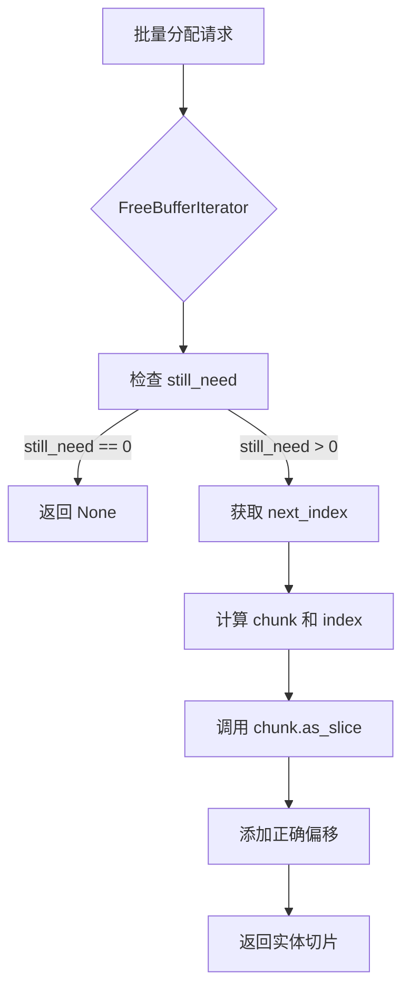

+++
title = "#22672 Fix spawn batch bug"
date = "2026-01-23T00:00:00"
draft = false
template = "pull_request_page.html"
in_search_index = false

[extra]
current_language = "zh-cn"
available_languages = {"en" = { name = "English", url = "/pull_request/bevy/2026-01/pr-22672-en-20260123" }, "zh-cn" = { name = "中文", url = "/pull_request/bevy/2026-01/pr-22672-zh-cn-20260123" }}
+++

# Fix spawn batch bug

## 基本信息
- **标题**: Fix spawn batch bug
- **PR链接**: https://github.com/bevyengine/bevy/pull/22672
- **作者**: ElliottjPierce
- **状态**: 已合并
- **标签**: C-Bug, A-ECS, P-Crash, S-Needs-Review
- **创建时间**: 2026-01-23T21:13:22Z
- **合并时间**: 2026-01-23T23:04:37Z
- **合并者**: mockersf

## 描述翻译

### 目标
#18670 引入了一个小而致命的批量生成（batch spawning）问题。之前的测试没有捕获这个bug，因为它们分别测试了`alloc`和`alloc_many`。

### 解决方案
- 修复了 `FreeBufferIterator::next` 中的一个off-by-one数学错误。
- 修复了需要使用 `ptr.add(index)` 来获取索引处元素的部分。糟糕。
- 添加一个测试以在下次捕获这些问题。

### 测试
- CI
- 一个新的测试
- 这个问题最初是在[这里](https://discord.com/channels/691052431525675048/749335865876021248/1464359124950319114)发现的，在main分支上复现会崩溃，但在这个分支上正常。

## 本PR的故事

这个PR修复了Bevy ECS中的一个内存安全问题，该问题可能导致程序崩溃。问题出现在远程分配器（remote allocator）的批量分配逻辑中，具体来说是两个独立的bug共同作用导致的。

### 问题的根源

问题源于PR #18670对远程分配器的修改。这个修改引入了两个关键bug：

1. **指针偏移错误**：在`Chunk::as_slice`方法中，代码错误地使用了原始指针而没有添加索引偏移。这意味着切片总是从chunk的头部开始，而不是从指定的索引位置开始。

2. **迭代器逻辑错误**：在`FreeBufferIterator::next`方法中，存在一个off-by-one错误。当`future_buffer_indices`范围为空时，代码应该直接返回`None`，但原实现却尝试从空范围中获取元素。

这两个bug的组合导致了严重问题。批量分配时，迭代器可能返回错误的切片，这些切片可能超出有效内存边界，进而导致未定义行为或崩溃。

### 修复方案的技术细节

修复分为三个部分，每个部分都针对一个具体的技术问题：

**第一部分：修复指针偏移**
```rust
// 修复前 - 错误：没有添加索引偏移
unsafe { core::slice::from_raw_parts(head, len) }

// 修复后 - 正确：从正确位置开始
unsafe { core::slice::from_raw_parts(head.add(index as usize), len) }
```
这个修复确保`as_slice`方法返回从正确索引开始的切片，而不是总是从chunk头部开始。这是内存安全的基本要求。

**第二部分：修复迭代器边界检查**
```rust
// 关键修复：添加边界检查
if still_need == 0 {
    return None;
}
```
这个检查防止了在不需要更多实体时继续迭代。原代码依赖`future_buffer_indices.next()`在范围为空时返回`None`，但在某些情况下可能先计算了`still_need`，然后范围才变为空，导致逻辑错误。

**第三部分：更新测试覆盖**
新添加的测试`allocation_order_correctness`验证了分配顺序的正确性。它模拟了一个特定场景：分配四个实体，全部释放，然后通过混合单个分配和批量分配重新分配它们。测试确保重新分配的实体符合预期。

### 为什么之前的测试没有发现问题？

原来的测试分别测试了`alloc`（单个分配）和`alloc_many`（批量分配），但没有充分测试两者混合使用的情况。批量分配逻辑涉及更复杂的迭代器状态管理，单个分配测试无法覆盖这些边界情况。

### 技术洞察

1. **内存安全的重要性**：这个bug展示了即使很小的指针错误也可能导致严重的内存安全问题。在系统编程中，特别是涉及裸指针时，必须仔细处理偏移和边界。

2. **迭代器状态管理**：`FreeBufferIterator`需要管理两个状态：剩余需要分配的数量（`still_need`）和待处理的缓冲区索引范围（`future_buffer_indices`）。正确处理这两个状态之间的关系是关键。

3. **测试策略**：这个案例说明了集成测试的重要性。单元测试分别验证组件可能无法捕获组件间交互时产生的问题。

### 影响和教训

这个修复：
- 防止了潜在的程序崩溃
- 确保了批量分配的内存安全性
- 添加了更全面的测试覆盖

从工程角度，我们可以学到：
- 修改分配器代码时要特别小心，小错误可能导致严重问题
- 测试应该覆盖组件间的交互，而不仅仅是独立功能
- 指针运算必须始终包含正确的偏移计算

## 可视化表示



## 关键文件更改

### `crates/bevy_ecs/src/entity/remote_allocator.rs` (+33/-2)

**更改1：修复Chunk::as_slice方法**
```rust
// 修复前：
unsafe { core::slice::from_raw_parts(head, len) }

// 修复后：
unsafe { core::slice::from_raw_parts(head.add(index as usize), len) }
```
这个修复确保切片从正确的内存位置开始，这是内存安全的关键。

**更改2：修复FreeBufferIterator::next方法**
```rust
// 修复前：
let still_need = self.future_buffer_indices.len() as u32;
let next_index = self.future_buffer_indices.next()?;

// 修复后：
let still_need = self.future_buffer_indices.len() as u32;
if still_need == 0 {
    return None;
}
let next_index = self.future_buffer_indices.start;
```
这个修复添加了必要的边界检查，防止在不需要更多实体时继续迭代。

**更改3：添加新的测试**
```rust
#[test]
fn allocation_order_correctness() {
    // 测试混合单个和批量分配的场景
    // 验证分配器在复杂使用情况下的正确性
}
```
这个测试模拟了真实场景：先分配一些实体，释放它们，然后通过混合单个和批量分配重新分配，确保分配顺序正确。

## 进一步阅读

1. **Rust内存安全**：
   - [The Rustonomicon](https://doc.rust-lang.org/nomicon/) - Rust不安全代码指南
   - [Rust裸指针指南](https://doc.rust-lang.org/book/ch19-01-unsafe-rust.html)

2. **Bevy ECS架构**：
   - [Bevy ECS文档](https://bevyengine.org/learn/quick-start/ecs/) - Bevy实体组件系统概述
   - [Bevy GitHub仓库](https://github.com/bevyengine/bevy) - 源代码和更多示例

3. **测试策略**：
   - [《单元测试的艺术》](https://www.artofunittesting.com/) - 单元测试和集成测试的最佳实践
   - [Rust测试指南](https://doc.rust-lang.org/book/ch11-00-testing.html)

4. **相关PR和问题**：
   - PR #18670 - 引入这个bug的原始修改
   - [Discord讨论](https://discord.com/channels/691052431525675048/749335865876021248/1464359124950319114) - 社区发现和讨论这个bug的原始对话