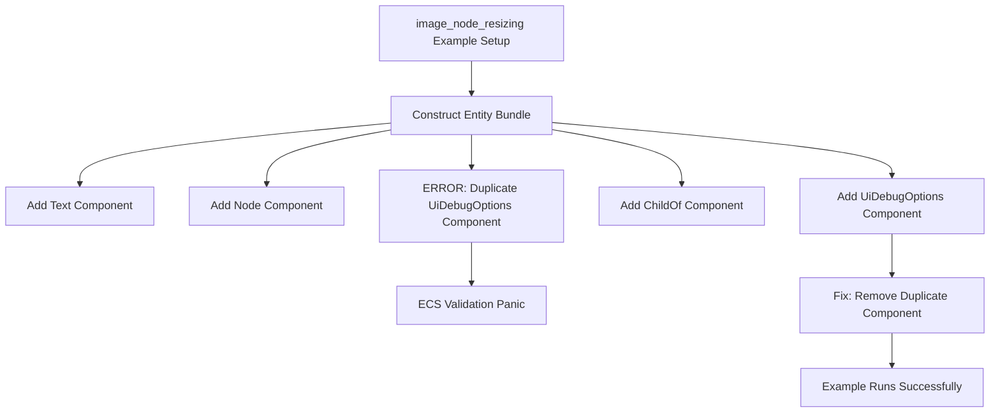

+++
title = "#22674 example image_node_resizing crash: duplicate component"
date = "2026-01-24T00:00:00"
draft = false
template = "pull_request_page.html"
in_search_index = true

[taxonomies]
list_display = ["show"]

[extra]
current_language = "en"
available_languages = {"en" = { name = "English", url = "/pull_request/bevy/2026-01/pr-22674-en-20260124" }, "zh-cn" = { name = "中文", url = "/pull_request/bevy/2026-01/pr-22674-zh-cn-20260124" }}
labels = ["D-Trivial", "C-Examples"]
+++

# Title
example image_node_resizing crash: duplicate component

## Basic Information
- **Title**: example image_node_resizing crash: duplicate component
- **PR Link**: https://github.com/bevyengine/bevy/pull/22674
- **Author**: mockersf
- **Status**: MERGED
- **Labels**: D-Trivial, C-Examples, S-Ready-For-Final-Review
- **Created**: 2026-01-24T01:04:29Z
- **Merged**: 2026-01-24T15:33:28Z
- **Merged By**: mockersf

## Description Translation

# Objective

- New example added in https://github.com/bevyengine/bevy/pull/22606 doesn't work
```
thread 'main' (16547671) panicked at crates/bevy_ecs/src/bundle/info.rs:118:13:
Bundle (image_node_resizing::TextData, bevy_ui::widget::text::Text, bevy_text::text::TextColor, bevy_ui::ui_node::Node, bevy_ui_render::debug_overlay::UiDebugOptions, bevy_ui_render::debug_overlay::UiDebugOptions, bevy_ecs::hierarchy::ChildOf) has duplicate components: ["bevy_ui_render::debug_overlay::UiDebugOptions"]
note: run with `RUST_BACKTRACE=1` environment variable to display a backtrace
Encountered a panic when applying buffers for system `image_node_resizing::setup`!
```

## Solution

- Remove the duplicate component

## Testing

- `cargo run --example image_node_resizing`

## The Story of This Pull Request

This PR addresses a straightforward but important issue that surfaced after merging a new example into the Bevy engine. The problem was a compilation-time bug that caused a runtime panic when the `image_node_resizing` example was executed. The core issue was a duplicate component in a bundle, which violates ECS (Entity Component System) constraints where each component type can appear only once per entity.

The context here involves a recently added UI example (#22606) designed to demonstrate image node resizing functionality. During the example's setup phase, a bundle was constructed with multiple components, including `UiDebugOptions`. The problem occurred because this component was accidentally included twice in the same bundle. When Bevy's ECS system processes bundles, it performs validation to ensure no duplicate components exist - a check that triggers a panic if violated.

The solution approach was minimal and direct: identify and remove the duplicate `UiDebugOptions` component. This is a textbook example of a simple oversight in code review that leads to a runtime failure. The fix required examining the bundle construction in the `setup` function and recognizing the duplicate entry.

Looking at the implementation details, the issue was in how the bundle was constructed using Bevy's commands API. The bundle was being built with multiple components chained together, and the duplicate slipped through because both instances had identical configurations (`enabled: false`). This made the duplicate less visually obvious during code review.

From a technical perspective, this PR highlights several important aspects of working with ECS systems:

1. **Bundle Validation**: Bevy's bundle system performs compile-time and runtime checks to prevent invalid entity configurations. The panic message clearly indicates which component was duplicated, making debugging straightforward.

2. **Error Messages**: The error message from the panic provides clear information: it shows the entire bundle structure and explicitly calls out the duplicate component. This is good design in Bevy's error reporting.

3. **Component Uniqueness Constraint**: In ECS patterns, each component type must be unique per entity. This constraint ensures predictable behavior when querying for components and prevents ambiguity in component access.

The impact of this fix is immediate: the example now runs without crashing, allowing developers to test and learn from the image node resizing functionality. While this is a trivial change from a code perspective, it's important for maintaining the quality and reliability of Bevy's examples, which serve as both documentation and test cases for the engine.

This type of issue is common in codebases that use builder patterns or fluent interfaces for constructing complex objects. The lesson here is to pay careful attention when constructing bundles with multiple similar-looking components, especially when copying and pasting code blocks.

## Visual Representation



## Key Files Changed

**File:** `examples/ui/image_node_resizing.rs`

1. **Description of Change:** The fix removes a duplicate `UiDebugOptions` component from the bundle being spawned in the `setup` function. This resolves the runtime panic that occurred when the ECS system validated the bundle and found duplicate components.

2. **Code Snippets:**

Before the fix (lines 99-106):
```rust
            UiDebugOptions {
                enabled: false,
                ..default()
            },
            UiDebugOptions {
                enabled: false,
                ..default()
            },
            ChildOf(container),
```

After the fix:
```rust
            UiDebugOptions {
                enabled: false,
                ..default()
            },
            ChildOf(container),
```

3. **Relationship to Overall Purpose:** This change directly addresses the crash mentioned in the PR description. By removing the duplicate component, the bundle becomes valid according to ECS rules, allowing the example to run without panicking.

## Further Reading

1. **Bevy ECS Documentation:** https://bevyengine.org/learn/ecs-introduction/
2. **Bevy UI System:** https://bevyengine.org/examples/ui/ui/
3. **Understanding Rust Panics:** https://doc.rust-lang.org/book/ch09-01-unrecoverable-errors-with-panic.html
4. **Bevy Bundle System:** https://docs.rs/bevy_ecs/latest/bevy_ecs/bundle/trait.Bundle.html
5. **Common ECS Anti-patterns:** https://github.com/bevyengine/bevy/discussions/89

# Full Code Diff
```
diff --git a/examples/ui/image_node_resizing.rs b/examples/ui/image_node_resizing.rs
index c07ce02579acb..5103c6ee6b16d 100644
--- a/examples/ui/image_node_resizing.rs
+++ b/examples/ui/image_node_resizing.rs
@@ -99,10 +99,6 @@ fn setup(mut commands: Commands, asset_server: Res<AssetServer>) {
                 enabled: false,
                 ..default()
             },
-            UiDebugOptions {
-                enabled: false,
-                ..default()
-            },
             ChildOf(container),
         ))
         .observe(update_text);
```