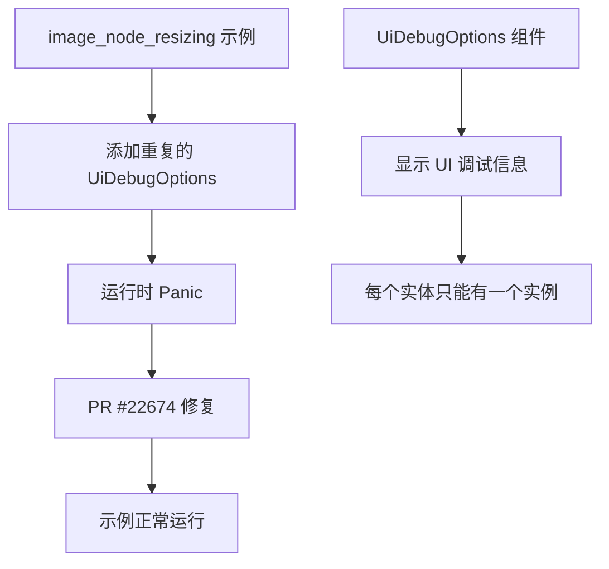

+++
title = "#22674 example image_node_resizing crash: duplicate component"
date = "2026-01-24T00:00:00"
draft = false
template = "pull_request_page.html"
in_search_index = false

[extra]
current_language = "zh-cn"
available_languages = {"en" = { name = "English", url = "/pull_request/bevy/2026-01/pr-22674-en-20260124" }, "zh-cn" = { name = "中文", url = "/pull_request/bevy/2026-01/pr-22674-zh-cn-20260124" }}
+++

# Title

## 基本信息
- **标题**: example image_node_resizing crash: duplicate component
- **PR 链接**: https://github.com/bevyengine/bevy/pull/22674
- **作者**: mockersf
- **状态**: 已合并
- **标签**: D-Trivial, C-Examples, S-Ready-For-Final-Review
- **创建时间**: 2026-01-24T01:04:29Z
- **合并时间**: 2026-01-24T15:33:28Z
- **合并者**: mockersf

## 描述翻译
# 目标

- https://github.com/bevyengine/bevy/pull/22606 中添加的新示例无法运行
```
thread 'main' (16547671) panicked at crates/bevy_ecs/src/bundle/info.rs:118:13:
Bundle (image_node_resizing::TextData, bevy_ui::widget::text::Text, bevy_text::text::TextColor, bevy_ui::ui_node::Node, bevy_ui_render::debug_overlay::UiDebugOptions, bevy_ui_render::debug_overlay::UiDebugOptions, bevy_ecs::hierarchy::ChildOf) has duplicate components: ["bevy_ui_render::debug_overlay::UiDebugOptions"]
note: run with `RUST_BACKTRACE=1` environment variable to display a backtrace
Encountered a panic when applying buffers for system `image_node_resizing::setup`!
```

## 解决方案

- 移除重复的组件

## 测试

- `cargo run --example image_node_resizing`

## 这个 PR 的故事

这个 PR 的故事很简单，但很有代表性：一个看似简单的修复背后，体现了游戏引擎开发中的常见挑战和对代码质量的关注。

### 问题和背景

在 PR #22606 中，开发者添加了一个名为 `image_node_resizing` 的新 UI 示例。这个示例演示了如何在 Bevy 的 UI 系统中动态调整图像节点的大小。然而，当其他开发者尝试运行这个示例时，会立即遇到一个 panic（崩溃）。

错误信息明确指出问题所在：在构建一个组件 Bundle 时，重复包含了 `UiDebugOptions` 组件。根据 Bevy ECS 的设计原则，一个实体不能拥有相同类型的多个组件，这是导致运行时 panic 的根本原因。

### 解决方案

这个问题的解决方案非常直接：找到并移除多余的 `UiDebugOptions` 组件。开发者在代码审查或测试过程中发现了这个问题，因为错误信息明确指出了重复的组件类型。

### 技术实现

查看代码改动，问题出现在 `setup` 函数中，当创建 UI 文本实体时，不小心添加了两个 `UiDebugOptions` 组件：

```rust
// 问题代码：包含两个相同的 UiDebugOptions 组件
commands.spawn((
    TextData::default(),
    Text::default(),
    TextColor(Color::BLACK),
    Node::default(),
    UiDebugOptions {  // 第一个 UiDebugOptions
        enabled: false,
        ..default()
    },
    UiDebugOptions {  // 第二个 UiDebugOptions（多余的）
        enabled: false,
        ..default()
    },
    ChildOf(container),
))
```

修复后的代码移除了重复的组件定义：

```rust
// 修复后的代码：只有一个 UiDebugOptions 组件
commands.spawn((
    TextData::default(),
    Text::default(),
    TextColor(Color::BLACK),
    Node::default(),
    UiDebugOptions {  // 只有一个 UiDebugOptions 组件
        enabled: false,
        ..default()
    },
    ChildOf(container),
))
```

### 技术洞察

这个修复虽然简单，但涉及几个重要的技术概念：

1. **Bevy ECS 的组件唯一性**：在 Bevy 的 ECS 架构中，每个实体对每种组件类型只能有一个实例。这是设计上的约束，确保了数据的组织清晰和查询效率。

2. **编译时 vs 运行时检查**：有趣的是，这个错误是在运行时发现的，而不是编译时。这表明 Bevy 的 Bundle 系统在构建时没有进行完整的重复组件检查，而是在实际使用 Bundle 创建实体时才进行验证。

3. **开发工作流的重要性**：这个 bug 在示例代码被合并后才被发现，强调了全面测试新代码的重要性。即使是一个简单的示例，也需要确保它能正常运行。

### 影响

这个修复确保了 `image_node_resizing` 示例能正常运行，展示了 Bevy UI 系统的预期功能。更重要的是，它防止了新用户在运行示例时遇到 confusing（令人困惑）的错误，提供了更好的开发者体验。

从代码质量的角度看，这个修复虽然微小，但体现了一个重要的工程原则：即使是示例代码也需要保持高质量，因为它是其他开发者的学习参考。

## 可视化表示



## 关键文件更改

### `examples/ui/image_node_resizing.rs`

这个文件包含了需要修复的示例代码。修复移除了重复的 `UiDebugOptions` 组件。

**修改内容**：
```rust
// 修复前（包含重复的 UiDebugOptions）：
commands.spawn((
    TextData::default(),
    Text::default(),
    TextColor(Color::BLACK),
    Node::default(),
    UiDebugOptions {  // 第一个
        enabled: false,
        ..default()
    },
    UiDebugOptions {  // 第二个（多余的）
        enabled: false,
        ..default()
    },
    ChildOf(container),
))

// 修复后（只有一个 UiDebugOptions）：
commands.spawn((
    TextData::default(),
    Text::default(),
    TextColor(Color::BLACK),
    Node::default(),
    UiDebugOptions {  // 唯一的 UiDebugOptions
        enabled: false,
        ..default()
    },
    ChildOf(container),
))
```

## 进一步阅读

1. **Bevy ECS 文档**：了解 Bevy 的实体-组件系统如何工作，包括组件的唯一性约束。
   - https://bevy-cheatbook.github.io/programming/ecs-intro.html

2. **Bevy UI 系统**：深入了解 Bevy 的 UI 框架，包括 `UiDebugOptions` 的作用。
   - https://github.com/bevyengine/bevy/tree/main/examples/ui

3. **Rust 和 Bevy 的错误处理**：学习如何在 Rust 和 Bevy 中处理 panic 和错误。
   - https://doc.rust-lang.org/book/ch09-00-error-handling.html

4. **代码审查最佳实践**：了解如何有效地进行代码审查，防止这类简单错误进入代码库。
   - https://google.github.io/eng-practices/review/

# 完整代码差异
```
diff --git a/examples/ui/image_node_resizing.rs b/examples/ui/image_node_resizing.rs
index c07ce02579acb..5103c6ee6b16d 100644
--- a/examples/ui/image_node_resizing.rs
+++ b/examples/ui/image_node_resizing.rs
@@ -99,10 +99,6 @@ fn setup(mut commands: Commands, asset_server: Res<AssetServer>) {
                 enabled: false,
                 ..default()
             },
-            UiDebugOptions {
-                enabled: false,
-                ..default()
-            },
             ChildOf(container),
         ))
         .observe(update_text);
```