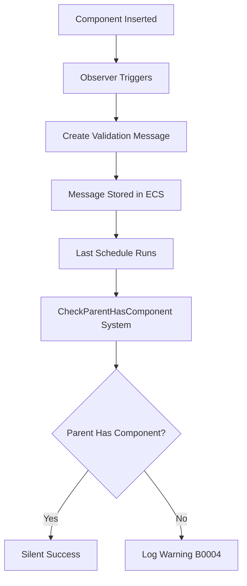

+++
title = "#22675 Replace `validate_parent_has_component` with `ValidateParentHasComponentPlugin`."
date = "2026-01-27T00:00:00"
draft = false
template = "pull_request_page.html"
in_search_index = true

[taxonomies]
list_display = ["show"]

[extra]
current_language = "en"
available_languages = {"en" = { name = "English", url = "/pull_request/bevy/2026-01/pr-22675-en-20260127" }, "zh-cn" = { name = "中文", url = "/pull_request/bevy/2026-01/pr-22675-zh-cn-20260127" }}
labels = ["C-Bug", "A-ECS", "M-Migration-Guide", "D-Straightforward"]
+++

# Title

## Basic Information
- **Title**: Replace `validate_parent_has_component` with `ValidateParentHasComponentPlugin`.
- **PR Link**: https://github.com/bevyengine/bevy/pull/22675
- **Author**: andriyDev
- **Status**: MERGED
- **Labels**: C-Bug, A-ECS, S-Ready-For-Final-Review, M-Migration-Guide, D-Straightforward
- **Created**: 2026-01-24T02:39:40Z
- **Merged**: 2026-01-27T06:44:28Z
- **Merged By**: alice-i-cecile

## Description Translation

# Objective

- Fixes #21666.
- Fixes #19776

## Solution

Instead of warning in the hook, we instead send a message for the entity if its parent is missing the component. A system later reads these messages and checks again if the parent is missing the component, and only then logs. This is done by:

- Change the hook into an observer.
- Create a message to indicate a check is needed.
- Create a system to do this check.
- Create a plugin in `bevy_app` to add all these things to the app.
    - I couldn't think of a better place to put this, other than like `bevy_util`, but I didn't want to add to the "kitchen sink".
- Switch `GlobalTransform`/`InheritedVisibility` to use this plugin instead.
    - One thing to note is I only perform this check in the `Last` schedule. We could move this check if necessary, but I doubt many users will spawn a child, and then only add the parent's GlobalTransform **after** `PostUpdate` (not sure if this will even affect transform propagation though?)

Note: the memory usage is proportional to how many of these bad entities you spawn in a single frame.

## Testing

- I ran the following example:

```rust
use bevy::prelude::*;

fn main() {
    App::new()
        .add_plugins(DefaultPlugins)
        .add_systems(Startup, setup)
        .run();
}

fn setup(mut commands: Commands) {
    let parent = commands.spawn_empty().id();
    let child = commands.spawn_empty().id();

    // Initialize the child first, add the Visibility+Transform component, which implicitly adds the
    // InheritedVisibility+GlobalTransform component as well.
    commands
        .entity(child)
        .insert((ChildOf(parent), Visibility::Inherited, Transform::default()));

    // Also make the parent add the Visibility+Transform component so it is valid.
    commands
        .entity(parent)
        .insert((Visibility::Inherited, Transform::default()));
}
``` 

On main, this logs two warnings. With this PR, there are no logs! I also verified that omitting attaching the components to the parent still logs the warning.

## The Story of This Pull Request

This PR addresses a fundamental problem in Bevy's component hierarchy validation system. The original implementation used `on_insert` component hooks to immediately validate when certain components were added to entities. Specifically, it checked whether an entity with a `GlobalTransform` or `InheritedVisibility` component had a parent that also contained the same component.

The problem with this approach was that it validated immediately upon component insertion, which often occurred during entity spawning when components might be added in a non-deterministic order. In many cases, developers would spawn a child entity first, then spawn or configure its parent. This ordering would trigger false positive warnings, even though the parent would eventually get the required component later in the same frame.

The PR fixes this by replacing the immediate validation hook with a deferred validation system. Instead of checking and warning immediately, the new approach marks entities that need validation and performs the check later in the frame during the `Last` schedule. This allows parent components to be added to entities before the validation occurs, eliminating false positives while still catching genuine configuration errors.

The implementation creates a new plugin system that's more flexible and robust than the previous hook-based approach. The `ValidateParentHasComponentPlugin` sets up three main components:
1. An observer that triggers when a component is inserted and creates validation messages
2. A message type (`CheckParentHasComponent`) to track entities needing validation
3. A system that processes these messages and logs warnings only if validation still fails

This approach demonstrates several important ECS patterns in Bevy:
- Using observers instead of hooks for more complex logic
- Leveraging Bevy's message system for deferred processing
- Creating reusable plugin infrastructure for common validation patterns
- Managing validation timing to avoid false positives

The memory usage is proportional to the number of validation messages created per frame, which in practice means it scales with the number of entities that might be misconfigured. This is an acceptable trade-off for eliminating false positive warnings that were confusing developers.

## Visual Representation



## Key Files Changed

### `crates/bevy_app/src/hierarchy.rs` (+137/-0)
This new file contains the entire implementation of the `ValidateParentHasComponentPlugin`. It defines the plugin struct, the message type for deferred validation, the observer that triggers on component insertion, and the system that performs the actual validation.

Key implementation:
```rust
// The plugin that sets up the validation system
pub struct ValidateParentHasComponentPlugin<C: Component> {
    schedule: Interned<dyn ScheduleLabel>,
    marker: PhantomData<fn() -> C>,
}

// Observer that triggers when component C is inserted
fn validate_parent_has_component<C: Component>(
    event: On<Insert, C>,
    child: Query<&ChildOf>,
    with_component: Query<(), With<C>>,
    mut writer: MessageWriter<CheckParentHasComponent<C>>,
) {
    // Check if parent has component, send message if not
}

// System that processes validation messages
fn check_parent_has_component<C: Component>(
    mut messages: MessageReader<CheckParentHasComponent<C>>,
    children: Query<(&ChildOf, Option<&Name>), With<C>>,
    components: Query<Option<&Name>, Without<C>>,
) {
    // Check again and log warning if parent still missing component
}
```

### `crates/bevy_ecs/src/hierarchy.rs` (+2/-41)
This file removes the old `validate_parent_has_component` hook function that was causing the false positive warnings.

Before:
```rust
// Old hook that validated immediately
pub fn validate_parent_has_component<C: Component>(
    world: DeferredWorld,
    HookContext { entity, caller, .. }: HookContext,
) {
    // Immediate validation with warning
}
```

After:
- The function is completely removed
- No replacement in this file (moved to bevy_app)

### `crates/bevy_transform/src/plugins.rs` (+10/-6)
This file updates the `TransformPlugin` to use the new validation plugin instead of the old hook.

Before:
```rust
impl Plugin for TransformPlugin {
    fn build(&self, app: &mut App) {
        app.init_resource::<StaticTransformOptimizations>()
            // ... systems added
    }
}
```

After:
```rust
impl Plugin for TransformPlugin {
    fn build(&self, app: &mut App) {
        app.add_plugins(ValidateParentHasComponentPlugin::<GlobalTransform>::default())
            .init_resource::<StaticTransformOptimizations>()
            // ... systems added
    }
}
```

### `crates/bevy_camera/src/visibility/mod.rs` (+4/-4)
This file updates the `VisibilityPlugin` to use the new validation plugin for `InheritedVisibility`.

Before:
```rust
#[component(on_insert = validate_parent_has_component::<Self>)]
pub struct InheritedVisibility(bool);
```

After:
```rust
// Component definition without hook
pub struct InheritedVisibility(bool);

// In plugin build method:
impl Plugin for VisibilityPlugin {
    fn build(&self, app: &mut bevy_app::App) {
        app.add_plugins(ValidateParentHasComponentPlugin::<InheritedVisibility>::default())
            // ... rest of plugin setup
    }
}
```

### `crates/bevy_transform/src/components/global_transform.rs` (+2/-6)
This file removes the `on_insert` hook from the `GlobalTransform` component definition.

Before:
```rust
#[cfg_attr(
    feature = "bevy-support",
    derive(Component),
    component(on_insert = validate_parent_has_component::<GlobalTransform>)
)]
```

After:
```rust
#[cfg_attr(feature = "bevy-support", derive(Component))]
```

### `release-content/migration-guides/validate_parent_has_component_is_now_a_plugin.md` (+8/-0)
This new migration guide explains the change for users who might have been using the old hook function directly.

## Further Reading

1. [Bevy ECS Observers Documentation](https://docs.rs/bevy_ecs/latest/bevy_ecs/observer/index.html) - Learn about observers as a replacement for component hooks
2. [Bevy Message System](https://docs.rs/bevy_ecs/latest/bevy_ecs/message/index.html) - Understanding ECS messages for deferred processing
3. [Bevy Plugin System](https://docs.rs/bevy_app/latest/bevy_app/trait.Plugin.html) - How to create reusable plugins in Bevy
4. [Component Hooks vs Observers](https://github.com/bevyengine/bevy/discussions/21666) - Discussion about the limitations of component hooks
5. [Error B0004 Documentation](https://bevy.org/learn/errors/b0004) - Official documentation for the hierarchy validation warning