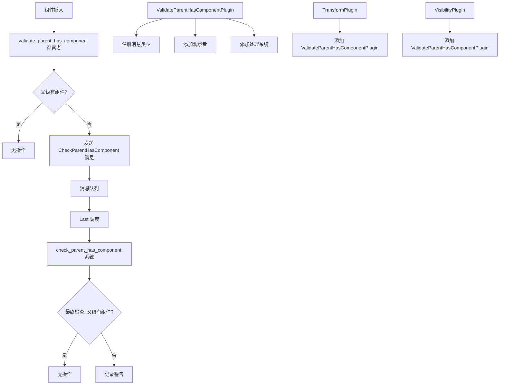

+++
title = "#22675 Replace `validate_parent_has_component` with `ValidateParentHasComponentPlugin`"
date = "2026-01-27T00:00:00"
draft = false
template = "pull_request_page.html"
in_search_index = false

[extra]
current_language = "zh-cn"
available_languages = {"en" = { name = "English", url = "/pull_request/bevy/2026-01/pr-22675-en-20260127" }, "zh-cn" = { name = "中文", url = "/pull_request/bevy/2026-01/pr-22675-zh-cn-20260127" }}
labels = ["C-Bug", "A-ECS", "M-Migration-Guide", "D-Straightforward"]
+++

# Title

## Basic Information
- **Title**: Replace `validate_parent_has_component` with `ValidateParentHasComponentPlugin`
- **PR Link**: https://github.com/bevyengine/bevy/pull/22675
- **Author**: andriyDev
- **Status**: MERGED
- **Labels**: C-Bug, A-ECS, S-Ready-For-Final-Review, M-Migration-Guide, D-Straightforward
- **Created**: 2026-01-24T02:39:40Z
- **Merged**: 2026-01-27T06:44:28Z
- **Merged By**: alice-i-cecile

## Description Translation
# 目标

- 修复 #21666
- 修复 #19776

## 解决方案

不再在钩子中警告，而是为实体发送消息，如果其父级缺少组件。随后一个系统读取这些消息并再次检查父级是否缺少组件，只有这时才记录日志。具体通过以下方式实现：

- 将钩子更改为观察者
- 创建消息来指示需要检查
- 创建系统来执行此检查
- 在 `bevy_app` 中创建一个插件，将这些功能添加到应用程序中
    - 我找不到比这更好的位置，也许可以放在 `bevy_util`，但我不想增加"杂物抽屉"的负担
- 将 `GlobalTransform`/`InheritedVisibility` 切换为使用此插件
    - 需要注意的是，我只在 `Last` 调度中执行此检查。如果需要，可以移动此检查，但我怀疑很少有用户会在生成子实体后，只在 `PostUpdate` 之后才添加父级的 GlobalTransform（不确定这是否会影响变换传播？）

注意：内存使用量与一帧内生成的这类不良实体的数量成正比。

## 测试

- 我运行了以下示例：

```rust
use bevy::prelude::*;

fn main() {
    App::new()
        .add_plugins(DefaultPlugins)
        .add_systems(Startup, setup)
        .run();
}

fn setup(mut commands: Commands) {
    let parent = commands.spawn_empty().id();
    let child = commands.spawn_empty().id();

    // 首先初始化子实体，添加 Visibility+Transform 组件，这会隐式添加 InheritedVisibility+GlobalTransform 组件
    commands
        .entity(child)
        .insert((ChildOf(parent), Visibility::Inherited, Transform::default()));

    // 同时让父级也添加 Visibility+Transform 组件，使其有效
    commands
        .entity(parent)
        .insert((Visibility::Inherited, Transform::default()));
}
```

在 main 分支上，这会记录两条警告。使用此 PR 后，没有日志！我也验证了省略向父级附加组件仍然会记录警告。

## 这个 Pull Request 的故事

这个 PR 解决了一个在 Bevy 中持续存在的问题：父子实体组件一致性检查中出现的误报警告。问题的核心在于时机——当子实体插入具有层次结构的组件时，系统会立即检查父实体是否具有相同组件。如果父实体的组件稍后在同一帧中添加，这会导致不必要的警告。

### 问题和背景

在之前的实现中，`validate_parent_has_component` 是一个组件插入钩子（on_insert hook），当像 `GlobalTransform` 或 `InheritedVisibility` 这样的组件插入到具有 `ChildOf` 关系的实体时触发。钩子会立即检查父实体是否具有相同组件，如果没有，就记录警告。

这种方法有两个主要问题：
1. **时机问题**：如果子实体和父实体的组件在同一帧的不同时间点添加，即使最终配置正确，也会产生警告
2. **架构问题**：钩子在 `DeferredWorld` 上下文中运行，这限制了可以执行的查询类型和操作

问题 #21666 和 #19776 都报告了这种误报警告，特别是在复杂的实体生成场景中。

### 解决方案方法

开发者采用了基于消息传递的延迟验证方法，而不是立即检查。这个解决方案的关键洞察是：我们不需要立即警告，因为父组件的添加可能只是稍微延迟一些。通过将检查推迟到帧的后期，我们给父级一个机会来添加必要的组件。

技术方法包括三个核心部分：
1. **观察者（Observer）**：替换原来的钩子，在组件插入时触发但不立即检查
2. **消息系统**：发送需要检查的消息到队列
3. **延迟系统**：在帧后期处理消息并执行最终检查

这种方法的优势在于：
- 消除了同一帧内组件添加顺序导致的误报
- 更灵活的架构，使用标准系统而不是钩子
- 更好的控制检查时机

### 实现细节

实现从创建一个新的插件开始：`ValidateParentHasComponentPlugin`。这个插件封装了整个验证逻辑：

```rust
pub struct ValidateParentHasComponentPlugin<C: Component> {
    schedule: Interned<dyn ScheduleLabel>,
    marker: PhantomData<fn() -> C>,
}
```

插件在构建时添加了三个关键组件：
1. 消息类型 `CheckParentHasComponent<C>`，用于表示需要检查的实体
2. 观察者 `validate_parent_has_component`，在组件插入时发送消息
3. 系统 `check_parent_has_component`，在指定调度中处理消息

观察者的实现简洁明了：

```rust
fn validate_parent_has_component<C: Component>(
    event: On<Insert, C>,
    child: Query<&ChildOf>,
    with_component: Query<(), With<C>>,
    mut writer: MessageWriter<CheckParentHasComponent<C>>,
) {
    let Ok(child_of) = child.get(event.entity) else {
        return;
    };
    if with_component.contains(child_of.parent()) {
        return;
    }
    // 发送消息稍后检查
    writer.write(CheckParentHasComponent::<C> {
        entity: event.entity,
        caller: event.caller(),
        marker: PhantomData,
    });
}
```

关键的改进在于：如果父级缺少组件，我们不立即警告，而是发送一个消息。这给了父级时间在同一帧的稍后阶段添加组件。

处理系统在 `Last` 调度中运行，确保所有组件添加操作都已完成：

```rust
fn check_parent_has_component<C: Component>(
    mut messages: MessageReader<CheckParentHasComponent<C>>,
    children: Query<(&ChildOf, Option<&Name>), With<C>>,
    components: Query<Option<&Name>, Without<C>>,
) {
    // 处理所有消息并检查最终状态
}
```

这个系统执行最终检查，只有当父级在帧结束时仍然缺少组件时才记录警告。

### 架构决策

开发者做出了几个重要的架构决策：

1. **插件位置**：将插件放在 `bevy_app` 而不是 `bevy_util`，因为这与应用程序调度和系统管理更相关，符合"厨房水槽"原则——避免将所有实用工具堆在一个地方。

2. **检查时机**：选择在 `Last` 调度中执行检查。这是一个保守的选择，确保所有常规系统都已完成。开发者考虑了将其移到更早调度的可能性，但认为这种情况很少见。

3. **消息设计**：使用 Bevy 的消息系统而不是事件系统，因为这是组件验证的专门用例，消息系统提供更直接的机制。

4. **内存考虑**：内存使用与不良实体数量成正比，但只在单帧内存在，这对大多数用例来说是可接受的。

### 迁移变化

这个 PR 带来了明显的架构变化：

1. **从钩子到插件**：原来的 `validate_parent_has_component` 钩子被完全移除，替换为插件系统
2. **组件装饰器变化**：`GlobalTransform` 和 `InheritedVisibility` 组件移除了 `#[component(on_insert = validate_parent_has_component::<Self>)]` 装饰器
3. **插件集成**：`TransformPlugin` 和 `VisibilityPlugin` 现在添加 `ValidateParentHasComponentPlugin`

迁移指南清楚地说明了这一变化，指导用户使用新的插件系统。

### 技术洞察

这个实现展示了 Bevy ECS 中几个重要的模式：

1. **观察者模式**：使用 `On<Insert, C>` 观察者而不是旧式钩子，提供更好的类型安全和更清晰的执行上下文
2. **消息传递**：使用 `MessageWriter`/`MessageReader` 在系统间通信，这是一种轻量级的进程内通信机制
3. **延迟验证**：通过推迟检查来避免时序问题，这是处理实体生成顺序依赖的常见模式
4. **泛型插件**：插件使用泛型类型参数 `C: Component`，使其可重用于任何需要父子一致性检查的组件

### 影响

这个更改的主要影响是：

1. **消除误报**：解决了长期存在的问题 #21666 和 #19776，提高了开发者的体验
2. **更清晰的架构**：从专门的钩子迁移到标准的插件/系统模式，更符合 Bevy 的架构哲学
3. **更好的可扩展性**：新的设计更容易扩展和定制，比如改变检查时机或添加额外的验证逻辑
4. **向后兼容**：虽然 API 有变化，但行为基本保持不变，只是修复了误报问题

这个 PR 展示了 Bevy 生态系统中从旧模式向新模式演进的过程，反映了框架的成熟和架构的改进。

## Visual Representation



## Key Files Changed

### 1. `crates/bevy_app/src/hierarchy.rs` (+137/-0)
**变化原因**：创建新的插件系统来管理父子组件验证

**关键代码**：
```rust
/// 插件主结构
pub struct ValidateParentHasComponentPlugin<C: Component> {
    schedule: Interned<dyn ScheduleLabel>,
    marker: PhantomData<fn() -> C>,
}

/// 观察者函数
fn validate_parent_has_component<C: Component>(
    event: On<Insert, C>,
    child: Query<&ChildOf>,
    with_component: Query<(), With<C>>,
    mut writer: MessageWriter<CheckParentHasComponent<C>>,
) {
    // 检查并发送消息
}

/// 消息类型
#[derive(Message)]
struct CheckParentHasComponent<C: Component> {
    entity: Entity,
    caller: MaybeLocation,
    marker: PhantomData<fn() -> C>,
}

/// 处理系统
fn check_parent_has_component<C: Component>(
    mut messages: MessageReader<CheckParentHasComponent<C>>,
    children: Query<(&ChildOf, Option<&Name>), With<C>>,
    components: Query<Option<&Name>, Without<C>>,
) {
    // 处理消息并记录警告
}
```

**与 PR 的关系**：这是核心实现，提供了新的验证机制

### 2. `crates/bevy_ecs/src/hierarchy.rs` (+2/-41)
**变化原因**：移除旧的 `validate_parent_has_component` 钩子函数

**关键代码**：
```rust
// 之前:
pub fn validate_parent_has_component<C: Component>(
    world: DeferredWorld,
    HookContext { entity, caller, .. }: HookContext,
) {
    // 立即检查并警告
}

// 之后:
// 函数被完全移除，由插件系统替代
```

**与 PR 的关系**：清理旧代码，迁移到新架构

### 3. `crates/bevy_transform/src/plugins.rs` (+10/-6)
**变化原因**：更新 TransformPlugin 以使用新的验证插件

**关键代码**：
```rust
// 之前:
impl Plugin for TransformPlugin {
    fn build(&self, app: &mut App) {
        app.init_resource::<StaticTransformOptimizations>()
            .add_systems(...)
    }
}

// 之后:
impl Plugin for TransformPlugin {
    fn build(&self, app: &mut App) {
        app.add_plugins(ValidateParentHasComponentPlugin::<GlobalTransform>::default())
            .init_resource::<StaticTransformOptimizations>()
            .add_systems(...)
    }
}
```

**与 PR 的关系**：将 GlobalTransform 验证迁移到新系统

### 4. `crates/bevy_camera/src/visibility/mod.rs` (+4/-4)
**变化原因**：更新 VisibilityPlugin 以使用新的验证插件

**关键代码**：
```rust
// 之前:
#[component(on_insert = validate_parent_has_component::<Self>)]
pub struct InheritedVisibility(bool);

// 之后:
pub struct InheritedVisibility(bool); // 移除了装饰器

// 在插件构建中:
app.add_plugins(ValidateParentHasComponentPlugin::<InheritedVisibility>::default())
```

**与 PR 的关系**：将 InheritedVisibility 验证迁移到新系统

### 5. `crates/bevy_transform/src/components/global_transform.rs` (+2/-6)
**变化原因**：移除 GlobalTransform 组件上的旧验证钩子

**关键代码**：
```rust
// 之前:
#[cfg_attr(
    feature = "bevy-support",
    derive(Component),
    component(on_insert = validate_parent_has_component::<GlobalTransform>)
)]

// 之后:
#[cfg_attr(feature = "bevy-support", derive(Component))] // 移除了钩子
```

**与 PR 的关系**：清理组件定义，移除对旧验证系统的依赖

### 6. `release-content/migration-guides/validate_parent_has_component_is_now_a_plugin.md` (+8/-0)
**变化原因**：为新变化添加迁移指南

**关键代码**：
```markdown
---
title: The `validate_parent_has_component` is superseded by `ValidateParentHasComponentPlugin`
pull_requests: [22675]
---

The `validate_parent_has_component` insert hook has been replaced by a plugin:
`ValidateParentHasComponentPlugin`. This uses an observer, a resource, and a system to achieve a
more robust (and less spurious) warning for invalid configuration of entities.
```

**与 PR 的关系**：提供向后兼容性信息和迁移指导

## Further Reading

1. **Bevy 观察者系统**：了解 Bevy 中的观察者模式如何工作，特别是 `On<Insert, T>` 和类似构造
2. **Bevy 消息系统**：研究 Bevy 的消息传递机制，包括 `MessageWriter` 和 `MessageReader`
3. **ECS 中的父子关系**：深入理解实体组件系统中层次结构的设计模式
4. **Bevy 插件架构**：学习如何创建和使用 Bevy 插件来模块化功能
5. **组件生命周期钩子**：查看 Bevy 中组件生命周期的其他钩子类型及其用例
6. **调度和系统排序**：了解 Bevy 的调度系统如何工作，特别是 `Last` 调度和其他调度阶段