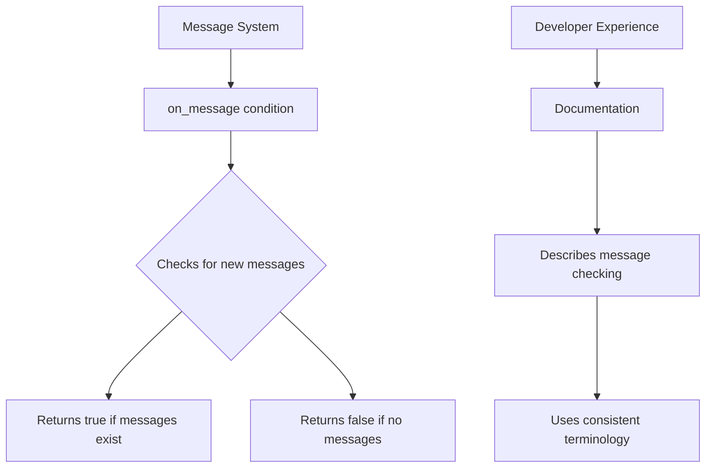

+++
title = "#22679 Update `on_message` condition docs to reflect rename to \"message\" from \"event\""
date = "2026-01-24T00:00:00"
draft = false
template = "pull_request_page.html"
in_search_index = true

[taxonomies]
list_display = ["show"]

[extra]
current_language = "en"
available_languages = {"en" = { name = "English", url = "/pull_request/bevy/2026-01/pr-22679-en-20260124" }, "zh-cn" = { name = "中文", url = "/pull_request/bevy/2026-01/pr-22679-zh-cn-20260124" }}
labels = ["C-Docs", "A-ECS", "D-Straightforward"]
+++

# Title
Update `on_message` condition docs to reflect rename to "message" from "event"

## Basic Information
- **Title**: Update `on_message` condition docs to reflect rename to "message" from "event"
- **PR Link**: https://github.com/bevyengine/bevy/pull/22679
- **Author**: Nilirad
- **Status**: MERGED
- **Labels**: C-Docs, A-ECS, D-Straightforward
- **Created**: 2026-01-24T11:21:54Z
- **Merged**: 2026-01-24T15:35:02Z
- **Merged By**: mockersf

## Description Translation
The `on_message` condition being referred to as an event in its own doc comment survived the rename to messages. This PR fixes that.

## The Story of This Pull Request

This PR addresses a documentation inconsistency in Bevy's ECS schedule conditions. The issue was straightforward: a recent rename from "events" to "messages" in the Bevy codebase left behind outdated terminology in the documentation for the `on_message` condition function.

The problem centered on three instances in the doc comments where the term "event" was still used to describe what are now called "messages." While this doesn't affect runtime behavior, it creates confusion for developers reading the documentation. Inconsistent terminology makes the API harder to learn and can lead to misunderstandings about how the system works.

The solution approach was direct and minimal: update the doc comments to use the correct terminology. The developer identified three specific locations in the documentation where "event" needed to be changed to "message." This included both the function's main description and example code comments.

The implementation consisted of three simple text substitutions in the `common_conditions` module. The first change updated the function's summary line from "if there are any new events of the given type" to "if there are any new messages of the given type." The second change corrected an example comment from "No new `MyMessage` events have been push" to "No new `MyMessage` messages have been pushed" (also fixing a typo: "push" to "pushed"). The third change updated another example comment from "A `MyMessage` event has been pushed" to "A `MyMessage` message has been pushed."

These changes ensure that developers encountering the `on_message` condition for the first time won't be confused by mixed terminology. The documentation now consistently refers to "messages" throughout, aligning with the actual API naming and recent architectural decisions in Bevy.

From a technical perspective, this PR demonstrates the importance of maintaining documentation consistency during API changes. When terminology evolves in a codebase, documentation updates need to be comprehensive to avoid leaving "semantic debt" - situations where the documentation describes the system using outdated concepts. While this particular fix was simple, it prevents potential confusion that could arise when developers try to reconcile the documentation's "events" terminology with the actual "messages" API they encounter in code.

The impact of these changes is purely educational - they make the codebase more approachable and consistent for developers. By fixing these documentation inconsistencies, the PR reduces cognitive load for engineers learning Bevy's ECS system and ensures that the documentation accurately reflects the current architectural patterns.

## Visual Representation



## Key Files Changed

**File:** `crates/bevy_ecs/src/schedule/condition.rs` (+3/-3)

This file contains Bevy's ECS schedule conditions, including the `on_message` condition function. The changes update the documentation comments to use "message" terminology consistently instead of the outdated "event" terminology.

**Key Changes:**
1. Updated the function's summary description to refer to "messages" instead of "events"
2. Fixed example comments to use "messages" terminology
3. Corrected a typo ("push" to "pushed") in the process

**Code Snippets:**

```rust
// File: crates/bevy_ecs/src/schedule/condition.rs
// Before:
/// A [`SystemCondition`]-satisfying system that returns `true`
/// if there are any new events of the given type since it was last called.

// After:
/// A [`SystemCondition`]-satisfying system that returns `true`
/// if there are any new messages of the given type since it was last called.
```

```rust
// File: crates/bevy_ecs/src/schedule/condition.rs
// Before:
/// // No new `MyMessage` events have been push so `my_system` won't run

// After:
/// // No new `MyMessage` messages have been pushed so `my_system` won't run
```

```rust
// File: crates/bevy_ecs/src/schedule/condition.rs
// Before:
/// // A `MyMessage` event has been pushed so `my_system` will run

// After:
/// // A `MyMessage` message has been pushed so `my_system` will run
```

These changes ensure that the documentation accurately reflects the current terminology used throughout Bevy's messaging system, providing consistency for developers reading the API documentation.

## Further Reading

- [Bevy ECS Documentation](https://docs.rs/bevy_ecs/latest/bevy_ecs/) - Official Bevy ECS API documentation
- [Bevy Schedule Conditions](https://bevy-cheatbook.github.io/programming/schedules.html#conditions) - Guide to using conditions in Bevy schedules
- [Bevy Messages vs Events](https://github.com/bevyengine/bevy/discussions/22678) - Discussion about the rename from events to messages
- [Rust Documentation Guidelines](https://rust-lang.github.io/rfcs/1574-more-api-documentation-conventions.html) - Best practices for Rust documentation