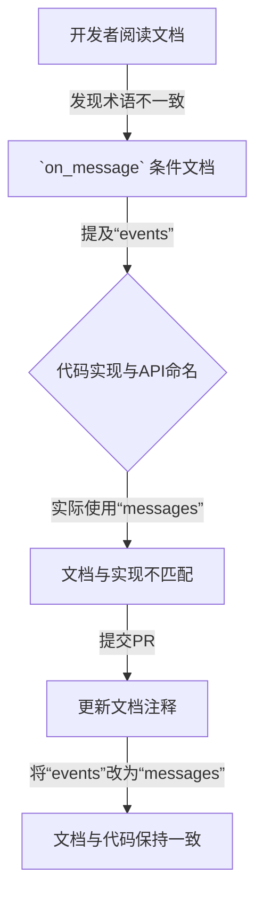

+++
title = "#22679 Update `on_message` condition docs to reflect rename to \"message\" from \"event\""
date = "2026-01-24T00:00:00"
draft = false
template = "pull_request_page.html"
in_search_index = false

[extra]
current_language = "zh-cn"
available_languages = {"en" = { name = "English", url = "/pull_request/bevy/2026-01/pr-22679-en-20260124" }, "zh-cn" = { name = "中文", url = "/pull_request/bevy/2026-01/pr-22679-zh-cn-20260124" }}
+++

# Title

## 基本信息
- **标题**: Update `on_message` condition docs to reflect rename to "message" from "event"
- **PR链接**: https://github.com/bevyengine/bevy/pull/22679
- **作者**: Nilirad
- **状态**: 已合并
- **标签**: C-Docs, A-ECS, D-Straightforward
- **创建时间**: 2026-01-24T11:21:54Z
- **合并时间**: 2026-01-24T15:35:02Z
- **合并者**: mockersf

## 描述翻译
`on_message` 条件在其自身的文档注释中被指代为“事件（event）”，这个称谓在重命名为“消息（message）”后遗留下来。本 PR 修复了这个问题。

## 本 PR 的来龙去脉

这个 PR 的核心是一个典型的文档同步问题。Bevy 引擎的 ECS（实体组件系统）调度系统中，有一个叫做 `on_message` 的条件（condition），它用于判断特定类型的“消息（Message）”是否有更新，从而决定后续的系统（system）是否应该运行。

问题是，这个功能的实现或命名可能已经从“事件（event）”更改为“消息（message）”，但其相关的 API 文档却没有随之更新。在软件开发中，尤其是像 Bevy 这样的大型开源项目，代码重构和术语统一是常有的事。当核心概念的名称发生变化时，确保所有相关的文档、注释和示例代码都同步更新，对于维护代码库的清晰度和开发者体验至关重要。陈旧的文档会误导贡献者，增加理解和使用 API 的认知负担。

开发者 Nilirad 发现了这个不一致之处。解决思路非常直接：找到所有在描述 `on_message` 条件时仍在使用旧术语“事件（event）”的文档注释，并将其更新为正确的术语“消息（message）”。这是一种低成本、高收益的贡献，它不涉及任何功能逻辑的修改，但能显著提升文档的准确性。

从实现细节来看，改动全部集中在 `crates/bevy_ecs/src/schedule/condition.rs` 文件中 `common_conditions` 模块下的 `on_message` 函数的文档注释里。具体修改有三处：
1.  将函数摘要从“if there are any new events of the given type”改为“if there are any new messages of the given type”。
2.  将示例代码中的第一条注释从“No new `MyMessage` events have been push”改为“No new `MyMessage` messages have been pushed”（同时修正了拼写错误“push”->“pushed”）。
3.  将示例代码中的第二条注释从“A `MyMessage` event has been pushed”改为“A `MyMessage` message has been pushed”。

这些改动虽然微小，但意义明确。它们确保了开发者在阅读 `on_message` 的文档时，所接触到的术语与 API 名称本身（`on_message`）以及 Bevy 代码库中其他地方可能使用的术语（如 `Messages<T>` 资源）保持一致。这对于新手理解 Bevy 的消息传递机制特别有帮助，可以避免因术语混淆而产生的“这里为什么叫 `on_message` 但文档却写 `event`”的疑问。

从技术角度看，`on_message` 是一个 `SystemCondition`，它是 Bevy 调度系统的一个强大特性，允许根据运行时的状态（此处是特定 `Message` 类型资源的更新情况）来动态控制系统的执行。保持其文档的准确性，是维护整个条件系统（Condition System）文档质量的一部分。

这次修改的影响是局部的、非破坏性的，它只涉及注释字符串，不改变任何编译后的行为。它被标记为 `C-Docs`（文档变更）、`A-ECS`（ECS 相关）和 `D-Straightforward`（简单直接），分类准确。合并过程迅速，表明审查者认可这是一项必要的、无风险的改进。

总而言之，这个 PR 展示了一个良好的开源贡献实践：敏锐地发现文档与代码之间的细微脱节，并提出精准、最小化的修复方案，从而帮助项目维持高质量的标准。

## 视觉图示



## 关键文件变更

**修改的文件**:
- `crates/bevy_ecs/src/schedule/condition.rs` (+3/-3)

**变更说明**:
此文件是 Bevy ECS 计划调度中条件系统的定义处。本次 PR 仅修改了 `common_conditions` 模块内 `on_message` 函数的三行文档注释，将过时的术语“event(s)”更新为“message(s)”，使其与 API 名称及代码库中的其他相关术语保持一致。

**代码片段**:
```rust
// 文件: crates/bevy_ecs/src/schedule/condition.rs
// 修改前：
    /// A [`SystemCondition`]-satisfying system that returns `true`
    /// if there are any new events of the given type since it was last called.
...
    /// // No new `MyMessage` events have been push so `my_system` won't run
...
    /// // A `MyMessage` event has been pushed so `my_system` will run

// 修改后：
    /// A [`SystemCondition`]-satisfying system that returns `true`
    /// if there are any new messages of the given type since it was last called.
...
    /// // No new `MyMessage` messages have been pushed so `my_system` won't run
...
    /// // A `MyMessage` message has been pushed so `my_system` will run
```

## 扩展阅读

1.  **Bevy 官方文档 - 条件（Conditions）**: 了解 Bevy 调度系统中条件是如何工作的。
2.  **Bevy 官方示例 - `condition.rs`**: 查看使用 `on_message` 和其他条件的实际示例代码。
3.  **GitHub Pull Request 指南**: 学习如何为开源项目（如 Bevy）提交有效的 PR，包括像本文这样的文档修复。