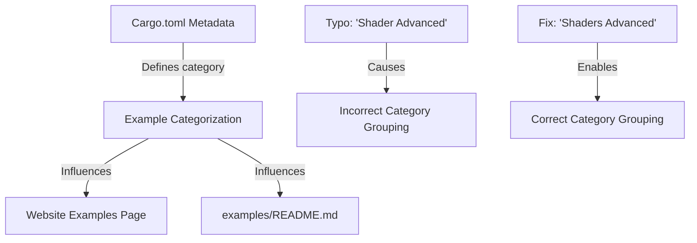

+++
title = "#22680 Web Example Category Typo"
date = "2026-01-24T00:00:00"
draft = false
template = "pull_request_page.html"
in_search_index = true

[taxonomies]
list_display = ["show"]

[extra]
current_language = "en"
available_languages = {"en" = { name = "English", url = "/pull_request/bevy/2026-01/pr-22680-en-20260124" }, "zh-cn" = { name = "中文", url = "/pull_request/bevy/2026-01/pr-22680-zh-cn-20260124" }}
labels = ["C-Docs", "C-Examples"]
+++

# Title

## Basic Information
- **Title**: Web Example Category Typo
- **PR Link**: https://github.com/bevyengine/bevy/pull/22680
- **Author**: PVDoriginal
- **Status**: MERGED
- **Labels**: C-Docs, C-Examples, S-Ready-For-Final-Review
- **Created**: 2026-01-24T13:13:17Z
- **Merged**: 2026-01-24T15:33:28Z
- **Merged By**: mockersf

## Description
Fixed a typo in the category of one web example that was putting it into its own separate category: https://bevy.org/examples/#shader-advanced

## The Story of This Pull Request

This PR addresses a minor but impactful documentation issue in the Bevy game engine's example organization system. The problem was straightforward: a typo in an example's metadata was causing incorrect categorization on the Bevy website's examples page.

The issue stemmed from inconsistency in category naming conventions. Bevy organizes its examples into logical groups for easier navigation, both in the source code repository and on the public-facing website. One example, "Manual Material Implementation," was assigned to the category "Shader Advanced" instead of the correctly pluralized "Shaders Advanced" used by other examples in the same functional area.

This typo had concrete consequences. On the Bevy website at https://bevy.org/examples/#shader-advanced, the example appeared in its own separate section rather than being grouped with the other advanced shader examples. This created a fragmented user experience where developers looking for shader-related examples had to search through multiple categories to find all relevant content.

The solution involved two coordinated changes to fix the inconsistency:

1. **Metadata correction in Cargo.toml**: The example's category was updated from "Shader Advanced" to "Shaders Advanced" to match the established naming convention.

2. **Documentation reorganization in examples/README.md**: The documentation was restructured to remove the incorrectly created category section and move the example description to the correct section.

The implementation demonstrates how Bevy's example system works. Examples are configured in `Cargo.toml` using Rust's package metadata system, with each example having properties like name, description, category, and platform support flags (like `wasm = true` for web examples). The `examples/README.md` file is likely auto-generated from this metadata, maintaining consistency between the code organization and documentation.

From a technical perspective, this fix highlights the importance of consistent naming conventions in documentation systems. While the typo was minor, it had a visible impact on the user experience. The change also shows how Bevy's documentation tooling works - categories defined in `Cargo.toml` metadata directly influence the structure of both the auto-generated documentation and the website's examples page.

The engineering approach here was pragmatic: identify the root cause (naming inconsistency), understand the impact (fragmented user experience), and apply the minimal fix needed (correct the name in both the source and generated documentation). No complex refactoring was required because the underlying system was already designed to handle category-based organization correctly.

## Visual Representation



## Key Files Changed

### `Cargo.toml` (+1/-1)
This file contains the Rust package metadata where examples are configured. The change corrected the category name for the `manual_material` example.

**Before:**
```toml
[package.metadata.example.manual_material]
name = "Manual Material Implementation"
description = "Demonstrates how to implement a material manually using the mid-level render APIs"
category = "Shader Advanced"
wasm = true
```

**After:**
```toml
[package.metadata.example.manual_material]
name = "Manual Material Implementation"
description = "Demonstrates how to implement a material manually using the mid-level render APIs"
category = "Shaders Advanced"
wasm = true
```

### `examples/README.md` (+1/-7)
This file contains the auto-generated documentation for Bevy's examples. The changes removed the incorrect category section and moved the example to the correct section.

**Before:**
```markdown
  - [Shader Advanced](#shader-advanced)
  - [Shaders](#shaders)
  - [Shaders Advanced](#shaders-advanced)

### Shader Advanced

Example | Description
--- | ---
[Manual Material Implementation](../examples/shader_advanced/manual_material.rs) | Demonstrates how to implement a material manually using the mid-level render APIs

### Shaders Advanced

Example | Description
--- | ---
[Fullscreen Material](../examples/shader_advanced/fullscreen_material.rs) | Demonstrates how to write a fullscreen material
```

**After:**
```markdown
  - [Shaders](#shaders)
  - [Shaders Advanced](#shaders-advanced)

### Shaders Advanced

Example | Description
--- | ---
[Fullscreen Material](../examples/shader_advanced/fullscreen_material.rs) | Demonstrates how to write a fullscreen material
[Manual Material Implementation](../examples/shader_advanced/manual_material.rs) | Demonstrates how to implement a material manually using the mid-level render APIs
```

## Further Reading

1. [Bevy Examples Documentation](https://bevyengine.org/examples/) - The live examples page affected by this change
2. [Rust Package Metadata Documentation](https://doc.rust-lang.org/cargo/reference/manifest.html#the-metadata-table) - How Rust uses metadata in Cargo.toml
3. [Bevy's Contribution Guide](https://github.com/bevyengine/bevy/blob/main/CONTRIBUTING.md) - Guidelines for contributing to Bevy, including documentation standards
4. [Bevy's Example Structure](https://github.com/bevyengine/bevy/tree/main/examples) - The examples directory structure and organization

## Full Code Diff
```diff
diff --git a/Cargo.toml b/Cargo.toml
index 87de1d18f3990..5ae0e23c51da1 100644
--- a/Cargo.toml
+++ b/Cargo.toml
@@ -3307,7 +3307,7 @@ doc-scrape-examples = false
 [package.metadata.example.manual_material]
 name = "Manual Material Implementation"
 description = "Demonstrates how to implement a material manually using the mid-level render APIs"
-category = "Shader Advanced"
+category = "Shaders Advanced"
 wasm = true
 
 [[example]]
diff --git a/examples/README.md b/examples/README.md
index 38675937b46d9..082ac278517fe 100644
--- a/examples/README.md
+++ b/examples/README.md
@@ -60,7 +60,6 @@ git checkout v0.4.0
   - [Reflection](#reflection)
   - [Remote Protocol](#remote-protocol)
   - [Scene](#scene)
-  - [Shader Advanced](#shader-advanced)
   - [Shaders](#shaders)
   - [Shaders Advanced](#shaders-advanced)
   - [State](#state)
@@ -454,12 +453,6 @@ Example | Description
 --- | ---
 [Scene](../examples/scene/scene.rs) | Demonstrates loading from and saving scenes to files
 
-### Shader Advanced
-
-Example | Description
---- | ---
-[Manual Material Implementation](../examples/shader_advanced/manual_material.rs) | Demonstrates how to implement a material manually using the mid-level render APIs
-
 ### Shaders
 
 These examples demonstrate how to implement different shaders in user code.
@@ -501,6 +494,7 @@ Example | Description
 Example | Description
 --- | ---
 [Fullscreen Material](../examples/shader_advanced/fullscreen_material.rs) | Demonstrates how to write a fullscreen material
+[Manual Material Implementation](../examples/shader_advanced/manual_material.rs) | Demonstrates how to implement a material manually using the mid-level render APIs
 
 ### State
 
```