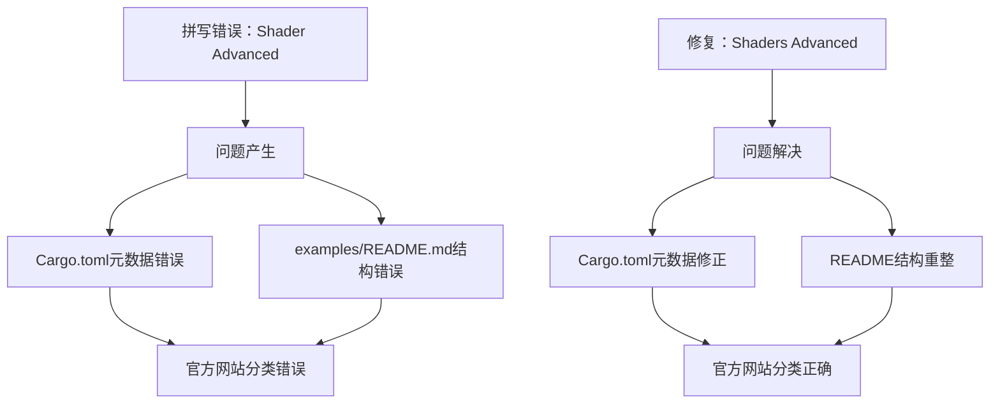

+++
title = "#22680 Web Example Category Typo"
date = "2026-01-24T00:00:00"
draft = false
template = "pull_request_page.html"
in_search_index = false

[extra]
current_language = "zh-cn"
available_languages = {"en" = { name = "English", url = "/pull_request/bevy/2026-01/pr-22680-en-20260124" }, "zh-cn" = { name = "中文", url = "/pull_request/bevy/2026-01/pr-22680-zh-cn-20260124" }}
+++

# Web Example Category Typo

## 基本信息
- **标题**: Web Example Category Typo
- **PR链接**: https://github.com/bevyengine/bevy/pull/22680
- **作者**: PVDoriginal
- **状态**: 已合并
- **标签**: C-Docs, C-Examples, S-Ready-For-Final-Review
- **创建时间**: 2026-01-24T13:13:17Z
- **合并时间**: 2026-01-24T15:33:28Z
- **合并者**: mockersf

## 描述翻译
修复了一个Web示例分类中的拼写错误，该错误导致该示例被放入单独的类别：https://bevy.org/examples/#shader-advanced

## 这个Pull Request的故事

这个PR解决了一个简单的拼写错误问题，但这个问题影响了Bevy引擎在线示例文档的组织结构。问题出现在一个Web示例的分类定义中，错误地将"Shaders Advanced"拼写为"Shader Advanced"，导致该示例在官方网站上显示为单独的类别。

从技术角度看，Bevy使用Cargo.toml中的metadata来组织示例，并通过自动化工具生成在线文档。拼写错误虽然看似微小，但破坏了示例分类的一致性，影响了用户查找相关示例的体验。

问题的核心在于`Cargo.toml`文件中的元数据定义。`manual_material`示例的`category`字段被错误地设置为"Shader Advanced"，而正确的分类应该是"Shaders Advanced"。这个错误导致了两个问题：

1. 在`examples/README.md`文件中，自动生成的文档创建了一个多余的"Shader Advanced"章节
2. 在Bevy官方网站的示例页面（https://bevy.org/examples/），该示例出现在错误的分类中

修复方案直接明了：将拼写错误的"Shader Advanced"更正为"Shaders Advanced"。这个改动涉及两个文件：

在`Cargo.toml`中，修改了示例的元数据定义：
```toml
# Before:
category = "Shader Advanced"

# After:
category = "Shaders Advanced"
```

在`examples/README.md`中，相应的更新反映在文档结构中：
- 移除了错误的"Shader Advanced"章节
- 将"Manual Material Implementation"示例移动到正确的"Shaders Advanced"章节中

这种类型的错误修复虽然简单，但对于维护项目的文档质量至关重要。文档拼写错误会降低项目的专业性，特别是在示例分类这种基础的组织结构中。用户依赖清晰的分类来查找相关示例，错误的分类会直接阻碍学习和使用体验。

从工程角度看，这个修复展示了元数据驱动文档生成的一个常见问题：元数据中的小错误会在多个地方产生连锁反应。在这个案例中，一个拼写错误同时影响了：
- 自动生成的README文档结构
- 官方网站的示例分类
- 潜在的内部文档工具输出

修复后，"Shaders Advanced"分类现在包含所有相关的shader高级示例，包括"Fullscreen Material"和"Manual Material Implementation"，保持了分类的逻辑一致性。

## 可视化表示



## 关键文件更改

### `Cargo.toml` (+1/-1)
**更改说明**: 修正了`manual_material`示例的分类拼写错误，从"Shader Advanced"改为"Shaders Advanced"

**代码片段**:
```toml
# 修改前:
[package.metadata.example.manual_material]
name = "Manual Material Implementation"
description = "Demonstrates how to implement a material manually using the mid-level render APIs"
category = "Shader Advanced"  # 拼写错误
wasm = true

# 修改后:
[package.metadata.example.manual_material]
name = "Manual Material Implementation"
description = "Demonstrates how to implement a material manually using the mid-level render APIs"
category = "Shaders Advanced"  # 修正后
wasm = true
```

### `examples/README.md` (+1/-7)
**更改说明**: 更新了README文档结构，移除了错误的"Shader Advanced"章节，并将相关示例移到正确的"Shaders Advanced"章节中

**代码片段**:
```markdown
# 修改前:
## Shaders Advanced

Example | Description
--- | ---
[Fullscreen Material](../examples/shader_advanced/fullscreen_material.rs) | Demonstrates how to write a fullscreen material

# 修改后:
## Shaders Advanced

Example | Description
--- | ---
[Fullscreen Material](../examples/shader_advanced/fullscreen_material.rs) | Demonstrates how to write a fullscreen material
[Manual Material Implementation](../examples/shader_advanced/manual_material.rs) | Demonstrates how to implement a material manually using the mid-level render APIs
```

**目录结构变化**:
```markdown
# 修改前（多余的章节）:
- [Shader Advanced](#shader-advanced)
- [Shaders](#shaders)
- [Shaders Advanced](#shaders-advanced)

# 修改后（移除了错误章节）:
- [Shaders](#shaders)
- [Shaders Advanced](#shaders-advanced)
```

## 进一步阅读

1. **Bevy示例文档**: https://bevyengine.org/examples/
2. **Rust Cargo Manifest格式**: https://doc.rust-lang.org/cargo/reference/manifest.html
3. **Bevy Shader系统文档**: https://bevyengine.org/learn/book/next/features/shader/
4. **Markdown文档编写最佳实践**: https://www.markdownguide.org/basic-syntax/

# 完整代码差异
```
diff --git a/Cargo.toml b/Cargo.toml
index 87de1d18f3990..5ae0e23c51da1 100644
--- a/Cargo.toml
+++ b/Cargo.toml
@@ -3307,7 +3307,7 @@ doc-scrape-examples = false
 [package.metadata.example.manual_material]
 name = "Manual Material Implementation"
 description = "Demonstrates how to implement a material manually using the mid-level render APIs"
-category = "Shader Advanced"
+category = "Shaders Advanced"
 wasm = true
 
 [[example]]
diff --git a/examples/README.md b/examples/README.md
index 38675937b46d9..082ac278517fe 100644
--- a/examples/README.md
+++ b/examples/README.md
@@ -60,7 +60,6 @@ git checkout v0.4.0
   - [Reflection](#reflection)
   - [Remote Protocol](#remote-protocol)
   - [Scene](#scene)
-  - [Shader Advanced](#shader-advanced)
   - [Shaders](#shaders)
   - [Shaders Advanced](#shaders-advanced)
   - [State](#state)
@@ -454,12 +453,6 @@ Example | Description
 --- | ---
 [Scene](../examples/scene/scene.rs) | Demonstrates loading from and saving scenes to files
 
-### Shader Advanced
-
-Example | Description
---- | ---
-[Manual Material Implementation](../examples/shader_advanced/manual_material.rs) | Demonstrates how to implement a material manually using the mid-level render APIs
-
 ### Shaders
 
 These examples demonstrate how to implement different shaders in user code.
@@ -501,6 +494,7 @@ Example | Description
 Example | Description
 --- | ---
 [Fullscreen Material](../examples/shader_advanced/fullscreen_material.rs) | Demonstrates how to write a fullscreen material
+[Manual Material Implementation](../examples/shader_advanced/manual_material.rs) | Demonstrates how to implement a material manually using the mid-level render APIs
 
 ### State
```