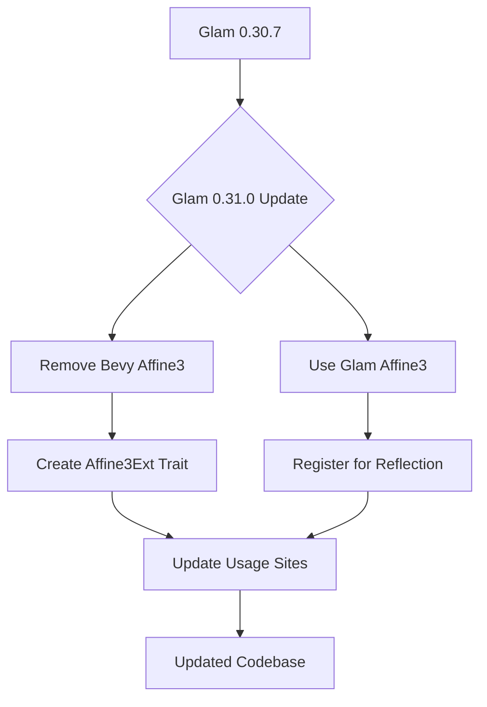

+++
title = "#22681 Glam 0.31"
date = "2026-01-25T00:00:00"
draft = false
template = "pull_request_page.html"
in_search_index = true

[taxonomies]
list_display = ["show"]

[extra]
current_language = "en"
available_languages = {"en" = { name = "English", url = "/pull_request/bevy/2026-01/pr-22681-en-20260125" }, "zh-cn" = { name = "中文", url = "/pull_request/bevy/2026-01/pr-22681-zh-cn-20260125" }}
labels = ["C-Dependencies", "A-Math", "M-Migration-Guide"]
+++

# Title

## Basic Information
- **Title**: Glam 0.31
- **PR Link**: https://github.com/bevyengine/bevy/pull/22681
- **Author**: hukasu
- **Status**: MERGED
- **Labels**: C-Dependencies, S-Ready-For-Final-Review, A-Math, M-Migration-Guide
- **Created**: 2026-01-24T14:53:34Z
- **Merged**: 2026-01-25T22:41:29Z
- **Merged By**: alice-i-cecile

## Description Translation
**Objective**

Adopt and closes #22665

**Solution**

Delete bevy's `Affine3`, create an extension trait for methods create for old bevy's `Affine3` to be used by glam's `Affine3`, and register glam's `Affine3` for reflection

**Testing**

`cargo run -p ci`

## The Story of This Pull Request

This PR updates Bevy's dependency on the glam math library from version 0.30.7 to 0.31.0. The primary challenge was that glam 0.31 introduced its own `Affine3` type, which conflicted with Bevy's custom `Affine3` struct that served as a storage-optimized version. This required a coordinated migration across the codebase to replace Bevy's custom type with glam's implementation while maintaining backward compatibility for existing functionality.

The core issue was straightforward: glam 0.31 introduced a new `Affine3` struct in its public API, making it impossible to have both Bevy's custom `Affine3` and glam's `Affine3` in the same namespace. Since using the upstream implementation from glam is preferable for maintenance and consistency, the decision was made to remove Bevy's version entirely.

However, Bevy's `Affine3` provided two utility methods that weren't available in glam's implementation: `to_transpose()` and `inverse_transpose_3x3()`. These methods were used throughout the rendering pipeline to format affine transformations for GPU buffer packing. Rather than losing this functionality or modifying glam's upstream type, the solution was to create an extension trait `Affine3Ext` that adds these methods to glam's `Affine3` type.

The implementation approach was methodical:

1. Update all Cargo.toml files to reference glam 0.31.0
2. Replace the custom `Affine3` struct in `bevy_math` with an extension trait
3. Update all usage sites to import and use the extension trait
4. Register glam's `Affine3` for reflection to maintain serialization capabilities
5. Update dependent crates like hexasphere that also needed version bumps

The key insight was recognizing that an extension trait provides a clean separation of concerns: glam provides the core affine transformation functionality, while Bevy adds domain-specific utilities needed for its rendering pipeline. This approach follows Rust's trait system design patterns and avoids modifying upstream dependencies.

The migration required updating approximately 11 files across the codebase, with most changes being mechanical conversions from `Affine3::from(&affine)` to `Affine3::from(affine)` and adding the `Affine3Ext` import where the utility methods were needed. The changes in rendering code were particularly important because affine transformations are fundamental to positioning and transforming objects in 3D space.

One notable aspect of the implementation is how the `to_transpose()` method works. It converts a 4x3 affine matrix (3x3 rotation/scale matrix + 3D translation vector) into a transposed 3x4 format suitable for GPU shader consumption. The method cleverly uses `Vec4` types where the fourth component stores the translation component, which matches the expected memory layout for GPU buffers.

```rust
// Before: Custom struct with methods
pub struct Affine3 {
    pub matrix3: Mat3,
    pub translation: Vec3,
}

impl Affine3 {
    pub fn to_transpose(&self) -> [Vec4; 3] { ... }
}

// After: Extension trait for glam's type
pub trait Affine3Ext {
    fn to_transpose(self) -> [Vec4; 3];
}

impl Affine3Ext for Affine3 {
    fn to_transpose(self) -> [Vec4; 3] {
        let transpose_3x3 = self.matrix3.transpose();
        [
            transpose_3x3.x_axis.extend(self.translation.x),
            transpose_3x3.y_axis.extend(self.translation.y),
            transpose_3x3.z_axis.extend(self.translation.z),
        ]
    }
}
```

The migration guide was created to help users update their code, noting that the `to_transpose` and `inverse_transpose_3x3` methods now require the `Affine3Ext` trait to be in scope. This is a minor breaking change but follows established Rust patterns for extension traits.

From a performance perspective, using glam's native `Affine3` type likely provides better optimization opportunities since it's implemented by the same team that specializes in high-performance graphics math. The removal of conversion layers between Bevy's `Affine3` and glam's `Affine3A` also eliminates some overhead.

The PR successfully modernizes Bevy's math dependencies while maintaining all existing functionality through careful use of Rust's trait system. The approach demonstrates how to handle upstream API changes in a large codebase with minimal disruption.

## Visual Representation



## Key Files Changed

**crates/bevy_math/src/affine3.rs (+10/-36)**
This file underwent the most significant change, transforming from a custom struct definition to an extension trait. The old `Affine3` struct was completely removed and replaced with `Affine3Ext` trait that provides the same utility methods for glam's `Affine3` type.

```rust
// Before: Custom struct with implementations
pub struct Affine3 {
    pub matrix3: Mat3,
    pub translation: Vec3,
}

impl Affine3 {
    pub fn to_transpose(&self) -> [Vec4; 3] { ... }
    pub fn inverse_transpose_3x3(&self) -> ([Vec4; 2], f32) { ... }
}

// After: Extension trait only
pub trait Affine3Ext {
    fn to_transpose(self) -> [Vec4; 3];
    fn inverse_transpose_3x3(self) -> ([Vec4; 2], f32);
}

impl Affine3Ext for Affine3 {
    fn to_transpose(self) -> [Vec4; 3] { ... }
    fn inverse_transpose_3x3(self) -> ([Vec4; 2], f32) { ... }
}
```

**crates/bevy_reflect/src/impls/glam.rs (+8/-0)**
Added reflection support for glam's `Affine3` type, which is necessary for serialization and deserialization workflows in Bevy's ECS.

```rust
impl_reflect!(
    #[reflect(Clone, Debug, PartialEq, Default, Deserialize, Serialize)]
    #[type_path = "glam"]
    struct Affine3 {
        matrix3: Mat3,
        translation: Vec3,
    }
);
```

**crates/bevy_pbr/src/render/mesh.rs (+5/-5)**
Updated mesh rendering code to use the new extension trait and remove references to the old `Affine3` type. The changes show the pattern of removing the reference operator when converting affine transformations.

```rust
// Before:
world_from_local: (&transform.affine()).into(),

// After:
world_from_local: transform.affine().into(),
```

**release-content/migration-guides/affine3_extension_trait.md (+9/-0)**
Created a migration guide explaining that the `to_transpose` and `inverse_transpose_3x3` methods are now part of an extension trait and require the trait to be in scope.

**Multiple Cargo.toml files**
Updated glam dependency from 0.30.7 to 0.31.0 across the entire project, ensuring consistency. Also updated hexasphere from 16.0 to 17.0 in bevy_mesh, which was likely required due to its own glam dependency.

## Further Reading

- [Rust Traits: Defining Shared Behavior](https://doc.rust-lang.org/book/ch10-02-traits.html) - Understanding extension traits
- [Glam Library Documentation](https://docs.rs/glam/) - Official documentation for the glam math library
- [Affine Transformations in Computer Graphics](https://en.wikipedia.org/wiki/Affine_transformation) - Mathematical background on affine transformations
- [Bevy Reflection System](https://bevyengine.org/learn/book/features/reflection/) - How Bevy handles serialization and runtime type information