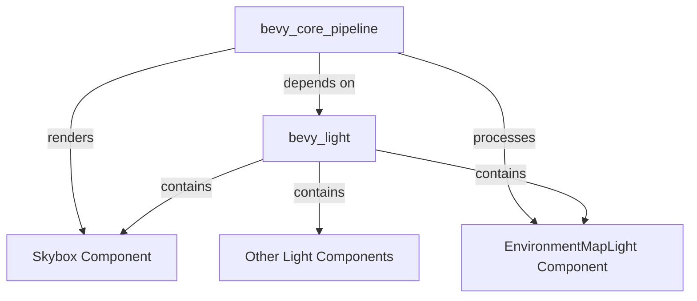

+++
title = "#22682 move Skybox to bevy_light"
date = "2026-01-25T00:00:00"
draft = false
template = "pull_request_page.html"
in_search_index = true

[taxonomies]
list_display = ["show"]

[extra]
current_language = "en"
available_languages = {"en" = { name = "English", url = "/pull_request/bevy/2026-01/pr-22682-en-20260125" }, "zh-cn" = { name = "中文", url = "/pull_request/bevy/2026-01/pr-22682-zh-cn-20260125" }}
labels = ["A-Rendering", "M-Migration-Guide", "D-Straightforward"]
+++

# Title
move Skybox to bevy_light

## Basic Information
- **Title**: move Skybox to bevy_light
- **PR Link**: https://github.com/bevyengine/bevy/pull/22682
- **Author**: atlv24
- **Status**: MERGED
- **Labels**: A-Rendering, S-Ready-For-Final-Review, M-Migration-Guide, D-Straightforward
- **Created**: 2026-01-24T16:42:35Z
- **Merged**: 2026-01-25T01:45:00Z
- **Merged By**: alice-i-cecile

## Description Translation

# Objective

- Skybox is a main world component for scene definition, it shouldnt be in a rendering crate

## Solution

- Move it to bevy_light, alongside EnvironmentMapLight component sibling which lets it influence lighting.

## Testing

- skybox example works

## The Story of This Pull Request

This PR addresses a code organization issue in the Bevy engine where the `Skybox` component was located in the wrong module from an architectural perspective. The core problem was that `Skybox` is fundamentally a scene definition component - it defines part of the visual environment - but it was placed in `bevy_core_pipeline`, which is focused on rendering implementation details rather than scene composition.

The developer recognized that `Skybox` logically belongs with other lighting and environment components, specifically alongside `EnvironmentMapLight` in the `bevy_light` crate. This is because both components define environmental visual properties, with `EnvironmentMapLight` affecting scene lighting and `Skybox` providing background rendering. Having them in the same crate creates better conceptual grouping and makes the API more intuitive for users.

The implementation approach was straightforward but required careful handling of cross-crate dependencies and trait implementations. The main technical challenge arose from Rust's orphan rules when moving the `Skybox` component to a different crate. Previously, `Skybox` implemented the `ExtractComponent` trait from `bevy_core_pipeline`, but after moving it to `bevy_light`, this implementation would violate Rust's orphan rule (cannot implement a foreign trait for a foreign type).

To solve this, the developer replaced the `ExtractComponent` trait implementation with a custom extraction system. Instead of using the automatic extraction provided by `ExtractComponentPlugin`, they created a manual extraction function `extract_skybox` that performs the same logic:

```rust
pub fn extract_skybox(
    mut commands: Commands,
    mut previous_len: Local<usize>,
    query: Extract<Query<(RenderEntity, &Skybox, Option<&Exposure>)>>,
) {
    let mut values = Vec::with_capacity(*previous_len);
    for (entity, skybox, exposure) in &query {
        // ... extraction logic
        values.push((entity, (skybox.clone(), uniforms)));
    }
    *previous_len = values.len();
    commands.try_insert_batch(values);
}
```

This function is then registered in the render app's `ExtractSchedule` system set. The approach maintains the same functionality while working around the orphan rule limitation.

The move also required updating the crate dependencies. `bevy_core_pipeline` now depends on `bevy_light` since it still needs to process `Skybox` components during rendering. This dependency direction makes sense because rendering systems need to understand scene components, but scene components shouldn't depend on rendering implementation details.

From a code architecture perspective, this change improves separation of concerns. `bevy_light` now contains all environment-related components (`Skybox`, `EnvironmentMapLight`, `IrradianceVolume`, etc.), while `bevy_core_pipeline` focuses on the rendering pipeline implementation. This makes the codebase more maintainable and easier for new contributors to navigate.

The impact of this change is primarily organizational rather than functional. All existing functionality is preserved, but users need to update their import statements from `bevy::core_pipeline::Skybox` to `bevy::light::Skybox`. The PR includes a migration guide to help users with this transition.

The technical lesson here is about managing Rust's orphan rules when refactoring code across crate boundaries. The solution demonstrates a pattern for replacing trait implementations with manual systems when automatic derivation isn't possible due to crate separation.

## Visual Representation



## Key Files Changed

1. **`crates/bevy_core_pipeline/src/skybox/mod.rs`** (+32/-68)
   - Removed the `Skybox` component definition and `ExtractComponent` implementation
   - Added `extract_skybox` function to manually extract skybox data
   - Added import for `Skybox` from `bevy_light`
   - Updated plugin to use manual extraction instead of `ExtractComponentPlugin`

```rust
// Before (in bevy_core_pipeline):
#[derive(Component, Clone, Reflect)]
#[reflect(Component, Default, Clone)]
pub struct Skybox {
    pub image: Handle<Image>,
    pub brightness: f32,
    pub rotation: Quat,
}

impl ExtractComponent for Skybox {
    // Trait implementation for automatic extraction
}

// After (in bevy_light):
#[derive(Component, Clone, Reflect)]
#[reflect(Component, Default, Clone)]
pub struct Skybox {
    pub image: Handle<Image>,
    pub brightness: f32,
    pub rotation: Quat,
}

// In bevy_core_pipeline:
pub fn extract_skybox(
    mut commands: Commands,
    mut previous_len: Local<usize>,
    query: Extract<Query<(RenderEntity, &Skybox, Option<&Exposure>)>>,
) {
    // Manual extraction logic
}
```

2. **`crates/bevy_light/src/probe.rs`** (+31/-0)
   - Added the `Skybox` component definition to this file
   - Now contains both `Skybox` and `EnvironmentMapLight` in the same module

3. **`crates/bevy_core_pipeline/Cargo.toml`** (+1/-0)
   - Added dependency on `bevy_light` crate
   - Necessary because rendering systems need to access `Skybox` component

4. **`examples/3d/skybox.rs`** and 11 other example files
   - Updated import statements from `bevy::core_pipeline::Skybox` to `bevy::light::Skybox`
   - Ensures examples compile and work correctly after the move

```rust
// Before in examples:
use bevy::core_pipeline::Skybox;

// After in examples:
use bevy::light::Skybox;
```

5. **`release-content/migration-guides/skybox.md`** (+6/-0)
   - Created migration guide documenting the change
   - Helps users update their code when upgrading Bevy versions

## Further Reading

1. **Rust Orphan Rules**: Understanding Rust's coherence rules and orphan rules is essential when working with traits across crate boundaries.
2. **Bevy ECS Extraction**: The Bevy renderer uses an extraction phase to copy data from the main world to the render world. The `ExtractComponent` trait automates this process.
3. **Bevy Module Organization**: Bevy's architecture separates scene definition (components, systems) from rendering implementation (pipelines, shaders).
4. **Environment Mapping Techniques**: Both skyboxes and environment maps are techniques for rendering distant environments; understanding their relationship helps appreciate why these components belong together.