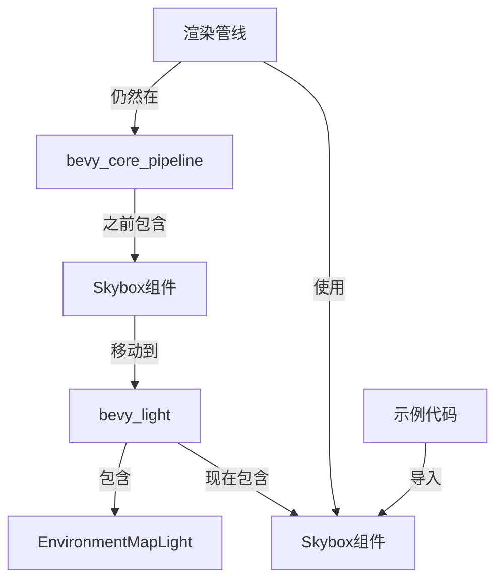

+++
title = "#22682 move Skybox to bevy_light"
date = "2026-01-25T00:00:00"
draft = false
template = "pull_request_page.html"
in_search_index = false

[extra]
current_language = "zh-cn"
available_languages = {"en" = { name = "English", url = "/pull_request/bevy/2026-01/pr-22682-en-20260125" }, "zh-cn" = { name = "中文", url = "/pull_request/bevy/2026-01/pr-22682-zh-cn-20260125" }}
+++

# move Skybox to bevy_light

## 基本信息
- **标题**: move Skybox to bevy_light
- **PR链接**: https://github.com/bevyengine/bevy/pull/22682
- **作者**: atlv24
- **状态**: 已合并
- **标签**: A-Rendering, S-Ready-For-Final-Review, M-Migration-Guide, D-Straightforward
- **创建时间**: 2026-01-24T16:42:35Z
- **合并时间**: 2026-01-25T01:45:00Z
- **合并者**: alice-i-cecile

## 描述翻译

# 目标

- Skybox是用于场景定义的主要世界组件，它不应该在渲染crate中

## 解决方案

- 将其移动到bevy_light，与EnvironmentMapLight组件放在一起，后者让它影响光照。

## 测试

- skybox示例可以工作

## 这个PR的故事

这次PR的核心目标是解决Skybox组件在代码库中的位置问题。Skybox作为场景定义的核心组件，原先被放置在`bevy_core_pipeline`这个渲染管线crate中，这在架构上不够合理。`bevy_core_pipeline`主要处理渲染流程和管线，而Skybox作为影响场景外观和光照的组件，应该与相关的光照组件放在一起。

问题的关键在于模块职责的划分。在原始设计中，Skybox虽然用于渲染背景，但它本质上是一个场景配置组件，与`EnvironmentMapLight`这类影响光照的环境映射组件密切相关。将它们分离在不同的crate中会导致代码组织不清晰，增加了开发者的认知负担。

解决方案是进行组件迁移。开发者决定将Skybox组件从`bevy_core_pipeline`移动到`bevy_light`crate中，使其与`EnvironmentMapLight`组件位于同一模块。这个决策基于以下几个技术考虑：
1. 功能相关性：Skybox和EnvironmentMapLight都处理环境映射和场景光照
2. 架构一致性：将场景定义组件与渲染实现分离
3. 开发者体验：相关的功能应该放在一起便于查找和使用

实施这个迁移需要解决几个技术挑战。由于Bevy使用ECS架构，组件的移动不仅涉及定义位置的改变，还需要处理渲染管线的提取系统。一个关键问题是"孤儿规则"（orphan rule）的限制——不能为外部类型实现外部特征。具体来说，Skybox现在定义在`bevy_light`中，但渲染提取逻辑在`bevy_core_pipeline`中，无法直接使用`ExtractComponent`特征。

开发者通过创建自定义的提取系统来绕过这个限制。在`bevy_core_pipeline/src/skybox/mod.rs`中，他们移除了`ExtractComponent`的实现，改为添加一个`extract_skybox`系统：

```rust
pub fn extract_skybox(
    mut commands: Commands,
    mut previous_len: Local<usize>,
    query: Extract<Query<(RenderEntity, &Skybox, Option<&Exposure>)>>,
) {
    let mut values = Vec::with_capacity(*previous_len);
    for (entity, skybox, exposure) in &query {
        let exposure = exposure
            .map(Exposure::exposure)
            .unwrap_or_else(|| Exposure::default().exposure());
        let uniforms = SkyboxUniforms {
            brightness: skybox.brightness * exposure,
            transform: Transform::from_rotation(skybox.rotation.inverse()).to_matrix(),
            #[cfg(all(feature = "webgl", target_arch = "wasm32", not(feature = "webgpu")))]
            _webgl2_padding_8b: 0,
            #[cfg(all(feature = "webgl", target_arch = "wasm32", not(feature = "webgpu")))]
            _webgl2_padding_12b: 0,
            #[cfg(all(feature = "webgl", target_arch = "wasm32", not(feature = "webgpu")))]
            _webgl2_padding_16b: 0,
        };
        values.push((entity, (skybox.clone(), uniforms)));
    }
    *previous_len = values.len();
    commands.try_insert_batch(values);
}
```

这个系统手动提取Skybox组件及其相关的uniform数据，保持了渲染管线的功能完整性。同时，Skybox组件本身的定义被完全移动到`bevy_light/src/probe.rs`中：

```rust
/// Adds a skybox to a 3D camera, based on a cubemap texture.
///
/// Note that this component does not (currently) affect the scene's lighting.
/// To do so, use `EnvironmentMapLight` alongside this component.
///
/// See also <https://en.wikipedia.org/wiki/Skybox_(video_games)>.
#[derive(Component, Clone, Reflect)]
#[reflect(Component, Default, Clone)]
pub struct Skybox {
    pub image: Handle<Image>,
    /// Scale factor applied to the skybox image.
    /// After applying this multiplier to the image samples, the resulting values should
    /// be in units of [cd/m^2](https://en.wikipedia.org/wiki/Candela_per_square_metre).
    pub brightness: f32,

    /// View space rotation applied to the skybox cubemap.
    /// This is useful for users who require a different axis, such as the Z-axis, to serve
    /// as the vertical axis.
    pub rotation: Quat,
}
```

迁移的另一个重要方面是更新所有使用Skybox的示例代码。PR修改了12个示例文件，将导入路径从`bevy::core_pipeline::Skybox`改为`bevy::light::Skybox`。这是一个直接但必要的工作，确保示例代码与新的API保持一致。

从技术架构的角度看，这个PR体现了几个重要的设计原则：
1. **关注点分离**：渲染管线实现与场景组件定义分离
2. **模块内聚性**：相关功能聚集在同一模块中
3. **向后兼容性**：通过迁移指南和示例更新确保平稳过渡

这次重构的影响主要体现在代码组织上，而不是功能上。对于最终用户，Skybox的功能保持不变，只是导入路径发生了变化。对于Bevy开发者，这个改动提高了代码的可维护性，使得与光照相关的组件更加集中，便于未来的扩展和修改。

一个值得注意的技术细节是，尽管Skybox被移动到了`bevy_light`，但其渲染逻辑仍然保留在`bevy_core_pipeline`中。这种分离是合理的，因为渲染管线的实现细节与组件定义可以独立演化。这种架构允许不同的团队或贡献者分别关注场景定义和渲染优化。

## 视觉表示



## 关键文件更改

### 1. `crates/bevy_light/src/probe.rs` (+31/-0)
**变更描述**：将Skybox组件定义从`bevy_core_pipeline`移动到此文件
**代码示例**：
```rust
/// Adds a skybox to a 3D camera, based on a cubemap texture.
///
/// Note that this component does not (currently) affect the scene's lighting.
/// To do so, use `EnvironmentMapLight` alongside this component.
///
/// See also <https://en.wikipedia.org/wiki/Skybox_(video_games)>.
#[derive(Component, Clone, Reflect)]
#[reflect(Component, Default, Clone)]
pub struct Skybox {
    pub image: Handle<Image>,
    /// Scale factor applied to the skybox image.
    /// After applying this multiplier to the image samples, the resulting values should
    /// be in units of [cd/m^2](https://en.wikipedia.org/wiki/Candela_per_square_metre).
    pub brightness: f32,

    /// View space rotation applied to the skybox cubemap.
    /// This is useful for users who require a different axis, such as the Z-axis, to serve
    /// as the vertical axis.
    pub rotation: Quat,
}
```

### 2. `crates/bevy_core_pipeline/src/skybox/mod.rs` (+32/-68)
**变更描述**：移除Skybox组件定义，添加自定义提取系统来绕过孤儿规则限制
**代码示例**：
```rust
// 之前：使用ExtractComponent特征
impl ExtractComponent for Skybox {
    type QueryData = (&'static Self, Option<&'static Exposure>);
    type QueryFilter = ();
    type Out = (Self, SkyboxUniforms);

    fn extract_component(
        (skybox, exposure): QueryItem<'_, '_, Self::QueryData>,
    ) -> Option<Self::Out> {
        // ... 提取逻辑
    }
}

// 之后：使用自定义提取系统
pub fn extract_skybox(
    mut commands: Commands,
    mut previous_len: Local<usize>,
    query: Extract<Query<(RenderEntity, &Skybox, Option<&Exposure>)>>,
) {
    // ... 手动提取逻辑
}
```

### 3. `examples/3d/skybox.rs` (+1/-1)
**变更描述**：更新示例中的导入路径
**代码示例**：
```rust
// 之前：
use bevy::core_pipeline::Skybox;

// 之后：
use bevy::light::Skybox;
```

### 4. `release-content/migration-guides/skybox.md` (+6/-0)
**变更描述**：添加迁移指南文档
**代码示例**：
```markdown
---
title: "`Skybox` moved to `bevy_light`"
pull_requests: [22682]
---

`Skybox` has been moved from `bevy_core_pipelines` to `bevy_light`.
```

### 5. `crates/bevy_core_pipeline/Cargo.toml` (+1/-0)
**变更描述**：添加对`bevy_light`的依赖
**代码示例**：
```toml
bevy_light = { path = "../bevy_light", version = "0.19.0-dev" }
```

## 进一步阅读

1. **Bevy ECS架构**：了解Bevy的实体组件系统如何工作，特别是组件和系统的组织方式
2. **Rust孤儿规则**：理解为什么不能为外部类型实现外部特征，以及如何绕过这一限制
3. **Bevy渲染管线**：学习Bevy的渲染系统如何组织，特别是提取阶段的作用
4. **模块化设计原则**：探索如何在大型代码库中合理组织模块和crate
5. **Bevy迁移指南**：查看其他组件的迁移历史，了解Bevy API的演变模式