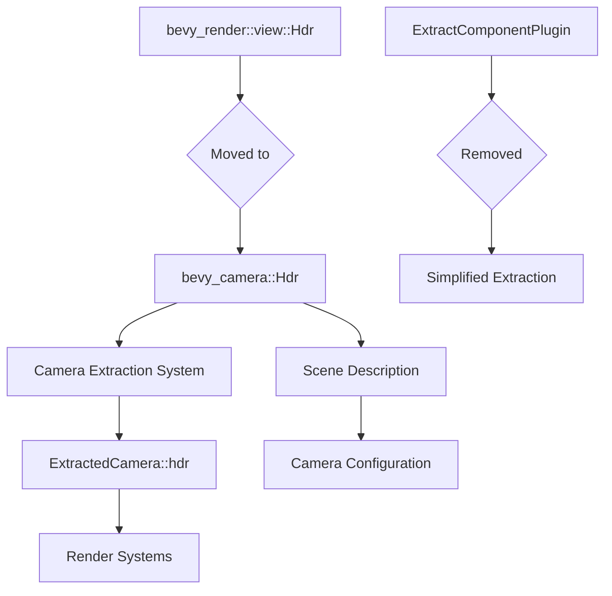

+++
title = "#22683 move Hdr to bevy_camera"
date = "2026-01-24T00:00:00"
draft = false
template = "pull_request_page.html"
in_search_index = true

[taxonomies]
list_display = ["show"]

[extra]
current_language = "en"
available_languages = {"en" = { name = "English", url = "/pull_request/bevy/2026-01/pr-22683-en-20260124" }, "zh-cn" = { name = "中文", url = "/pull_request/bevy/2026-01/pr-22683-zh-cn-20260124" }}
labels = ["A-Rendering", "M-Migration-Guide"]
+++

# Title
move Hdr to bevy_camera

## Basic Information
- **Title**: move Hdr to bevy_camera
- **PR Link**: https://github.com/bevyengine/bevy/pull/22683
- **Author**: atlv24
- **Status**: MERGED
- **Labels**: A-Rendering, M-Migration-Guide
- **Created**: 2026-01-24T17:43:57Z
- **Merged**: 2026-01-24T21:58:03Z
- **Merged By**: james7132

## Description Translation

# Objective

- whether a Camera needs to draw Hdr content or not is an aspect of scene description
- as such, it should live in a non-rendering crate

## Solution

- move it to bevy_camera
- dont extract it to the render world anymore. audited all usages of it and none are in the render world queries, instead `ExtractedCamera::hdr` is used.

## Testing

- manual spot check of a few examples
- example runner regression test

## The Story of This Pull Request

This PR addresses a fundamental architectural concern in Bevy's camera system: the proper separation between scene description and rendering implementation. The core issue was that the `Hdr` component, which determines whether a camera should use high dynamic range rendering, was located in the rendering crate (`bevy_render`) rather than with other camera configuration components in `bevy_camera`.

The developer identified that whether a camera needs HDR capabilities is fundamentally a scene description concern. In Bevy's architecture, scene description components should reside in non-rendering crates to maintain clear separation of concerns. The `bevy_camera` crate already contains other camera configuration components like `Camera`, `Camera3d`, `Exposure`, and various camera-related settings, making it the logical home for `Hdr`.

The implementation approach was straightforward but required careful analysis. The developer moved the `Hdr` component definition from `bevy_render::view` to `bevy_camera::components`. This involved more than just moving the struct definition - it required updating import statements across 10 crates and 19 example files to reflect the new location.

A key insight emerged during the implementation audit: the `Hdr` component was being extracted to the render world via `ExtractComponentPlugin`, but no render world queries were actually using the extracted component. Instead, render systems were accessing HDR information through `ExtractedCamera::hdr`, which is populated during camera extraction. This discovery allowed the developer to remove the extraction system entirely, simplifying the codebase.

The technical implementation demonstrates good software engineering practices. By moving `Hdr` to `bevy_camera`, the codebase now has better organization - all camera configuration lives together. The removal of unnecessary extraction reduces system overhead and makes the data flow clearer. Systems that need HDR information during rendering can continue using `ExtractedCamera::hdr`, which is already being populated from the camera component.

The migration guide was added to help users update their code, indicating that imports need to change from `bevy_render::view::Hdr` to `bevy_camera::Hdr`. The guide also notes that the component is no longer extracted to the render world, which could affect any custom render systems that might have been querying for it directly.

## Visual Representation



## Key Files Changed

### `crates/bevy_render/src/view/mod.rs` (+0/-11)
This file lost the `Hdr` component definition and its associated `ExtractComponentPlugin` registration. The component was removed from the view module entirely since it's no longer a rendering concern.

```rust
// Before (removed):
#[derive(
    Component, Default, Copy, Clone, ExtractComponent, Reflect, PartialEq, Eq, Hash, Debug,
)]
#[reflect(Component, Default, PartialEq, Hash, Debug)]
pub struct Hdr;
```

### `crates/bevy_camera/src/components.rs` (+8/-0)
The `Hdr` component was added to the camera components module, where it logically belongs with other camera configuration.

```rust
// After (added):
/// If this component is added to a camera, the camera will use an intermediate "high dynamic range" render texture.
/// This allows rendering with a wider range of lighting values. However, this does *not* affect
/// whether the camera will render with hdr display output (which bevy does not support currently)
/// and only affects the intermediate render texture.
#[derive(Component, Default, Copy, Clone, Reflect, PartialEq, Eq, Hash, Debug)]
#[reflect(Component, Default, PartialEq, Hash, Debug)]
pub struct Hdr;
```

### `crates/bevy_render/src/camera.rs` (import changes)
This file shows how the import was updated to use the new location of `Hdr`. The camera extraction system continues to work with `Hdr` but now gets it from `bevy_camera`.

```rust
// Before:
use bevy_camera::{
    // ... other imports
};
use bevy_render::view::Hdr;

// After:
use bevy_camera::{
    // ... other imports, including Hdr
    Hdr,
};
```

### `release-content/migration-guides/hdr.md` (+8/-0)
A new migration guide was added to help users update their code. This is important for a breaking change like moving a component between crates.

```markdown
---
title: "`Hdr` moved to `bevy_camera`"
pull_requests: [22683]
---

`Hdr` has been moved from `bevy_render` to `bevy_camera`.

Furthermore, it is no longer extracted to the render world. If you were relying on its presence in the render world, consider using `ExtractedCamera::hdr` instead.
```

### `examples/3d/ssr.rs` (+2/-4)
This example demonstrates typical import changes required throughout the codebase. The import for `Hdr` was updated from the render module to the camera module.

```rust
// Before:
use bevy::render::view::Hdr;

// After:
use bevy::camera::Hdr;
```

### `examples/large_scenes/caldera_hotel/src/main.rs` (+5/-2)
This example shows how multiple camera-related imports can be consolidated. The `Hdr` import was moved to be with other camera imports.

```rust
// Before:
use bevy::camera::visibility::{NoCpuCulling, NoFrustumCulling};
use bevy::render::view::Hdr;

// After:
use bevy::camera::{
    visibility::{NoCpuCulling, NoFrustumCulling},
    Hdr,
};
```

## Further Reading

1. **Bevy ECS Architecture**: Understanding Bevy's Entity Component System is essential for working with components like `Hdr`.
2. **Camera System Documentation**: The `bevy_camera` crate documentation provides details on camera components and systems.
3. **Render Graph Architecture**: To understand how `ExtractedCamera` works in the rendering pipeline.
4. **Component Extraction Patterns**: The `ExtractComponent` trait and how data flows from the main world to the render world.
5. **High Dynamic Range Rendering**: Technical background on HDR rendering techniques and their implementation in game engines.