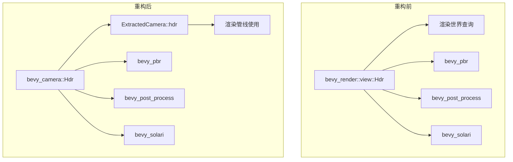

+++
title = "#22683 move Hdr to bevy_camera"
date = "2026-01-24T00:00:00"
draft = false
template = "pull_request_page.html"
in_search_index = false

[extra]
current_language = "zh-cn"
available_languages = {"en" = { name = "English", url = "/pull_request/bevy/2026-01/pr-22683-en-20260124" }, "zh-cn" = { name = "中文", url = "/pull_request/bevy/2026-01/pr-22683-zh-cn-20260124" }}
+++

# Title

## 基本信息
- **标题**: move Hdr to bevy_camera
- **PR链接**: https://github.com/bevyengine/bevy/pull/22683
- **作者**: atlv24
- **状态**: 已合并
- **标签**: A-Rendering, M-Migration-Guide
- **创建时间**: 2026-01-24T17:43:57Z
- **合并时间**: 2026-01-24T21:58:03Z
- **合并者**: james7132

## 描述翻译
此PR的主要目标是将`Hdr`组件从`bevy_render` crate移动到`bevy_camera` crate。

### 目标
- 摄像机是否需要绘制HDR内容属于场景描述的一个方面
- 因此，它应该存在于非渲染crate中

### 解决方案
- 将其移动到bevy_camera
- 不再将其提取到渲染世界。审核了所有使用它的地方，没有发现它在渲染世界查询中使用，而是使用`ExtractedCamera::hdr`

### 测试
- 手动抽查了几个示例
- 示例运行器回归测试

## 此PR的故事

这个PR的故事始于对Bevy引擎代码架构的一次整理。开发者发现`Hdr`组件的放置位置存在逻辑不一致的问题，于是开始了一次精确的代码重构。

问题的核心在于`Hdr`组件的定位不符合Bevy的架构设计原则。`Hdr`组件控制摄像机是否使用高动态范围渲染纹理，这本质上是对摄像机行为的描述，属于场景配置的一部分。按照Bevy的设计模式，场景配置相关的组件应该放在`bevy_camera`这样的非渲染crate中，而`bevy_render`应该专注于渲染实现细节。然而在实际代码中，`Hdr`组件却被定义在`bevy_render::view`模块中。

这种不一致性带来的问题不仅仅是代码组织上的混乱。从工程角度看，它违反了关注点分离原则，导致渲染系统需要处理本应属于场景层的配置逻辑。更重要的是，这会给新开发者带来困惑，让他们难以理解Bevy的架构模式。

开发者采取了直接而清晰的解决方案：将`Hdr`组件从`bevy_render`移动到`bevy_camera`。这个解决方案的关键洞察是仔细审查了所有使用`Hdr`的地方，发现了一个重要的事实：没有代码在渲染世界查询中直接使用`Hdr`组件，而是通过`ExtractedCamera::hdr`来访问这个信息。

这一发现使得迁移变得更加简单和安全。由于`Hdr`实际上已经通过`ExtractedCamera`在渲染世界中使用，我们不需要改变渲染管线的核心逻辑，只需要更新组件定义的位置和所有导入这个组件的代码。

在实现过程中，开发者执行了系统性的修改：

1. 首先在`bevy_camera/src/components.rs`中定义了新的`Hdr`组件：
```rust
/// If this component is added to a camera, the camera will use an intermediate "high dynamic range" render texture.
/// This allows rendering with a wider range of lighting values. However, this does *not* affect
/// whether the camera will render with hdr display output (which bevy does not support currently)
/// and only affects the intermediate render texture.
#[derive(Component, Default, Copy, Clone, Reflect, PartialEq, Eq, Hash, Debug)]
#[reflect(Component, Default, PartialEq, Hash, Debug)]
pub struct Hdr;
```

2. 然后从`bevy_render/src/view/mod.rs`中移除了原有的`Hdr`定义，并移除了相应的`ExtractComponentPlugin::<Hdr>::default()`注册。

3. 更新了所有使用`bevy_render::view::Hdr`的导入语句，改为使用`bevy_camera::Hdr`。

技术上的一个重要细节是，虽然`Hdr`组件不再被提取到渲染世界，但它的信息仍然通过`ExtractedCamera::hdr`字段在渲染管线中使用。这意味着渲染系统不需要直接访问`Hdr`组件，而是通过已提取的摄像机数据来获取HDR配置。这种设计保持了渲染世界的独立性，同时确保了功能的连续性。

从架构角度来看，这次重构有几点值得注意：
- 保持了向后兼容性：所有使用`Hdr`组件的现有代码只需更新导入路径即可
- 提高了代码的清晰度：现在所有摄像机相关的配置都在同一个crate中
- 遵循了Bevy的设计模式：场景配置与渲染实现分离

这次修改的影响范围相当广泛，涉及到19个示例文件的更新，包括从简单的3D示例到大型场景示例。这表明`Hdr`在Bevy的渲染系统中是一个基础且广泛使用的组件。

有趣的是，虽然这个PR看起来只是移动代码位置，但它实际上反映了Bevy架构中一个重要模式的发展：清晰地区分场景描述（在`bevy_camera`中）和渲染实现（在`bevy_render`中）。这种分离使得代码更易于理解和维护，特别是在多人协作的大型项目中。

## 视觉表示



## 关键文件变更

### 1. `crates/bevy_render/src/view/mod.rs` (+0/-11)
**变更原因**：从`bevy_render`中移除`Hdr`组件定义和提取插件注册
```rust
// 移除前的代码片段（注释形式展示）：
// #[derive(
//     Component, Default, Copy, Clone, ExtractComponent, Reflect, PartialEq, Eq, Hash, Debug,
// )]
// #[reflect(Component, Default, PartialEq, Hash, Debug)]
// pub struct Hdr;

// 从插件注册中移除：
// .add_plugins((
//     ExtractComponentPlugin::<Hdr>::default(),  // 这行被移除
//     ExtractComponentPlugin::<Msaa>::default(),
// ))
```
**与整体PR的关系**：这是重构的核心，将`Hdr`从渲染crate中完全移除，符合架构设计原则。

### 2. `crates/bevy_camera/src/components.rs` (+8/-0)
**变更原因**：在`bevy_camera`中添加`Hdr`组件定义
```rust
/// If this component is added to a camera, the camera will use an intermediate "high dynamic range" render texture.
/// This allows rendering with a wider range of lighting values. However, this does *not* affect
/// whether the camera will render with hdr display output (which bevy does not support currently)
/// and only affects the intermediate render texture.
#[derive(Component, Default, Copy, Clone, Reflect, PartialEq, Eq, Hash, Debug)]
#[reflect(Component, Default, PartialEq, Hash, Debug)]
pub struct Hdr;
```
**与整体PR的关系**：这是重构的目的地，将`Hdr`组件放置在逻辑上正确的位置。

### 3. `release-content/migration-guides/hdr.md` (+8/-0)
**变更原因**：创建迁移指南，帮助用户适应这一变更
```markdown
---
title: "`Hdr` moved to `bevy_camera`"
pull_requests: [22683]
---

`Hdr` has been moved from `bevy_render` to `bevy_camera`.

Furthermore, it is no longer extracted to the render world. If you were relying on its presence in the render world, consider using `ExtractedCamera::hdr` instead.
```
**与整体PR的关系**：提供向后兼容性和用户指导，是工程完整性的体现。

### 4. `examples/large_scenes/caldera_hotel/src/main.rs` (+5/-2)
**变更原因**：更新大型场景示例中的导入语句
```rust
// 变更前：
use bevy::render::view::{Hdr, NoIndirectDrawing};

// 变更后：
use bevy::camera::{
    visibility::{NoCpuCulling, NoFrustumCulling},
    Hdr,
};
use bevy::render::view::NoIndirectDrawing;
```
**与整体PR的关系**：展示了实际使用中的修改模式，从`bevy_render::view::Hdr`改为`bevy_camera::Hdr`。

### 5. `examples/3d/ssr.rs` (+2/-4)
**变更原因**：更新屏幕空间反射示例中的导入
```rust
// 变更前：
use bevy::{
    render::{
        render_resource::{AsBindGroup, ShaderType},
        view::Hdr,
    },
};

// 变更后：
use bevy::{
    camera::Hdr,
    render::render_resource::{AsBindGroup, ShaderType},
};
```
**与整体PR的关系**：展示了典型的导入更新模式，保持了渲染相关导入的清晰性。

## 延伸阅读

1. **Bevy架构指南**: 了解Bevy的ECS架构和crate组织原则
2. **组件提取系统**: 学习Bevy中组件如何从主世界提取到渲染世界
3. **渲染管线设计**: 理解现代游戏引擎的渲染架构
4. **关注点分离原则**: 软件工程中的基础设计模式，对维护大型代码库至关重要
5. **向后兼容性策略**: 如何在重构时保持API的稳定性