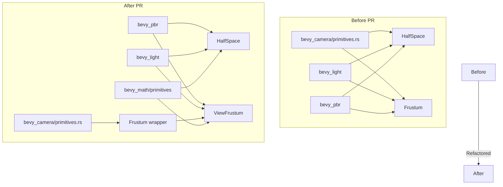

+++
title = "#22684 Move `HalfSpace` and some of `Frustum` (renamed to `ViewFrustum`) from `bevy_camera` to `bevy_math`"
date = "2026-01-27T00:00:00"
draft = false
template = "pull_request_page.html"
in_search_index = true

[taxonomies]
list_display = ["show"]

[extra]
current_language = "en"
available_languages = {"en" = { name = "English", url = "/pull_request/bevy/2026-01/pr-22684-en-20260127" }, "zh-cn" = { name = "中文", url = "/pull_request/bevy/2026-01/pr-22684-zh-cn-20260127" }}
labels = ["A-Rendering", "C-Code-Quality", "A-Math", "M-Migration-Guide", "X-Contentious", "D-Modest"]
+++

# Title: Move `HalfSpace` and some of `Frustum` (renamed to `ViewFrustum`) from `bevy_camera` to `bevy_math`

## Basic Information
- **Title**: Move `HalfSpace` and some of `Frustum` (renamed to `ViewFrustum`) from `bevy_camera` to `bevy_math`
- **PR Link**: https://github.com/bevyengine/bevy/pull/22684
- **Author**: kfc35
- **Status**: MERGED
- **Labels**: A-Rendering, C-Code-Quality, S-Ready-For-Final-Review, A-Math, M-Migration-Guide, X-Contentious, D-Modest
- **Created**: 2026-01-24T19:04:54Z
- **Merged**: 2026-01-27T06:44:28Z
- **Merged By**: alice-i-cecile

## Description Translation

# Objective

- Does the latter half of #13945 
- Does the first two thirds of #13878 
- Finish some of what #13882 started

## Solution

- Moves `bevy_camera::primitives::HalfSpace` to `bevy_math::primitives::HalfSpace` (first commit)
- Moves some of `bevy_camera::primitives::Frustum` to `bevy_math::primitives::ViewFrustum` (second commit)
- I basically followed Jondolf’s directions on the two refactorings. aabb, obb, and sphere stuff stays in bevy_camera (for now? If sphere is refactored, it has been stressed to be done as a follow up )

## Testing

I ran the `lighting`, `2d_gizmos`, and `3d_gizmos` example just to make sure the lights… and camera… (and action!) were still working. Everything seems to be fine there compared to main. If there are any other examples I should run to make sure things look good, let me know.

## The Story of This Pull Request

This PR addresses a structural issue in Bevy's codebase where mathematical primitives that are widely useful across multiple subsystems were incorrectly located within the camera module. The problem was that `HalfSpace` and the core geometric representation of `Frustum` are general-purpose mathematical concepts, not specific to cameras. By placing them in `bevy_camera`, other parts of the engine that needed these primitives had to depend on the camera module unnecessarily, creating circular dependencies and reducing code reusability.

The developer approached this by separating concerns: moving the pure mathematical definitions to `bevy_math` while keeping the camera-specific functionality in `bevy_camera`. For `HalfSpace`, this was straightforward - the entire struct and its methods were moved. For `Frustum`, the approach was more nuanced. The geometric representation (six half-spaces and construction methods from projection matrices) was moved to `bevy_math` as `ViewFrustum`, while the camera component wrapper remained in `bevy_camera` as `Frustum`, now using the newtype pattern with `Deref` and `DerefMut` derives.

The implementation required careful updates across the codebase. In `bevy_camera/src/primitives.rs`, the `Frustum` struct became a simple wrapper around `ViewFrustum`. The construction methods that were moved to `ViewFrustum` needed to be called and wrapped appropriately. This pattern is visible in the `compute_frustum` method in `projection.rs`:

```rust
// Before:
Frustum::from_clip_from_world_custom_far(...)

// After:
Frustum(ViewFrustum::from_clip_from_world_custom_far(...))
```

Lighting modules (`directional_light.rs`, `point_light.rs`, `spot_light.rs`) similarly updated their frustum construction to use the new `ViewFrustum` methods. The PBR renderer needed updates to reference the moved `HalfSpace` and use `ViewFrustum` constants instead of `Frustum` constants.

An important technical decision was to leave AABB, OBB, and sphere primitives in `bevy_camera` for now. These may be moved in a follow-up PR, but the current changeset focuses on the most widely reused primitives. The migration guide provides clear examples of how to update code, showing both direct construction patterns and factory method usage.

The changes maintain backward compatibility through the newtype wrapper pattern. The `Frustum` component in `bevy_camera` still exists and functions the same way, but now delegates to the underlying `ViewFrustum`. This means existing code that uses `Frustum` as a component continues to work, while code that needs the mathematical representation can now use `ViewFrustum` from `bevy_math` without camera dependencies.

The impact is cleaner separation of concerns and reduced coupling between modules. Lighting systems no longer need to depend on camera code to use geometric primitives, and `bevy_math` becomes a more complete mathematical library. This aligns with the long-term goal of making Bevy's modules more modular and reusable.

## Visual Representation



## Key Files Changed

### 1. `crates/bevy_camera/src/primitives.rs` (+16/-135)
**What changed:** The `HalfSpace` struct was removed entirely, and `Frustum` was converted to a newtype wrapper around `ViewFrustum`. The construction methods for frustums were moved to `bevy_math`.

**Key code changes:**
```rust
// Before:
pub struct Frustum {
    pub half_spaces: [HalfSpace; 6],
}

impl Frustum {
    pub const NEAR_PLANE_IDX: usize = 4;
    const FAR_PLANE_IDX: usize = 5;
    
    pub fn from_clip_from_world(clip_from_world: &Mat4) -> Self { ... }
    pub fn from_clip_from_world_custom_far(...) -> Self { ... }
}

// After:
#[derive(Component, Clone, Copy, Debug, Default, Deref, DerefMut, Reflect)]
#[reflect(Component, Default, Debug, Clone)]
pub struct Frustum(pub ViewFrustum);

impl Frustum {
    // Construction methods removed - now use ViewFrustum methods
}
```

### 2. `crates/bevy_math/src/primitives/view_frustum.rs` (+86/-0)
**What changed:** New file containing the `ViewFrustum` struct with frustum construction logic moved from `bevy_camera`.

**Key code:**
```rust
pub struct ViewFrustum {
    pub half_spaces: [HalfSpace; 6],
}

impl ViewFrustum {
    pub const NEAR_PLANE_IDX: usize = 4;
    pub const FAR_PLANE_IDX: usize = 5;
    
    pub fn from_clip_from_world(clip_from_world: &Mat4) -> Self { ... }
    pub fn from_clip_from_world_custom_far(...) -> Self { ... }
}
```

### 3. `crates/bevy_math/src/primitives/half_space.rs` (+78/-0)
**What changed:** New file containing the `HalfSpace` struct moved from `bevy_camera`.

**Key code:**
```rust
pub struct HalfSpace {
    normal_d: Vec4,
}

impl HalfSpace {
    pub fn new(normal_d: Vec4) -> Self { ... }
    pub fn normal(&self) -> Vec3A { ... }
    pub fn d(&self) -> f32 { ... }
    pub fn normal_d(&self) -> Vec4 { ... }
}
```

### 4. `release-content/migration-guides/camera_primitives_moved.md` (+30/-0)
**What changed:** New migration guide explaining how to update code for the moved primitives.

**Key content:**
```markdown
`bevy_camera::primitives::HalfSpace` has moved to `bevy_math::primitives::HalfSpace`.
Some parts of `bevy_camera::primitives::Frustum` have moved to `bevy_math::primitives::ViewFrustum`.

// 0.18
use bevy_camera::primitives::{Frustum, HalfSpace}

// 0.19
use bevy_math::primitives::{HalfSpace, ViewFrustum}
use bevy_camera::primitives::Frustum
```

### 5. `crates/bevy_pbr/src/render/light.rs` (+8/-5)
**What changed:** Updated to use `HalfSpace` and `ViewFrustum` from `bevy_math` and use `ViewFrustum` constants instead of `Frustum` constants.

**Key code changes:**
```rust
// Before:
use bevy_camera::primitives::{Frustum, HalfSpace};
frustum.half_spaces[Frustum::NEAR_PLANE_IDX] = HalfSpace::new(...);

// After:
use bevy_math::primitives::{HalfSpace, ViewFrustum};
frustum.half_spaces[ViewFrustum::NEAR_PLANE_IDX] = HalfSpace::new(...);
```

## Further Reading

1. **Newtype Pattern in Rust**: The PR uses the newtype pattern (`struct Frustum(ViewFrustum)`) with `Deref` derives. This is a common Rust pattern for creating type-safe wrappers.
2. **Bevy's Module Organization**: This refactor aligns with Bevy's ongoing efforts to improve module boundaries and reduce coupling between subsystems.
3. **Geometric Primitives in Game Engines**: The frustum and half-space representations follow standard computer graphics practices from resources like "Foundations of Game Engine Development 2: Rendering" by Lengyel, as noted in the code comments.
4. **Migration Guides**: The included migration guide demonstrates Bevy's commitment to providing upgrade paths for breaking changes.