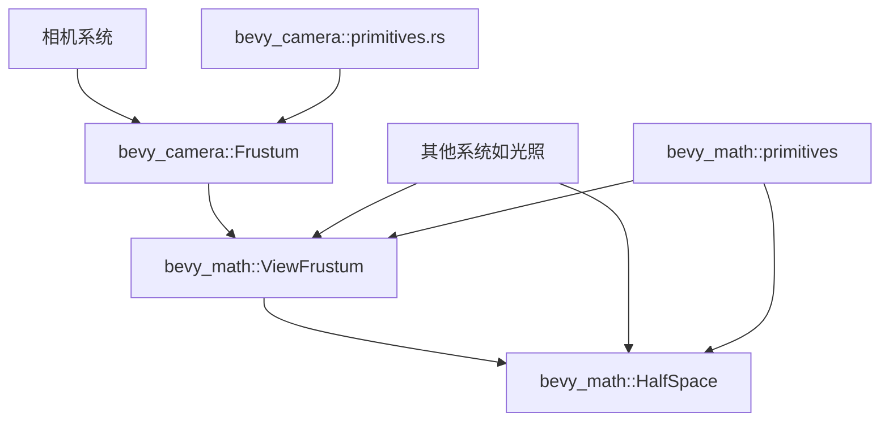

+++
title = "#22684 Move `HalfSpace` and some of `Frustum` (renamed to `ViewFrustum`) from `bevy_camera` to `bevy_math"
date = "2026-01-27T00:00:00"
draft = false
template = "pull_request_page.html"
in_search_index = false

[extra]
current_language = "zh-cn"
available_languages = {"en" = { name = "English", url = "/pull_request/bevy/2026-01/pr-22684-en-20260127" }, "zh-cn" = { name = "中文", url = "/pull_request/bevy/2026-01/pr-22684-zh-cn-20260127" }}
+++

# 标题：Move `HalfSpace` and some of `Frustum` (renamed to `ViewFrustum`) from `bevy_camera` to `bevy_math`

## 基本信息
- **标题**: Move `HalfSpace` and some of `Frustum` (renamed to `ViewFrustum`) from `bevy_camera` to `bevy_math`
- **PR链接**: https://github.com/bevyengine/bevy/pull/22684
- **作者**: kfc35
- **状态**: 已合并
- **标签**: A-Rendering, C-Code-Quality, S-Ready-For-Final-Review, A-Math, M-Migration-Guide, X-Contentious, D-Modest
- **创建时间**: 2026-01-24T19:04:54Z
- **合并时间**: 2026-01-27T06:44:28Z
- **合并人**: alice-i-cecile

## 描述翻译

# 目标
- 完成 #13945 的后半部分
- 完成 #13878 的前三分之二
- 完成 #13882 开始的部分工作

## 解决方案
- 将 `bevy_camera::primitives::HalfSpace` 移动到 `bevy_math::primitives::HalfSpace`（第一个提交）
- 将 `bevy_camera::primitives::Frustum` 的部分功能移动到 `bevy_math::primitives::ViewFrustum`（第二个提交）
- 我基本遵循了 Jondolf 在两次重构中的指示。aabb、obb 和 sphere 相关功能暂时保留在 bevy_camera 中（如果 sphere 要重构，已被强调作为后续工作处理）

## 测试
我运行了 `lighting`、`2d_gizmos` 和 `3d_gizmos` 示例，只是为了确保灯光...和相机...（以及动作！）仍然正常工作。与主分支相比，一切似乎都正常。如果有其他示例需要运行以确保情况良好，请告诉我。

## 本次PR的故事

这个PR的核心是一个代码组织优化任务，目的是将数学原语从相机模块中提取出来，放到更合适的数学模块中。这个看似简单的移动操作实际上涉及了多个技术层面的考量，展现了良好的模块化设计原则。

### 问题与背景

在Bevy的代码库中，`HalfSpace`（半空间）和 `Frustum`（视锥体）这两个几何原语最初被放置在 `bevy_camera` 模块中。这在早期架构中是合理的，因为它们主要用于相机相关的视锥体计算。但随着渲染系统的发展，这些原语在其他上下文中也变得有用，特别是光照计算。

核心问题是模块边界不清晰。`HalfSpace` 是一个纯粹的数学概念——它定义了3D空间中被一个平面分割的两部分之一。`Frustum` 虽然通常与相机相关，但其几何表示（六个半空间的交集）本质上也是一个数学构造。将这些原语保留在相机模块中限制了它们的重用性，并使得其他需要这些原语的系统不必要地依赖于相机模块。

### 解决方案方法

开发者采取了一个分步迁移的方法：
1. 完全移动 `HalfSpace` 到 `bevy_math::primitives`
2. 将 `Frustum` 的几何部分提取为 `ViewFrustum` 并移动到数学模块
3. 在相机模块中保留 `Frustum` 组件作为 `ViewFrustum` 的包装器

这个方法的优势在于保持了向后兼容性——相机相关的代码仍然可以像以前一样使用 `Frustum` 组件，但数学原语现在可以在其他上下文中被独立使用。

### 实现细节

从技术实现上看，这个PR展示了几个关键的设计决策：

首先，`HalfSpace` 的移动是直接的。原结构体和所有方法被完整地从 `bevy_camera/src/primitives.rs` 移动到新的 `bevy_math/src/primitives/half_space.rs` 文件中。移动后的代码保持了完全相同的行为，但增加了适当的特性配置（如反射和序列化支持）。

```rust
// 移动到 bevy_math 后的 HalfSpace 结构
#[derive(Clone, Copy, Debug, Default, PartialEq)]
#[cfg_attr(feature = "serialize", derive(serde::Serialize, serde::Deserialize))]
#[cfg_attr(
    feature = "bevy_reflect",
    derive(Reflect),
    reflect(Clone, Debug, Default, PartialEq)
)]
pub struct HalfSpace {
    normal_d: Vec4,
}
```

对于 `Frustum`，情况更复杂。开发者没有简单地移动整个结构体，而是创建了一个新的 `ViewFrustum` 结构体来包含纯粹的几何部分：

```rust
// 新的 ViewFrustum 结构体，包含构造方法和几何属性
#[derive(Clone, Copy, Debug, Default, PartialEq)]
pub struct ViewFrustum {
    pub half_spaces: [HalfSpace; 6],
}

impl ViewFrustum {
    pub const NEAR_PLANE_IDX: usize = 4;
    pub const FAR_PLANE_IDX: usize = 5;
    
    #[inline]
    pub fn from_clip_from_world(clip_from_world: &Mat4) -> Self {
        // 实现保持不变
    }
}
```

相机模块中的 `Frustum` 组件现在变成了一个简单的包装器：

```rust
#[derive(Component, Clone, Copy, Debug, Default, Deref, DerefMut, Reflect)]
#[reflect(Component, Default, Debug, Clone)]
pub struct Frustum(pub ViewFrustum);
```

这里使用了 `Deref` 和 `DerefMut` 派生，这使得 `Frustum` 实例可以像 `ViewFrustum` 一样使用，保持了API的兼容性。同时，`Frustum` 保留了作为ECS组件的所有特性。

### 技术洞察

这个重构展示了几个重要的软件工程原则：

1. **单一职责原则**：`HalfSpace` 和 `ViewFrustum` 现在是纯粹的数学原语，不依赖于任何特定的应用上下文（如相机系统）。

2. **依赖倒置**：通过将数学原语移动到基础模块，高级模块（如光照系统）现在可以依赖于抽象的原语而不是具体的相机实现。

3. **渐进式重构**：PR明确提到只移动了"部分" `Frustum` 功能。`Aabb`、`Obb` 和 `Sphere` 仍然留在相机模块中，这表明了审慎的重构策略——只移动明确属于数学范畴的部分，而将仍与相机紧密耦合的部分保留。

在性能方面，这个改变是透明的。由于 `Frustum` 组件现在包装了 `ViewFrustum`，内存布局没有变化，方法调用通过 `Deref` 转发也没有额外开销。

一个需要注意的细节是常量的迁移。原来的 `Frustum::NEAR_PLANE_IDX` 和 `Frustum::FAR_PLANE_IDX` 被移动到 `ViewFrustum` 中，所有使用这些常量的代码都需要更新引用：

```rust
// 更新前
if (idx == Frustum::NEAR_PLANE_IDX && !intersect_near)

// 更新后  
if (idx == ViewFrustum::NEAR_PLANE_IDX && !intersect_near)
```

### 影响与意义

这个PR的主要影响是改善了代码的组织结构。从架构角度来看，它使得：

1. 数学原语现在可以在整个引擎中共享，减少了代码重复的可能性
2. 渲染系统中的光照计算现在可以直接使用这些原语，而不需要引入对相机模块的依赖
3. 代码库的模块边界更加清晰，有助于新贡献者理解系统结构

从开发者体验角度看，这个改变需要更新导入语句，但大部分API保持不变。迁移指南提供了清晰的示例：

```rust
// 0.18 版本
use bevy_camera::primitives::{Frustum, HalfSpace}
let frustum_two: Frustum = Frustum::from_clip_from_world(...);

// 0.19 版本  
use bevy_math::primitives::{HalfSpace, ViewFrustum}
use bevy_camera::primitives::Frustum
let frustum_two: Frustum = Frustum(ViewFrustum::from_clip_from_world(...));
```

这种逐步的、向后兼容的重构方式使得迁移过程相对平滑。

## 可视化表示



这个图展示了重构后的依赖关系。`HalfSpace` 和 `ViewFrustum` 现在位于数学模块中，可以被多个系统共享。相机模块的 `Frustum` 组件包装了 `ViewFrustum`，保持了与现有代码的兼容性。

## 关键文件变更

1. **`crates/bevy_camera/src/primitives.rs` (+16/-135)**
   - 移除了 `HalfSpace` 的完整定义
   - 将 `Frustum` 组件改为包装器结构
   - 保留了与相机相关的几何体（Aabb、Sphere等）

```rust
// 更新后的 Frustum 定义
#[derive(Component, Clone, Copy, Debug, Default, Deref, DerefMut, Reflect)]
#[reflect(Component, Default, Debug, Clone)]
pub struct Frustum(pub ViewFrustum);
```

2. **`crates/bevy_math/src/primitives/view_frustum.rs` (+86/-0)**
   - 新文件，包含 `ViewFrustum` 结构体
   - 包含从投影矩阵构造视锥体的方法
   - 包含相关的常量定义

```rust
pub struct ViewFrustum {
    pub half_spaces: [HalfSpace; 6],
}

impl ViewFrustum {
    pub const NEAR_PLANE_IDX: usize = 4;
    pub const FAR_PLANE_IDX: usize = 5;
    
    pub fn from_clip_from_world(clip_from_world: &Mat4) -> Self {
        // 实现细节
    }
}
```

3. **`crates/bevy_math/src/primitives/half_space.rs` (+78/-0)**
   - 新文件，包含 `HalfSpace` 结构体的完整定义
   - 包含构造方法和访问器
   - 添加了特性条件编译支持

4. **`release-content/migration-guides/camera_primitives_moved.md` (+30/-0)**
   - 新增的迁移指南
   - 展示了从旧版本到新版本的代码变化
   - 帮助用户平滑过渡

5. **`crates/bevy_pbr/src/render/light.rs` (+8/-5)**
   - 更新了光照系统中的引用
   - 从 `bevy_math` 导入 `HalfSpace` 和 `ViewFrustum`
   - 展示了原语在新上下文中的使用

```rust
// 更新前
use bevy_camera::primitives::{HalfSpace, Frustum};

// 更新后
use bevy_math::primitives::{HalfSpace, ViewFrustum};
use bevy_camera::primitives::Frustum;
```

## 进一步阅读

1. **Bevy模块化设计原则**：了解Bevy如何组织代码模块和依赖关系
2. **Rust的Deref trait**：理解如何使用Deref实现智能指针和包装器模式
3. **计算机图形学中的视锥体裁剪**：深入学习视锥体的数学原理和在渲染中的应用
4. **渐进式重构技术**：学习如何逐步改进代码结构而不破坏现有功能
5. **游戏引擎架构**：了解现代游戏引擎如何组织数学库、渲染系统和实体组件系统

这个PR展示了在大型代码库中进行渐进式改进的良好实践，平衡了代码质量改进和向后兼容性的需求。