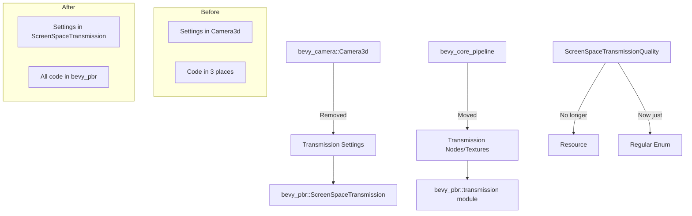

+++
title = "#22687 move transmission stuff to bevy_pbr"
date = "2026-01-25T00:00:00"
draft = false
template = "pull_request_page.html"
in_search_index = true

[taxonomies]
list_display = ["show"]

[extra]
current_language = "en"
available_languages = {"en" = { name = "English", url = "/pull_request/bevy/2026-01/pr-22687-en-20260125" }, "zh-cn" = { name = "中文", url = "/pull_request/bevy/2026-01/pr-22687-zh-cn-20260125" }}
labels = ["A-Rendering", "M-Migration-Guide", "D-Modest"]
+++

# Title
move transmission stuff to bevy_pbr

## Basic Information
- **Title**: move transmission stuff to bevy_pbr
- **PR Link**: https://github.com/bevyengine/bevy/pull/22687
- **Author**: atlv24
- **Status**: MERGED
- **Labels**: A-Rendering, S-Ready-For-Final-Review, M-Migration-Guide, D-Modest
- **Created**: 2026-01-24T20:48:59Z
- **Merged**: 2026-01-25T21:02:10Z
- **Merged By**: alice-i-cecile

## Description Translation
# Objective

- It makes no sense for bevy_camera::Camera3d to talk about transmission quality settings
- transmission is not a core thing its a purely pbr thing, why is in bevy_core_pipelines
- the implementation is generally scattered all over the place
- ScreenSpaceTransmissionQuality is a resource for no reason at all

## Solution

- split out a struct for transmission stuff
- consolidate stuff in bevy_pbr
- make ScreenSpaceTransmissionQuality not a resource

## Testing

transmission example looks good

## The Story of This Pull Request

This PR addresses a code organization problem in Bevy's rendering system. The issue was that screen-space transmission, which is a physically-based rendering (PBR) feature, had its configuration and implementation scattered across multiple modules that weren't logically related to PBR.

The problem started with architectural misplacement. The `Camera3d` component in `bevy_camera` contained transmission-specific settings like `screen_space_specular_transmission_steps` and `screen_space_specular_transmission_quality`. This didn't make sense because cameras are general-purpose components that shouldn't be coupled to specific rendering techniques. Additionally, `ScreenSpaceTransmissionQuality` was defined as a `Resource` in `bevy_camera`, even though it was only used as a component field.

The implementation was also scattered. Transmission-related code lived in three different crates: `bevy_camera` (for the configuration), `bevy_core_pipeline` (for the rendering node and texture management), and `bevy_pbr` (for the shaders and some rendering logic). This made the code harder to maintain and understand because transmission isn't a core rendering feature—it's specifically a PBR feature.

The solution involved consolidating all transmission-related code into `bevy_pbr` where it logically belongs. The developer created a new `ScreenSpaceTransmission` component to hold the transmission settings that were previously in `Camera3d`. This component is now extracted and used in the render world. The `ScreenSpaceTransmissionQuality` enum was moved to `bevy_pbr` and is no longer a `Resource`—it's now just a regular enum used within the component.

The implementation required moving several pieces of code. The `MainTransmissivePass3dNode` was moved from `bevy_core_pipeline` to `bevy_pbr`. The `ViewTransmissionTexture` component and its preparation system were also moved to `bevy_pbr`. A new `ScreenSpaceTransmissionPlugin` was created to set up the rendering graph node and systems. All shader code for transmission was consolidated into a single `transmission.wgsl` file in the new module.

From an architectural perspective, this change improves separation of concerns. The `Camera3d` component now only contains settings relevant to camera behavior (like depth texture configuration), while PBR-specific features are isolated in the PBR module. This makes the codebase more modular and easier to reason about. The removal of the `Resource` trait from `ScreenSpaceTransmissionQuality` is also correct—it was never used as a global resource, only as part of camera configuration.

The migration path is straightforward. Users who were setting transmission properties on `Camera3d` now need to add a `ScreenSpaceTransmission` component to their camera instead. The example code was updated to demonstrate the new API. The changes are backward-compatible in the sense that the functionality remains the same, just organized differently.

This refactoring demonstrates good software engineering principles: keeping related code together, reducing unnecessary coupling between modules, and cleaning up API design. It makes the transmission feature easier to maintain and sets a better pattern for where PBR-related configuration should live in the Bevy codebase.

## Visual Representation



## Key Files Changed

### `crates/bevy_pbr/src/transmission/mod.rs` (+123/-0)
This is a new module created to house all transmission-related code. It defines the `ScreenSpaceTransmission` component and `ScreenSpaceTransmissionQuality` enum, and sets up the plugin for screen-space transmission.

```rust
// File: crates/bevy_pbr/src/transmission/mod.rs
#[derive(Component, Reflect, Clone, ExtractComponent)]
#[reflect(Component, Default, Clone)]
pub struct ScreenSpaceTransmission {
    pub screen_space_specular_transmission_steps: usize,
    pub screen_space_specular_transmission_quality: ScreenSpaceTransmissionQuality,
}

#[derive(Default, Clone, Copy, Reflect, PartialEq, PartialOrd, Debug)]
#[reflect(Default, Clone, Debug, PartialEq)]
pub enum ScreenSpaceTransmissionQuality {
    Low,
    #[default]
    Medium,
    High,
    Ultra,
}
```

### `crates/bevy_pbr/src/transmission/texture.rs` (+113/-0)
This new file contains the `ViewTransmissionTexture` component and the `prepare_core_3d_transmission_textures` system that was moved from `bevy_core_pipeline`.

```rust
// File: crates/bevy_pbr/src/transmission/texture.rs
#[derive(Component)]
pub struct ViewTransmissionTexture {
    pub texture: Texture,
    pub view: TextureView,
    pub sampler: Sampler,
}

pub fn prepare_core_3d_transmission_textures(
    mut commands: Commands,
    mut texture_cache: ResMut<TextureCache>,
    render_device: Res<RenderDevice>,
    opaque_3d_phases: Res<ViewBinnedRenderPhases<Opaque3d>>,
    // ... other parameters
    views_3d: Query<(
        Entity,
        &ExtractedCamera,
        &ScreenSpaceTransmission,  // Now uses ScreenSpaceTransmission instead of Camera3d
        &ExtractedView,
    )>,
) {
    // Implementation moved from bevy_core_pipeline
}
```

### `crates/bevy_core_pipeline/src/core_3d/mod.rs` (+4/-100)
This file lost the transmission-related code that was moved to `bevy_pbr`. The `ViewTransmissionTexture` component and `prepare_core_3d_transmission_textures` system were removed, and the `MainTransmissivePass3dNode` is no longer registered here.

```rust
// File: crates/bevy_core_pipeline/src/core_3d/mod.rs (simplified)
// Before: Had transmission systems and node registration
// After: Transmission code removed
impl Plugin for Core3dPlugin {
    fn build(&self, app: &mut App) {
        // ...
        // Removed: .add_render_graph_node::<ViewNodeRunner<MainTransmissivePass3dNode>>
        // Removed: prepare_core_3d_transmission_textures system
    }
}
```

### `crates/bevy_camera/src/components.rs` (+0/-58)
The `Camera3d` struct was simplified by removing transmission-specific fields. The `ScreenSpaceTransmissionQuality` enum and its `Resource` implementation were completely removed from this module.

```rust
// File: crates/bevy_camera/src/components.rs
// Before:
pub struct Camera3d {
    pub screen_space_specular_transmission_steps: usize,
    pub screen_space_specular_transmission_quality: ScreenSpaceTransmissionQuality,
    // ... other fields
}

// After:
pub struct Camera3d {
    // Transmission fields removed
    pub depth_load_op: Camera3dDepthLoadOp,
    pub depth_texture_usages: Camera3dDepthTextureUsage,
}
```

### `examples/3d/transmission.rs` (+27/-14)
The example was updated to use the new `ScreenSpaceTransmission` component instead of setting transmission properties on `Camera3d`.

```rust
// File: examples/3d/transmission.rs
// Before:
commands.spawn((
    Camera3d {
        screen_space_specular_transmission_steps: 1,
        screen_space_specular_transmission_quality: ScreenSpaceTransmissionQuality::Medium,
        ..default()
    },
    // ...
));

// After:
commands.spawn((
    Camera3d::default(),
    ScreenSpaceTransmission {
        screen_space_specular_transmission_steps: 1,
        screen_space_specular_transmission_quality: ScreenSpaceTransmissionQuality::Medium,
    },
    // ...
));
```

## Further Reading

1. **Bevy PBR Documentation**: The official Bevy documentation on physically-based rendering provides context for why transmission is a PBR feature.
2. **Component-Based Architecture**: Understanding ECS (Entity Component System) patterns helps explain why moving transmission settings to a separate component is beneficial.
3. **Render Graph Architecture**: Bevy's render graph system explains how rendering nodes like `MainTransmissivePass3dNode` fit into the overall rendering pipeline.
4. **WGSL Shader Language**: The transmission shaders are written in WGSL, WebGPU's shading language.
5. **Code Organization Best Practices**: Resources on modular code design and separation of concerns in large codebases.