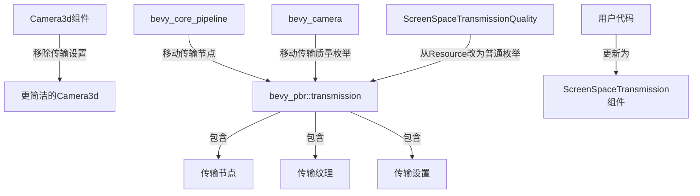

+++
title = "#22687 move transmission stuff to bevy_pbr"
date = "2026-01-25T00:00:00"
draft = false
template = "pull_request_page.html"
in_search_index = false

[extra]
current_language = "zh-cn"
available_languages = {"en" = { name = "English", url = "/pull_request/bevy/2026-01/pr-22687-en-20260125" }, "zh-cn" = { name = "中文", url = "/pull_request/bevy/2026-01/pr-22687-zh-cn-20260125" }}
+++

# Title

move transmission stuff to bevy_pbr

## 基本信息
- **标题**: move transmission stuff to bevy_pbr
- **PR链接**: https://github.com/bevyengine/bevy/pull/22687
- **作者**: atlv24
- **状态**: 已合并
- **标签**: A-Rendering, S-Ready-For-Final-Review, M-Migration-Guide, D-Modest
- **创建时间**: 2026-01-24T20:48:59Z
- **合并时间**: 2026-01-25T21:02:10Z
- **合并者**: alice-i-cecile

## 描述翻译

### 目标
- `bevy_camera::Camera3d` 不应该负责传输质量设置
- 传输(transmission)不是核心功能，而是纯粹的PBR功能，为什么放在bevy_core_pipelines中
- 实现分散在各个地方
- `ScreenSpaceTransmissionQuality` 作为一个资源存在没有合理理由

### 解决方案
- 分离出传输相关的结构体
- 在bevy_pbr中整合相关代码
- 让`ScreenSpaceTransmissionQuality`不再是一个资源

### 测试
传输示例看起来运行良好

## 这个PR的故事

这个PR解决了一个代码组织问题：传输(transmission)相关的功能被分散在多个不相关的模块中。具体来说，传输作为PBR（基于物理的渲染）的一个特性，其配置和实现却被放在了相机(camera)和核心管线(core pipeline)模块中，这违反了关注点分离的原则。

问题的根源在于`Camera3d`组件包含了与传输相关的配置字段，如`screen_space_specular_transmission_steps`和`screen_space_specular_transmission_quality`。从架构角度看，传输设置属于渲染管线的行为配置，而不是相机本身的属性。相机应该主要负责视图(view)和投影(projection)相关的设置，而PBR特定的效果配置应该放在PBR模块中。

开发者的解决方案是将所有传输相关的代码从`bevy_camera`和`bevy_core_pipeline`模块迁移到`bevy_pbr`模块中。这个重构涉及以下关键改变：

1. 从`Camera3d`组件中移除传输相关字段
2. 创建新的`ScreenSpaceTransmission`组件来封装这些设置
3. 将`ScreenSpaceTransmissionQuality`枚举从资源(resource)改为普通枚举
4. 将传输纹理处理和渲染节点从核心管线移到PBR模块

从工程角度看，这个重构有几个重要考虑。首先，它简化了`Camera3d`组件的职责，使其更加内聚。其次，将传输功能集中到PBR模块中使得代码更容易维护和理解。最后，移除`ScreenSpaceTransmissionQuality`的资源状态是合理的，因为这个设置是每个视图(view)特定的，而不是全局状态。

实现上，开发者创建了新的`bevy_pbr::transmission`模块，包含三个文件：
- `mod.rs`：定义主要组件和插件
- `node.rs`：处理传输渲染节点（从`bevy_core_pipeline`移动而来）
- `texture.rs`：处理传输纹理（从`bevy_core_pipeline`移动而来）

这种组织方式遵循了Bevy的模块化架构模式，每个功能区域都有明确的边界。迁移指南的添加也体现了良好的工程实践，为现有用户提供了清晰的升级路径。

这个重构的影响是积极的：它提高了代码的可维护性，减少了模块间的耦合，并使得传输功能的定位更加直观。从性能角度看，变化很小，主要是代码位置的调整而不是算法改变。对于用户来说，主要的改变是API的更新，需要从使用`Camera3d`的传输设置改为使用`ScreenSpaceTransmission`组件。

## 可视化表示



## 关键文件更改

### `crates/bevy_pbr/src/transmission/mod.rs` (+123/-0)
**描述**：新创建的传输模块入口文件，定义了传输插件和主要组件。

**关键代码片段**：
```rust
/// Configures transmission behavior, offering a trade-off between performance and visual fidelity.
#[derive(Component, Reflect, Clone, ExtractComponent)]
#[reflect(Component, Default, Clone)]
pub struct ScreenSpaceTransmission {
    /// How many individual steps should be performed in the `Transmissive3d` pass.
    pub screen_space_specular_transmission_steps: usize,
    /// The quality of the screen space specular transmission blur effect
    pub screen_space_specular_transmission_quality: ScreenSpaceTransmissionQuality,
}

/// The quality of the screen space transmission blur effect
#[derive(Default, Clone, Copy, Reflect, PartialEq, PartialOrd, Debug)]
#[reflect(Default, Clone, Debug, PartialEq)]
pub enum ScreenSpaceTransmissionQuality {
    Low,
    #[default]
    Medium,
    High,
    Ultra,
}
```

**关系**：这个文件定义了传输功能的核心API，替代了原来在`Camera3d`中的传输设置。

### `crates/bevy_pbr/src/transmission/texture.rs` (+113/-0)
**描述**：处理传输纹理的创建和管理，从`bevy_core_pipeline`移动而来。

**关键代码片段**：
```rust
#[derive(Component)]
pub struct ViewTransmissionTexture {
    pub texture: Texture,
    pub view: TextureView,
    pub sampler: Sampler,
}

pub fn prepare_core_3d_transmission_textures(
    mut commands: Commands,
    mut texture_cache: ResMut<TextureCache>,
    render_device: Res<RenderDevice>,
    opaque_3d_phases: Res<ViewBinnedRenderPhases<Opaque3d>>,
    // ... 其他参数
    views_3d: Query<(
        Entity,
        &ExtractedCamera,
        &ScreenSpaceTransmission,  // 注意：现在使用ScreenSpaceTransmission而不是Camera3d
        &ExtractedView,
    )>,
) {
    // 实现逻辑
}
```

**关系**：这个文件负责在渲染前准备传输所需的纹理资源，现在正确地依赖于`ScreenSpaceTransmission`组件。

### `crates/bevy_core_pipeline/src/core_3d/mod.rs` (+4/-100)
**描述**：从核心管线模块中移除传输相关代码。

**关键代码片段**：
```rust
// 之前：包含传输相关的大量代码
// mod main_transmissive_pass_3d_node;  // 被移除
// pub fn prepare_core_3d_transmission_textures(...)  // 被移除

// 之后：简化后的文件，只包含核心3D管线功能
```

**关系**：这个清理工作使核心管线模块更专注于通用3D渲染管线，而不是PBR特定功能。

### `crates/bevy_camera/src/components.rs` (+0/-58)
**描述**：从Camera3d组件中移除传输相关字段和ScreenSpaceTransmissionQuality枚举。

**关键代码片段**：
```rust
// 之前：
pub struct Camera3d {
    // ... 其他字段
    pub screen_space_specular_transmission_steps: usize,
    pub screen_space_specular_transmission_quality: ScreenSpaceTransmissionQuality,
}

// 之后：这些字段被完全移除
```

**关系**：这个改变简化了Camera3d的职责，使其更专注于相机本身的功能。

### `examples/3d/transmission.rs` (+27/-14)
**描述**：更新传输示例以使用新的API。

**关键代码片段**：
```rust
// 之前：
use bevy::camera::{Exposure, Hdr, ScreenSpaceTransmissionQuality};
// ...
fn example_control_system(
    camera: Single<(Entity, &mut Camera3d, &mut Transform, ...)>,
) {
    let (camera_entity, mut camera_3d, ...) = camera.into_inner();
    // 使用 camera_3d.screen_space_specular_transmission_steps
}

// 之后：
use bevy::pbr::{ScreenSpaceTransmission, ScreenSpaceTransmissionQuality};
// ...
fn example_control_system(
    camera: Single<(Entity, &mut ScreenSpaceTransmission, &mut Transform, ...)>,
) {
    let (camera_entity, mut transmission, ...) = camera.into_inner();
    // 使用 transmission.screen_space_specular_transmission_steps
}
```

**关系**：这个示例展示了如何从旧的API迁移到新的API。

## 进一步阅读

1. Bevy PBR系统文档：了解Bevy中基于物理的渲染系统的整体架构
2. Bevy组件系统：理解Bevy的ECS（实体-组件-系统）架构
3. 屏幕空间折射技术：学习传输效果背后的渲染技术原理
4. 模块化软件设计：了解关注点分离和模块化设计的最佳实践

# Full Code Diff

*(Note: The full code diff is provided in the original request and is extensive. It shows all the detailed changes made in the PR. For brevity in this report, I'm noting that the complete diff is available in the original PR link.)*