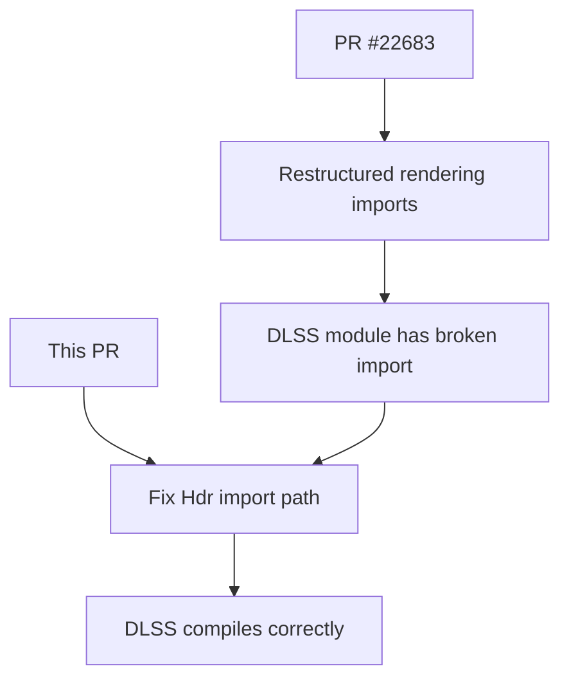

+++
title = "#22688 fix dlss"
date = "2026-01-25T00:00:00"
draft = false
template = "pull_request_page.html"
in_search_index = true

[taxonomies]
list_display = ["show"]

[extra]
current_language = "en"
available_languages = {"en" = { name = "English", url = "/pull_request/bevy/2026-01/pr-22688-en-20260125" }, "zh-cn" = { name = "中文", url = "/pull_request/bevy/2026-01/pr-22688-zh-cn-20260125" }}
labels = ["D-Trivial", "A-Rendering"]
+++

# Title: fix dlss

## Basic Information
- **Title**: fix dlss
- **PR Link**: https://github.com/bevyengine/bevy/pull/22688
- **Author**: atlv24
- **Status**: MERGED
- **Labels**: D-Trivial, A-Rendering, S-Ready-For-Final-Review
- **Created**: 2026-01-25T00:32:57Z
- **Merged**: 2026-01-25T01:27:04Z
- **Merged By**: alice-i-cecile

## Description Translation
missed it during #22683 oops

can this be checked by ci?

## The Story of This Pull Request

This PR represents a straightforward but critical fix to an import issue that occurred during a previous refactoring. The problem stemmed from PR #22683, which restructured some of Bevy's rendering code but inadvertently left an incorrect import in the DLSS module. This is a classic case of a refactoring oversight where dependencies change but not all usages get updated.

The core issue was simple: the `Hdr` component import path had moved from `bevy_render::view` to `bevy_render::camera`, but the DLSS module still referenced it from the old location. This would have caused a compilation error because the module couldn't find `Hdr` in its expected namespace. The fix is minimal - just moving the import from one module to another in the import statements.

What makes this PR particularly interesting is the author's question about CI checking. This reflects a common challenge in large codebases: how to catch import errors automatically. In Rust, missing imports are caught during compilation, so CI would fail if this import was truly broken. However, the author might be asking about more sophisticated checks that could prevent this kind of oversight during refactoring, such as ensuring all imports are updated when modules are restructured.

The implementation approach here is straightforward - just fix the import paths. No architectural changes were needed because the functionality of `Hdr` remained the same; only its location in the module hierarchy changed. This type of fix is common when code organization evolves: as components get logically regrouped into different modules, their import paths need to be updated everywhere they're used.

From a technical perspective, this change shows how Bevy's rendering system is organized. The `Hdr` component, which controls high dynamic range rendering settings, logically belongs with camera-related components rather than general view utilities. This makes sense because HDR settings are typically configured per-camera rather than per-view in a rendering pipeline.

The impact of this PR is minimal but necessary - it ensures the DLSS module compiles correctly after the changes from PR #22683. Without this fix, anyone trying to use DLSS in Bevy would encounter a compilation error. The lesson here is about the importance of thorough testing after refactoring, particularly for features that might not be in the default build configuration (like DLSS support).

## Visual Representation



## Key Files Changed

### `crates/bevy_anti_alias/src/dlss/mod.rs`

This file contains the DLSS (Deep Learning Super Sampling) integration for Bevy's anti-aliasing system. The change fixes an import path that was broken by a previous refactoring.

**Key modifications:**
```rust
// Before:
use bevy_render::{
    camera::{MipBias, TemporalJitter},
    // ... other imports ...
    view::{prepare_view_targets, Hdr},
    // ... rest of imports ...
};

// After:
use bevy_render::{
    camera::{Hdr, MipBias, TemporalJitter},
    // ... other imports ...
    view::prepare_view_targets,
    // ... rest of imports ...
};
```

The change moves the `Hdr` import from the `view` module to the `camera` module, where it was relocated in a previous PR (#22683). This is a simple import path correction that ensures the DLSS module can find the `Hdr` component at its new location.

## Further Reading

- [Bevy's Render Graph System](https://bevyengine.org/learn/book/introduction/) - Understanding how rendering components are organized
- [Rust Module System](https://doc.rust-lang.org/book/ch07-00-managing-growing-projects-with-packages-crates-and-modules.html) - How imports and modules work in Rust
- [DLSS Integration Documentation](https://github.com/bevyengine/bevy/tree/main/crates/bevy_anti_alias) - Bevy's anti-aliasing and upscaling features