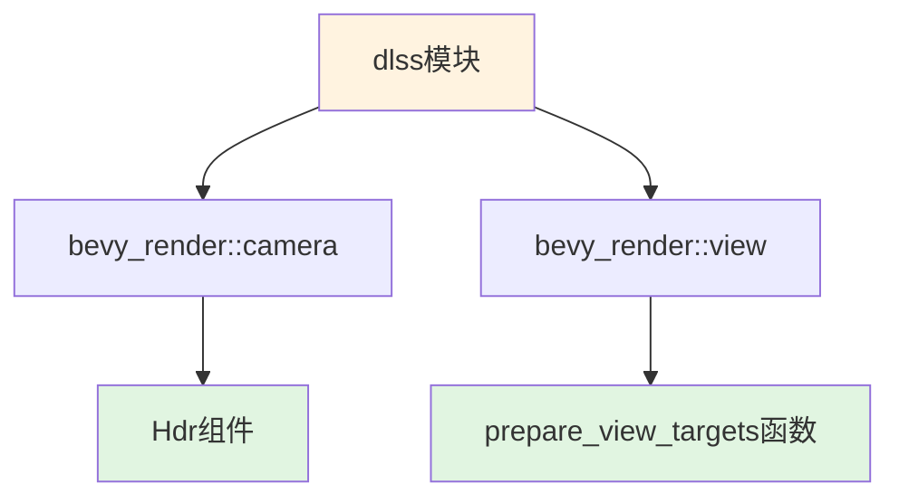

+++
title = "#22688 fix dlss"
date = "2026-01-25T00:00:00"
draft = false
template = "pull_request_page.html"
in_search_index = false

[extra]
current_language = "zh-cn"
available_languages = {"en" = { name = "English", url = "/pull_request/bevy/2026-01/pr-22688-en-20260125" }, "zh-cn" = { name = "中文", url = "/pull_request/bevy/2026-01/pr-22688-zh-cn-20260125" }}
+++

# 修复 DLSS 导入错误

## 基本信息
- **标题**: fix dlss
- **PR 链接**: https://github.com/bevyengine/bevy/pull/22688  
- **作者**: atlv24
- **状态**: 已合并
- **标签**: D-Trivial, A-Rendering, S-Ready-For-Final-Review
- **创建时间**: 2026-01-25T00:32:57Z
- **合并时间**: 2026-01-25T01:27:04Z
- **合并者**: alice-i-cecile

## 描述翻译
在 PR #22683 中遗漏了这个修复，抱歉。

这个能通过 CI 检查吗？

## 这个 PR 的故事

这个 PR 解决了一个在之前的重构中引入的简单但重要的导入错误。PR #22683 对 Bevy 渲染系统的导入进行了重构，但在修改 `bevy_anti_alias` 模块中的 DLSS 实现时，遗漏了一处关键的导入调整。

问题是关于 `Hdr` 组件的导入路径。在重构前，`Hdr` 是通过 `bevy_render::view` 模块导入的。重构后，`Hdr` 组件被移到了 `bevy_render::camera` 模块中，但 `bevy_anti_alias/src/dlss/mod.rs` 文件中的导入语句没有相应更新。这会导致编译失败，因为编译器无法在原来的位置找到 `Hdr` 组件。

修复方案很简单：将 `Hdr` 的导入从 `bevy_render::view` 模块移动到 `bevy_render::camera` 模块。同时，保持 `prepare_view_targets` 函数仍然从 `bevy_render::view` 模块导入，因为它的位置没有改变。

从技术实现角度看，这个修改涉及两行代码的变化：
1. 从 `camera::{MipBias, TemporalJitter}` 改为 `camera::{Hdr, MipBias, TemporalJitter}`
2. 从 `view::{prepare_view_targets, Hdr}` 改为 `view::prepare_view_targets`

这种类型的错误在大型重构中很常见，尤其是在需要同步修改多个文件时。PR 作者在描述中提到"missed it during #22683 oops"，表明这是在后续检查中发现的遗漏。作者还询问"can this be checked by ci?"，这反映出对 CI 系统能够验证此类简单修复的期望。

从工程实践角度看，这个 PR 展示了几个重要的点：
- 即使是最简单的重构，也需要仔细验证所有相关文件的导入
- CI 系统对于捕获这类导入错误非常有价值
- 模块化设计使得这种修复非常局部化，只影响一个文件的两行代码

这个修复确保了 DLSS 功能能够正确编译和运行。DLSS（Deep Learning Super Sampling，深度学习超级采样）是 NVIDIA 的 AI 抗锯齿技术，在 Bevy 的渲染管线中通过专门的模块实现。保持正确的导入对于确保所有渲染组件能够协同工作至关重要。

## 可视化表示



## 关键文件更改

### `crates/bevy_anti_alias/src/dlss/mod.rs` (+2/-2)

这个文件包含了 DLSS 实现的模块定义。修改更新了导入语句，以反映 `Hdr` 组件在代码库中的新位置。

**修改前:**
```rust
use bevy_render::{
    camera::{MipBias, TemporalJitter},
    render_graph::{RenderGraphExt, ViewNodeRunner},
    renderer::{
        raw_vulkan_init::{AdditionalVulkanFeatures, RawVulkanInitSettings},
        RenderDevice, RenderQueue,
    },
    texture::CachedTexture,
    view::{prepare_view_targets, Hdr},
    ExtractSchedule, Render, RenderApp, RenderSystems,
};
```

**修改后:**
```rust
use bevy_render::{
    camera::{Hdr, MipBias, TemporalJitter},
    render_graph::{RenderGraphExt, ViewNodeRunner},
    renderer::{
        raw_vulkan_init::{AdditionalVulkanFeatures, RawVulkanInitSettings},
        RenderDevice, RenderQueue,
    },
    texture::CachedTexture,
    view::prepare_view_targets,
    ExtractSchedule, Render, RenderApp, RenderSystems,
};
```

**关键变化:**
- `Hdr` 组件从 `view` 模块的导入列表中移除
- `Hdr` 组件添加到 `camera` 模块的导入列表中
- `prepare_view_targets` 函数保持从 `view` 模块导入

## 完整代码差异

```diff
diff --git a/crates/bevy_anti_alias/src/dlss/mod.rs b/crates/bevy_anti_alias/src/dlss/mod.rs
index 50586f5d03d02..7d97696fd8659 100644
--- a/crates/bevy_anti_alias/src/dlss/mod.rs
+++ b/crates/bevy_anti_alias/src/dlss/mod.rs
@@ -29,14 +29,14 @@ use bevy_ecs::prelude::*;
 use bevy_math::{UVec2, Vec2};
 use bevy_reflect::{reflect_remote, Reflect};
 use bevy_render::{
-    camera::{MipBias, TemporalJitter},
+    camera::{Hdr, MipBias, TemporalJitter},
     render_graph::{RenderGraphExt, ViewNodeRunner},
     renderer::{
         raw_vulkan_init::{AdditionalVulkanFeatures, RawVulkanInitSettings},
         RenderDevice, RenderQueue,
     },
     texture::CachedTexture,
-    view::{prepare_view_targets, Hdr},
+    view::prepare_view_targets,
     ExtractSchedule, Render, RenderApp, RenderSystems,
 };
 use dlss_wgpu::{
```

## 扩展阅读

- [Bevy 渲染系统架构](https://bevyengine.org/learn/book/getting-started/architecture/) - 了解 Bevy 的 ECS 和渲染系统如何组织
- [Rust 模块系统](https://doc.rust-lang.org/book/ch07-02-defining-modules-to-control-scope-and-privacy.html) - 理解 Rust 的模块和导入系统
- [DLSS 技术文档](https://developer.nvidia.com/dlss) - NVIDIA DLSS 的官方技术文档
- [PR #22683](https://github.com/bevyengine/bevy/pull/22683) - 导致这个导入错误的前序重构 PR